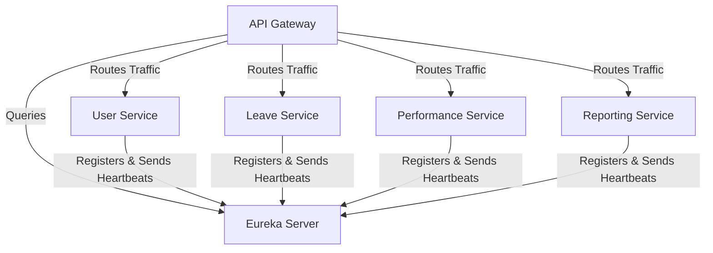

# Eureka Server (Service Discovery)

## 📌 Overview
The **Eureka Server** is a crucial component in the microservices architecture, acting as a Service Discovery engine. In a distributed environment where microservices dynamically scale up and down, keeping track of their locations (IP addresses and ports) manually is impossible. Eureka solves this by acting as a phonebook for your microservices.

Every other microservice (like User Service, API Gateway, etc.) acts as a **Eureka Client** and registers itself with this server upon startup. When one service needs to communicate with another, it queries the Eureka Server to find the target's current instance details.

## 🏗️ Architecture & Flow



### 🔑 Key Responsibilities:
1. **Service Registration**: Microservices register their instance information (IP address, port, health indicator URL, status) with Eureka.
2. **Service Discovery**: Microservices that need to invoke other microservices query the Eureka Server for the target microservice's network location.
3. **Health Monitoring (Heartbeats)**: Microservices send periodic heatbeats (typically every 30 seconds) to the Eureka Server. If the Eureka Server receives no heartbeat from an instance for a certain period, it removes the instance from its registry.

## 💻 Technical Details

### Dependencies (`pom.xml`)
The service includes the Spring Cloud Netflix Eureka Server starter:
```xml
<dependency>
    <groupId>org.springframework.cloud</groupId>
    <artifactId>spring-cloud-starter-netflix-eureka-server</artifactId>
</dependency>
```

### Main Application Class
The application requires the `@EnableEurekaServer` annotation to function as a discovery server:
```java
import org.springframework.boot.SpringApplication;
import org.springframework.boot.autoconfigure.SpringBootApplication;
import org.springframework.cloud.netflix.eureka.server.EnableEurekaServer;

@SpringBootApplication
@EnableEurekaServer // Marks this application as a Eureka Server
public class ServiceDiscoveryApplication {
    public static void main(String[] args) {
        SpringApplication.run(ServiceDiscoveryApplication.class, args);
    }
}
```

### Configuration (`application.properties`)
```properties
spring.application.name=eureka-server
# The default port for Eureka Server
server.port=8761 

# Tells this instance not to register WITH another Eureka instance (as it IS the server)
eureka.client.register-with-eureka=false

# Tells this instance not to fetch the registry from another Eureka server
eureka.client.fetch-registry=false

# Disables self-preservation for development purposes
eureka.server.enable-self-preservation=false
```

## 🚀 How to Run
**Using Maven:**
```bash
mvn spring-boot:run
```

**Using Docker:**
```bash
docker run -p 8761:8761 eureka-server:latest
```

## 🌐 Dashboard
Once running, the Eureka Server provides a UI dashboard at:
👉 **[http://localhost:8761](http://localhost:8761)**

On this dashboard, you can see all the actively registered microservices, their UP/DOWN status, and their respective ports.


## 🛑 Deep Dive Component Codes & Project Structure
This section contains the full, exhaustive breakdown of the microservice's source code, project structure, and dependencies. It operates as the fundamental source of truth replacing isolated snippets with the actual working code.

### 🌳 Complete Project Tree
```text
service-discovery/
├── .dockerignore
├── .gitattributes
├── .gitignore
├── Dockerfile
├── mvnw
├── mvnw.cmd
├── pom.xml
└── src
    ├── main
    │   ├── java
    │   │   └── com
    │   │       └── revworkforce
    │   │           └── servicediscovery
    │   │               └── ServiceDiscoveryApplication.java
    │   └── resources
    │       └── application.properties
    └── test
        └── java
            └── com
                └── revworkforce
                    └── servicediscovery
                        └── ServiceDiscoveryApplicationTests.java
```

### 📦 Dependencies (`pom.xml`)
```xml
<?xml version="1.0" encoding="UTF-8"?>
<project xmlns="http://maven.apache.org/POM/4.0.0" xmlns:xsi="http://www.w3.org/2001/XMLSchema-instance"
         xsi:schemaLocation="http://maven.apache.org/POM/4.0.0 https://maven.apache.org/xsd/maven-4.0.0.xsd">
    <modelVersion>4.0.0</modelVersion>
    <parent>
        <groupId>org.springframework.boot</groupId>
        <artifactId>spring-boot-starter-parent</artifactId>
        <version>4.0.3</version>
        <relativePath/>
    </parent>
    <groupId>com.revworkforce</groupId>
    <artifactId>service-discovery</artifactId>
    <version>0.0.1-SNAPSHOT</version>
    <name>service-discovery</name>
    <description>service-discovery</description>
    <url/>
    <licenses>
        <license/>
    </licenses>
    <developers>
        <developer/>
    </developers>
    <scm>
        <connection/>
        <developerConnection/>
        <tag/>
        <url/>
    </scm>
    <properties>
        <java.version>17</java.version>
        <spring-cloud.version>2025.1.0</spring-cloud.version>
    </properties>
    <dependencies>
        <dependency>
            <groupId>org.springframework.cloud</groupId>
            <artifactId>spring-cloud-starter-netflix-eureka-server</artifactId>
        </dependency>

        <dependency>
            <groupId>org.springframework.boot</groupId>
            <artifactId>spring-boot-starter-test</artifactId>
            <scope>test</scope>
        </dependency>
    </dependencies>
    <dependencyManagement>
        <dependencies>
            <dependency>
                <groupId>org.springframework.cloud</groupId>
                <artifactId>spring-cloud-dependencies</artifactId>
                <version>${spring-cloud.version}</version>
                <type>pom</type>
                <scope>import</scope>
            </dependency>
        </dependencies>
    </dependencyManagement>

    <build>
        <plugins>
            <plugin>
                <groupId>org.springframework.boot</groupId>
                <artifactId>spring-boot-maven-plugin</artifactId>
            </plugin>
        </plugins>
    </build>

</project>

```

### ⚙️ Configurations (`src/main/resources`)
**`application.properties`**
```properties
spring.application.name=eureka-server
server.port = 8761
eureka.client.register-with-eureka=false
eureka.client.fetch-registry=false
eureka.server.enable-self-preservation=false
```
