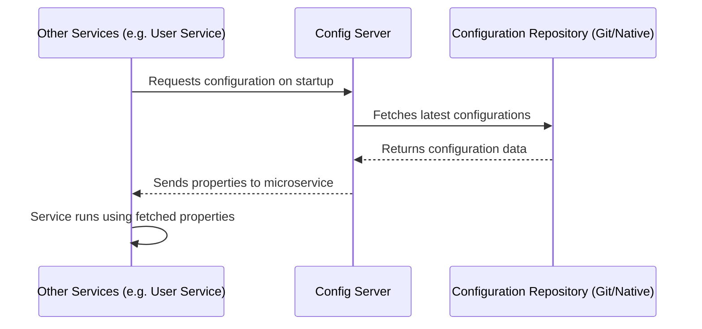

# Config Server (Centralized Configuration)

## 📌 Overview
The **Config Server** acts as the central hub for the external properties of applications across all environments. In a microservices ecosystem, managing configurations (like database credentials, feature flags, or endpoints) for multiple small, distinct applications can become chaotic.

By using Spring Cloud Config, you extract the configurations out of each microservice's JAR file (`application.properties` / `application.yml`) and store them securely in one place. Changes to properties can be made without requiring a full rebuild or restart of the individual microservices.

## 🏗️ Architecture & Flow



### 🔑 Key Responsibilities:
1. **Centralized Management**: Keep configuration files isolated and secure.
2. **Environment Separation**: Serve different configurations depending on the active profile (`dev`, `staging`, `prod`).
3. **Dynamic Reloads**: Clients can refresh their configurations on the fly without restarting.
4. **Consistency**: Ensure all instances of a microservice boot up using the exact same configuration set.

## 💻 Technical Details

### Dependencies (`pom.xml`)
The service includes the Spring Cloud Config Server dependency:
```xml
<dependency>
    <groupId>org.springframework.cloud</groupId>
    <artifactId>spring-cloud-config-server</artifactId>
</dependency>
```

### Main Application Class
The application requires the `@EnableConfigServer` annotation to actively function as a configuration repository server:
```java
import org.springframework.boot.SpringApplication;
import org.springframework.boot.autoconfigure.SpringBootApplication;
import org.springframework.cloud.config.server.EnableConfigServer;

@SpringBootApplication
@EnableConfigServer // Tells Spring this is a central Config Server
public class ConfigServerApplication {
    public static void main(String[] args) {
        SpringApplication.run(ConfigServerApplication.class, args);
    }
}
```

### Configuration (`application.properties`)
```properties
spring.application.name=config-server
# Standard Config Server Port
server.port=8888 

# Eureka Client Registration (optional if discovery is needed)
eureka.client.service-url.defaultZone=http://localhost:8761/eureka/

# Instructing to fetch properties from the local file system
spring.profiles.active=native
spring.cloud.config.server.native.search-locations=file:///D:/HRMS/Microservices - HRMS/config-repo
```
*Note: The system points to a Native path. In a real-world scenario, this would likely be an external GitHub repository URL.*

## 🚀 How to Run
**Using Maven:**
```bash
mvn spring-boot:run
```

**Using Docker:**
```bash
docker run -p 8888:8888 config-server:latest
```

## 🌐 Endpoints
The Config Server provides endpoints to retrieve configurations for a target application:
👉 **[http://localhost:8888/{application-name}/{profile}](http://localhost:8888/{application-name}/{profile})**


## 🛑 Deep Dive Component Codes & Project Structure
This section contains the full, exhaustive breakdown of the microservice's source code, project structure, and dependencies. It operates as the fundamental source of truth replacing isolated snippets with the actual working code.

### 🌳 Complete Project Tree
```text
📦 config-server
    📜 .dockerignore
    📜 .gitattributes
    📜 .gitignore
    📜 Dockerfile
    📜 mvnw
    📜 mvnw.cmd
    📜 pom.xml
    📂 src
        📂 main
            📂 java
                📂 com
                    📂 revworkforce
                        📂 configserver
                            📜 ConfigServerApplication.java
            📂 resources
                📜 application.properties
        📂 test
            📂 java
                📂 com
                    📂 revworkforce
                        📂 configserver
                            📜 ConfigServerApplicationTests.java
```

### 📦 Dependencies (`pom.xml`)
```xml
<?xml version="1.0" encoding="UTF-8"?>
<project xmlns="http://maven.apache.org/POM/4.0.0" xmlns:xsi="http://www.w3.org/2001/XMLSchema-instance"
         xsi:schemaLocation="http://maven.apache.org/POM/4.0.0 https://maven.apache.org/xsd/maven-4.0.0.xsd">
    <modelVersion>4.0.0</modelVersion>
    <parent>
        <groupId>org.springframework.boot</groupId>
        <artifactId>spring-boot-starter-parent</artifactId>
        <version>4.0.3</version>
        <relativePath/>
    </parent>
    <groupId>com.revworkforce</groupId>
    <artifactId>config-server</artifactId>
    <version>0.0.1-SNAPSHOT</version>
    <name>config-server</name>
    <description>config-server</description>
    <url/>
    <licenses>
        <license/>
    </licenses>
    <developers>
        <developer/>
    </developers>
    <scm>
        <connection/>
        <developerConnection/>
        <tag/>
        <url/>
    </scm>
    <properties>
        <java.version>17</java.version>
        <spring-cloud.version>2025.1.0</spring-cloud.version>
    </properties>
    <dependencies>
        <dependency>
            <groupId>org.springframework.cloud</groupId>
            <artifactId>spring-cloud-config-server</artifactId>
        </dependency>
        <dependency>
            <groupId>org.springframework.cloud</groupId>
            <artifactId>spring-cloud-starter-netflix-eureka-client</artifactId>
        </dependency>

        <dependency>
            <groupId>org.springframework.boot</groupId>
            <artifactId>spring-boot-starter-test</artifactId>
            <scope>test</scope>
        </dependency>
    </dependencies>
    <dependencyManagement>
        <dependencies>
            <dependency>
                <groupId>org.springframework.cloud</groupId>
                <artifactId>spring-cloud-dependencies</artifactId>
                <version>${spring-cloud.version}</version>
                <type>pom</type>
                <scope>import</scope>
            </dependency>
        </dependencies>
    </dependencyManagement>

    <build>
        <plugins>
            <plugin>
                <groupId>org.springframework.boot</groupId>
                <artifactId>spring-boot-maven-plugin</artifactId>
            </plugin>
        </plugins>
    </build>

</project>

```

### ⚙️ Configurations (`src/main/resources`)
**`application.properties`**
```properties
spring.application.name=config-server
server.port=8888
eureka.client.service-url.defaultZone=http://localhost:8761/eureka/
spring.profiles.active=native
spring.cloud.config.server.native.search-locations=file:///D:/HRMS/Microservices - HRMS/config-repo

```

### ☕ Source Code Files
#### **`src/main/java/com/revworkforce/configserver/ConfigServerApplication.java`**
```java
package com.revworkforce.configserver;

import org.springframework.boot.SpringApplication;
import org.springframework.boot.autoconfigure.SpringBootApplication;
import org.springframework.cloud.config.server.EnableConfigServer;

@SpringBootApplication
@EnableConfigServer
public class ConfigServerApplication {
    public static void main(String[] args) {
        SpringApplication.run(ConfigServerApplication.class, args);
    }
}

```
