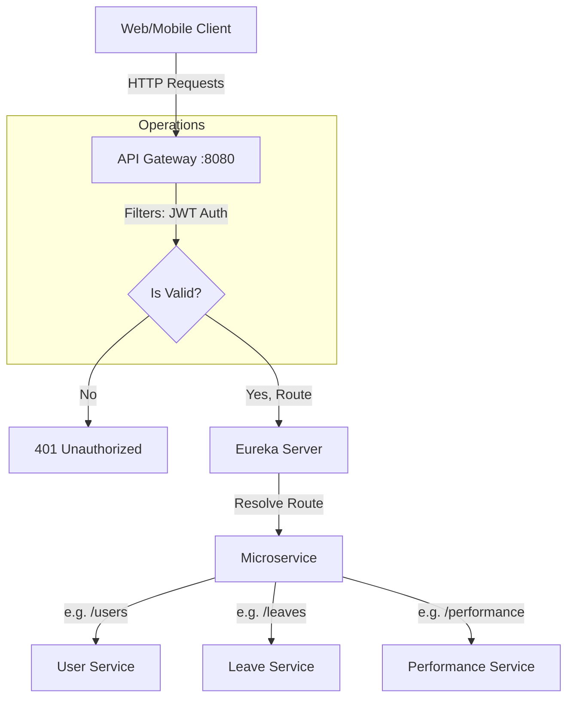

# API Gateway (Entry Point & Routing)

## 📌 Overview
The **API Gateway** serves as the single entry point into the entire microservices architecture. It sits between the client applications (web, mobile) and the internal microservices.

Instead of a client application keeping track of the host, port, and API endpoints for every single microservice (e.g. knowing where the User Service is vs where the Leave Service is), it simply sends all requests to the API Gateway. The Gateway then parses the request and dynamically routes it to the appropriate underlying service using Service Discovery (Eureka).

## 🏗️ Architecture & Flow



### 🔑 Key Responsibilities:
1. **Dynamic Routing**: Automatically maps incoming requests to the appropriate microservices (e.g. `/user/**` -> User Service).
2. **Security & Authentication**: Validates JWT tokens on incoming requests. Acts as the first line of defense blocking unauthenticated traffic from reaching internal backend services.
3. **Cross-Origin Resource Sharing (CORS)**: Handles pre-flight checks and injects necessary CORS headers so frontend applications can consume the APIs.
4. **Resilience**: Implements Circuit Breakers (using Resilience4J) so that if a backend service fails, it doesn't bring down the whole system.
5. **Load Balancing**: Works closely with Eureka to send traffic to healthy instances.

## 💻 Technical Details

### Dependencies (`pom.xml`)
- `spring-cloud-starter-gateway`: The core gateway engine.
- `spring-cloud-starter-netflix-eureka-client`: To find other services.
- `spring-boot-starter-security`: For JWT Validation and security configuration.
- `resilience4j`: For Circuit Breaking pattern in routes.

### Configuration (`application.properties`)
The gateway heavily relies on configurations to determine how to route traffic and act on failures:
```properties
spring.application.name=api-gateway
server.port=8080

# Fetch dynamic routes & config from Config Server
spring.config.import=optional:configserver:http://localhost:8888

# Register with Eureka to know where microservices are
eureka.client.service-url.defaultZone=http://localhost:8761/eureka/

# JWT Secret to decode and validate incoming tokens
jwt.secret=404E635266556A586E3272357538782F413F4428472B4B6250645367566B5970

# Circuit Breaker Setup
resilience4j.circuitbreaker.configs.default.sliding-window-size=10
resilience4j.circuitbreaker.configs.default.failure-rate-threshold=50
resilience4j.circuitbreaker.configs.default.wait-duration-in-open-state=10000
```

### Authentication Filter (`JwtAuthenticationFilter`)
The Gateway contains a custom filter that intercepts requests, checks for a `Authorization: Bearer <token>` header, and uses the `jwt.secret` to validate it. If the token is expired or invalid, the Gateway stops the request dead in its tracks.

## 🚀 How to Run
**Using Maven:**
```bash
mvn spring-boot:run
```

**Using Docker:**
```bash
docker run -p 8080:8080 api-gateway:latest
```

All interactions with the system should now go through `http://localhost:8080`.


## 🛑 Deep Dive Component Codes & Project Structure
This section contains the full, exhaustive breakdown of the microservice's source code, project structure, and dependencies. It operates as the fundamental source of truth replacing isolated snippets with the actual working code.

### 🌳 Complete Project Tree
```text
📦 api-gateway
    📜 .dockerignore
    📜 .gitattributes
    📜 .gitignore
    📜 Dockerfile
    📜 hs_err_pid19528.log
    📜 mvnw
    📜 mvnw.cmd
    📜 pom.xml
    📜 replay_pid19528.log
    📂 src
        📂 main
            📂 java
                📂 com
                    📂 revworkforce
                        📂 apigateway
                            📜 ApiGatewayApplication.java
                            📂 config
                                📜 JwtUtil.java
                                📜 RouteConfig.java
                            📂 filter
                                📜 HeaderMutableRequestWrapper.java
                                📜 JwtAuthenticationFilter.java
            📂 resources
                📜 application.properties
        📂 test
            📂 java
                📂 com
                    📂 revworkforce
                        📂 apigateway
                            📜 ApiGatewayApplicationTests.java
```

### 📦 Dependencies (`pom.xml`)
```xml
<?xml version="1.0" encoding="UTF-8"?>
<project xmlns="http://maven.apache.org/POM/4.0.0" xmlns:xsi="http://www.w3.org/2001/XMLSchema-instance"
         xsi:schemaLocation="http://maven.apache.org/POM/4.0.0 https://maven.apache.org/xsd/maven-4.0.0.xsd">
    <modelVersion>4.0.0</modelVersion>
    <parent>
        <groupId>org.springframework.boot</groupId>
        <artifactId>spring-boot-starter-parent</artifactId>
        <version>4.0.3</version>
        <relativePath/>
    </parent>
    <groupId>com.revworkforce</groupId>
    <artifactId>api-gateway</artifactId>
    <version>0.0.1-SNAPSHOT</version>
    <name>api-gateway</name>
    <description>api-gateway</description>
    <url/>
    <licenses>
        <license/>
    </licenses>
    <developers>
        <developer/>
    </developers>
    <scm>
        <connection/>
        <developerConnection/>
        <tag/>
        <url/>
    </scm>
    <properties>
        <java.version>17</java.version>
        <spring-cloud.version>2025.1.0</spring-cloud.version>
    </properties>
    <dependencies>
        <dependency>
            <groupId>org.springframework.cloud</groupId>
            <artifactId>spring-cloud-starter-config</artifactId>
        </dependency>
        <dependency>
            <groupId>org.springframework.cloud</groupId>
            <artifactId>spring-cloud-starter-circuitbreaker-resilience4j</artifactId>
        </dependency>
        <dependency>
            <groupId>org.springframework.cloud</groupId>
            <artifactId>spring-cloud-starter-gateway-server-webmvc</artifactId>
        </dependency>
        <dependency>
            <groupId>org.springframework.cloud</groupId>
            <artifactId>spring-cloud-starter-netflix-eureka-client</artifactId>
        </dependency>

        <dependency>
            <groupId>org.springframework.boot</groupId>
            <artifactId>spring-boot-starter-actuator</artifactId>
        </dependency>

        <dependency>
            <groupId>io.jsonwebtoken</groupId>
            <artifactId>jjwt-api</artifactId>
            <version>0.12.6</version>
        </dependency>
        <dependency>
            <groupId>io.jsonwebtoken</groupId>
            <artifactId>jjwt-impl</artifactId>
            <version>0.12.6</version>
            <scope>runtime</scope>
        </dependency>
        <dependency>
            <groupId>io.jsonwebtoken</groupId>
            <artifactId>jjwt-jackson</artifactId>
            <version>0.12.6</version>
            <scope>runtime</scope>
        </dependency>

        <dependency>
            <groupId>org.springframework.boot</groupId>
            <artifactId>spring-boot-starter-test</artifactId>
            <scope>test</scope>
        </dependency>
    </dependencies>
    <dependencyManagement>
        <dependencies>
            <dependency>
                <groupId>org.springframework.cloud</groupId>
                <artifactId>spring-cloud-dependencies</artifactId>
                <version>${spring-cloud.version}</version>
                <type>pom</type>
                <scope>import</scope>
            </dependency>
        </dependencies>
    </dependencyManagement>

    <build>
        <plugins>
            <plugin>
                <groupId>org.springframework.boot</groupId>
                <artifactId>spring-boot-maven-plugin</artifactId>
            </plugin>
        </plugins>
    </build>

</project>

```

### ⚙️ Configurations (`src/main/resources`)
**`application.properties`**
```properties
spring.application.name=api-gateway
spring.config.import=optional:configserver:http://localhost:8888
eureka.client.service-url.defaultZone=http://localhost:8761/eureka/
eureka.instance.hostname=localhost
eureka.instance.prefer-ip-address=false
eureka.instance.instance-id=${spring.application.name}:${server.port}

server.port=8080

jwt.secret=404E635266556A586E3272357538782F413F4428472B4B6250645367566B5970

resilience4j.circuitbreaker.configs.default.sliding-window-size=10
resilience4j.circuitbreaker.configs.default.failure-rate-threshold=50
resilience4j.circuitbreaker.configs.default.wait-duration-in-open-state=10000
resilience4j.circuitbreaker.configs.default.permitted-number-of-calls-in-half-open-state=3

management.endpoint.gateway.enabled=true
management.endpoints.web.exposure.include=gateway,health,info
logging.level.org.springframework.cloud.gateway=DEBUG
spring.cloud.gateway.default-filters[0]=DedupeResponseHeader=Access-Control-Allow-Origin Access-Control-Allow-Credentials RETAIN_FIRST

```

### ☕ Source Code Files
#### **`src/main/java/com/revworkforce/apigateway/ApiGatewayApplication.java`**
```java
package com.revworkforce.apigateway;

import org.springframework.boot.SpringApplication;
import org.springframework.boot.autoconfigure.SpringBootApplication;

@SpringBootApplication
public class ApiGatewayApplication {
    public static void main(String[] args) {
        SpringApplication.run(ApiGatewayApplication.class, args);
    }
}

```

#### **`src/main/java/com/revworkforce/apigateway/config/JwtUtil.java`**
```java
package com.revworkforce.apigateway.config;

import io.jsonwebtoken.Claims;
import io.jsonwebtoken.Jwts;
import io.jsonwebtoken.io.Decoders;
import io.jsonwebtoken.security.Keys;
import org.springframework.beans.factory.annotation.Value;
import org.springframework.stereotype.Component;

import javax.crypto.SecretKey;
import java.util.Date;

@Component
public class JwtUtil {
    @Value("${jwt.secret}")
    private String secretKey;

    public Claims extractAllClaims(String token) {
        return Jwts.parser()
                .verifyWith(getSigningKey())
                .build()
                .parseSignedClaims(token)
                .getPayload();
    }

    public String extractEmail(String token) {
        return extractAllClaims(token).getSubject();
    }

    public String extractRole(String token) {
        return extractAllClaims(token).get("role", String.class);
    }

    public boolean isTokenValid(String token) {
        try {
            Claims claims = extractAllClaims(token);
            return !claims.getExpiration().before(new Date());
        } catch (Exception e) {
            return false;
        }
    }

    private SecretKey getSigningKey() {
        byte[] keyBytes = Decoders.BASE64.decode(secretKey);
        return Keys.hmacShaKeyFor(keyBytes);
    }
}


```

#### **`src/main/java/com/revworkforce/apigateway/config/RouteConfig.java`**
```java
package com.revworkforce.apigateway.config;

import org.springframework.context.annotation.Bean;
import org.springframework.context.annotation.Configuration;
import org.springframework.web.servlet.function.RouterFunction;
import org.springframework.web.servlet.function.ServerResponse;

import static org.springframework.cloud.gateway.server.mvc.handler.GatewayRouterFunctions.route;
import static org.springframework.cloud.gateway.server.mvc.handler.HandlerFunctions.http;
import static org.springframework.cloud.gateway.server.mvc.filter.LoadBalancerFilterFunctions.lb;
import static org.springframework.cloud.gateway.server.mvc.predicate.GatewayRequestPredicates.path;

@Configuration
public class RouteConfig {
    @Bean
    public RouterFunction<ServerResponse> leaveServiceRoute() {
        return route("leave-service")
                .route(path("/api/employees/leaves/**")
                        .or(path("/api/employees/leave-balance/**"))
                        .or(path("/api/employees/holidays/**"))
                        .or(path("/api/employees/attendance/**"))
                        .or(path("/api/manager/leaves/**"))
                        .or(path("/api/manager/leave-calendar/**"))
                        .or(path("/api/manager/leave-analysis/**"))
                        .or(path("/api/manager/attendance/**"))
                        .or(path("/api/admin/leaves/**"))
                        .or(path("/api/admin/leave-types/**"))
                        .or(path("/api/admin/holidays/**"))
                        .or(path("/api/admin/leave-balances/**"))
                        .or(path("/api/admin/attendance/**"))
                        .or(path("/api/admin/office-locations/**")), http())
                .filter(lb("LEAVE-SERVICE"))
                .build();
    }

    @Bean
    public RouterFunction<ServerResponse> performanceServiceRoute() {
        return route("performance-service")
                .route(path("/api/employees/reviews/**")
                        .or(path("/api/employees/reviews"))
                        .or(path("/api/employees/goals/**"))
                        .or(path("/api/employees/goals"))
                        .or(path("/api/manager/reviews/**"))
                        .or(path("/api/manager/reviews"))
                        .or(path("/api/manager/goals/**"))
                        .or(path("/api/manager/goals"))
                        .or(path("/api/manager/performance/**"))
                        .or(path("/api/admin/performance/**")), http())
                .filter(lb("PERFORMANCE-SERVICE"))
                .build();
    }

    @Bean
    public RouterFunction<ServerResponse> employeeMgmtServiceRoute() {
        return route("employee-management-service")
                .route(path("/api/admin/announcements/**")
                        .or(path("/api/employees/announcements/**"))
                        .or(path("/api/employee/expenses/**"))
                        .or(path("/api/admin/expenses/**"))
                        .or(path("/api/manager/expenses/**"))
                        .or(path("/api/ai/**"))
                        .or(path("/api/chat/**"))
                        .or(path("/api/admin/dashboard/**"))
                        .or(path("/api/manager/team/**")), http())
                .filter(lb("EMPLOYEE-MANAGEMENT-SERVICE"))
                .build();
    }

    @Bean
    public RouterFunction<ServerResponse> employeeMgmtWsRoute() {
        return route("employee-management-ws")
                .route(path("/ws/**"), http())
                .filter(lb("EMPLOYEE-MANAGEMENT-SERVICE"))
                .build();
    }

    @Bean
    public RouterFunction<ServerResponse> notificationServiceRoute() {
        return route("notification-service")
                .route(path("/api/notifications/**"), http())
                .filter(lb("NOTIFICATION-SERVICE"))
                .build();
    }

    @Bean
    public RouterFunction<ServerResponse> reportingServiceRoute() {
        return route("reporting-service")
                .route(path("/api/admin/reports/**"), http())
                .filter(lb("REPORTING-SERVICE"))
                .build();
    }

    @Bean
    public RouterFunction<ServerResponse> userServiceRoute() {
        return route("user-service")
                .route(path("/api/auth/**")
                        .or(path("/api/employees/me/**"))
                        .or(path("/api/employees/me"))
                        .or(path("/api/employees/dashboard"))
                        .or(path("/api/employees/directory/**"))
                        .or(path("/api/admin/employees/**"))
                        .or(path("/api/admin/departments/**"))
                        .or(path("/api/admin/designations/**"))
                        .or(path("/api/admin/ip-access/**"))
                        .or(path("/api/admin/activity-logs/**")), http())
                .filter(lb("USER-SERVICE"))
                .build();
    }
}

```

#### **`src/main/java/com/revworkforce/apigateway/filter/HeaderMutableRequestWrapper.java`**
```java
package com.revworkforce.apigateway.filter;

import jakarta.servlet.http.HttpServletRequest;
import jakarta.servlet.http.HttpServletRequestWrapper;

import java.util.*;

public class HeaderMutableRequestWrapper extends HttpServletRequestWrapper {
    private final Map<String, String> customHeaders = new HashMap<>();

    public HeaderMutableRequestWrapper(HttpServletRequest request) {
        super(request);
    }

    public void addHeader(String name, String value) {
        customHeaders.put(name, value);
    }

    @Override
    public String getHeader(String name) {
        String customValue = customHeaders.get(name);
        if (customValue != null) {
            return customValue;
        }
        return super.getHeader(name);
    }

    @Override
    public Enumeration<String> getHeaderNames() {
        Set<String> names = new LinkedHashSet<>(customHeaders.keySet());
        Enumeration<String> originalNames = super.getHeaderNames();
        while (originalNames.hasMoreElements()) {
            names.add(originalNames.nextElement());
        }
        return Collections.enumeration(names);
    }

    @Override
    public Enumeration<String> getHeaders(String name) {
        String customValue = customHeaders.get(name);
        if (customValue != null) {
            return Collections.enumeration(List.of(customValue));
        }
        return super.getHeaders(name);
    }
}


```

#### **`src/main/java/com/revworkforce/apigateway/filter/JwtAuthenticationFilter.java`**
```java
package com.revworkforce.apigateway.filter;

import com.revworkforce.apigateway.config.JwtUtil;
import jakarta.servlet.FilterChain;
import jakarta.servlet.ServletException;
import jakarta.servlet.http.HttpServletRequest;
import jakarta.servlet.http.HttpServletResponse;
import org.slf4j.Logger;
import org.slf4j.LoggerFactory;
import org.springframework.beans.factory.annotation.Autowired;
import org.springframework.http.HttpHeaders;
import org.springframework.stereotype.Component;
import org.springframework.web.filter.OncePerRequestFilter;

import java.io.IOException;
import java.util.List;

@Component
public class JwtAuthenticationFilter extends OncePerRequestFilter {
    private static final Logger log = LoggerFactory.getLogger(JwtAuthenticationFilter.class);

    @Autowired
    private JwtUtil jwtUtil;

    private static final List<String> PUBLIC_PATHS = List.of(
            "/api/auth/",
            "/swagger-ui",
            "/v3/api-docs",
            "/actuator",
            "/ws",
            "/ws/"
    );

    @Override
    protected void doFilterInternal(HttpServletRequest request,
                                    HttpServletResponse response,
                                    FilterChain filterChain) throws ServletException, IOException {
        String path = request.getRequestURI();

        if (isPublicPath(path)) {
            filterChain.doFilter(request, response);
            return;
        }

        if ("OPTIONS".equalsIgnoreCase(request.getMethod())) {
            filterChain.doFilter(request, response);
            return;
        }

        String authHeader = request.getHeader(HttpHeaders.AUTHORIZATION);

        if (authHeader == null || !authHeader.startsWith("Bearer ")) {
            log.warn("Missing or invalid Authorization header for path: {}", path);
            sendUnauthorized(response, "Missing or invalid Authorization header");
            return;
        }

        String token = authHeader.substring(7);

        try {
            if (!jwtUtil.isTokenValid(token)) {
                log.warn("Expired or invalid JWT token for path: {}", path);
                sendUnauthorized(response, "Token is expired or invalid");
                return;
            }

            String email = jwtUtil.extractEmail(token);
            String role = jwtUtil.extractRole(token);

            HeaderMutableRequestWrapper wrappedRequest = new HeaderMutableRequestWrapper(request);
            wrappedRequest.addHeader("X-User-Email", email);
            wrappedRequest.addHeader("X-User-Role", role != null ? role : "");

            log.debug("JWT validated — email={}, role={}, path={}", email, role, path);

            filterChain.doFilter(wrappedRequest, response);
        } catch (Exception e) {
            log.error("JWT validation failed: {}", e.getMessage());
            sendUnauthorized(response, "Token validation failed: " + e.getMessage());
        }
    }

    private boolean isPublicPath(String path) {
        return PUBLIC_PATHS.stream().anyMatch(path::startsWith);
    }

    private void sendUnauthorized(HttpServletResponse response, String message) throws IOException {
        response.setContentType("application/json");
        response.setStatus(HttpServletResponse.SC_UNAUTHORIZED);
        response.getWriter().write("{\"success\":false,\"message\":\"" + message + "\"}");
    }
}


```
