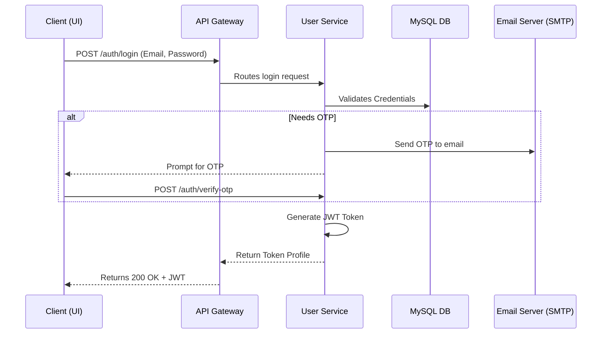

# User Service (Identity & Authentication)

## 📌 Overview
The **User Service** manages all aspects of user identity, authentication, and authorization within the HRMS system. It acts as the primary Identity Provider (IdP) for the ecosystem, validating user credentials and generating secure JWT tokens for downstream services.

Instead of handling authentication independently, other services trust the User Service to perform logins, register users, enforce OTP (One Time Password) checks, and issue valid claims.

## 🏗️ Architecture & Flow



### 🔑 Key Responsibilities:
1. **User Authentication**: Secure login mechanism with strong hashing (e.g., BCrypt).
2. **2-Factor Authentication (OTP)**: Multi-factor authentication layer requiring One-Time Passwords sent via email.
3. **Token Generation (JWT)**: Creates stateless JSON Web Tokens used for cross-service authentication.
4. **Role Management**: Distinguishes between roles (e.g., ADMIN, MANAGER, EMPLOYEE) for route protection.
5. **Swagger Documentation**: Houses the OpenAPI specs for user-related APIs (`/v3/api-docs`).

## 💻 Technical Details

### Technologies & Dependencies
- **Spring Data JPA & Hibernate**: For ORM mapping of User entities.
- **MySQL Driver**: Connects to the primary relational database (`workforce`).
- **Spring Boot Starter Mail**: Handles SMTP connectivity to send OTP emails.
- **Spring Security**: Underpins the token validation and path protection.
- **SpringDoc OpenAPI**: Generates Swagger-UI documentation.

### Configuration Highlights (`application.properties`)
```properties
spring.application.name=user-service
server.port=8087

# Database Connection
spring.datasource.url=jdbc:mysql://localhost:3306/workforce?createDatabaseIfNotExist=true
spring.jpa.hibernate.ddl-auto=update

# Security Constants
jwt.secret=404E635266556A586E3272357538782F413F4428472B4B6250645367566B5970
jwt.expiration=86400000 # 24 Hours

# OTP Setup
otp.expiry-minutes=5
otp.max-attempts=5
otp.enforce-for-all=true

# SMTP Mail properties
spring.mail.host=smtp.gmail.com
spring.mail.port=587
spring.mail.username=rkonda863@gmail.com
```

### OpenAPI (Swagger) Access
With the service running, the interactive API documentation can be accessed at:
👉 **[http://localhost:8087/swagger-ui.html](http://localhost:8087/swagger-ui.html)**
*(Note: Can also be proxied through the API Gateway)*

## 🚀 How to Run
**Using Maven:**
```bash
mvn spring-boot:run
```

**Using Docker:**
```bash
docker run -p 8087:8087 user-service:latest
```


## 🛑 Deep Dive Component Codes & Project Structure
This section contains the full, exhaustive breakdown of the microservice's source code, project structure, and dependencies. It operates as the fundamental source of truth replacing isolated snippets with the actual working code.

### 🌳 Complete Project Tree
```text
📦 user-service
    📜 .gitattributes
    📜 .gitignore
    📜 Dockerfile
    📜 hs_err_pid18216.log
    📜 hs_err_pid19964.log
    📜 mvnw
    📜 mvnw.cmd
    📜 pom.xml
    📜 replay_pid18216.log
    📜 replay_pid19964.log
    📂 src
        📂 main
            📂 java
                📂 com
                    📂 revworkforce
                        📂 userservice
                            📜 UserServiceApplication.java
                            📂 config
                                📜 AuthenticationEventListener.java
                                📜 DataSeeder.java
                                📜 IpAccessControlFilter.java
                                📜 JwtAuthenticationFilter.java
                                📜 JwtUtil.java
                                📜 OllamaConfig.java
                                📜 SecurityConfig.java
                                📜 SwaggerConfig.java
                                📜 WebSocketAuthInterceptor.java
                                📜 WebSocketConfig.java
                                📜 WebSocketEventListener.java
                            📂 controller
                                📜 AdminActivityLogController.java
                                📜 AdminDashboardController.java
                                📜 AdminDepartmentController.java
                                📜 AdminDesignationController.java
                                📜 AdminEmployeeController.java
                                📜 AdminIpAccessController.java
                                📜 AdminOfficeLocationController.java
                                📜 AuthController.java
                                📜 EmployeeController.java
                                📜 EmployeeDirectoryController.java
                                📜 ManagerTeamController.java
                            📂 dto
                                📜 AdjustLeaveBalanceRequest.java
                                📜 AIChatRequest.java
                                📜 AIChatResponse.java
                                📜 AnnouncementRequest.java
                                📜 ApiResponse.java
                                📜 AssignManagerRequest.java
                                📜 AttendanceResponse.java
                                📜 AttendanceSummaryResponse.java
                                📜 ChangePasswordRequest.java
                                📜 ChatMessageRequest.java
                                📜 ChatMessageResponse.java
                                📜 CheckInRequest.java
                                📜 CheckOutRequest.java
                                📜 ConversationResponse.java
                                📜 DashboardResponse.java
                                📜 DepartmentRequest.java
                                📜 DesignationRequest.java
                                📜 EmployeeDashboardResponse.java
                                📜 EmployeeDirectoryResponse.java
                                📜 EmployeeProfileResponse.java
                                📜 EmployeeReportResponse.java
                                📜 ExpenseActionRequest.java
                                📜 ExpenseRequest.java
                                📜 ForceResetPasswordRequest.java
                                📜 GoalProgressRequest.java
                                📜 GoalRequest.java
                                📜 HolidayRequest.java
                                📜 InvoiceParseResponse.java
                                📜 IpRangeRequest.java
                                📜 IpRangeResponse.java
                                📜 LeaveActionRequest.java
                                📜 LeaveAnalysisResponse.java
                                📜 LeaveApplyRequest.java
                                📜 LeaveReportResponse.java
                                📜 LeaveTypeRequest.java
                                📜 LoginRequest.java
                                📜 ManagerFeedbackRequest.java
                                📜 ManagerGoalCommentRequest.java
                                📜 OfficeLocationRequest.java
                                📜 OfficeLocationResponse.java
                                📜 PerformanceReportResponse.java
                                📜 PerformanceReviewRequest.java
                                📜 RefreshTokenRequest.java
                                📜 RegisterEmployeeRequest.java
                                📜 ResendOtpRequest.java
                                📜 TeamLeaveCalendarEntry.java
                                📜 TypingIndicator.java
                                📜 UpdateEmployeeRequest.java
                                📜 UpdateProfileRequest.java
                                📜 VerifyOtpRequest.java
                            📂 exception
                                📜 AccessDeniedException.java
                                📜 AccountDeactivatedException.java
                                📜 BadRequestException.java
                                📜 DuplicateResourceException.java
                                📜 GlobalExceptionHandler.java
                                📜 InsufficientBalanceException.java
                                📜 InvalidActionException.java
                                📜 IpBlockedException.java
                                📜 ResourceNotFoundException.java
                                📜 UnauthorizedException.java
                            📂 model
                                📜 ActivityLog.java
                                📜 AllowedIpRange.java
                                📜 Announcement.java
                                📜 Attendance.java
                                📜 Department.java
                                📜 Designation.java
                                📜 Employee.java
                                📜 Goal.java
                                📜 Holiday.java
                                📜 LeaveApplication.java
                                📜 LeaveBalance.java
                                📜 LeaveType.java
                                📜 Notification.java
                                📜 OfficeLocation.java
                                📜 OtpVerification.java
                                📜 PerformanceReview.java
                                📜 RefreshToken.java
                                📂 enums
                                    📜 AttendanceStatus.java
                                    📜 Gender.java
                                    📜 GoalPriority.java
                                    📜 GoalStatus.java
                                    📜 LeaveStatus.java
                                    📜 NotificationType.java
                                    📜 ReviewStatus.java
                                    📜 Role.java
                            📂 repository
                                📜 ActivityLogRepository.java
                                📜 AllowedIpRangeRepository.java
                                📜 AttendanceRepository.java
                                📜 DepartmentRepository.java
                                📜 DesignationRepository.java
                                📜 EmployeeRepository.java
                                📜 HolidayRepository.java
                                📜 LeaveApplicationRepository.java
                                📜 LeaveBalanceRepository.java
                                📜 LeaveTypeRepository.java
                                📜 NotificationRepository.java
                                📜 OfficeLocationRepository.java
                                📜 OtpVerificationRepository.java
                                📜 PerformanceReviewRepository.java
                                📜 RefreshTokenRepository.java
                            📂 service
                                📜 ActivityLogService.java
                                📜 CustomUserDetailsService.java
                                📜 DashboardService.java
                                📜 DepartmentService.java
                                📜 DesignationService.java
                                📜 EmailService.java
                                📜 EmployeeService.java
                                📜 IpAccessControlService.java
                                📜 NotificationService.java
                                📜 OfficeLocationService.java
                                📜 OtpService.java
                                📜 PresenceService.java
                                📜 RefreshTokenService.java
                                📜 WebSocketNotificationService.java
                            📂 util
                                📜 NetworkIpUtil.java
            📂 resources
                📜 application.properties
        📂 test
            📂 java
                📂 com
                    📂 revworkforce
                        📂 userservice
                            📜 UserServiceApplicationTests.java
```

### 📦 Dependencies (`pom.xml`)
```xml
<?xml version="1.0" encoding="UTF-8"?>
<project xmlns="http://maven.apache.org/POM/4.0.0" xmlns:xsi="http://www.w3.org/2001/XMLSchema-instance"
         xsi:schemaLocation="http://maven.apache.org/POM/4.0.0 https://maven.apache.org/xsd/maven-4.0.0.xsd">
    <modelVersion>4.0.0</modelVersion>
    <parent>
        <groupId>org.springframework.boot</groupId>
        <artifactId>spring-boot-starter-parent</artifactId>
        <version>4.0.3</version>
        <relativePath/>
    </parent>
    <groupId>com.revworkforce</groupId>
    <artifactId>user-service</artifactId>
    <version>0.0.1-SNAPSHOT</version>
    <name>user-service</name>
    <description>Authentication, RBAC, profile management, employee directory</description>
    <properties>
        <java.version>17</java.version>
        <spring-cloud.version>2025.1.0</spring-cloud.version>
    </properties>
    <dependencies>
        <dependency>
            <groupId>org.springframework.boot</groupId>
            <artifactId>spring-boot-starter-actuator</artifactId>
        </dependency>
        <dependency>
            <groupId>org.springframework.boot</groupId>
            <artifactId>spring-boot-starter-data-jpa</artifactId>
        </dependency>
        <dependency>
            <groupId>org.springframework.boot</groupId>
            <artifactId>spring-boot-starter-security</artifactId>
        </dependency>
        <dependency>
            <groupId>org.springframework.boot</groupId>
            <artifactId>spring-boot-starter-validation</artifactId>
        </dependency>
        <dependency>
            <groupId>org.springframework.boot</groupId>
            <artifactId>spring-boot-starter-webmvc</artifactId>
        </dependency>
        <dependency>
            <groupId>org.springframework.boot</groupId>
            <artifactId>spring-boot-starter-mail</artifactId>
        </dependency>
        <dependency>
            <groupId>org.springframework.boot</groupId>
            <artifactId>spring-boot-starter-websocket</artifactId>
        </dependency>
        <dependency>
            <groupId>org.springframework.cloud</groupId>
            <artifactId>spring-cloud-starter-config</artifactId>
        </dependency>
        <dependency>
            <groupId>org.springframework.cloud</groupId>
            <artifactId>spring-cloud-starter-netflix-eureka-client</artifactId>
        </dependency>
        <dependency>
            <groupId>org.springframework.cloud</groupId>
            <artifactId>spring-cloud-starter-openfeign</artifactId>
        </dependency>

        <dependency>
            <groupId>io.jsonwebtoken</groupId>
            <artifactId>jjwt-api</artifactId>
            <version>0.12.6</version>
        </dependency>
        <dependency>
            <groupId>io.jsonwebtoken</groupId>
            <artifactId>jjwt-impl</artifactId>
            <version>0.12.6</version>
            <scope>runtime</scope>
        </dependency>
        <dependency>
            <groupId>io.jsonwebtoken</groupId>
            <artifactId>jjwt-jackson</artifactId>
            <version>0.12.6</version>
            <scope>runtime</scope>
        </dependency>

        <dependency>
            <groupId>org.springdoc</groupId>
            <artifactId>springdoc-openapi-starter-webmvc-ui</artifactId>
            <version>2.8.4</version>
        </dependency>

        <dependency>
            <groupId>com.mysql</groupId>
            <artifactId>mysql-connector-j</artifactId>
            <scope>runtime</scope>
        </dependency>
        <dependency>
            <groupId>org.projectlombok</groupId>
            <artifactId>lombok</artifactId>
            <optional>true</optional>
        </dependency>
        <dependency>
            <groupId>org.springframework.boot</groupId>
            <artifactId>spring-boot-starter-test</artifactId>
            <scope>test</scope>
        </dependency>
        <dependency>
            <groupId>com.h2database</groupId>
            <artifactId>h2</artifactId>
            <scope>test</scope>
        </dependency>
    </dependencies>
    <dependencyManagement>
        <dependencies>
            <dependency>
                <groupId>org.springframework.cloud</groupId>
                <artifactId>spring-cloud-dependencies</artifactId>
                <version>${spring-cloud.version}</version>
                <type>pom</type>
                <scope>import</scope>
            </dependency>
        </dependencies>
    </dependencyManagement>

    <build>
        <plugins>
            <plugin>
                <groupId>org.apache.maven.plugins</groupId>
                <artifactId>maven-compiler-plugin</artifactId>
                <configuration>
                    <annotationProcessorPaths>
                        <path>
                            <groupId>org.projectlombok</groupId>
                            <artifactId>lombok</artifactId>
                        </path>
                    </annotationProcessorPaths>
                </configuration>
            </plugin>
            <plugin>
                <groupId>org.springframework.boot</groupId>
                <artifactId>spring-boot-maven-plugin</artifactId>
                <configuration>
                    <excludes>
                        <exclude>
                            <groupId>org.projectlombok</groupId>
                            <artifactId>lombok</artifactId>
                        </exclude>
                    </excludes>
                </configuration>
            </plugin>
        </plugins>
    </build>
</project>

```

### ⚙️ Configurations (`src/main/resources`)
**`application.properties`**
```properties
spring.application.name=user-service
spring.config.import=optional:configserver:http://localhost:8888
eureka.client.service-url.defaultZone=http://localhost:8761/eureka/
server.port=8087

spring.datasource.url=jdbc:mysql://localhost:3306/workforce?createDatabaseIfNotExist=true
spring.datasource.username=root
spring.datasource.password=1234
spring.datasource.driver-class-name=com.mysql.cj.jdbc.Driver
spring.jpa.hibernate.ddl-auto=update
spring.jpa.show-sql=false
spring.jpa.properties.hibernate.format_sql=true
spring.jpa.properties.hibernate.dialect=org.hibernate.dialect.MySQLDialect

jwt.secret=404E635266556A586E3272357538782F413F4428472B4B6250645367566B5970
jwt.expiration=86400000
jwt.refresh-expiration=604800000

spring.mail.host=smtp.gmail.com
spring.mail.port=587
spring.mail.username=rkonda863@gmail.com
spring.mail.password=zplsqhgqsbptleua
spring.mail.properties.mail.smtp.auth=true
spring.mail.properties.mail.smtp.starttls.enable=true
spring.mail.properties.mail.smtp.starttls.required=true

otp.expiry-minutes=5
otp.max-attempts=5
otp.fail-open-on-email-error=false
otp.skip-for-local=false
otp.enforce-for-all=true

springdoc.api-docs.path=/v3/api-docs
springdoc.swagger-ui.path=/swagger-ui.html

```

### ☕ Source Code Files
#### **`src/main/java/com/revworkforce/userservice/UserServiceApplication.java`**
```java
package com.revworkforce.userservice;

import org.springframework.boot.SpringApplication;
import org.springframework.boot.autoconfigure.SpringBootApplication;
import org.springframework.cloud.client.discovery.EnableDiscoveryClient;
import org.springframework.cloud.openfeign.EnableFeignClients;

@SpringBootApplication
@EnableDiscoveryClient
@EnableFeignClients
public class UserServiceApplication {
    public static void main(String[] args) {
        SpringApplication.run(UserServiceApplication.class, args);
    }
}

```

#### **`src/main/java/com/revworkforce/userservice/config/AuthenticationEventListener.java`**
```java
package com.revworkforce.userservice.config;

import com.revworkforce.userservice.model.ActivityLog;
import com.revworkforce.userservice.repository.ActivityLogRepository;
import org.springframework.beans.factory.annotation.Autowired;
import org.springframework.context.event.EventListener;
import org.springframework.security.authentication.event.AuthenticationFailureBadCredentialsEvent;
import org.springframework.security.authentication.event.AuthenticationFailureDisabledEvent;
import org.springframework.stereotype.Component;

@Component
public class AuthenticationEventListener {
    @Autowired
    private ActivityLogRepository activityLogRepository;

    @EventListener
    public void onAuthenticationFailureBadCredentials(AuthenticationFailureBadCredentialsEvent event) {
        String email = (String) event.getAuthentication().getPrincipal();
        activityLogRepository.save(ActivityLog.builder()
                .action("LOGIN_FAILED")
                .entityType("AUTH")
                .details("Failed login attempt for email: " + email + " - Bad credentials")
                .status("FAILED")
                .build());
    }

    @EventListener
    public void onAuthenticationFailureDisabled(AuthenticationFailureDisabledEvent event) {
        String email = (String) event.getAuthentication().getPrincipal();
        activityLogRepository.save(ActivityLog.builder()
                .action("LOGIN_FAILED_DISABLED")
                .entityType("AUTH")
                .details("Login attempt for deactivated account: " + email)
                .status("FAILED")
                .build());
    }
}

```

#### **`src/main/java/com/revworkforce/userservice/config/DataSeeder.java`**
```java
package com.revworkforce.userservice.config;
import com.revworkforce.userservice.model.Department;
import com.revworkforce.userservice.model.Designation;
import com.revworkforce.userservice.model.Employee;
import com.revworkforce.userservice.model.LeaveType;
import com.revworkforce.userservice.model.enums.Gender;
import com.revworkforce.userservice.model.enums.Role;
import com.revworkforce.userservice.repository.DepartmentRepository;
import com.revworkforce.userservice.repository.DesignationRepository;
import com.revworkforce.userservice.repository.EmployeeRepository;
import com.revworkforce.userservice.repository.LeaveTypeRepository;
import org.springframework.boot.CommandLineRunner;
import org.springframework.context.annotation.Bean;
import org.springframework.context.annotation.Configuration;
import org.springframework.security.crypto.password.PasswordEncoder;
import java.math.BigDecimal;
import java.time.LocalDate;
import java.util.Arrays;
import java.util.List;

@Configuration
public class DataSeeder {
    @Bean
    CommandLineRunner initDatabase(DepartmentRepository departmentRepository,
            DesignationRepository designationRepository, LeaveTypeRepository leaveTypeRepository) {
        return args -> {
            if (departmentRepository.count() == 0) {
                List<Department> departments = Arrays.asList(
                        Department.builder().departmentName("IT").description("Information Technology").build(),
                        Department.builder().departmentName("HR").description("Human Resources").build(),
                        Department.builder().departmentName("Finance").description("Financial Department").build(),
                        Department.builder().departmentName("Marketing").description("Marketing Department").build());
                departmentRepository.saveAll(departments);
                System.out.println("Seeded Departments");
            }
            if (designationRepository.count() == 0) {
                List<Designation> designations = Arrays.asList(
                        Designation.builder().designationName("Software Engineer").description("Develops software")
                                .build(),
                        Designation.builder().designationName("HR Manager").description("Manages HR").build(),
                        Designation.builder().designationName("Accountant").description("Manages Accounts").build(),
                        Designation.builder().designationName("Marketing Executive").description("Marketing strategies")
                                .build());
                designationRepository.saveAll(designations);
                System.out.println("Seeded Designations");
            }

            if (leaveTypeRepository.count() == 0) {
                List<LeaveType> leaveTypes = Arrays.asList(
                        LeaveType.builder()
                                .leaveTypeName("Earned Leave")
                                .description("Earned/Privilege leave accrued over time. Can be carried forward.")
                                .defaultDays(15)
                                .isPaidLeave(true)
                                .isCarryForwardEnabled(true)
                                .maxCarryForwardDays(5)
                                .isLossOfPay(false)
                                .build(),
                        LeaveType.builder()
                                .leaveTypeName("Sick Leave")
                                .description("Leave for medical/health reasons. May require medical certificate for extended period.")
                                .defaultDays(12)
                                .isPaidLeave(true)
                                .isCarryForwardEnabled(false)
                                .maxCarryForwardDays(0)
                                .isLossOfPay(false)
                                .build(),
                        LeaveType.builder()
                                .leaveTypeName("Casual Leave")
                                .description("Short-duration leave for personal/urgent matters.")
                                .defaultDays(10)
                                .isPaidLeave(true)
                                .isCarryForwardEnabled(false)
                                .maxCarryForwardDays(0)
                                .isLossOfPay(false)
                                .build(),
                        LeaveType.builder()
                                .leaveTypeName("Loss of Pay")
                                .description("Unpaid leave when all other leave balances are exhausted.")
                                .defaultDays(0)
                                .isPaidLeave(false)
                                .isCarryForwardEnabled(false)
                                .maxCarryForwardDays(0)
                                .isLossOfPay(true)
                                .build()
                );
                leaveTypeRepository.saveAll(leaveTypes);
                System.out.println("Seeded Default Leave Types: Earned Leave, Sick Leave, Casual Leave, Loss of Pay");
            }
        };
    }

    @Bean
    CommandLineRunner initAdmin(EmployeeRepository employeeRepository, PasswordEncoder passwordEncoder) {
        return args -> {
            if (!employeeRepository.existsByRole(Role.ADMIN)) {
                Employee admin = Employee.builder()
                        .employeeCode("ADM001")
                        .firstName("System")
                        .lastName("Admin")
                        .email("admin@workforce.com")
                        .passwordHash(passwordEncoder.encode("Admin@123"))
                        .phone("0000000000")
                        .dateOfBirth(LocalDate.of(1990, 1, 1))
                        .gender(Gender.MALE)
                        .address("WorkForce HQ")
                        .joiningDate(LocalDate.now())
                        .salary(BigDecimal.ZERO)
                        .role(Role.ADMIN)
                        .isActive(true)
                        .build();
                employeeRepository.save(admin);
                System.out.println("=== Default Admin Seeded ===");
                System.out.println("Email   : admin@workforce.com");
                System.out.println("Password: Admin@123");
                System.out.println("Code    : ADM001");
                System.out.println("============================");
            }
        };
    }
}

```

#### **`src/main/java/com/revworkforce/userservice/config/IpAccessControlFilter.java`**
```java
package com.revworkforce.userservice.config;

import jakarta.servlet.FilterChain;
import jakarta.servlet.ServletException;
import jakarta.servlet.http.HttpServletRequest;
import jakarta.servlet.http.HttpServletResponse;
import com.revworkforce.userservice.service.IpAccessControlService;
import com.revworkforce.userservice.util.NetworkIpUtil;
import org.slf4j.Logger;
import org.slf4j.LoggerFactory;
import org.springframework.beans.factory.annotation.Autowired;
import org.springframework.stereotype.Component;
import org.springframework.web.filter.OncePerRequestFilter;

import java.io.IOException;

@Component
public class IpAccessControlFilter extends OncePerRequestFilter {
    private static final Logger log = LoggerFactory.getLogger(IpAccessControlFilter.class);

    @Autowired
    private IpAccessControlService ipAccessControlService;

    @Override
    protected void doFilterInternal(HttpServletRequest request,
                                    HttpServletResponse response,
                                    FilterChain filterChain) throws ServletException, IOException {
        String requestUri = request.getRequestURI();
        String clientIp = NetworkIpUtil.resolveClientIp(request);

        boolean isEmployeeEndpoint = requestUri.startsWith("/api/employees");
        boolean isManagerEndpoint = requestUri.startsWith("/api/manager");

        if (isEmployeeEndpoint || isManagerEndpoint) {
            log.info("[IP-FILTER] Checking IP for URI: {} | Client IP: {}", requestUri, clientIp);

            boolean allowed = ipAccessControlService.isIpAllowed(clientIp);

            if (!allowed) {
                log.warn("[IP-FILTER] BLOCKED — IP: {} | URI: {}", clientIp, requestUri);
                response.setContentType("application/json");
                response.setStatus(HttpServletResponse.SC_FORBIDDEN);
                response.getWriter().write(
                        "{\"success\":false,\"message\":\"Access denied. Your IP address ("
                                + clientIp + ") is not whitelisted. Please contact your administrator.\"}"
                );
                return;
            }

            log.info("[IP-FILTER] ALLOWED — IP: {} | URI: {}", clientIp, requestUri);
        }

        filterChain.doFilter(request, response);
    }
}

```

#### **`src/main/java/com/revworkforce/userservice/config/JwtAuthenticationFilter.java`**
```java
package com.revworkforce.userservice.config;
import jakarta.servlet.FilterChain;
import jakarta.servlet.ServletException;
import jakarta.servlet.http.HttpServletRequest;
import jakarta.servlet.http.HttpServletResponse;
import org.springframework.beans.factory.annotation.Autowired;
import org.springframework.security.authentication.UsernamePasswordAuthenticationToken;
import org.springframework.security.core.context.SecurityContextHolder;
import org.springframework.security.core.userdetails.UserDetails;
import org.springframework.security.core.userdetails.UserDetailsService;
import org.springframework.security.web.authentication.WebAuthenticationDetailsSource;
import org.springframework.stereotype.Component;
import org.springframework.web.filter.OncePerRequestFilter;
import java.io.IOException;

@Component
public class JwtAuthenticationFilter extends OncePerRequestFilter {
    @Autowired
    private JwtUtil jwtUtil;
    @Autowired
    private UserDetailsService userDetailsService;
    @Override
    protected void doFilterInternal(HttpServletRequest request, HttpServletResponse response, FilterChain filterChain) throws ServletException, IOException {
        final String authHeader = request.getHeader("Authorization");
        if (authHeader == null || !authHeader.startsWith("Bearer ")) {
            filterChain.doFilter(request, response);
            return;
        }
        final String jwt = authHeader.substring(7);
        try {
            final String userEmail = jwtUtil.extractEmail(jwt);
            if (userEmail != null && SecurityContextHolder.getContext().getAuthentication() == null) {
                UserDetails userDetails = userDetailsService.loadUserByUsername(userEmail);
                if (jwtUtil.isTokenValid(jwt, userDetails)) {
                    UsernamePasswordAuthenticationToken authToken =
                            new UsernamePasswordAuthenticationToken(
                                    userDetails,
                                    null,
                                    userDetails.getAuthorities()
                            );
                    authToken.setDetails(new WebAuthenticationDetailsSource().buildDetails(request));
                    SecurityContextHolder.getContext().setAuthentication(authToken);
                }
            }
        } catch (Exception e) {
            logger.error("JWT authentication failed: " + e.getMessage());
        }
        filterChain.doFilter(request, response);
    }
}

```

#### **`src/main/java/com/revworkforce/userservice/config/JwtUtil.java`**
```java
package com.revworkforce.userservice.config;
import io.jsonwebtoken.Claims;
import io.jsonwebtoken.Jwts;
import io.jsonwebtoken.io.Decoders;
import io.jsonwebtoken.security.Keys;
import org.springframework.beans.factory.annotation.Value;
import org.springframework.security.core.userdetails.UserDetails;
import org.springframework.stereotype.Component;
import javax.crypto.SecretKey;
import java.util.Date;
import java.util.HashMap;
import java.util.Map;
import java.util.function.Function;

@Component
public class JwtUtil {
    @Value("${jwt.secret}")
    private String secretKey;
    @Value("${jwt.expiration}")
    private long jwtExpiration;
    public String extractEmail(String token) {
        return extractClaim(token, Claims::getSubject);
    }
    public Date extractExpiration(String token) {
        return extractClaim(token, Claims::getExpiration);
    }
    public <T> T extractClaim(String token, Function<Claims, T> claimsResolver) {
        final Claims claims = extractAllClaims(token);
        return claimsResolver.apply(claims);
    }
    public String extractRole(String token) {
        return extractAllClaims(token).get("role", String.class);
    }
    public String generateToken(UserDetails userDetails) {
        return generateToken(new HashMap<>(), userDetails);
    }
    public String generateToken(Map<String, Object> extraClaims, UserDetails userDetails) {
        return Jwts.builder().claims(extraClaims).subject(userDetails.getUsername()).issuedAt(new Date(System.currentTimeMillis())).expiration(new Date(System.currentTimeMillis() + jwtExpiration)).signWith(getSigningKey()).compact();
    }
    public boolean isTokenValid(String token, UserDetails userDetails) {
        final String email = extractEmail(token);
        return (email.equals(userDetails.getUsername())) && !isTokenExpired(token);
    }
    private boolean isTokenExpired(String token) {
        return extractExpiration(token).before(new Date());
    }
    private Claims extractAllClaims(String token) {
        return Jwts.parser()
                .verifyWith(getSigningKey())
                .build()
                .parseSignedClaims(token)
                .getPayload();
    }
    private SecretKey getSigningKey() {
        byte[] keyBytes = Decoders.BASE64.decode(secretKey);
        return Keys.hmacShaKeyFor(keyBytes);
    }
}

```

#### **`src/main/java/com/revworkforce/userservice/config/OllamaConfig.java`**
```java
package com.revworkforce.userservice.config;

import org.springframework.beans.factory.annotation.Value;
import org.springframework.context.annotation.Bean;
import org.springframework.context.annotation.Configuration;
import org.springframework.http.client.SimpleClientHttpRequestFactory;
import org.springframework.web.client.RestTemplate;

@Configuration
public class OllamaConfig {
    @Value("${ollama.timeout:60000}")
    private int timeout;
    @Bean(name = "ollamaRestTemplate")
    public RestTemplate ollamaRestTemplate() {
        SimpleClientHttpRequestFactory factory = new SimpleClientHttpRequestFactory();
        factory.setConnectTimeout(timeout);
        factory.setReadTimeout(timeout);
        return new RestTemplate(factory);
    }
}
```

#### **`src/main/java/com/revworkforce/userservice/config/SecurityConfig.java`**
```java
package com.revworkforce.userservice.config;
import jakarta.servlet.http.HttpServletResponse;
import org.springframework.beans.factory.annotation.Autowired;
import org.springframework.beans.factory.annotation.Value;
import org.springframework.boot.web.servlet.FilterRegistrationBean;
import org.springframework.context.annotation.Bean;
import org.springframework.context.annotation.Configuration;
import org.springframework.security.authentication.AuthenticationManager;
import org.springframework.security.config.annotation.authentication.configuration.AuthenticationConfiguration;
import org.springframework.security.config.annotation.web.builders.HttpSecurity;
import org.springframework.security.config.annotation.web.configuration.EnableWebSecurity;
import org.springframework.security.config.http.SessionCreationPolicy;
import org.springframework.security.crypto.bcrypt.BCryptPasswordEncoder;
import org.springframework.security.web.SecurityFilterChain;
import org.springframework.security.web.authentication.UsernamePasswordAuthenticationFilter;
import org.springframework.web.cors.CorsConfiguration;
import java.util.Arrays;
import java.util.List;

@Configuration
@EnableWebSecurity
public class SecurityConfig {
    @Autowired
    private JwtAuthenticationFilter jwtAuthenticationFilter;
    @Autowired
    private IpAccessControlFilter ipAccessControlFilter;

    @Value("${app.cors.allowed-origins:http://localhost:4200}")
    private String allowedOrigins;

    @Bean
    public BCryptPasswordEncoder passwordEncoder() {
        return new BCryptPasswordEncoder();
    }

    @Bean
    public AuthenticationManager authenticationManager(AuthenticationConfiguration config) throws Exception {
        return config.getAuthenticationManager();
    }

    @Bean
    public FilterRegistrationBean<JwtAuthenticationFilter> jwtFilterRegistration(JwtAuthenticationFilter filter) {
        FilterRegistrationBean<JwtAuthenticationFilter> registration = new FilterRegistrationBean<>(filter);
        registration.setEnabled(false);
        return registration;
    }

    @Bean
    public FilterRegistrationBean<IpAccessControlFilter> ipFilterRegistration(IpAccessControlFilter filter) {
        FilterRegistrationBean<IpAccessControlFilter> registration = new FilterRegistrationBean<>(filter);
        registration.setEnabled(false);
        return registration;
    }

    @Bean
    public SecurityFilterChain filterChain(HttpSecurity http) throws Exception {
        http
            .cors(cors -> cors.configurationSource(request -> {
                CorsConfiguration config = new CorsConfiguration();
                List<String> origins = Arrays.asList(allowedOrigins.split(","));
                config.setAllowedOrigins(origins);
                config.setAllowedMethods(List.of("GET", "POST", "PUT", "PATCH", "DELETE", "OPTIONS"));
                config.setAllowedHeaders(List.of("*"));
                config.setAllowCredentials(true);
                return config;
            }))
            .csrf(csrf -> csrf.disable())
            .sessionManagement(session -> session.sessionCreationPolicy(SessionCreationPolicy.STATELESS))
            .authorizeHttpRequests(auth -> auth
                .requestMatchers("/api/auth/**").permitAll()
                .requestMatchers("/ws/**").permitAll()
                .requestMatchers("/css/**", "/js/**", "/images/**").permitAll()
                .requestMatchers("/swagger-ui/**").permitAll()
                .requestMatchers("/v3/api-docs/**").permitAll()
                .requestMatchers("/swagger-ui.html").permitAll()
                .requestMatchers("/actuator/**").permitAll()
                .requestMatchers("/api/admin/**").hasRole("ADMIN")
                .requestMatchers("/api/manager/**").hasAnyRole("MANAGER", "ADMIN")
                .anyRequest().authenticated()
            )
            .exceptionHandling(ex -> ex
                .authenticationEntryPoint((request, response, authException) -> {
                    response.setContentType("application/json");
                    response.setStatus(HttpServletResponse.SC_UNAUTHORIZED);
                    response.getWriter().write("{\"success\":false,\"message\":\"Unauthorized. Please provide a valid JWT token.\"}");
                })
                .accessDeniedHandler((request, response, accessDeniedException) -> {
                    response.setContentType("application/json");
                    response.setStatus(HttpServletResponse.SC_FORBIDDEN);
                    response.getWriter().write("{\"success\":false,\"message\":\"Access denied. Insufficient permissions.\"}");
                })
            )
            .addFilterBefore(jwtAuthenticationFilter, UsernamePasswordAuthenticationFilter.class)
            .addFilterAfter(ipAccessControlFilter, JwtAuthenticationFilter.class);
        return http.build();
    }
}

```

#### **`src/main/java/com/revworkforce/userservice/config/SwaggerConfig.java`**
```java
package com.revworkforce.userservice.config;
import io.swagger.v3.oas.models.*;
import io.swagger.v3.oas.models.info.Contact;
import io.swagger.v3.oas.models.info.Info;
import io.swagger.v3.oas.models.security.SecurityRequirement;
import io.swagger.v3.oas.models.security.SecurityScheme;
import org.springframework.context.annotation.Bean;
import org.springframework.context.annotation.Configuration;

@Configuration
public class SwaggerConfig {
    @Bean
    public OpenAPI workforceOpenAPI(){
        return new OpenAPI().info(new Info().title("WorkForce HRMS API's").description("API documentation").version("1.0.0").contact(new Contact().name("Rakesh").email("reddykr21@gmail.com"))).addSecurityItem(new SecurityRequirement().addList("Bearer Authentication")).components(new Components().addSecuritySchemes("Bearer Authentication", new SecurityScheme().type(SecurityScheme.Type.HTTP).bearerFormat("JWT").scheme("bearer")));
    }
}

```

#### **`src/main/java/com/revworkforce/userservice/config/WebSocketAuthInterceptor.java`**
```java
package com.revworkforce.userservice.config;

import org.springframework.beans.factory.annotation.Autowired;
import org.springframework.messaging.Message;
import org.springframework.messaging.MessageChannel;
import org.springframework.messaging.simp.stomp.StompCommand;
import org.springframework.messaging.simp.stomp.StompHeaderAccessor;
import org.springframework.messaging.support.ChannelInterceptor;
import org.springframework.messaging.support.MessageHeaderAccessor;
import org.springframework.security.authentication.UsernamePasswordAuthenticationToken;
import org.springframework.security.core.context.SecurityContextHolder;
import org.springframework.security.core.userdetails.UserDetails;
import org.springframework.security.core.userdetails.UserDetailsService;
import org.springframework.stereotype.Component;

@Component
public class WebSocketAuthInterceptor implements ChannelInterceptor {
    @Autowired
    private JwtUtil jwtUtil;

    @Autowired
    private UserDetailsService userDetailsService;

    @Override
    public Message<?> preSend(Message<?> message, MessageChannel channel) {
        StompHeaderAccessor accessor = MessageHeaderAccessor.getAccessor(message, StompHeaderAccessor.class);

        if (accessor != null && StompCommand.CONNECT.equals(accessor.getCommand())) {
            String authHeader = accessor.getFirstNativeHeader("Authorization");
            if (authHeader != null && authHeader.startsWith("Bearer ")) {
                String jwt = authHeader.substring(7);
                try {
                    String email = jwtUtil.extractEmail(jwt);
                    if (email != null) {
                        UserDetails userDetails = userDetailsService.loadUserByUsername(email);
                        if (jwtUtil.isTokenValid(jwt, userDetails)) {
                            UsernamePasswordAuthenticationToken authToken =
                                    new UsernamePasswordAuthenticationToken(
                                            userDetails, null, userDetails.getAuthorities());
                            SecurityContextHolder.getContext().setAuthentication(authToken);
                            accessor.setUser(authToken);
                        }
                    }
                } catch (Exception e) {
                    throw new IllegalArgumentException("Invalid JWT token for WebSocket connection");
                }
            }
        }
        return message;
    }
}

```

#### **`src/main/java/com/revworkforce/userservice/config/WebSocketConfig.java`**
```java
package com.revworkforce.userservice.config;

import org.springframework.beans.factory.annotation.Autowired;
import org.springframework.beans.factory.annotation.Value;
import org.springframework.context.annotation.Configuration;
import org.springframework.messaging.simp.config.ChannelRegistration;
import org.springframework.messaging.simp.config.MessageBrokerRegistry;
import org.springframework.web.socket.config.annotation.EnableWebSocketMessageBroker;
import org.springframework.web.socket.config.annotation.StompEndpointRegistry;
import org.springframework.web.socket.config.annotation.WebSocketMessageBrokerConfigurer;

@Configuration
@EnableWebSocketMessageBroker
public class WebSocketConfig implements WebSocketMessageBrokerConfigurer {
    @Autowired
    private WebSocketAuthInterceptor webSocketAuthInterceptor;

    @Value("${app.cors.allowed-origins:http://localhost:4200}")
    private String allowedOrigins;

    @Override
    public void configureMessageBroker(MessageBrokerRegistry registry) {
        registry.enableSimpleBroker("/topic", "/queue");

        registry.setApplicationDestinationPrefixes("/app");

        registry.setUserDestinationPrefix("/user");
    }

    @Override
    public void registerStompEndpoints(StompEndpointRegistry registry) {
        registry.addEndpoint("/ws")
                .setAllowedOrigins(allowedOrigins.split(","));
    }

    @Override
    public void configureClientInboundChannel(ChannelRegistration registration) {
        registration.interceptors(webSocketAuthInterceptor);
    }
}

```

#### **`src/main/java/com/revworkforce/userservice/config/WebSocketEventListener.java`**
```java
package com.revworkforce.userservice.config;

import com.revworkforce.userservice.service.PresenceService;
import org.slf4j.Logger;
import org.slf4j.LoggerFactory;
import org.springframework.beans.factory.annotation.Autowired;
import org.springframework.context.event.EventListener;
import org.springframework.messaging.simp.SimpMessagingTemplate;
import org.springframework.stereotype.Component;
import org.springframework.web.socket.messaging.SessionConnectedEvent;
import org.springframework.web.socket.messaging.SessionDisconnectEvent;

import java.security.Principal;
import java.util.Map;

@Component
public class WebSocketEventListener {
    private static final Logger logger = LoggerFactory.getLogger(WebSocketEventListener.class);

    @Autowired
    private PresenceService presenceService;

    @Autowired
    private SimpMessagingTemplate messagingTemplate;

    @EventListener
    public void handleWebSocketConnect(SessionConnectedEvent event) {
        Principal principal = event.getUser();
        if (principal != null) {
            String email = principal.getName();
            presenceService.userConnected(email);
            logger.info("User connected via WebSocket: {}", email);
            broadcastPresence(email, true);
        }
    }

    @EventListener
    public void handleWebSocketDisconnect(SessionDisconnectEvent event) {
        Principal principal = event.getUser();
        if (principal != null) {
            String email = principal.getName();
            presenceService.userDisconnected(email);
            logger.info("User disconnected from WebSocket: {}", email);
            broadcastPresence(email, false);
        }
    }

    private void broadcastPresence(String email, boolean online) {
        Object payload = Map.of("email", email, "online", online);
        messagingTemplate.convertAndSend("/topic/presence", payload);
    }
}

```

#### **`src/main/java/com/revworkforce/userservice/controller/AdminActivityLogController.java`**
```java
package com.revworkforce.userservice.controller;

import com.revworkforce.userservice.dto.ApiResponse;
import com.revworkforce.userservice.model.ActivityLog;
import com.revworkforce.userservice.service.ActivityLogService;
import org.springframework.beans.factory.annotation.Autowired;
import org.springframework.data.domain.Page;
import org.springframework.data.domain.PageRequest;
import org.springframework.data.domain.Pageable;
import org.springframework.format.annotation.DateTimeFormat;
import org.springframework.http.ResponseEntity;
import org.springframework.web.bind.annotation.*;

import java.time.LocalDate;
import java.util.List;

@RestController
@RequestMapping("/api/admin/activity-logs")
public class AdminActivityLogController {
    @Autowired
    private ActivityLogService activityLogService;

    @GetMapping
    public ResponseEntity<ApiResponse> getAllLogs(
            @RequestParam(defaultValue = "0") int page,
            @RequestParam(defaultValue = "20") int size) {
        Pageable pageable = PageRequest.of(page, size);
        Page<ActivityLog> logs = activityLogService.getAllLogs(pageable);
        return ResponseEntity.ok(new ApiResponse(true, "Activity logs fetched successfully", logs));
    }

    @GetMapping("/entity-type/{entityType}")
    public ResponseEntity<ApiResponse> getLogsByEntityType(
            @PathVariable String entityType,
            @RequestParam(defaultValue = "0") int page,
            @RequestParam(defaultValue = "20") int size) {
        Pageable pageable = PageRequest.of(page, size);
        Page<ActivityLog> logs = activityLogService.getLogsByEntityType(entityType, pageable);
        return ResponseEntity.ok(new ApiResponse(true, "Activity logs fetched successfully", logs));
    }

    @GetMapping("/employee/{employeeId}")
    public ResponseEntity<ApiResponse> getLogsByEmployee(
            @PathVariable Integer employeeId,
            @RequestParam(defaultValue = "0") int page,
            @RequestParam(defaultValue = "20") int size) {
        Pageable pageable = PageRequest.of(page, size);
        Page<ActivityLog> logs = activityLogService.getLogsByEmployee(employeeId, pageable);
        return ResponseEntity.ok(new ApiResponse(true, "Activity logs fetched successfully", logs));
    }

    @GetMapping("/entity/{entityType}/{entityId}")
    public ResponseEntity<ApiResponse> getLogsByEntity(@PathVariable String entityType, @PathVariable Integer entityId) {
        List<ActivityLog> logs = activityLogService.getLogsByEntity(entityType, entityId);
        return ResponseEntity.ok(new ApiResponse(true, "Activity logs fetched successfully", logs));
    }

    @GetMapping("/date-range")
    public ResponseEntity<ApiResponse> getLogsByDateRange(
            @RequestParam @DateTimeFormat(iso = DateTimeFormat.ISO.DATE) LocalDate startDate,
            @RequestParam @DateTimeFormat(iso = DateTimeFormat.ISO.DATE) LocalDate endDate,
            @RequestParam(defaultValue = "0") int page,
            @RequestParam(defaultValue = "20") int size) {
        Pageable pageable = PageRequest.of(page, size);
        Page<ActivityLog> logs = activityLogService.getLogsByDateRange(startDate, endDate, pageable);
        return ResponseEntity.ok(new ApiResponse(true, "Activity logs fetched successfully", logs));
    }
}


```

#### **`src/main/java/com/revworkforce/userservice/controller/AdminDashboardController.java`**
```java
package com.revworkforce.userservice.controller;
import com.revworkforce.userservice.dto.ApiResponse;
import com.revworkforce.userservice.dto.DashboardResponse;
import com.revworkforce.userservice.dto.EmployeeReportResponse;
import com.revworkforce.userservice.dto.LeaveReportResponse;
import com.revworkforce.userservice.service.DashboardService;
import org.springframework.beans.factory.annotation.Autowired;
import org.springframework.http.ResponseEntity;
import org.springframework.web.bind.annotation.*;

import java.util.List;

@RestController
@RequestMapping("/api/admin/dashboard")
public class AdminDashboardController {
    @Autowired
    private DashboardService dashboardService;

    @GetMapping
    public ResponseEntity<ApiResponse> getDashboard() {
        DashboardResponse dashboard = dashboardService.getDashboard();
        return ResponseEntity.ok(new ApiResponse(true, "Dashboard data fetched successfully", dashboard));
    }

    @GetMapping("/leave-report")
    public ResponseEntity<ApiResponse> getLeaveReport(@RequestParam(required = false) Integer year) {
        List<LeaveReportResponse> report = dashboardService.getLeaveReport(year);
        return ResponseEntity.ok(new ApiResponse(true, "Leave report fetched successfully", report));
    }

    @GetMapping("/leave-report/department/{departmentId}")
    public ResponseEntity<ApiResponse> getLeaveReportByDepartment(
            @PathVariable Integer departmentId,
            @RequestParam(required = false) Integer year) {
        List<LeaveReportResponse> report = dashboardService.getLeaveReportByDepartment(departmentId, year);
        return ResponseEntity.ok(new ApiResponse(true, "Department leave report fetched successfully", report));
    }

    @GetMapping("/leave-report/employee/{employeeCode}")
    public ResponseEntity<ApiResponse> getLeaveReportByEmployee(
            @PathVariable String employeeCode,
            @RequestParam(required = false) Integer year) {
        List<LeaveReportResponse> report = dashboardService.getLeaveReportByEmployee(employeeCode, year);
        return ResponseEntity.ok(new ApiResponse(true, "Employee leave report fetched successfully", report));
    }

    @GetMapping("/employee-report")
    public ResponseEntity<ApiResponse> getEmployeeReport() {
        EmployeeReportResponse report = dashboardService.getEmployeeReport();
        return ResponseEntity.ok(new ApiResponse(true, "Employee report generated successfully", report));
    }
}


```

#### **`src/main/java/com/revworkforce/userservice/controller/AdminDepartmentController.java`**
```java
package com.revworkforce.userservice.controller;
import jakarta.validation.Valid;
import com.revworkforce.userservice.dto.ApiResponse;
import com.revworkforce.userservice.dto.DepartmentRequest;
import com.revworkforce.userservice.model.Department;
import com.revworkforce.userservice.service.DepartmentService;
import org.springframework.beans.factory.annotation.Autowired;
import org.springframework.http.HttpStatus;
import org.springframework.http.ResponseEntity;
import org.springframework.web.bind.annotation.*;
import java.util.List;

@RestController
@RequestMapping("/api/admin/departments")
public class AdminDepartmentController {
    @Autowired
    private DepartmentService departmentService;

    @PostMapping
    public ResponseEntity<ApiResponse> createDepartment(@Valid @RequestBody DepartmentRequest request) {
        Department department = departmentService.createDepartment(request);
        return ResponseEntity.status(HttpStatus.CREATED).body(new ApiResponse(true, "Department created successfully", department));
    }

    @PutMapping("/{departmentId}")
    public ResponseEntity<ApiResponse> updateDepartment(@PathVariable Integer departmentId, @Valid @RequestBody DepartmentRequest request) {
        Department department = departmentService.updateDepartment(departmentId, request);
        return ResponseEntity.ok(new ApiResponse(true, "Department updated successfully", department));
    }

    @PatchMapping("/{departmentId}/deactivate")
    public ResponseEntity<ApiResponse> deactivateDepartment(@PathVariable Integer departmentId) {
        Department department = departmentService.deactivateDepartment(departmentId);
        return ResponseEntity.ok(new ApiResponse(true, "Department deactivated successfully", department));
    }

    @PatchMapping("/{departmentId}/activate")
    public ResponseEntity<ApiResponse> activateDepartment(@PathVariable Integer departmentId) {
        Department department = departmentService.activateDepartment(departmentId);
        return ResponseEntity.ok(new ApiResponse(true, "Department activated successfully", department));
    }

    @GetMapping
    public ResponseEntity<ApiResponse> getAllDepartments() {
        List<Department> departments = departmentService.getAllDepartments();
        return ResponseEntity.ok(new ApiResponse(true, "Departments fetched successfully", departments));
    }

    @GetMapping("/{departmentId}")
    public ResponseEntity<ApiResponse> getDepartment(@PathVariable Integer departmentId) {
        Department department = departmentService.getDepartmentById(departmentId);
        return ResponseEntity.ok(new ApiResponse(true, "Department fetched successfully", department));
    }
}


```

#### **`src/main/java/com/revworkforce/userservice/controller/AdminDesignationController.java`**
```java
package com.revworkforce.userservice.controller;
import jakarta.validation.Valid;
import com.revworkforce.userservice.dto.ApiResponse;
import com.revworkforce.userservice.dto.DesignationRequest;
import com.revworkforce.userservice.model.Designation;
import com.revworkforce.userservice.service.DesignationService;
import org.springframework.beans.factory.annotation.Autowired;
import org.springframework.http.HttpStatus;
import org.springframework.http.ResponseEntity;
import org.springframework.web.bind.annotation.*;
import java.util.List;

@RestController
@RequestMapping("/api/admin/designations")
public class AdminDesignationController {
    @Autowired
    private DesignationService designationService;

    @PostMapping
    public ResponseEntity<ApiResponse> createDesignation(@Valid @RequestBody DesignationRequest request) {
        Designation designation = designationService.createDesignation(request);
        return ResponseEntity.status(HttpStatus.CREATED).body(new ApiResponse(true, "Designation created successfully", designation));
    }

    @PutMapping("/{designationId}")
    public ResponseEntity<ApiResponse> updateDesignation(@PathVariable Integer designationId, @Valid @RequestBody DesignationRequest request) {
        Designation designation = designationService.updateDesignation(designationId, request);
        return ResponseEntity.ok(new ApiResponse(true, "Designation updated successfully", designation));
    }

    @PatchMapping("/{designationId}/deactivate")
    public ResponseEntity<ApiResponse> deactivateDesignation(@PathVariable Integer designationId) {
        Designation designation = designationService.deactivateDesignation(designationId);
        return ResponseEntity.ok(new ApiResponse(true, "Designation deactivated successfully", designation));
    }

    @PatchMapping("/{designationId}/activate")
    public ResponseEntity<ApiResponse> activateDesignation(@PathVariable Integer designationId) {
        Designation designation = designationService.activateDesignation(designationId);
        return ResponseEntity.ok(new ApiResponse(true, "Designation activated successfully", designation));
    }

    @GetMapping
    public ResponseEntity<ApiResponse> getAllDesignations() {
        List<Designation> designations = designationService.getAllDesignations();
        return ResponseEntity.ok(new ApiResponse(true, "Designations fetched successfully", designations));
    }

    @GetMapping("/{designationId}")
    public ResponseEntity<ApiResponse> getDesignation(@PathVariable Integer designationId) {
        Designation designation = designationService.getDesignationById(designationId);
        return ResponseEntity.ok(new ApiResponse(true, "Designation fetched successfully", designation));
    }
}


```

#### **`src/main/java/com/revworkforce/userservice/controller/AdminEmployeeController.java`**
```java
package com.revworkforce.userservice.controller;
import jakarta.validation.Valid;
import com.revworkforce.userservice.dto.*;
import com.revworkforce.userservice.exception.UnauthorizedException;
import com.revworkforce.userservice.model.Employee;
import com.revworkforce.userservice.service.EmployeeService;
import org.springframework.beans.factory.annotation.Autowired;
import org.springframework.data.domain.Page;
import org.springframework.data.domain.PageRequest;
import org.springframework.data.domain.Pageable;
import org.springframework.data.domain.Sort;
import org.springframework.http.HttpStatus;
import org.springframework.http.ResponseEntity;
import org.springframework.security.core.Authentication;
import org.springframework.security.core.context.SecurityContextHolder;
import org.springframework.web.bind.annotation.*;

@RestController
@RequestMapping("/api/admin/employees")
public class AdminEmployeeController {
    @Autowired
    private EmployeeService employeeService;

    @PostMapping("/register")
    public ResponseEntity<ApiResponse> registerEmployee(@Valid @RequestBody RegisterEmployeeRequest request) {
        Employee employee = employeeService.registerEmployee(request);
        EmployeeProfileResponse profile = employeeService.getEmployeeByCode(employee.getEmployeeCode());
        return ResponseEntity.status(HttpStatus.CREATED).body(new ApiResponse(true, "Employee registered successfully", profile));
    }

    @GetMapping("/{employeeCode}")
    public ResponseEntity<ApiResponse> getEmployee(@PathVariable String employeeCode) {
        EmployeeProfileResponse profile = employeeService.getEmployeeByCode(employeeCode);
        return ResponseEntity.ok(new ApiResponse(true, "Employee fetched successfully", profile));
    }

    @GetMapping
    public ResponseEntity<ApiResponse> getAllEmployees(
            @RequestParam(required = false) String keyword,
            @RequestParam(required = false) Integer departmentId,
            @RequestParam(required = false) String role,
            @RequestParam(required = false) Boolean active,
            @RequestParam(defaultValue = "0") int page,
            @RequestParam(defaultValue = "10") int size,
            @RequestParam(defaultValue = "employeeId") String sortBy,
            @RequestParam(defaultValue = "asc") String direction) {
        Sort sort = direction.equalsIgnoreCase("desc") ? Sort.by(sortBy).descending() : Sort.by(sortBy).ascending();
        Pageable pageable = PageRequest.of(page, size, sort);
        Page<EmployeeProfileResponse> employees = employeeService.getEmployees(keyword, departmentId, role, active, pageable);
        return ResponseEntity.ok(new ApiResponse(true, "Employees fetched successfully", employees));
    }

    @PutMapping("/{employeeCode}")
    public ResponseEntity<ApiResponse> updateEmployee(@PathVariable String employeeCode, @Valid @RequestBody UpdateEmployeeRequest request) {
        String adminEmail = getAdminEmail();
        EmployeeProfileResponse profile = employeeService.updateEmployeeByAdmin(employeeCode, request, adminEmail);
        return ResponseEntity.ok(new ApiResponse(true, "Employee updated successfully", profile));
    }

    @PatchMapping("/{employeeCode}/deactivate")
    public ResponseEntity<ApiResponse> deactivateEmployee(@PathVariable String employeeCode) {
        String adminEmail = getAdminEmail();
        EmployeeProfileResponse profile = employeeService.deactivateEmployee(employeeCode, adminEmail);
        return ResponseEntity.ok(new ApiResponse(true, "Employee deactivated successfully", profile));
    }

    @PatchMapping("/{employeeCode}/activate")
    public ResponseEntity<ApiResponse> activateEmployee(@PathVariable String employeeCode) {
        String adminEmail = getAdminEmail();
        EmployeeProfileResponse profile = employeeService.activateEmployee(employeeCode, adminEmail);
        return ResponseEntity.ok(new ApiResponse(true, "Employee reactivated successfully", profile));
    }

    @PatchMapping("/{employeeCode}/manager")
    public ResponseEntity<ApiResponse> assignManager(@PathVariable String employeeCode, @Valid @RequestBody AssignManagerRequest request) {
        String adminEmail = getAdminEmail();
        EmployeeProfileResponse profile = employeeService.assignManager(employeeCode, request.getManagerCode(), adminEmail);
        return ResponseEntity.ok(new ApiResponse(true, "Manager assigned successfully", profile));
    }

    @PatchMapping("/{employeeCode}/reset-password")
    public ResponseEntity<ApiResponse> forceResetPassword(@PathVariable String employeeCode,
                                                           @Valid @RequestBody ForceResetPasswordRequest request) {
        String adminEmail = getAdminEmail();
        employeeService.forceResetPassword(employeeCode, request.getNewPassword(), adminEmail);
        return ResponseEntity.ok(new ApiResponse(true, "Password for " + employeeCode + " has been reset successfully"));
    }

    @PatchMapping("/{employeeCode}/enable-2fa")
    public ResponseEntity<ApiResponse> enable2FA(@PathVariable String employeeCode) {
        String adminEmail = getAdminEmail();
        employeeService.enable2FA(employeeCode, adminEmail);
        return ResponseEntity.ok(new ApiResponse(true, "2FA has been enabled for " + employeeCode));
    }

    @PatchMapping("/{employeeCode}/disable-2fa")
    public ResponseEntity<ApiResponse> disable2FA(@PathVariable String employeeCode) {
        String adminEmail = getAdminEmail();
        employeeService.disable2FA(employeeCode, adminEmail);
        return ResponseEntity.ok(new ApiResponse(true, "2FA has been disabled for " + employeeCode));
    }

    @PostMapping("/force-enable-2fa")
    public ResponseEntity<ApiResponse> forceEnable2FAForAll() {
        String adminEmail = getAdminEmail();
        int count = employeeService.forceEnable2FAForAll(adminEmail);
        return ResponseEntity.ok(new ApiResponse(true, "2FA force-enabled for " + count + " employees"));
    }

    private String getAdminEmail() {
        Authentication auth = SecurityContextHolder.getContext().getAuthentication();
        if (auth == null || !auth.isAuthenticated()) {
            throw new UnauthorizedException("Admin not authenticated");
        }
        return auth.getName();
    }
}


```

#### **`src/main/java/com/revworkforce/userservice/controller/AdminIpAccessController.java`**
```java
package com.revworkforce.userservice.controller;

import jakarta.servlet.http.HttpServletRequest;
import jakarta.validation.Valid;
import com.revworkforce.userservice.dto.ApiResponse;
import com.revworkforce.userservice.dto.IpRangeRequest;
import com.revworkforce.userservice.dto.IpRangeResponse;
import com.revworkforce.userservice.model.AllowedIpRange;
import com.revworkforce.userservice.service.IpAccessControlService;
import com.revworkforce.userservice.util.NetworkIpUtil;
import org.springframework.beans.factory.annotation.Autowired;
import org.springframework.http.HttpStatus;
import org.springframework.http.ResponseEntity;
import org.springframework.web.bind.annotation.*;

import java.util.List;
import java.util.stream.Collectors;

@RestController
@RequestMapping("/api/admin/ip-access")
public class AdminIpAccessController {
    @Autowired
    private IpAccessControlService ipAccessControlService;

    @GetMapping
    public ResponseEntity<ApiResponse> getAllIpRanges() {
        List<AllowedIpRange> ranges = ipAccessControlService.getAllIpRanges();
        List<IpRangeResponse> responseList = ranges.stream()
                .map(this::mapToResponse)
                .collect(Collectors.toList());
        return ResponseEntity.ok(new ApiResponse(true, "IP ranges fetched successfully", responseList));
    }

    @GetMapping("/my-ip")
    public ResponseEntity<ApiResponse> getMyIp(HttpServletRequest request) {
        String clientIp = NetworkIpUtil.resolveClientIp(request);
        return ResponseEntity.ok(new ApiResponse(true, "Your current IP address", clientIp));
    }

    @PostMapping
    public ResponseEntity<ApiResponse> addIpRange(@Valid @RequestBody IpRangeRequest request) {
        AllowedIpRange saved = ipAccessControlService.addIpRange(request);
        return ResponseEntity.status(HttpStatus.CREATED)
                .body(new ApiResponse(true, "IP range added successfully", mapToResponse(saved)));
    }

    @PutMapping("/{id}")
    public ResponseEntity<ApiResponse> updateIpRange(
            @PathVariable Integer id,
            @Valid @RequestBody IpRangeRequest request) {
        AllowedIpRange updated = ipAccessControlService.updateIpRange(id, request);
        return ResponseEntity.ok(new ApiResponse(true, "IP range updated successfully", mapToResponse(updated)));
    }

    @PatchMapping("/{id}/toggle")
    public ResponseEntity<ApiResponse> toggleIpRange(@PathVariable Integer id) {
        AllowedIpRange toggled = ipAccessControlService.toggleIpRange(id);
        String status = toggled.getIsActive() ? "activated" : "deactivated";
        return ResponseEntity.ok(new ApiResponse(true, "IP range " + status + " successfully", mapToResponse(toggled)));
    }

    @DeleteMapping("/{id}")
    public ResponseEntity<ApiResponse> deleteIpRange(@PathVariable Integer id) {
        ipAccessControlService.deleteIpRange(id);
        return ResponseEntity.ok(new ApiResponse(true, "IP range deleted successfully"));
    }

    @GetMapping("/check")
    public ResponseEntity<ApiResponse> checkIp(@RequestParam String ip) {
        boolean allowed = ipAccessControlService.isIpAllowed(ip);
        String msg = allowed ? "IP " + ip + " is ALLOWED" : "IP " + ip + " is BLOCKED";
        return ResponseEntity.ok(new ApiResponse(true, msg, allowed));
    }

    private IpRangeResponse mapToResponse(AllowedIpRange entity) {
        return IpRangeResponse.builder()
                .ipRangeId(entity.getIpRangeId())
                .ipRange(entity.getIpRange())
                .description(entity.getDescription())
                .isActive(entity.getIsActive())
                .createdAt(entity.getCreatedAt())
                .updatedAt(entity.getUpdatedAt())
                .build();
    }
}


```

#### **`src/main/java/com/revworkforce/userservice/controller/AdminOfficeLocationController.java`**
```java
package com.revworkforce.userservice.controller;

import jakarta.validation.Valid;
import com.revworkforce.userservice.dto.ApiResponse;
import com.revworkforce.userservice.dto.OfficeLocationRequest;
import com.revworkforce.userservice.dto.OfficeLocationResponse;
import com.revworkforce.userservice.model.OfficeLocation;
import com.revworkforce.userservice.service.OfficeLocationService;
import org.springframework.beans.factory.annotation.Autowired;
import org.springframework.http.HttpStatus;
import org.springframework.http.ResponseEntity;
import org.springframework.web.bind.annotation.*;

import java.util.List;

@RestController
@RequestMapping("/api/admin/office-locations")
public class AdminOfficeLocationController {
    @Autowired
    private OfficeLocationService officeLocationService;

    @GetMapping
    public ResponseEntity<ApiResponse> getAllLocations() {
        List<OfficeLocation> locations = officeLocationService.getAllLocations();
        List<OfficeLocationResponse> response = locations.stream()
                .map(this::mapToResponse)
                .toList();
        return ResponseEntity.ok(new ApiResponse(true, "Office locations fetched", response));
    }

    @GetMapping("/{id}")
    public ResponseEntity<ApiResponse> getLocation(@PathVariable Integer id) {
        OfficeLocation location = officeLocationService.getLocationById(id);
        return ResponseEntity.ok(new ApiResponse(true, "Office location fetched", mapToResponse(location)));
    }

    @PostMapping
    public ResponseEntity<ApiResponse> addLocation(@Valid @RequestBody OfficeLocationRequest request) {
        OfficeLocation created = officeLocationService.addLocation(request);
        return ResponseEntity.status(HttpStatus.CREATED)
                .body(new ApiResponse(true, "Office location created", mapToResponse(created)));
    }

    @PutMapping("/{id}")
    public ResponseEntity<ApiResponse> updateLocation(@PathVariable Integer id,
                                                       @Valid @RequestBody OfficeLocationRequest request) {
        OfficeLocation updated = officeLocationService.updateLocation(id, request);
        return ResponseEntity.ok(new ApiResponse(true, "Office location updated", mapToResponse(updated)));
    }

    @PatchMapping("/{id}/toggle")
    public ResponseEntity<ApiResponse> toggleLocation(@PathVariable Integer id) {
        OfficeLocation toggled = officeLocationService.toggleLocation(id);
        return ResponseEntity.ok(new ApiResponse(true,
                "Office location " + (toggled.getIsActive() ? "activated" : "deactivated"),
                mapToResponse(toggled)));
    }

    @DeleteMapping("/{id}")
    public ResponseEntity<ApiResponse> deleteLocation(@PathVariable Integer id) {
        officeLocationService.deleteLocation(id);
        return ResponseEntity.ok(new ApiResponse(true, "Office location deleted"));
    }

    @GetMapping("/active")
    public ResponseEntity<ApiResponse> getActiveLocations() {
        List<OfficeLocation> locations = officeLocationService.getActiveLocations();
        List<OfficeLocationResponse> response = locations.stream()
                .map(this::mapToResponse)
                .toList();
        return ResponseEntity.ok(new ApiResponse(true, "Active office locations fetched", response));
    }

    private OfficeLocationResponse mapToResponse(OfficeLocation entity) {
        return OfficeLocationResponse.builder()
                .locationId(entity.getLocationId())
                .locationName(entity.getLocationName())
                .address(entity.getAddress())
                .latitude(entity.getLatitude())
                .longitude(entity.getLongitude())
                .radiusMeters(entity.getRadiusMeters())
                .isActive(entity.getIsActive())
                .createdAt(entity.getCreatedAt())
                .updatedAt(entity.getUpdatedAt())
                .build();
    }
}


```

#### **`src/main/java/com/revworkforce/userservice/controller/AuthController.java`**
```java
package com.revworkforce.userservice.controller;

import jakarta.servlet.http.HttpServletRequest;
import jakarta.validation.Valid;
import com.revworkforce.userservice.config.JwtUtil;
import com.revworkforce.userservice.dto.ApiResponse;
import com.revworkforce.userservice.dto.LoginRequest;
import com.revworkforce.userservice.dto.RefreshTokenRequest;
import com.revworkforce.userservice.dto.ResendOtpRequest;
import com.revworkforce.userservice.dto.VerifyOtpRequest;
import com.revworkforce.userservice.exception.IpBlockedException;
import com.revworkforce.userservice.exception.ResourceNotFoundException;
import com.revworkforce.userservice.model.ActivityLog;
import com.revworkforce.userservice.model.Employee;
import com.revworkforce.userservice.model.RefreshToken;
import com.revworkforce.userservice.model.enums.Role;
import com.revworkforce.userservice.repository.ActivityLogRepository;
import com.revworkforce.userservice.repository.EmployeeRepository;
import com.revworkforce.userservice.service.IpAccessControlService;
import com.revworkforce.userservice.service.OtpService;
import com.revworkforce.userservice.service.RefreshTokenService;
import com.revworkforce.userservice.util.NetworkIpUtil;
import org.slf4j.Logger;
import org.slf4j.LoggerFactory;
import org.springframework.beans.factory.annotation.Autowired;
import org.springframework.beans.factory.annotation.Value;
import org.springframework.http.ResponseEntity;
import org.springframework.security.authentication.AuthenticationManager;
import org.springframework.security.authentication.UsernamePasswordAuthenticationToken;
import org.springframework.security.core.Authentication;
import org.springframework.security.core.context.SecurityContextHolder;
import org.springframework.security.core.userdetails.UserDetails;
import org.springframework.security.core.userdetails.UserDetailsService;
import org.springframework.web.bind.annotation.*;

import java.util.HashMap;
import java.util.Map;

@RestController
@RequestMapping("/api/auth")
public class AuthController {
    private static final Logger log = LoggerFactory.getLogger(AuthController.class);

    @Autowired
    private AuthenticationManager authenticationManager;
    @Autowired
    private EmployeeRepository employeeRepository;
    @Autowired
    private JwtUtil jwtUtil;
    @Autowired
    private RefreshTokenService refreshTokenService;
    @Autowired
    private UserDetailsService userDetailsService;
    @Autowired
    private ActivityLogRepository activityLogRepository;
    @Autowired
    private IpAccessControlService ipAccessControlService;
    @Autowired
    private OtpService otpService;

    @Value("${otp.fail-open-on-email-error:false}")
    private boolean otpFailOpenOnEmailError;
    @Value("${otp.skip-for-local:false}")
    private boolean otpSkipForLocal;
    @Value("${otp.enforce-for-all:true}")
    private boolean otpEnforceForAll;

    @PostMapping("/login")
    public ResponseEntity<ApiResponse> login(@Valid @RequestBody LoginRequest request, HttpServletRequest httpRequest) {
        String ipAddress = NetworkIpUtil.resolveClientIp(httpRequest);
        String userAgent = httpRequest.getHeader("User-Agent");

        Authentication authentication = authenticationManager.authenticate(
                new UsernamePasswordAuthenticationToken(request.getEmail(), request.getPassword()));
        UserDetails userDetails = (UserDetails) authentication.getPrincipal();
        Employee employee = employeeRepository.findByEmail(request.getEmail())
                .orElseThrow(() -> new ResourceNotFoundException("Employee not found with email: " + request.getEmail()));

        if (employee.getRole() != Role.ADMIN && !ipAccessControlService.isIpAllowed(ipAddress)) {
            activityLogRepository.save(ActivityLog.builder()
                    .performedBy(employee)
                    .action("LOGIN_BLOCKED_IP")
                    .entityType("AUTH")
                    .entityId(employee.getEmployeeId())
                    .details("Login blocked — IP not whitelisted: " + ipAddress)
                    .ipAddress(ipAddress)
                    .userAgent(userAgent)
                    .status("BLOCKED")
                    .build());

            throw new IpBlockedException(
                    "Access denied. Your IP address (" + ipAddress + ") is not whitelisted. Please contact your administrator.");
        }

        boolean requiresTwoFactor = employee.getRole() != Role.ADMIN
                && (otpEnforceForAll || Boolean.TRUE.equals(employee.getTwoFactorEnabled()));
        if (requiresTwoFactor) {
            if (otpSkipForLocal && !otpEnforceForAll) {
                log.warn("2FA bypassed for {} because otp.skip-for-local is enabled", employee.getEmail());
                activityLogRepository.save(ActivityLog.builder()
                        .performedBy(employee)
                        .action("2FA_BYPASSED_LOCAL")
                        .entityType("AUTH")
                        .entityId(employee.getEmployeeId())
                        .details("2FA bypassed due to local/dev configuration")
                        .ipAddress(ipAddress)
                        .userAgent(userAgent)
                        .status("WARNING")
                        .build());
                return buildLoginResponse(employee, userDetails, ipAddress, userAgent);
            }
            try {
                String preAuthToken = otpService.generateAndSendOtp(employee);

                activityLogRepository.save(ActivityLog.builder()
                        .performedBy(employee)
                        .action("2FA_OTP_SENT")
                        .entityType("AUTH")
                        .entityId(employee.getEmployeeId())
                        .details("2FA OTP sent to email for login verification")
                        .ipAddress(ipAddress)
                        .userAgent(userAgent)
                        .status("PENDING")
                        .build());

                Map<String, Object> twoFactorData = new HashMap<>();
                twoFactorData.put("twoFactorRequired", true);
                twoFactorData.put("preAuthToken", preAuthToken);
                twoFactorData.put("maskedEmail", maskEmail(employee.getEmail()));

                return ResponseEntity.ok(new ApiResponse(true, "Verification code sent to your email", twoFactorData));
            } catch (RuntimeException ex) {
                if (!otpFailOpenOnEmailError || otpEnforceForAll) {
                    throw ex;
                }

                log.warn("OTP email failed for {}. Allowing fail-open login due to config. Reason: {}", employee.getEmail(), ex.getMessage());
                activityLogRepository.save(ActivityLog.builder()
                        .performedBy(employee)
                        .action("2FA_BYPASSED_EMAIL_FAILURE")
                        .entityType("AUTH")
                        .entityId(employee.getEmployeeId())
                        .details("2FA temporarily bypassed because OTP email failed to send")
                        .ipAddress(ipAddress)
                        .userAgent(userAgent)
                        .status("WARNING")
                        .build());
                return buildLoginResponse(employee, userDetails, ipAddress, userAgent);
            }
        }

        return buildLoginResponse(employee, userDetails, ipAddress, userAgent);
    }

    @PostMapping("/verify-otp")
    public ResponseEntity<ApiResponse> verifyOtp(@Valid @RequestBody VerifyOtpRequest request, HttpServletRequest httpRequest) {
        String ipAddress = NetworkIpUtil.resolveClientIp(httpRequest);
        String userAgent = httpRequest.getHeader("User-Agent");

        Employee employee = otpService.verifyOtp(request.getPreAuthToken(), request.getOtp());
        UserDetails userDetails = userDetailsService.loadUserByUsername(employee.getEmail());

        activityLogRepository.save(ActivityLog.builder()
                .performedBy(employee)
                .action("2FA_VERIFIED")
                .entityType("AUTH")
                .entityId(employee.getEmployeeId())
                .details("2FA OTP verified successfully")
                .ipAddress(ipAddress)
                .userAgent(userAgent)
                .status("SUCCESS")
                .build());

        return buildLoginResponse(employee, userDetails, ipAddress, userAgent);
    }

    @PostMapping("/resend-otp")
    public ResponseEntity<ApiResponse> resendOtp(@Valid @RequestBody ResendOtpRequest request) {
        String newPreAuthToken = otpService.resendOtp(request.getPreAuthToken());

        Map<String, Object> data = new HashMap<>();
        data.put("preAuthToken", newPreAuthToken);

        return ResponseEntity.ok(new ApiResponse(true, "New verification code sent to your email", data));
    }

    @PostMapping("/refresh")
    public ResponseEntity<ApiResponse> refreshToken(@Valid @RequestBody RefreshTokenRequest request) {
        RefreshToken refreshToken = refreshTokenService.verifyRefreshToken(request.getRefreshToken());
        Employee employee = refreshToken.getEmployee();

        UserDetails userDetails = userDetailsService.loadUserByUsername(employee.getEmail());

        Map<String, Object> extraClaims = new HashMap<>();
        extraClaims.put("role", employee.getRole().name());
        extraClaims.put("employeeId", employee.getEmployeeId());
        extraClaims.put("name", employee.getFirstName() + " " + employee.getLastName());
        String newAccessToken = jwtUtil.generateToken(extraClaims, userDetails);

        Map<String, Object> responseData = new HashMap<>();
        responseData.put("accessToken", newAccessToken);
        responseData.put("refreshToken", refreshToken.getToken());
        responseData.put("tokenType", "Bearer");

        return ResponseEntity.ok(new ApiResponse(true, "Token refreshed successfully", responseData));
    }

    @PostMapping("/logout")
    public ResponseEntity<ApiResponse> logout(HttpServletRequest httpRequest) {
        Authentication auth = SecurityContextHolder.getContext().getAuthentication();
        if (auth != null && auth.isAuthenticated() && !"anonymousUser".equals(auth.getPrincipal())) {
            String email = auth.getName();
            refreshTokenService.revokeTokenByEmployee(email);

            Employee employee = employeeRepository.findByEmail(email).orElse(null);
            if (employee != null) {
                activityLogRepository.save(ActivityLog.builder()
                        .performedBy(employee)
                        .action("LOGOUT")
                        .entityType("AUTH")
                        .entityId(employee.getEmployeeId())
                        .details("Employee logged out")
                        .ipAddress(NetworkIpUtil.resolveClientIp(httpRequest))
                        .status("SUCCESS")
                        .build());
            }
        }
        return ResponseEntity.ok(new ApiResponse(true, "Logged out successfully. All refresh tokens revoked."));
    }

    private ResponseEntity<ApiResponse> buildLoginResponse(Employee employee, UserDetails userDetails, String ipAddress, String userAgent) {
        Map<String, Object> extraClaims = new HashMap<>();
        extraClaims.put("role", employee.getRole().name());
        extraClaims.put("employeeId", employee.getEmployeeId());
        extraClaims.put("name", employee.getFirstName() + " " + employee.getLastName());
        String accessToken = jwtUtil.generateToken(extraClaims, userDetails);

        RefreshToken refreshToken = refreshTokenService.createRefreshToken(employee.getEmail());

        activityLogRepository.save(ActivityLog.builder()
                .performedBy(employee)
                .action("LOGIN_SUCCESS")
                .entityType("AUTH")
                .entityId(employee.getEmployeeId())
                .details("Successful login from IP: " + ipAddress)
                .ipAddress(ipAddress)
                .userAgent(userAgent)
                .status("SUCCESS")
                .build());

        Map<String, Object> responseData = new HashMap<>();
        responseData.put("accessToken", accessToken);
        responseData.put("refreshToken", refreshToken.getToken());
        responseData.put("tokenType", "Bearer");
        responseData.put("employeeId", employee.getEmployeeId());
        responseData.put("employeeCode", employee.getEmployeeCode());
        responseData.put("name", employee.getFirstName() + " " + employee.getLastName());
        responseData.put("email", employee.getEmail());
        responseData.put("role", employee.getRole().name());

        return ResponseEntity.ok(new ApiResponse(true, "Login Successful", responseData));
    }

    private String maskEmail(String email) {
        int atIndex = email.indexOf('@');
        if (atIndex <= 2) {
            return email.charAt(0) + "***" + email.substring(atIndex);
        }
        return email.charAt(0) + "***" + email.charAt(atIndex - 1) + email.substring(atIndex);
    }
}


```

#### **`src/main/java/com/revworkforce/userservice/controller/EmployeeController.java`**
```java
package com.revworkforce.userservice.controller;

import jakarta.validation.Valid;
import com.revworkforce.userservice.dto.*;
import com.revworkforce.userservice.exception.UnauthorizedException;
import com.revworkforce.userservice.service.DashboardService;
import com.revworkforce.userservice.service.EmployeeService;
import org.springframework.beans.factory.annotation.Autowired;
import org.springframework.http.ResponseEntity;
import org.springframework.security.core.Authentication;
import org.springframework.security.core.context.SecurityContextHolder;
import org.springframework.web.bind.annotation.*;

@RestController
@RequestMapping("/api/employees")
public class EmployeeController {
    @Autowired
    private EmployeeService employeeService;
    @Autowired
    private DashboardService dashboardService;

    @GetMapping("/me")
    public ResponseEntity<ApiResponse> getMyProfile() {
        String email = getCurrentUserEmail();
        EmployeeProfileResponse profile = employeeService.getEmployeeProfileByEmail(email);
        return ResponseEntity.ok(new ApiResponse(true, "Profile fetched successfully", profile));
    }

    @GetMapping("/dashboard")
    public ResponseEntity<ApiResponse> getMyDashboard() {
        String email = getCurrentUserEmail();
        EmployeeDashboardResponse dashboard = dashboardService.getEmployeeDashboard(email);
        return ResponseEntity.ok(new ApiResponse(true, "Dashboard fetched successfully", dashboard));
    }

    @PutMapping("/me")
    public ResponseEntity<ApiResponse> updateMyProfile(@Valid @RequestBody UpdateProfileRequest request) {
        String email = getCurrentUserEmail();
        EmployeeProfileResponse profile = employeeService.updateProfileWithResponse(email, request);
        return ResponseEntity.ok(new ApiResponse(true, "Profile updated successfully", profile));
    }

    @PutMapping("/me/change-password")
    public ResponseEntity<ApiResponse> changePassword(@Valid @RequestBody ChangePasswordRequest request) {
        String email = getCurrentUserEmail();
        employeeService.changePassword(email, request);
        return ResponseEntity.ok(new ApiResponse(true, "Password changed successfully"));
    }

    private String getCurrentUserEmail() {
        Authentication authentication = SecurityContextHolder.getContext().getAuthentication();
        if (authentication == null || !authentication.isAuthenticated()) {
            throw new UnauthorizedException("User not authenticated");
        }
        return authentication.getName();
    }
}


```

#### **`src/main/java/com/revworkforce/userservice/controller/EmployeeDirectoryController.java`**
```java
package com.revworkforce.userservice.controller;

import com.revworkforce.userservice.dto.ApiResponse;
import com.revworkforce.userservice.dto.EmployeeDirectoryResponse;
import com.revworkforce.userservice.model.Employee;
import com.revworkforce.userservice.repository.EmployeeRepository;
import org.springframework.beans.factory.annotation.Autowired;
import org.springframework.data.domain.Page;
import org.springframework.data.domain.PageRequest;
import org.springframework.data.domain.Pageable;
import org.springframework.data.domain.Sort;
import org.springframework.http.ResponseEntity;
import org.springframework.web.bind.annotation.*;

@RestController
@RequestMapping("/api/employees/directory")
public class EmployeeDirectoryController {
    @Autowired
    private EmployeeRepository employeeRepository;

    @GetMapping
    public ResponseEntity<ApiResponse> searchDirectory(
            @RequestParam(required = false) String keyword,
            @RequestParam(required = false) Integer departmentId,
            @RequestParam(defaultValue = "0") int page,
            @RequestParam(defaultValue = "20") int size,
            @RequestParam(defaultValue = "firstName") String sortBy,
            @RequestParam(defaultValue = "asc") String direction) {
        Sort sort = direction.equalsIgnoreCase("desc") ? Sort.by(sortBy).descending() : Sort.by(sortBy).ascending();
        Pageable pageable = PageRequest.of(page, size, sort);
        Page<Employee> employees;
        if (keyword != null && !keyword.isBlank()) {
            employees = employeeRepository.searchByKeyword(keyword.trim(), pageable);
        } else if (departmentId != null) {
            employees = employeeRepository.findByDepartment_DepartmentId(departmentId, pageable);
        } else {
            employees = employeeRepository.findByIsActive(true, pageable);
        }
        Page<EmployeeDirectoryResponse> response = employees.map(this::mapToDirectoryResponse);
        return ResponseEntity.ok(new ApiResponse(true, "Employee directory fetched successfully", response));
    }

    private EmployeeDirectoryResponse mapToDirectoryResponse(Employee employee) {
        return EmployeeDirectoryResponse.builder()
                .employeeId(employee.getEmployeeId())
                .employeeCode(employee.getEmployeeCode())
                .firstName(employee.getFirstName())
                .lastName(employee.getLastName())
                .email(employee.getEmail())
                .phone(employee.getPhone())
                .departmentName(employee.getDepartment() != null ? employee.getDepartment().getDepartmentName() : null)
                .designationTitle(employee.getDesignation() != null ? employee.getDesignation().getDesignationName() : null)
                .role(employee.getRole().name())
                .isActive(employee.getIsActive())
                .build();
    }
}


```

#### **`src/main/java/com/revworkforce/userservice/controller/ManagerTeamController.java`**
```java
package com.revworkforce.userservice.controller;

import com.revworkforce.userservice.dto.ApiResponse;
import com.revworkforce.userservice.dto.EmployeeDirectoryResponse;
import com.revworkforce.userservice.dto.EmployeeProfileResponse;
import com.revworkforce.userservice.exception.InvalidActionException;
import com.revworkforce.userservice.exception.ResourceNotFoundException;
import com.revworkforce.userservice.exception.UnauthorizedException;
import com.revworkforce.userservice.model.Employee;
import com.revworkforce.userservice.repository.EmployeeRepository;
import com.revworkforce.userservice.service.EmployeeService;
import org.springframework.beans.factory.annotation.Autowired;
import org.springframework.data.domain.Page;
import org.springframework.data.domain.PageRequest;
import org.springframework.data.domain.Pageable;
import org.springframework.data.domain.Sort;
import org.springframework.http.ResponseEntity;
import org.springframework.security.core.Authentication;
import org.springframework.security.core.context.SecurityContextHolder;
import org.springframework.web.bind.annotation.*;

import java.util.List;

@RestController
@RequestMapping("/api/manager/team")
public class ManagerTeamController {
    @Autowired
    private EmployeeRepository employeeRepository;
    @Autowired
    private EmployeeService employeeService;

    @GetMapping
    public ResponseEntity<ApiResponse> getTeamMembers(
            @RequestParam(defaultValue = "0") int page,
            @RequestParam(defaultValue = "20") int size,
            @RequestParam(defaultValue = "firstName") String sortBy,
            @RequestParam(defaultValue = "asc") String direction) {
        String email = getManagerEmail();
        Employee manager = employeeRepository.findByEmail(email)
                .orElseThrow(() -> new ResourceNotFoundException("Manager not found"));
        Sort sort = direction.equalsIgnoreCase("desc") ? Sort.by(sortBy).descending() : Sort.by(sortBy).ascending();
        Pageable pageable = PageRequest.of(page, size, sort);
        Page<Employee> team = employeeRepository.findByManager_EmployeeCode(manager.getEmployeeCode(), pageable);
        Page<EmployeeDirectoryResponse> response = team.map(this::mapToDirectoryResponse);
        return ResponseEntity.ok(new ApiResponse(true, "Team members fetched successfully", response));
    }

    @GetMapping("/{employeeCode}")
    public ResponseEntity<ApiResponse> getTeamMemberProfile(@PathVariable String employeeCode) {
        String email = getManagerEmail();
        Employee manager = employeeRepository.findByEmail(email)
                .orElseThrow(() -> new ResourceNotFoundException("Manager not found"));
        Employee member = employeeRepository.findByEmployeeCode(employeeCode)
                .orElseThrow(() -> new ResourceNotFoundException("Employee not found"));
        if (member.getManager() == null || !member.getManager().getEmployeeCode().equals(manager.getEmployeeCode())) {
            throw new InvalidActionException("This employee is not in your team");
        }
        EmployeeProfileResponse profile = employeeService.getEmployeeByCode(employeeCode);
        return ResponseEntity.ok(new ApiResponse(true, "Team member profile fetched successfully", profile));
    }

    @GetMapping("/count")
    public ResponseEntity<ApiResponse> getTeamCount() {
        String email = getManagerEmail();
        Employee manager = employeeRepository.findByEmail(email)
                .orElseThrow(() -> new ResourceNotFoundException("Manager not found"));
        List<Employee> teamMembers = employeeRepository.findByManager_EmployeeCode(manager.getEmployeeCode());
        long activeCount = teamMembers.stream().filter(Employee::getIsActive).count();
        return ResponseEntity.ok(new ApiResponse(true, "Team count fetched successfully",
                java.util.Map.of("total", teamMembers.size(), "active", activeCount)));
    }

    private EmployeeDirectoryResponse mapToDirectoryResponse(Employee employee) {
        return EmployeeDirectoryResponse.builder().employeeCode(employee.getEmployeeCode()).firstName(employee.getFirstName()).lastName(employee.getLastName()).email(employee.getEmail()).phone(employee.getPhone()).departmentName(employee.getDepartment() != null ? employee.getDepartment().getDepartmentName() : null).designationTitle(employee.getDesignation() != null ? employee.getDesignation().getDesignationName() : null).role(employee.getRole().name()).isActive(employee.getIsActive()).build();
    }

    private String getManagerEmail() {
        Authentication auth = SecurityContextHolder.getContext().getAuthentication();
        if (auth == null || !auth.isAuthenticated()) {
            throw new UnauthorizedException("Manager not authenticated");
        }
        return auth.getName();
    }
}


```

#### **`src/main/java/com/revworkforce/userservice/dto/AdjustLeaveBalanceRequest.java`**
```java
package com.revworkforce.userservice.dto;

import jakarta.validation.constraints.NotBlank;
import jakarta.validation.constraints.NotNull;
import lombok.AllArgsConstructor;
import lombok.Data;
import lombok.NoArgsConstructor;

@Data
@NoArgsConstructor
@AllArgsConstructor
public class AdjustLeaveBalanceRequest {
    @NotNull(message = "Leave type ID is required")
    private Integer leaveTypeId;
    @NotNull(message = "Total leave is required")
    private Integer totalLeaves;
    @NotBlank(message = "Reason for adjustment is required")
    private String reason;
}

```

#### **`src/main/java/com/revworkforce/userservice/dto/AIChatRequest.java`**
```java
package com.revworkforce.userservice.dto;

import jakarta.validation.constraints.NotBlank;
import lombok.AllArgsConstructor;
import lombok.Data;
import lombok.NoArgsConstructor;

import java.util.List;

@Data
@NoArgsConstructor
@AllArgsConstructor
public class AIChatRequest {
    @NotBlank(message = "Message is required")
    private String message;
    private List<ChatHistoryEntry> history;

    @Data
    @NoArgsConstructor
    @AllArgsConstructor
    public static class ChatHistoryEntry{
        private String role;
        private String content;
    }
}

```

#### **`src/main/java/com/revworkforce/userservice/dto/AIChatResponse.java`**
```java
package com.revworkforce.userservice.dto;

import lombok.AllArgsConstructor;
import lombok.Builder;
import lombok.Data;
import lombok.NoArgsConstructor;

import java.util.List;

@Data
@NoArgsConstructor
@AllArgsConstructor
@Builder
public class AIChatResponse {
    private String reply;
    private String action;
    private Object actionData;
    private boolean actionPerformed;
    private List<String> quickReplies;
}

```

#### **`src/main/java/com/revworkforce/userservice/dto/AnnouncementRequest.java`**
```java
package com.revworkforce.userservice.dto;
import jakarta.validation.constraints.NotBlank;
import lombok.AllArgsConstructor;
import lombok.Data;
import lombok.NoArgsConstructor;

@Data
@NoArgsConstructor
@AllArgsConstructor
public class AnnouncementRequest {
    @NotBlank(message = "Title is required")
    private String title;
    @NotBlank(message = "Content is required")
    private String content;
}

```

#### **`src/main/java/com/revworkforce/userservice/dto/ApiResponse.java`**
```java
package com.revworkforce.userservice.dto;
import lombok.AllArgsConstructor;
import lombok.Data;
import lombok.NoArgsConstructor;

@Data
@NoArgsConstructor
@AllArgsConstructor
public class ApiResponse {
    private boolean success;
    private String message;
    private Object data;

    public ApiResponse(boolean success, String message) {
        this.success = success;
        this.message = message;
        this.data = null;
    }
}

```

#### **`src/main/java/com/revworkforce/userservice/dto/AssignManagerRequest.java`**
```java
package com.revworkforce.userservice.dto;

import jakarta.validation.constraints.NotBlank;
import lombok.*;

@Data
@NoArgsConstructor
@AllArgsConstructor
public class AssignManagerRequest {
    @NotBlank(message = "Manager code is required")
    private String managerCode;
}

```

#### **`src/main/java/com/revworkforce/userservice/dto/AttendanceResponse.java`**
```java
package com.revworkforce.userservice.dto;

import lombok.AllArgsConstructor;
import lombok.Builder;
import lombok.Data;
import lombok.NoArgsConstructor;

import java.time.LocalDate;
import java.time.LocalDateTime;

@Data
@NoArgsConstructor
@AllArgsConstructor
@Builder
public class AttendanceResponse {
    private Integer attendanceId;
    private Integer employeeId;
    private String employeeCode;
    private String employeeName;
    private LocalDate attendanceDate;
    private LocalDateTime checkInTime;
    private LocalDateTime checkOutTime;
    private Double totalHours;
    private String status;
    private String checkInIp;
    private String checkOutIp;

    private Double checkInLatitude;
    private Double checkInLongitude;
    private Double checkOutLatitude;
    private Double checkOutLongitude;
    private Boolean locationVerified;
    private Double checkInDistanceMeters;
    private Double checkOutDistanceMeters;
    private String officeLocationName;

    private String notes;
    private Boolean isLate;
    private Boolean isEarlyDeparture;
    private LocalDateTime createdAt;
}

```

#### **`src/main/java/com/revworkforce/userservice/dto/AttendanceSummaryResponse.java`**
```java
package com.revworkforce.userservice.dto;

import lombok.AllArgsConstructor;
import lombok.Builder;
import lombok.Data;
import lombok.NoArgsConstructor;

@Data
@NoArgsConstructor
@AllArgsConstructor
@Builder
public class AttendanceSummaryResponse {
    private String employeeCode;
    private String employeeName;
    private long totalPresent;
    private long totalAbsent;
    private long totalHalfDay;
    private long totalOnLeave;
    private long totalLateArrivals;
    private long totalEarlyDepartures;
    private Double totalHoursWorked;
    private String month;
    private Integer year;
}

```

#### **`src/main/java/com/revworkforce/userservice/dto/ChangePasswordRequest.java`**
```java
package com.revworkforce.userservice.dto;

import jakarta.validation.constraints.NotBlank;
import jakarta.validation.constraints.Size;
import lombok.AllArgsConstructor;
import lombok.Data;
import lombok.NoArgsConstructor;

@Data
@NoArgsConstructor
@AllArgsConstructor
public class ChangePasswordRequest {
    @NotBlank(message = "Current password is required")
    private String currentPassword;

    @NotBlank(message = "New password is required")
    @Size(min = 8, message = "New password must be at least 8 characters long")
    private String newPassword;

    @NotBlank(message = "Confirm password is required")
    private String confirmPassword;
}

```

#### **`src/main/java/com/revworkforce/userservice/dto/ChatMessageRequest.java`**
```java
package com.revworkforce.userservice.dto;

import lombok.AllArgsConstructor;
import lombok.Data;
import lombok.NoArgsConstructor;

@Data
@NoArgsConstructor
@AllArgsConstructor
public class ChatMessageRequest {
    private Long conversationId;
    private Integer recipientId;
    private String content;
    private String messageType;
    private String fileUrl;
    private String fileName;
}

```

#### **`src/main/java/com/revworkforce/userservice/dto/ChatMessageResponse.java`**
```java
package com.revworkforce.userservice.dto;

import lombok.AllArgsConstructor;
import lombok.Builder;
import lombok.Data;
import lombok.NoArgsConstructor;

import java.time.LocalDateTime;

@Data
@NoArgsConstructor
@AllArgsConstructor
@Builder
public class ChatMessageResponse {
    private Long messageId;
    private Long conversationId;
    private Integer senderId;
    private String senderName;
    private String senderCode;
    private Integer recipientId;
    private String content;
    private String messageType;
    private String fileUrl;
    private String fileName;
    private Boolean isRead;
    private LocalDateTime createdAt;
}

```

#### **`src/main/java/com/revworkforce/userservice/dto/CheckInRequest.java`**
```java
package com.revworkforce.userservice.dto;

import lombok.AllArgsConstructor;
import lombok.Data;
import lombok.NoArgsConstructor;

@Data
@NoArgsConstructor
@AllArgsConstructor
public class CheckInRequest {
    private String notes;

    private Double latitude;

    private Double longitude;
}

```

#### **`src/main/java/com/revworkforce/userservice/dto/CheckOutRequest.java`**
```java
package com.revworkforce.userservice.dto;

import lombok.AllArgsConstructor;
import lombok.Data;
import lombok.NoArgsConstructor;

@Data
@NoArgsConstructor
@AllArgsConstructor
public class CheckOutRequest {
    private String notes;

    private Double latitude;

    private Double longitude;
}

```

#### **`src/main/java/com/revworkforce/userservice/dto/ConversationResponse.java`**
```java
package com.revworkforce.userservice.dto;

import lombok.AllArgsConstructor;
import lombok.Builder;
import lombok.Data;
import lombok.NoArgsConstructor;

import java.time.LocalDateTime;

@Data
@NoArgsConstructor
@AllArgsConstructor
@Builder
public class ConversationResponse {
    private Long conversationId;
    private Integer otherParticipantId;
    private String otherParticipantName;
    private String otherParticipantCode;
    private String otherParticipantRole;
    private String otherParticipantDepartment;
    private String lastMessageText;
    private Integer lastSenderId;
    private LocalDateTime lastMessageAt;
    private long unreadCount;
    private boolean online;
}

```

#### **`src/main/java/com/revworkforce/userservice/dto/DashboardResponse.java`**
```java
package com.revworkforce.userservice.dto;
import lombok.AllArgsConstructor;
import lombok.Builder;
import lombok.Data;
import lombok.NoArgsConstructor;
import java.util.Map;

@Data
@NoArgsConstructor
@AllArgsConstructor
@Builder
public class DashboardResponse {
    private long totalEmployees;
    private long activeEmployees;
    private long inactiveEmployees;
    private long totalManagers;
    private long totalAdmins;
    private long totalRegularEmployees;
    private long pendingLeaves;
    private long approvedLeavesToday;
    private long totalDepartments;
    private long totalDesignations;
    private Map<String, Long> employeesByDepartment;
}

```

#### **`src/main/java/com/revworkforce/userservice/dto/DepartmentRequest.java`**
```java
package com.revworkforce.userservice.dto;

import jakarta.validation.constraints.NotBlank;
import lombok.AllArgsConstructor;
import lombok.Data;
import lombok.NoArgsConstructor;

@Data
@NoArgsConstructor
@AllArgsConstructor
public class DepartmentRequest {
    @NotBlank(message = "Department name is required")
    private String departmentName;
    private String description;
}

```

#### **`src/main/java/com/revworkforce/userservice/dto/DesignationRequest.java`**
```java
package com.revworkforce.userservice.dto;
import jakarta.validation.constraints.NotBlank;
import lombok.AllArgsConstructor;
import lombok.Data;
import lombok.NoArgsConstructor;

@Data
@NoArgsConstructor
@AllArgsConstructor
public class DesignationRequest {
    @NotBlank(message = "Designation name is required")
    private String designationName;
    private String description;
}

```

#### **`src/main/java/com/revworkforce/userservice/dto/EmployeeDashboardResponse.java`**
```java
package com.revworkforce.userservice.dto;

import lombok.*;
import java.time.LocalDate;
import java.util.List;

@Data
@NoArgsConstructor
@AllArgsConstructor
@Builder
public class EmployeeDashboardResponse {
    private String employeeName;
    private String employeeCode;
    private String departmentName;
    private String designationTitle;
    private long pendingLeaveRequests;
    private long approvedLeaves;
    private long unreadNotifications;
    private List<LeaveBalanceSummary> leaveBalances;
    private List<UpcomingHolidaySummary> upcomingHolidays;

    @Data
    @NoArgsConstructor
    @AllArgsConstructor
    @Builder
    public static class LeaveBalanceSummary {
        private String leaveTypeName;
        private int totalLeaves;
        private int usedLeaves;
        private int availableBalance;
    }

    @Data
    @NoArgsConstructor
    @AllArgsConstructor
    @Builder
    public static class UpcomingHolidaySummary {
        private String holidayName;
        private LocalDate holidayDate;
        private String description;
    }
}

```

#### **`src/main/java/com/revworkforce/userservice/dto/EmployeeDirectoryResponse.java`**
```java
package com.revworkforce.userservice.dto;
import lombok.AllArgsConstructor;
import lombok.Builder;
import lombok.Data;
import lombok.NoArgsConstructor;

@Data
@NoArgsConstructor
@AllArgsConstructor
@Builder
public class EmployeeDirectoryResponse {
    private Integer employeeId;
    private String employeeCode;
    private String firstName;
    private String lastName;
    private String email;
    private String phone;
    private String departmentName;
    private String designationTitle;
    private String role;
    private Boolean isActive;
}

```

#### **`src/main/java/com/revworkforce/userservice/dto/EmployeeProfileResponse.java`**
```java
package com.revworkforce.userservice.dto;
import lombok.AllArgsConstructor;
import lombok.Builder;
import lombok.Data;
import lombok.NoArgsConstructor;
import java.math.BigDecimal;
import java.time.LocalDate;
import java.time.LocalDateTime;

@Data
@NoArgsConstructor
@AllArgsConstructor
@Builder
public class EmployeeProfileResponse {
    private Integer employeeId;
    private String employeeCode;
    private String firstName;
    private String lastName;
    private String email;
    private String phone;
    private LocalDate dateOfBirth;
    private String gender;
    private String address;
    private String emergencyContactName;
    private String emergencyContactPhone;
    private Integer departmentId;
    private String departmentName;
    private Integer designationId;
    private String designationTitle;
    private LocalDate joiningDate;
    private BigDecimal salary;
    private String role;
    private Boolean isActive;
    private Boolean twoFactorEnabled;
    private LocalDateTime createdAt;
    private LocalDateTime updatedAt;
    private ManagerInfo manager;
    @Data
    @NoArgsConstructor
    @AllArgsConstructor
    @Builder
    public static class ManagerInfo {
        private Integer managerId;
        private String managerCode;
        private String managerName;
        private String managerEmail;
        private String managerPhone;
    }
}

```

#### **`src/main/java/com/revworkforce/userservice/dto/EmployeeReportResponse.java`**
```java
package com.revworkforce.userservice.dto;

import lombok.*;
import java.util.List;
import java.util.Map;

@Data
@NoArgsConstructor
@AllArgsConstructor
@Builder
public class EmployeeReportResponse {
    private long totalEmployees;
    private long activeEmployees;
    private long inactiveEmployees;
    private Map<String, Long> headcountByDepartment;
    private Map<String, Long> headcountByRole;
    private List<JoiningTrend> joiningTrends;
    private double averageTenureMonths;

    @Data
    @NoArgsConstructor
    @AllArgsConstructor
    @Builder
    public static class JoiningTrend {
        private String period;
        private long count;
    }
}

```

#### **`src/main/java/com/revworkforce/userservice/dto/ExpenseActionRequest.java`**
```java
package com.revworkforce.userservice.dto;

import lombok.*;

@Getter @Setter @NoArgsConstructor @AllArgsConstructor @Builder
public class ExpenseActionRequest {
    private String action;
    private String comments;
}


```

#### **`src/main/java/com/revworkforce/userservice/dto/ExpenseRequest.java`**
```java
package com.revworkforce.userservice.dto;

import lombok.*;
import java.math.BigDecimal;
import java.time.LocalDate;
import java.util.List;

@Getter @Setter @NoArgsConstructor @AllArgsConstructor @Builder
public class ExpenseRequest {
    private String title;
    private String description;
    private String category;
    private BigDecimal totalAmount;
    private String currency;
    private LocalDate expenseDate;
    private String vendorName;
    private String invoiceNumber;
    private String receiptBase64;
    private String receiptFileName;
    private List<ExpenseItemRequest> items;

    @Getter @Setter @NoArgsConstructor @AllArgsConstructor @Builder
    public static class ExpenseItemRequest {
        private String description;
        private BigDecimal amount;
        private Integer quantity;
    }
}


```

#### **`src/main/java/com/revworkforce/userservice/dto/ForceResetPasswordRequest.java`**
```java
package com.revworkforce.userservice.dto;

import jakarta.validation.constraints.NotBlank;
import jakarta.validation.constraints.Size;
import lombok.AllArgsConstructor;
import lombok.Data;
import lombok.NoArgsConstructor;

@Data
@NoArgsConstructor
@AllArgsConstructor
public class ForceResetPasswordRequest {
    @NotBlank(message = "New password is required")
    @Size(min = 8, message = "New password must be at least 8 characters long")
    private String newPassword;
}

```

#### **`src/main/java/com/revworkforce/userservice/dto/GoalProgressRequest.java`**
```java
package com.revworkforce.userservice.dto;

import jakarta.validation.constraints.Max;
import jakarta.validation.constraints.Min;
import jakarta.validation.constraints.NotNull;
import lombok.AllArgsConstructor;
import lombok.Data;
import lombok.NoArgsConstructor;

@Data
@NoArgsConstructor
@AllArgsConstructor
public class GoalProgressRequest {
    @NotNull(message = "Progress percentage is required")
    @Min(value = 0, message = "Progress must be between 0 and 100")
    @Max(value = 100, message = "Progress must be between 0 and 100")
    private Integer progress;
    private String status;
}

```

#### **`src/main/java/com/revworkforce/userservice/dto/GoalRequest.java`**
```java
package com.revworkforce.userservice.dto;

import jakarta.validation.constraints.NotBlank;
import jakarta.validation.constraints.NotNull;
import lombok.AllArgsConstructor;
import lombok.Data;
import lombok.NoArgsConstructor;

import java.time.LocalDate;

@Data
@NoArgsConstructor
@AllArgsConstructor
public class GoalRequest {
    @NotBlank(message = "Goal title is required")
    private String title;
    private String description;
    @NotNull(message = "Deadline is required")
    private LocalDate deadline;
    @NotNull(message = "Priority is required (HIGH, MEDIUM, LOW)")
    private String priority;
}

```

#### **`src/main/java/com/revworkforce/userservice/dto/HolidayRequest.java`**
```java
package com.revworkforce.userservice.dto;
import jakarta.validation.constraints.NotBlank;
import jakarta.validation.constraints.NotNull;
import lombok.AllArgsConstructor;
import lombok.Data;
import lombok.NoArgsConstructor;
import java.time.LocalDate;

@Data
@NoArgsConstructor
@AllArgsConstructor
public class HolidayRequest {
    @NotBlank(message = "Holiday name is required")
    private String holidayName;
    @NotNull(message = "Holiday date is required")
    private LocalDate holidayDate;
    private String description;
}

```

#### **`src/main/java/com/revworkforce/userservice/dto/InvoiceParseResponse.java`**
```java
package com.revworkforce.userservice.dto;

import lombok.*;
import java.math.BigDecimal;
import java.util.List;

@Getter @Setter @NoArgsConstructor @AllArgsConstructor @Builder
public class InvoiceParseResponse {
    private boolean success;
    private String title;
    private String vendorName;
    private String invoiceNumber;
    private String invoiceDate;
    private BigDecimal totalAmount;
    private String currency;
    private String category;
    private String description;
    private List<ParsedItem> items;
    private String rawText;
    private String errorMessage;

    @Getter @Setter @NoArgsConstructor @AllArgsConstructor @Builder
    public static class ParsedItem {
        private String description;
        private BigDecimal amount;
        private Integer quantity;
    }
}


```

#### **`src/main/java/com/revworkforce/userservice/dto/IpRangeRequest.java`**
```java
package com.revworkforce.userservice.dto;

import jakarta.validation.constraints.NotBlank;
import jakarta.validation.constraints.Size;
import lombok.AllArgsConstructor;
import lombok.Data;
import lombok.NoArgsConstructor;

@Data
@NoArgsConstructor
@AllArgsConstructor
public class IpRangeRequest {
    @NotBlank(message = "IP range is required")
    @Size(max = 50, message = "IP range must not exceed 50 characters")
    private String ipRange;

    @NotBlank(message = "Description is required")
    @Size(max = 200, message = "Description must not exceed 200 characters")
    private String description;

    private Boolean isActive;
}

```

#### **`src/main/java/com/revworkforce/userservice/dto/IpRangeResponse.java`**
```java
package com.revworkforce.userservice.dto;

import lombok.AllArgsConstructor;
import lombok.Builder;
import lombok.Data;
import lombok.NoArgsConstructor;

import java.time.LocalDateTime;

@Data
@NoArgsConstructor
@AllArgsConstructor
@Builder
public class IpRangeResponse {
    private Integer ipRangeId;
    private String ipRange;
    private String description;
    private Boolean isActive;
    private LocalDateTime createdAt;
    private LocalDateTime updatedAt;
}

```

#### **`src/main/java/com/revworkforce/userservice/dto/LeaveActionRequest.java`**
```java
package com.revworkforce.userservice.dto;

import jakarta.validation.constraints.NotBlank;
import lombok.AllArgsConstructor;
import lombok.Data;
import lombok.NoArgsConstructor;

@Data
@NoArgsConstructor
@AllArgsConstructor
public class LeaveActionRequest {
    @NotBlank(message = "Action is required (APPROVED or REJECTED)")
    private String action;
    private String comments;
}

```

#### **`src/main/java/com/revworkforce/userservice/dto/LeaveAnalysisResponse.java`**
```java
package com.revworkforce.userservice.dto;

import lombok.*;
import java.util.List;
import java.util.Map;

@Getter @Setter @NoArgsConstructor @AllArgsConstructor @Builder
public class LeaveAnalysisResponse {
    private String employeeName;
    private String department;
    private String designation;

    private int totalLeavesTakenThisYear;
    private int totalLeavesTakenLastYear;
    private Map<String, Integer> leavesByType;
    private Map<String, Integer> leavesByMonth;
    private int pendingLeaveRequests;
    private double averageLeaveDuration;

    private Map<String, Integer> currentBalances;

    private List<String> patterns;
    private String frequencyTrend;
    private int teamMembersOnLeaveToday;

    private int requestedDays;
    private String requestedType;
    private int balanceAfterApproval;

    private String aiSummary;
    private String aiRecommendation;
    private List<String> aiReasons;
}


```

#### **`src/main/java/com/revworkforce/userservice/dto/LeaveApplyRequest.java`**
```java
package com.revworkforce.userservice.dto;

import jakarta.validation.constraints.NotBlank;
import jakarta.validation.constraints.NotNull;
import lombok.AllArgsConstructor;
import lombok.Data;
import lombok.NoArgsConstructor;

import java.time.LocalDate;

@Data
@NoArgsConstructor
@AllArgsConstructor
public class LeaveApplyRequest {
    @NotNull(message = "Leave type ID is required")
    private Integer leaveTypeId;
    @NotNull(message = "Start date is required")
    private LocalDate startDate;
    @NotNull(message = "End date is required")
    private LocalDate endDate;
    @NotBlank(message = "Reason is required")
    private String reason;
}

```

#### **`src/main/java/com/revworkforce/userservice/dto/LeaveReportResponse.java`**
```java
package com.revworkforce.userservice.dto;
import lombok.AllArgsConstructor;
import lombok.Builder;
import lombok.Data;
import lombok.NoArgsConstructor;

@Data
@NoArgsConstructor
@AllArgsConstructor
@Builder
public class LeaveReportResponse {
    private String employeeCode;
    private String employeeName;
    private String departmentName;
    private String leaveTypeName;
    private Integer totalLeaves;
    private Integer usedLeaves;
    private Integer availableBalance;
    private Integer year;
}

```

#### **`src/main/java/com/revworkforce/userservice/dto/LeaveTypeRequest.java`**
```java
package com.revworkforce.userservice.dto;
import jakarta.validation.constraints.Min;
import jakarta.validation.constraints.NotBlank;
import jakarta.validation.constraints.NotNull;
import lombok.AllArgsConstructor;
import lombok.Data;
import lombok.NoArgsConstructor;

@Data
@NoArgsConstructor
@AllArgsConstructor
public class LeaveTypeRequest {
    @NotBlank(message = "Leave type name is required")
    private String leaveTypeName;

    private String description;

    @NotNull(message = "Default days is required")
    @Min(value = 0, message = "Default days must be 0 or more")
    private Integer defaultDays;

    private Boolean isPaidLeave;

    private Boolean isCarryForwardEnabled;

    @Min(value = 0, message = "Max carry forward days must be 0 or more")
    private Integer maxCarryForwardDays;

    private Boolean isLossOfPay;
}

```

#### **`src/main/java/com/revworkforce/userservice/dto/LoginRequest.java`**
```java
package com.revworkforce.userservice.dto;
import lombok.Data;
import jakarta.validation.constraints.Email;
import jakarta.validation.constraints.NotBlank;

@Data
public class LoginRequest {
    @NotBlank(message = "Email is required")
    @Email(message = "Invalid email format")
    private String email;
    @NotBlank(message = "Password is required")
    private String password;
}

```

#### **`src/main/java/com/revworkforce/userservice/dto/ManagerFeedbackRequest.java`**
```java
package com.revworkforce.userservice.dto;

import jakarta.validation.constraints.Max;
import jakarta.validation.constraints.Min;
import jakarta.validation.constraints.NotBlank;
import jakarta.validation.constraints.NotNull;
import lombok.AllArgsConstructor;
import lombok.Data;
import lombok.NoArgsConstructor;

@Data
@AllArgsConstructor
@NoArgsConstructor
public class ManagerFeedbackRequest {
    @NotNull(message = "Manager rating is required")
    @Min(value = 1, message = "Rating must be between 1 and 5")
    @Max(value = 5, message = "Rating must be between 1 and 5")
    private Integer managerRating;
    @NotBlank(message = "Feedback is required")
    private String managerFeedback;
}

```

#### **`src/main/java/com/revworkforce/userservice/dto/ManagerGoalCommentRequest.java`**
```java
package com.revworkforce.userservice.dto;

import jakarta.validation.constraints.NotBlank;
import lombok.AllArgsConstructor;
import lombok.Data;
import lombok.NoArgsConstructor;

@Data
@NoArgsConstructor
@AllArgsConstructor
public class ManagerGoalCommentRequest {
    @NotBlank(message = "Comment is required")
    private String managerComments;
}

```

#### **`src/main/java/com/revworkforce/userservice/dto/OfficeLocationRequest.java`**
```java
package com.revworkforce.userservice.dto;

import jakarta.validation.constraints.NotBlank;
import jakarta.validation.constraints.NotNull;
import jakarta.validation.constraints.Size;
import lombok.AllArgsConstructor;
import lombok.Data;
import lombok.NoArgsConstructor;

@Data
@NoArgsConstructor
@AllArgsConstructor
public class OfficeLocationRequest {
    @NotBlank(message = "Location name is required")
    @Size(max = 100, message = "Location name must not exceed 100 characters")
    private String locationName;

    @Size(max = 500, message = "Address must not exceed 500 characters")
    private String address;

    @NotNull(message = "Latitude is required")
    private Double latitude;

    @NotNull(message = "Longitude is required")
    private Double longitude;

    private Integer radiusMeters;

    private Boolean isActive;
}

```

#### **`src/main/java/com/revworkforce/userservice/dto/OfficeLocationResponse.java`**
```java
package com.revworkforce.userservice.dto;

import lombok.AllArgsConstructor;
import lombok.Builder;
import lombok.Data;
import lombok.NoArgsConstructor;

import java.time.LocalDateTime;

@Data
@NoArgsConstructor
@AllArgsConstructor
@Builder
public class OfficeLocationResponse {
    private Integer locationId;
    private String locationName;
    private String address;
    private Double latitude;
    private Double longitude;
    private Integer radiusMeters;
    private Boolean isActive;
    private LocalDateTime createdAt;
    private LocalDateTime updatedAt;
}

```

#### **`src/main/java/com/revworkforce/userservice/dto/PerformanceReportResponse.java`**
```java
package com.revworkforce.userservice.dto;

import lombok.*;
import java.util.List;
import java.util.Map;

@Getter @Setter @NoArgsConstructor @AllArgsConstructor @Builder
public class PerformanceReportResponse {
    private String employeeName;
    private String employeeCode;
    private String department;
    private String designation;
    private String reportPeriod;

    private int totalPresentDays;
    private int totalAbsentDays;
    private int lateArrivals;
    private double averageHoursPerDay;

    private int totalLeavesTaken;
    private Map<String, Integer> leaveBreakdown;

    private int totalGoals;
    private int completedGoals;
    private int inProgressGoals;
    private double averageGoalProgress;
    private List<GoalSummary> goals;

    private List<ReviewSummary> reviews;
    private Double averageSelfRating;
    private Double averageManagerRating;

    private String aiOverallAssessment;
    private String aiStrengths;
    private String aiAreasForImprovement;
    private String aiRecommendations;
    private String aiRating;

    @Getter @Setter @NoArgsConstructor @AllArgsConstructor @Builder
    public static class GoalSummary {
        private String title;
        private String status;
        private int progress;
        private String priority;
    }

    @Getter @Setter @NoArgsConstructor @AllArgsConstructor @Builder
    public static class ReviewSummary {
        private String period;
        private Integer selfRating;
        private Integer managerRating;
        private String status;
    }
}


```

#### **`src/main/java/com/revworkforce/userservice/dto/PerformanceReviewRequest.java`**
```java
package com.revworkforce.userservice.dto;

import jakarta.validation.constraints.Max;
import jakarta.validation.constraints.Min;
import jakarta.validation.constraints.NotBlank;
import lombok.AllArgsConstructor;
import lombok.Data;
import lombok.NoArgsConstructor;

@Data
@NoArgsConstructor
@AllArgsConstructor
public class PerformanceReviewRequest {
    @NotBlank(message = "Review period is required (e.g., 2026-H1, 2026-Q1)")
    private String reviewPeriod;
    private String keyDeliverables;
    private String accomplishments;
    private String areasOfImprovement;
    @Min(value = 1, message = "Self assessment rating must be between 1 and 5")
    @Max(value = 5, message = "Self assessment rating must be between 1 and 5")
    private Integer selfAssessmentRating;
}

```

#### **`src/main/java/com/revworkforce/userservice/dto/RefreshTokenRequest.java`**
```java
package com.revworkforce.userservice.dto;

import jakarta.validation.constraints.NotBlank;
import lombok.AllArgsConstructor;
import lombok.Data;
import lombok.NoArgsConstructor;

@Data
@NoArgsConstructor
@AllArgsConstructor
public class RefreshTokenRequest {
    @NotBlank(message = "Refresh token is required")
    private String refreshToken;
}

```

#### **`src/main/java/com/revworkforce/userservice/dto/RegisterEmployeeRequest.java`**
```java
package com.revworkforce.userservice.dto;
import jakarta.validation.constraints.*;
import lombok.Data;
import java.math.BigDecimal;
import java.time.LocalDate;

@Data
public class RegisterEmployeeRequest {
    @NotBlank(message = "First name is required")
    private String firstName;
    @NotBlank(message = "Last name is required")
    private String lastName;
    @NotBlank(message = "Email is required")
    @Email(message = "Invalid email format")
    private String email;
    @NotBlank(message = "Password is required")
    @Size(min = 6, message = "Password must be at least 6 characters")
    private String password;
    private String employeeCode;
    private String phone;
    private LocalDate dateOfBirth;
    private String gender;
    private String address;
    private String emergencyContactName;
    private String emergencyContactPhone;
    private Integer departmentId;
    private Integer designationId;
    @NotNull(message = "Joining date is required")
    private LocalDate joiningDate;
    private BigDecimal salary;
    private String managerCode;
    private String role;
}

```

#### **`src/main/java/com/revworkforce/userservice/dto/ResendOtpRequest.java`**
```java
package com.revworkforce.userservice.dto;

import jakarta.validation.constraints.NotBlank;
import lombok.AllArgsConstructor;
import lombok.Data;
import lombok.NoArgsConstructor;

@Data
@NoArgsConstructor
@AllArgsConstructor
public class ResendOtpRequest {
    @NotBlank(message = "Pre-auth token is required")
    private String preAuthToken;
}

```

#### **`src/main/java/com/revworkforce/userservice/dto/TeamLeaveCalendarEntry.java`**
```java
package com.revworkforce.userservice.dto;

import lombok.*;
import java.time.LocalDate;

@Data
@NoArgsConstructor
@AllArgsConstructor
@Builder
public class TeamLeaveCalendarEntry {
    private String employeeCode;
    private String employeeName;
    private String leaveTypeName;
    private LocalDate startDate;
    private LocalDate endDate;
    private int totalDays;
    private String status;
}

```

#### **`src/main/java/com/revworkforce/userservice/dto/TypingIndicator.java`**
```java
package com.revworkforce.userservice.dto;

import lombok.AllArgsConstructor;
import lombok.Data;
import lombok.NoArgsConstructor;

@Data
@NoArgsConstructor
@AllArgsConstructor
public class TypingIndicator {
    private Long conversationId;
    private Integer senderId;
    private String senderName;
    private boolean typing;
}

```

#### **`src/main/java/com/revworkforce/userservice/dto/UpdateEmployeeRequest.java`**
```java
package com.revworkforce.userservice.dto;
import jakarta.validation.constraints.Email;
import jakarta.validation.constraints.Size;
import lombok.AllArgsConstructor;
import lombok.Data;
import lombok.NoArgsConstructor;
import java.math.BigDecimal;
import java.time.LocalDate;

@Data
@NoArgsConstructor
@AllArgsConstructor
public class UpdateEmployeeRequest {
    @Size(max = 100)
    private String firstName;
    @Size(max = 100)
    private String lastName;
    @Email(message = "Invalid email format")
    private String email;
    @Size(max = 20)
    private String phone;
    private LocalDate dateOfBirth;
    private String gender;
    private String address;
    @Size(max = 100)
    private String emergencyContactName;
    @Size(max = 20)
    private String emergencyContactPhone;
    private Integer departmentId;
    private Integer designationId;
    private LocalDate joiningDate;
    private BigDecimal salary;
    private String role;
}

```

#### **`src/main/java/com/revworkforce/userservice/dto/UpdateProfileRequest.java`**
```java
package com.revworkforce.userservice.dto;
import jakarta.validation.constraints.Pattern;
import jakarta.validation.constraints.Size;
import lombok.AllArgsConstructor;
import lombok.Data;
import lombok.NoArgsConstructor;

@Data
@NoArgsConstructor
@AllArgsConstructor
public class UpdateProfileRequest {
    @Size(max = 20, message = "Phone number must not exceed 20 characters")
    @Pattern(regexp = "^[+]?[0-9]{10,15}$", message = "Phone must be 10-15 digits, optionally starting with +")
    private String phone;
    private String address;
    @Size(max = 100, message = "Emergency contact name must not exceed 100 characters")
    private String emergencyContactName;
    @Size(max = 20, message = "Emergency contact phone must not exceed 20 characters")
    @Pattern(regexp = "^[+]?[0-9]{10,15}$", message = "Emergency phone must be 10-15 digits, optionally starting with +")
    private String emergencyContactPhone;
}

```

#### **`src/main/java/com/revworkforce/userservice/dto/VerifyOtpRequest.java`**
```java
package com.revworkforce.userservice.dto;

import jakarta.validation.constraints.NotBlank;
import jakarta.validation.constraints.Size;
import lombok.AllArgsConstructor;
import lombok.Data;
import lombok.NoArgsConstructor;

@Data
@NoArgsConstructor
@AllArgsConstructor
public class VerifyOtpRequest {
    @NotBlank(message = "Pre-auth token is required")
    private String preAuthToken;

    @NotBlank(message = "OTP is required")
    @Size(min = 6, max = 6, message = "OTP must be exactly 6 digits")
    private String otp;
}

```

#### **`src/main/java/com/revworkforce/userservice/exception/AccessDeniedException.java`**
```java
package com.revworkforce.userservice.exception;

public class AccessDeniedException extends RuntimeException {
    public AccessDeniedException(String message) {
        super(message);
    }
}

```

#### **`src/main/java/com/revworkforce/userservice/exception/AccountDeactivatedException.java`**
```java
package com.revworkforce.userservice.exception;

public class AccountDeactivatedException extends RuntimeException {
    public AccountDeactivatedException(String message) {
        super(message);
    }

    public AccountDeactivatedException(String employeeCode, String reason) {
        super(String.format("Account '%s' is deactivated. %s", employeeCode, reason));
    }
}

```

#### **`src/main/java/com/revworkforce/userservice/exception/BadRequestException.java`**
```java
package com.revworkforce.userservice.exception;

public class BadRequestException extends RuntimeException {
    public BadRequestException(String message) {
        super(message);
    }
}

```

#### **`src/main/java/com/revworkforce/userservice/exception/DuplicateResourceException.java`**
```java
package com.revworkforce.userservice.exception;

public class DuplicateResourceException extends RuntimeException {
    public DuplicateResourceException(String message) {
        super(message);
    }

    public DuplicateResourceException(String resourceName, String fieldName, Object fieldValue) {
        super(String.format("%s already exists with %s: '%s'", resourceName, fieldName, fieldValue));
    }
}

```

#### **`src/main/java/com/revworkforce/userservice/exception/GlobalExceptionHandler.java`**
```java
package com.revworkforce.userservice.exception;

import com.revworkforce.userservice.dto.ApiResponse;
import org.springframework.http.HttpStatus;
import org.springframework.http.ResponseEntity;
import org.springframework.security.authentication.BadCredentialsException;
import org.springframework.security.authentication.DisabledException;
import org.springframework.validation.FieldError;
import org.springframework.web.bind.MethodArgumentNotValidException;
import org.springframework.web.bind.annotation.ExceptionHandler;
import org.springframework.web.bind.annotation.RestControllerAdvice;
import org.springframework.web.method.annotation.MethodArgumentTypeMismatchException;
import org.springframework.web.servlet.resource.NoResourceFoundException;

import java.util.HashMap;
import java.util.Map;

@RestControllerAdvice
public class GlobalExceptionHandler {
    @ExceptionHandler(ResourceNotFoundException.class)
    public ResponseEntity<ApiResponse> handleResourceNotFound(ResourceNotFoundException ex) {
        return ResponseEntity.status(HttpStatus.NOT_FOUND)
                .body(new ApiResponse(false, ex.getMessage()));
    }

    @ExceptionHandler(BadRequestException.class)
    public ResponseEntity<ApiResponse> handleBadRequest(BadRequestException ex) {
        return ResponseEntity.status(HttpStatus.BAD_REQUEST)
                .body(new ApiResponse(false, ex.getMessage()));
    }

    @ExceptionHandler(DuplicateResourceException.class)
    public ResponseEntity<ApiResponse> handleDuplicateResource(DuplicateResourceException ex) {
        return ResponseEntity.status(HttpStatus.CONFLICT)
                .body(new ApiResponse(false, ex.getMessage()));
    }

    @ExceptionHandler(InsufficientBalanceException.class)
    public ResponseEntity<ApiResponse> handleInsufficientBalance(InsufficientBalanceException ex) {
        return ResponseEntity.status(HttpStatus.BAD_REQUEST)
                .body(new ApiResponse(false, ex.getMessage()));
    }

    @ExceptionHandler(UnauthorizedException.class)
    public ResponseEntity<ApiResponse> handleUnauthorized(UnauthorizedException ex) {
        return ResponseEntity.status(HttpStatus.UNAUTHORIZED)
                .body(new ApiResponse(false, ex.getMessage()));
    }

    @ExceptionHandler(AccessDeniedException.class)
    public ResponseEntity<ApiResponse> handleAccessDenied(AccessDeniedException ex) {
        return ResponseEntity.status(HttpStatus.FORBIDDEN)
                .body(new ApiResponse(false, ex.getMessage()));
    }

    @ExceptionHandler(InvalidActionException.class)
    public ResponseEntity<ApiResponse> handleInvalidAction(InvalidActionException ex) {
        return ResponseEntity.status(HttpStatus.BAD_REQUEST)
                .body(new ApiResponse(false, ex.getMessage()));
    }

    @ExceptionHandler(AccountDeactivatedException.class)
    public ResponseEntity<ApiResponse> handleAccountDeactivated(AccountDeactivatedException ex) {
        return ResponseEntity.status(HttpStatus.FORBIDDEN)
                .body(new ApiResponse(false, ex.getMessage()));
    }

    @ExceptionHandler(IpBlockedException.class)
    public ResponseEntity<ApiResponse> handleIpBlocked(IpBlockedException ex) {
        return ResponseEntity.status(HttpStatus.FORBIDDEN)
                .body(new ApiResponse(false, ex.getMessage()));
    }

    @ExceptionHandler(BadCredentialsException.class)
    public ResponseEntity<ApiResponse> handleBadCredentials(BadCredentialsException ex) {
        return ResponseEntity.status(HttpStatus.UNAUTHORIZED)
                .body(new ApiResponse(false, "Invalid email or password"));
    }

    @ExceptionHandler(DisabledException.class)
    public ResponseEntity<ApiResponse> handleDisabled(DisabledException ex) {
        return ResponseEntity.status(HttpStatus.FORBIDDEN)
                .body(new ApiResponse(false, ex.getMessage()));
    }

    @ExceptionHandler(MethodArgumentNotValidException.class)
    public ResponseEntity<ApiResponse> handleValidationErrors(MethodArgumentNotValidException ex) {
        Map<String, String> errors = new HashMap<>();
        for (FieldError fieldError : ex.getBindingResult().getFieldErrors()) {
            errors.put(fieldError.getField(), fieldError.getDefaultMessage());
        }
        return ResponseEntity.status(HttpStatus.BAD_REQUEST)
                .body(new ApiResponse(false, "Validation failed", errors));
    }

    @ExceptionHandler(MethodArgumentTypeMismatchException.class)
    public ResponseEntity<ApiResponse> handleTypeMismatch(MethodArgumentTypeMismatchException ex) {
        String message = String.format("Invalid value '%s' for parameter '%s'. Expected type: %s",
                ex.getValue(), ex.getName(),
                ex.getRequiredType() != null ? ex.getRequiredType().getSimpleName() : "unknown");
        return ResponseEntity.status(HttpStatus.BAD_REQUEST)
                .body(new ApiResponse(false, message));
    }

    @ExceptionHandler(NoResourceFoundException.class)
    public ResponseEntity<ApiResponse> handleNoResourceFound(NoResourceFoundException ex) {
        return ResponseEntity.status(HttpStatus.NOT_FOUND)
                .body(new ApiResponse(false, "The requested resource was not found"));
    }

    @ExceptionHandler(IllegalArgumentException.class)
    public ResponseEntity<ApiResponse> handleIllegalArgument(IllegalArgumentException ex) {
        return ResponseEntity.status(HttpStatus.BAD_REQUEST)
                .body(new ApiResponse(false, ex.getMessage()));
    }

    @ExceptionHandler(Exception.class)
    public ResponseEntity<ApiResponse> handleGenericException(Exception ex) {
        return ResponseEntity.status(HttpStatus.INTERNAL_SERVER_ERROR)
                .body(new ApiResponse(false, "An unexpected error occurred: " + ex.getMessage()));
    }
}

```

#### **`src/main/java/com/revworkforce/userservice/exception/InsufficientBalanceException.java`**
```java
package com.revworkforce.userservice.exception;

public class InsufficientBalanceException extends RuntimeException {
    public InsufficientBalanceException(String message) {
        super(message);
    }

    public InsufficientBalanceException(int available, int requested) {
        super(String.format("Insufficient leave balance. Available: %d, Requested: %d", available, requested));
    }
}

```

#### **`src/main/java/com/revworkforce/userservice/exception/InvalidActionException.java`**
```java
package com.revworkforce.userservice.exception;

public class InvalidActionException extends RuntimeException {
    public InvalidActionException(String message) {
        super(message);
    }

    public InvalidActionException(String action, String allowedActions) {
        super(String.format("Invalid action '%s'. Allowed actions: %s", action, allowedActions));
    }
}

```

#### **`src/main/java/com/revworkforce/userservice/exception/IpBlockedException.java`**
```java
package com.revworkforce.userservice.exception;

public class IpBlockedException extends RuntimeException {
    public IpBlockedException(String message) {
        super(message);
    }
}

```

#### **`src/main/java/com/revworkforce/userservice/exception/ResourceNotFoundException.java`**
```java
package com.revworkforce.userservice.exception;

public class ResourceNotFoundException extends RuntimeException {
    public ResourceNotFoundException(String message) {
        super(message);
    }

    public ResourceNotFoundException(String resourceName, String fieldName, Object fieldValue) {
        super(String.format("%s not found with %s: '%s'", resourceName, fieldName, fieldValue));
    }
}

```

#### **`src/main/java/com/revworkforce/userservice/exception/UnauthorizedException.java`**
```java
package com.revworkforce.userservice.exception;

public class UnauthorizedException extends RuntimeException {
    public UnauthorizedException(String message) {
        super(message);
    }
}

```

#### **`src/main/java/com/revworkforce/userservice/model/ActivityLog.java`**
```java
package com.revworkforce.userservice.model;
import com.fasterxml.jackson.annotation.JsonIgnoreProperties;
import jakarta.persistence.*;
import lombok.*;
import org.hibernate.annotations.CreationTimestamp;
import java.time.LocalDateTime;

@Entity @Table(name = "activity_log", indexes = {
    @Index(name = "idx_log_action", columnList = "action"),
    @Index(name = "idx_log_performed_by", columnList = "performed_by")
})
@Getter @Setter @NoArgsConstructor @AllArgsConstructor @Builder @EqualsAndHashCode(onlyExplicitlyIncluded = true)
public class ActivityLog {
    @Id @GeneratedValue(strategy = GenerationType.IDENTITY) @Column(name = "log_id")
    @EqualsAndHashCode.Include private Integer logId;
    @ManyToOne(fetch = FetchType.LAZY) @JoinColumn(name = "performed_by", nullable = false)
    @JsonIgnoreProperties({"hibernateLazyInitializer", "handler"}) private Employee performedBy;
    @Column(nullable = false, length = 100) private String action;
    @Column(name = "entity_type", length = 50) private String entityType;
    @Column(name = "entity_id") private Integer entityId;
    @Column(columnDefinition = "TEXT") private String details;
    @Column(name = "ip_address", length = 45) private String ipAddress;
    @Column(name = "user_agent", length = 500) private String userAgent;
    @Column(length = 20) @Builder.Default private String status = "SUCCESS";
    @CreationTimestamp @Column(name = "created_at", updatable = false) private LocalDateTime createdAt;
}

```

#### **`src/main/java/com/revworkforce/userservice/model/AllowedIpRange.java`**
```java
package com.revworkforce.userservice.model;
import jakarta.persistence.*;
import lombok.*;
import org.hibernate.annotations.CreationTimestamp;
import org.hibernate.annotations.UpdateTimestamp;
import java.time.LocalDateTime;

@Entity @Table(name = "allowed_ip_range")
@Data @NoArgsConstructor @AllArgsConstructor @Builder
public class AllowedIpRange {
    @Id @GeneratedValue(strategy = GenerationType.IDENTITY) @Column(name = "ip_range_id") private Integer ipRangeId;
    @Column(name = "ip_range", nullable = false, length = 50) private String ipRange;
    @Column(length = 200) private String description;
    @Column(name = "is_active") @Builder.Default private Boolean isActive = true;
    @CreationTimestamp @Column(name = "created_at", updatable = false) private LocalDateTime createdAt;
    @UpdateTimestamp @Column(name = "updated_at") private LocalDateTime updatedAt;
}

```

#### **`src/main/java/com/revworkforce/userservice/model/Announcement.java`**
```java
package com.revworkforce.userservice.model;
import com.fasterxml.jackson.annotation.JsonIgnoreProperties;
import jakarta.persistence.*;
import lombok.*;
import org.hibernate.annotations.CreationTimestamp;
import org.hibernate.annotations.UpdateTimestamp;
import java.time.LocalDateTime;

@Entity
@Table(name = "announcement", indexes = {@Index(name = "idx_announce_active", columnList = "is_active")})
@Getter
@Setter
@NoArgsConstructor
@AllArgsConstructor
@Builder
@ToString(exclude = {"createdBy"})
@EqualsAndHashCode(onlyExplicitlyIncluded = true)
public class Announcement {
    @Id
    @GeneratedValue(strategy = GenerationType.IDENTITY)
    @Column(name = "announcement_id")
    @EqualsAndHashCode.Include
    private Integer announcementId;
    @Column(nullable = false, length = 200)
    private String title;
    @Column(nullable = false, columnDefinition = "TEXT")
    private String content;
    @ManyToOne(fetch = FetchType.EAGER)
    @JoinColumn(name = "created_by", nullable = false)
    @JsonIgnoreProperties({"hibernateLazyInitializer", "handler"})
    private Employee createdBy;
    @Column(name = "is_active")
    @Builder.Default
    private Boolean isActive = true;
    @CreationTimestamp
    @Column(name = "created_at", updatable = false)
    private LocalDateTime createdAt;
    @UpdateTimestamp
    @Column(name = "updated_at")
    private LocalDateTime updatedAt;
}


```

#### **`src/main/java/com/revworkforce/userservice/model/Attendance.java`**
```java
package com.revworkforce.userservice.model;
import com.fasterxml.jackson.annotation.JsonIgnoreProperties;
import jakarta.persistence.*;
import lombok.*;
import com.revworkforce.userservice.model.enums.AttendanceStatus;
import org.hibernate.annotations.CreationTimestamp;
import org.hibernate.annotations.UpdateTimestamp;
import java.time.Duration;
import java.time.LocalDate;
import java.time.LocalDateTime;

@Entity
@Table(name = "attendance", uniqueConstraints = {
        @UniqueConstraint(name = "uk_emp_attendance_date", columnNames = {"employee_id", "attendance_date"})
}, indexes = {
        @Index(name = "idx_attendance_emp", columnList = "employee_id"),
        @Index(name = "idx_attendance_date", columnList = "attendance_date"),
        @Index(name = "idx_attendance_status", columnList = "status")
})
@Getter
@Setter
@NoArgsConstructor
@AllArgsConstructor
@Builder
@ToString(exclude = {"employee"})
@EqualsAndHashCode(onlyExplicitlyIncluded = true)
public class Attendance {
    @Id
    @GeneratedValue(strategy = GenerationType.IDENTITY)
    @Column(name = "attendance_id")
    @EqualsAndHashCode.Include
    private Integer attendanceId;

    @ManyToOne(fetch = FetchType.EAGER)
    @JoinColumn(name = "employee_id", nullable = false)
    @JsonIgnoreProperties({"hibernateLazyInitializer", "handler"})
    private Employee employee;

    @Column(name = "attendance_date", nullable = false)
    private LocalDate attendanceDate;

    @Column(name = "check_in_time")
    private LocalDateTime checkInTime;

    @Column(name = "check_out_time")
    private LocalDateTime checkOutTime;

    @Column(name = "total_hours")
    private Double totalHours;

    @Enumerated(EnumType.STRING)
    @Column(name = "status", length = 20, nullable = false)
    @Builder.Default
    private AttendanceStatus status = AttendanceStatus.PRESENT;

    @Column(name = "check_in_ip", length = 45)
    private String checkInIp;

    @Column(name = "check_out_ip", length = 45)
    private String checkOutIp;

    @Column(name = "check_in_latitude")
    private Double checkInLatitude;

    @Column(name = "check_in_longitude")
    private Double checkInLongitude;

    @Column(name = "check_out_latitude")
    private Double checkOutLatitude;

    @Column(name = "check_out_longitude")
    private Double checkOutLongitude;

    @Column(name = "location_verified")
    @Builder.Default
    private Boolean locationVerified = false;

    @Column(name = "check_in_distance_meters")
    private Double checkInDistanceMeters;

    @Column(name = "check_out_distance_meters")
    private Double checkOutDistanceMeters;

    @Column(name = "office_location_name", length = 100)
    private String officeLocationName;

    @Column(name = "notes", length = 500)
    private String notes;

    @Column(name = "is_late")
    @Builder.Default
    private Boolean isLate = false;

    @Column(name = "is_early_departure")
    @Builder.Default
    private Boolean isEarlyDeparture = false;

    @CreationTimestamp
    @Column(name = "created_at", updatable = false)
    private LocalDateTime createdAt;

    @UpdateTimestamp
    @Column(name = "updated_at")
    private LocalDateTime updatedAt;

    @Transient
    public Double getCalculatedHours() {
        if (checkInTime != null && checkOutTime != null) {
            Duration duration = Duration.between(checkInTime, checkOutTime);
            return Math.round(duration.toMinutes() / 60.0 * 100.0) / 100.0;
        }
        return 0.0;
    }
}

```

#### **`src/main/java/com/revworkforce/userservice/model/Department.java`**
```java
package com.revworkforce.userservice.model;
import jakarta.persistence.*;
import lombok.*;
import org.hibernate.annotations.CreationTimestamp;
import org.hibernate.annotations.UpdateTimestamp;
import java.time.LocalDateTime;

@Entity @Table(name = "department") @Data @NoArgsConstructor @AllArgsConstructor @Builder
public class Department {
    @Id @GeneratedValue(strategy = GenerationType.IDENTITY) @Column(name = "department_id")
    private Integer departmentId;
    @Column(name = "department_name", nullable = false, unique = true, length = 100) private String departmentName;
    @Column(columnDefinition = "TEXT") private String description;
    @Column(name = "is_active") @Builder.Default private Boolean isActive = true;
    @CreationTimestamp @Column(name = "created_at", updatable = false) private LocalDateTime createdAt;
    @UpdateTimestamp @Column(name = "updated_at") private LocalDateTime updatedAt;
}

```

#### **`src/main/java/com/revworkforce/userservice/model/Designation.java`**
```java
package com.revworkforce.userservice.model;
import jakarta.persistence.*;
import lombok.*;
import org.hibernate.annotations.CreationTimestamp;
import org.hibernate.annotations.UpdateTimestamp;
import java.time.LocalDateTime;

@Entity @Table(name = "designation") @Data @NoArgsConstructor @AllArgsConstructor @Builder
public class Designation {
    @Id @GeneratedValue(strategy = GenerationType.IDENTITY) @Column(name = "designation_id")
    private Integer designationId;
    @Column(name = "designation_name", nullable = false, unique = true, length = 100) private String designationName;
    @Column(columnDefinition = "TEXT") private String description;
    @Column(name = "is_active") @Builder.Default private Boolean isActive = true;
    @CreationTimestamp @Column(name = "created_at", updatable = false) private LocalDateTime createdAt;
    @UpdateTimestamp @Column(name = "updated_at") private LocalDateTime updatedAt;
}

```

#### **`src/main/java/com/revworkforce/userservice/model/Employee.java`**
```java
package com.revworkforce.userservice.model;
import com.fasterxml.jackson.annotation.JsonIgnore;
import com.fasterxml.jackson.annotation.JsonIgnoreProperties;
import jakarta.persistence.*;
import lombok.*;
import com.revworkforce.userservice.model.enums.Gender;
import com.revworkforce.userservice.model.enums.Role;
import org.hibernate.annotations.CreationTimestamp;
import org.hibernate.annotations.UpdateTimestamp;
import java.math.BigDecimal;
import java.time.LocalDateTime;
import java.time.LocalDate;

@Entity @Table(name = "employee", indexes = {
    @Index(name = "idx_emp_email", columnList = "email"),
    @Index(name = "idx_emp_name", columnList = "first_name, last_name"),
    @Index(name = "idx_emp_dept", columnList = "department_id"),
    @Index(name = "idx_emp_manager", columnList = "manager_code"),
    @Index(name = "idx_emp_role", columnList = "role")
})
@Getter @Setter @NoArgsConstructor @AllArgsConstructor @Builder
@EqualsAndHashCode(onlyExplicitlyIncluded = true)
public class Employee {
    @Id @GeneratedValue(strategy = GenerationType.IDENTITY) @Column(name = "employee_id")
    @EqualsAndHashCode.Include private Integer employeeId;
    @Column(name = "employee_code", nullable = false, unique = true, length = 20) private String employeeCode;
    @Column(name = "first_name", nullable = false, length = 100) private String firstName;
    @Column(name = "last_name", nullable = false, length = 100) private String lastName;
    @Column(nullable = false, unique = true, length = 255) private String email;
    @JsonIgnore @Column(name = "password_hash", nullable = false, length = 255) private String passwordHash;
    @Column(length = 20) private String phone;
    @Column(name = "date_of_birth") private LocalDate dateOfBirth;
    @Enumerated(EnumType.STRING) @Column(length = 10) private Gender gender;
    @Column(columnDefinition = "TEXT") private String address;
    @Column(name = "emergency_contact_name", length = 100) private String emergencyContactName;
    @Column(name = "emergency_contact_phone", length = 20) private String emergencyContactPhone;
    @ManyToOne(fetch = FetchType.EAGER) @JoinColumn(name = "department_id")
    @JsonIgnoreProperties({"hibernateLazyInitializer", "handler"}) private Department department;
    @ManyToOne(fetch = FetchType.EAGER) @JoinColumn(name = "designation_id")
    @JsonIgnoreProperties({"hibernateLazyInitializer", "handler"}) private Designation designation;
    @Column(name = "joining_date", nullable = false) private LocalDate joiningDate;
    @Column(precision = 12, scale = 2) private BigDecimal salary;
    @ManyToOne(fetch = FetchType.EAGER) @JoinColumn(name = "manager_code", referencedColumnName = "employee_code")
    @JsonIgnoreProperties({"hibernateLazyInitializer", "handler", "manager"}) private Employee manager;
    @Enumerated(EnumType.STRING) @Column(nullable = false, length = 10) @Builder.Default private Role role = Role.EMPLOYEE;
    @Column(name = "is_active") @Builder.Default private Boolean isActive = true;
    @Column(name = "two_factor_enabled") @Builder.Default private Boolean twoFactorEnabled = false;
    @CreationTimestamp @Column(name = "created_at", updatable = false) private LocalDateTime createdAt;
    @UpdateTimestamp @Column(name = "updated_at") private LocalDateTime updatedAt;
}

```

#### **`src/main/java/com/revworkforce/userservice/model/Goal.java`**
```java
package com.revworkforce.userservice.model;
import com.fasterxml.jackson.annotation.JsonIgnoreProperties;
import jakarta.persistence.*;
import lombok.*;
import com.revworkforce.userservice.model.enums.GoalPriority;
import com.revworkforce.userservice.model.enums.GoalStatus;
import org.hibernate.annotations.CreationTimestamp;
import org.hibernate.annotations.UpdateTimestamp;
import java.time.LocalDate;
import java.time.LocalDateTime;

@Entity
@Table(name = "goal", indexes = {
        @Index(name = "idx_goal_emp", columnList = "employee_id"),
        @Index(name = "idx_goal_year", columnList = "`year`")
})
@Getter
@Setter
@NoArgsConstructor
@AllArgsConstructor
@Builder
@ToString(exclude = {"employee"})
@EqualsAndHashCode(onlyExplicitlyIncluded = true)
public class Goal {
    @Id
    @GeneratedValue(strategy = GenerationType.IDENTITY)
    @Column(name = "goal_id")
    @EqualsAndHashCode.Include
    private Integer goalId;
    @ManyToOne(fetch = FetchType.EAGER)
    @JoinColumn(name = "employee_id", nullable = false)
    @JsonIgnoreProperties({"hibernateLazyInitializer", "handler"})
    private Employee employee;
    @Column(nullable = false, length = 200)
    private String title;
    @Column(columnDefinition = "TEXT")
    private String description;
    @Column(name = "`year`", nullable = false)
    private Integer year;
    @Column(nullable = false)
    private LocalDate deadline;
    @Enumerated(EnumType.STRING)
    @Column(length = 20)
    @Builder.Default
    private GoalPriority priority = GoalPriority.MEDIUM;
    @Enumerated(EnumType.STRING)
    @Column(length = 15)
    @Builder.Default
    private GoalStatus status = GoalStatus.NOT_STARTED;
    @Column
    @Builder.Default
    private Integer progress = 0;
    @Column(name = "manager_comments", columnDefinition = "TEXT")
    private String managerComments;
    @CreationTimestamp
    @Column(name = "created_at", updatable = false)
    private LocalDateTime createdAt;
    @UpdateTimestamp
    @Column(name = "updated_at")
    private LocalDateTime updatedAt;
}


```

#### **`src/main/java/com/revworkforce/userservice/model/Holiday.java`**
```java
package com.revworkforce.userservice.model;
import jakarta.persistence.*;
import lombok.*;
import org.hibernate.annotations.CreationTimestamp;
import org.hibernate.annotations.UpdateTimestamp;
import java.time.LocalDate;
import java.time.LocalDateTime;

@Entity
@Table(name = "holiday", indexes = {@Index(name = "idx_holiday_year", columnList = "`year`")})
@Data
@NoArgsConstructor
@AllArgsConstructor
@Builder
public class Holiday {
    @Id
    @GeneratedValue(strategy = GenerationType.IDENTITY)
    @Column(name = "holiday_id")
    private Integer holidayId;
    @Column(name = "holiday_name", nullable = false, length = 200)
    private String holidayName;
    @Column(name = "holiday_date", nullable = false, unique = true)
    private LocalDate holidayDate;
    @Column(length = 500)
    private String description;
    @Column(name = "`year`", nullable = false)
    private Integer year;
    @CreationTimestamp
    @Column(name = "created_at", updatable = false)
    private LocalDateTime createdAt;
    @UpdateTimestamp
    @Column(name = "updated_at")
    private LocalDateTime updatedAt;
}


```

#### **`src/main/java/com/revworkforce/userservice/model/LeaveApplication.java`**
```java
package com.revworkforce.userservice.model;
import com.fasterxml.jackson.annotation.JsonIgnoreProperties;
import jakarta.persistence.*;
import lombok.*;
import com.revworkforce.userservice.model.enums.LeaveStatus;
import org.hibernate.annotations.CreationTimestamp;
import org.hibernate.annotations.UpdateTimestamp;
import java.time.LocalDateTime;
import java.time.LocalDate;

@Entity
@Table(name = "leave_application", indexes = {
        @Index(name = "idx_leave_emp", columnList = "employee_id"),
        @Index(name = "idx_leave_status", columnList = "status"),
        @Index(name = "idx_leave_dates", columnList = "start_date, end_date")
})
@Getter
@Setter
@NoArgsConstructor
@AllArgsConstructor
@Builder
@ToString(exclude = {"employee", "leaveType", "actionedBy"})
@EqualsAndHashCode(onlyExplicitlyIncluded = true)
public class LeaveApplication {
    @Id
    @GeneratedValue(strategy = GenerationType.IDENTITY)
    @Column(name = "leave_id")
    @EqualsAndHashCode.Include
    private Integer leaveId;
    @ManyToOne(fetch = FetchType.EAGER)
    @JoinColumn(name = "employee_id", nullable = false)
    @JsonIgnoreProperties({"hibernateLazyInitializer", "handler"})
    private Employee employee;
    @ManyToOne(fetch = FetchType.EAGER)
    @JoinColumn(name = "leave_type_id", nullable = false)
    @JsonIgnoreProperties({"hibernateLazyInitializer", "handler"})
    private LeaveType leaveType;
    @Column(name = "start_date", nullable = false)
    private LocalDate startDate;
    @Column(name = "end_date", nullable = false)
    private LocalDate endDate;
    @Column(name = "total_days", nullable = false)
    private Integer totalDays;
    @Column(nullable = false, columnDefinition = "TEXT")
    private String reason;
    @Enumerated(EnumType.STRING)
    @Column(length = 20)
    @Builder.Default
    private LeaveStatus status = LeaveStatus.PENDING;
    @Column(name = "manager_comments", columnDefinition = "TEXT")
    private String managerComments;
    @ManyToOne(fetch = FetchType.EAGER)
    @JoinColumn(name = "actioned_by")
    @JsonIgnoreProperties({"hibernateLazyInitializer", "handler"})
    private Employee actionedBy;
    @Column(name = "applied_date", updatable = false)
    private LocalDateTime appliedDate;
    @Column(name = "action_date")
    private LocalDateTime actionDate;
    @CreationTimestamp
    @Column(name = "created_at", updatable = false)
    private LocalDateTime createdAt;
    @UpdateTimestamp
    @Column(name = "updated_at")
    private LocalDateTime updatedAt;
}


```

#### **`src/main/java/com/revworkforce/userservice/model/LeaveBalance.java`**
```java
package com.revworkforce.userservice.model;
import com.fasterxml.jackson.annotation.JsonIgnoreProperties;
import jakarta.persistence.*;
import lombok.*;
import org.hibernate.annotations.CreationTimestamp;
import org.hibernate.annotations.UpdateTimestamp;
import java.time.LocalDateTime;

@Entity
@Table(name = "leave_balance", uniqueConstraints = {
        @UniqueConstraint(name = "uk_emp_leave_year", columnNames = {"employee_id", "leave_type_id", "`year`"})
}, indexes = {@Index(name = "idx_balance_year", columnList = "`year`")})
@Getter
@Setter
@NoArgsConstructor
@AllArgsConstructor
@Builder
@ToString(exclude = {"employee", "leaveType", "adjustedBy"})
@EqualsAndHashCode(onlyExplicitlyIncluded = true)
public class LeaveBalance {
    @Id
    @GeneratedValue(strategy = GenerationType.IDENTITY)
    @Column(name = "balance_id")
    @EqualsAndHashCode.Include
    private Integer balanceId;
    @ManyToOne(fetch = FetchType.EAGER)
    @JoinColumn(name = "employee_id", nullable = false)
    @JsonIgnoreProperties({"hibernateLazyInitializer", "handler"})
    private Employee employee;
    @ManyToOne(fetch = FetchType.EAGER)
    @JoinColumn(name = "leave_type_id", nullable = false)
    @JsonIgnoreProperties({"hibernateLazyInitializer", "handler"})
    private LeaveType leaveType;
    @Column(name = "`year`", nullable = false)
    private Integer year;
    @Column(name = "total_leaves")
    @Builder.Default
    private Integer totalLeaves = 0;
    @Column(name = "used_leaves")
    @Builder.Default
    private Integer usedLeaves = 0;
    @Transient
    public Integer getAvailableBalance() {
        return (totalLeaves != null ? totalLeaves : 0) - (usedLeaves != null ? usedLeaves : 0);
    }
    @Column(name = "adjustment_reason", length = 500)
    private String adjustmentReason;
    @ManyToOne(fetch = FetchType.EAGER)
    @JoinColumn(name = "adjusted_by")
    @JsonIgnoreProperties({"hibernateLazyInitializer", "handler"})
    private Employee adjustedBy;
    @CreationTimestamp
    @Column(name = "created_at", updatable = false)
    private LocalDateTime createdAt;
    @UpdateTimestamp
    @Column(name = "updated_at")
    private LocalDateTime updatedAt;
}


```

#### **`src/main/java/com/revworkforce/userservice/model/LeaveType.java`**
```java
package com.revworkforce.userservice.model;
import jakarta.persistence.*;
import lombok.*;
import org.hibernate.annotations.CreationTimestamp;
import org.hibernate.annotations.UpdateTimestamp;
import java.time.LocalDateTime;

@Entity
@Table(name="leave_type")
@Getter
@Setter
@NoArgsConstructor
@AllArgsConstructor
@Builder
@ToString
@EqualsAndHashCode(onlyExplicitlyIncluded = true)
public class LeaveType {
    @Id
    @GeneratedValue(strategy = GenerationType.IDENTITY)
    @Column(name = "leave_type_id")
    @EqualsAndHashCode.Include
    private Integer leaveTypeId;

    @Column(name = "leave_type_name", nullable = false, unique = true, length = 50)
    private String leaveTypeName;

    @Column(columnDefinition = "TEXT")
    private String description;

    @Column(name = "default_days")
    @Builder.Default
    private Integer defaultDays = 0;

    @Column(name = "is_paid_leave")
    @Builder.Default
    private Boolean isPaidLeave = true;

    @Column(name = "is_carry_forward_enabled")
    @Builder.Default
    private Boolean isCarryForwardEnabled = false;

    @Column(name = "max_carry_forward_days")
    @Builder.Default
    private Integer maxCarryForwardDays = 0;

    @Column(name = "is_loss_of_pay")
    @Builder.Default
    private Boolean isLossOfPay = false;

    @Column(name = "is_active")
    @Builder.Default
    private Boolean isActive = true;

    @CreationTimestamp
    @Column(name = "created_at", updatable = false)
    private LocalDateTime createdAt;

    @UpdateTimestamp
    @Column(name = "updated_at")
    private LocalDateTime updatedAt;
}


```

#### **`src/main/java/com/revworkforce/userservice/model/Notification.java`**
```java
package com.revworkforce.userservice.model;
import com.fasterxml.jackson.annotation.JsonIgnoreProperties;
import jakarta.persistence.*;
import lombok.*;
import com.revworkforce.userservice.model.enums.NotificationType;
import org.hibernate.annotations.CreationTimestamp;
import java.time.LocalDateTime;

@Entity
@Table(name = "notification", indexes = {
        @Index(name = "idx_notif_recipient", columnList = "recipient_id"),
        @Index(name = "idx_notif_read", columnList = "is_read")
})
@Getter
@Setter
@NoArgsConstructor
@AllArgsConstructor
@Builder
@ToString(exclude = {"recipient"})
@EqualsAndHashCode(onlyExplicitlyIncluded = true)
public class Notification {
    @Id
    @GeneratedValue(strategy = GenerationType.IDENTITY)
    @Column(name = "notification_id")
    @EqualsAndHashCode.Include
    private Integer notificationId;
    @ManyToOne(fetch = FetchType.EAGER)
    @JoinColumn(name = "recipient_id", nullable = false)
    @JsonIgnoreProperties({"hibernateLazyInitializer", "handler"})
    private Employee recipient;
    @Column(nullable = false, length = 200)
    private String title;
    @Column(nullable = false, columnDefinition = "TEXT")
    private String message;
    @Enumerated(EnumType.STRING)
    @Column(nullable = false, length = 20)
    private NotificationType type;
    @Column(name = "is_read")
    @Builder.Default
    private Boolean isRead = false;
    @Column(name = "reference_id")
    private Integer referenceId;
    @Column(name = "reference_type", length = 50)
    private String referenceType;
    @CreationTimestamp
    @Column(name = "created_at", updatable = false)
    private LocalDateTime createdAt;
}


```

#### **`src/main/java/com/revworkforce/userservice/model/OfficeLocation.java`**
```java
package com.revworkforce.userservice.model;

import jakarta.persistence.*;
import lombok.*;
import org.hibernate.annotations.CreationTimestamp;
import org.hibernate.annotations.UpdateTimestamp;

import java.time.LocalDateTime;

@Entity
@Table(name = "office_location", indexes = {
        @Index(name = "idx_office_location_active", columnList = "is_active")
})
@Getter @Setter @NoArgsConstructor @AllArgsConstructor @Builder
@EqualsAndHashCode(onlyExplicitlyIncluded = true)
public class OfficeLocation {
    @Id
    @GeneratedValue(strategy = GenerationType.IDENTITY)
    @Column(name = "location_id")
    @EqualsAndHashCode.Include
    private Integer locationId;

    @Column(name = "location_name", nullable = false, length = 100)
    private String locationName;

    @Column(name = "address", length = 500)
    private String address;

    @Column(name = "latitude", nullable = false)
    private Double latitude;

    @Column(name = "longitude", nullable = false)
    private Double longitude;

    @Column(name = "radius_meters", nullable = false)
    @Builder.Default
    private Integer radiusMeters = 200;

    @Column(name = "is_active")
    @Builder.Default
    private Boolean isActive = true;

    @CreationTimestamp
    @Column(name = "created_at", updatable = false)
    private LocalDateTime createdAt;

    @UpdateTimestamp
    @Column(name = "updated_at")
    private LocalDateTime updatedAt;
}


```

#### **`src/main/java/com/revworkforce/userservice/model/OtpVerification.java`**
```java
package com.revworkforce.userservice.model;
import com.fasterxml.jackson.annotation.JsonIgnoreProperties;
import jakarta.persistence.*;
import lombok.*;
import org.hibernate.annotations.CreationTimestamp;
import java.time.LocalDateTime;

@Entity @Table(name = "otp_verification")
@Getter @Setter @NoArgsConstructor @AllArgsConstructor @Builder
@ToString(exclude = {"employee"}) @EqualsAndHashCode(onlyExplicitlyIncluded = true)
public class OtpVerification {
    @Id @GeneratedValue(strategy = GenerationType.IDENTITY)
    @Column(name = "otp_id")
    @EqualsAndHashCode.Include private Integer id;
    @ManyToOne(fetch = FetchType.LAZY) @JoinColumn(name = "employee_id", nullable = false)
    @JsonIgnoreProperties({"hibernateLazyInitializer", "handler"}) private Employee employee;

    @Column(name = "otp_code", nullable = false, length = 10) private String otp;

    @Column(name = "otp", nullable = false, length = 10) private String legacyOtp;
    @Column(name = "pre_auth_token", nullable = false, unique = true, length = 500) private String preAuthToken;
    @Column(name = "expires_at", nullable = false) private LocalDateTime expiresAt;
    @Column(name = "attempts") @Builder.Default private Integer attempts = 0;
    @Column(name = "is_used") @Builder.Default private Boolean isUsed = false;
    @CreationTimestamp @Column(name = "created_at", updatable = false) private LocalDateTime createdAt;

    @PrePersist
    @PreUpdate
    private void syncOtpColumns() {
        if (otp == null && legacyOtp != null) {
            otp = legacyOtp;
        }
        if (legacyOtp == null && otp != null) {
            legacyOtp = otp;
        }
    }

    public boolean isExpired() {
        return expiresAt != null && LocalDateTime.now().isAfter(expiresAt);
    }
}

```

#### **`src/main/java/com/revworkforce/userservice/model/PerformanceReview.java`**
```java
package com.revworkforce.userservice.model;
import com.fasterxml.jackson.annotation.JsonIgnoreProperties;
import jakarta.persistence.*;
import lombok.*;
import com.revworkforce.userservice.model.enums.ReviewStatus;
import org.hibernate.annotations.CreationTimestamp;
import org.hibernate.annotations.UpdateTimestamp;
import java.time.LocalDateTime;

@Entity
@Table(name = "performance_review", indexes = {
        @Index(name = "idx_review_emp", columnList = "employee_id"),
        @Index(name = "idx_review_status", columnList = "status")
})
@Getter
@Setter
@NoArgsConstructor
@AllArgsConstructor
@Builder
@ToString(exclude = {"employee", "reviewer"})
@EqualsAndHashCode(onlyExplicitlyIncluded = true)
public class PerformanceReview {
    @Id
    @GeneratedValue(strategy = GenerationType.IDENTITY)
    @Column(name = "review_id")
    @EqualsAndHashCode.Include
    private Integer reviewId;
    @ManyToOne(fetch = FetchType.EAGER)
    @JoinColumn(name = "employee_id", nullable = false)
    @JsonIgnoreProperties({"hibernateLazyInitializer", "handler"})
    private Employee employee;
    @ManyToOne(fetch = FetchType.EAGER)
    @JoinColumn(name = "reviewer_id")
    @JsonIgnoreProperties({"hibernateLazyInitializer", "handler"})
    private Employee reviewer;
    @Column(name = "review_period", nullable = false, length = 50)
    private String reviewPeriod;
    @Column(name = "key_deliverables", columnDefinition = "TEXT")
    private String keyDeliverables;
    @Column(columnDefinition = "TEXT")
    private String accomplishments;
    @Column(name = "areas_of_improvement", columnDefinition = "TEXT")
    private String areasOfImprovement;
    @Column(name = "self_assessment_rating")
    private Integer selfAssessmentRating;
    @Column(name = "manager_rating")
    private Integer managerRating;
    @Column(name = "manager_feedback", columnDefinition = "TEXT")
    private String managerFeedback;
    @Enumerated(EnumType.STRING)
    @Column(length = 20)
    @Builder.Default
    private ReviewStatus status = ReviewStatus.DRAFT;
    @Column(name = "submitted_date")
    private LocalDateTime submittedDate;
    @Column(name = "reviewed_date")
    private LocalDateTime reviewedDate;
    @CreationTimestamp
    @Column(name = "created_at", updatable = false)
    private LocalDateTime createdAt;
    @UpdateTimestamp
    @Column(name = "updated_at")
    private LocalDateTime updatedAt;
}


```

#### **`src/main/java/com/revworkforce/userservice/model/RefreshToken.java`**
```java
package com.revworkforce.userservice.model;
import com.fasterxml.jackson.annotation.JsonIgnoreProperties;
import jakarta.persistence.*;
import lombok.*;
import org.hibernate.annotations.CreationTimestamp;
import java.time.LocalDateTime;

@Entity @Table(name = "refresh_token", indexes = {
    @Index(name = "idx_refresh_token", columnList = "token"),
    @Index(name = "idx_refresh_emp", columnList = "employee_id"),
    @Index(name = "idx_refresh_expiry", columnList = "expiry_date")
})
@Getter @Setter @NoArgsConstructor @AllArgsConstructor @Builder
@ToString(exclude = {"employee"}) @EqualsAndHashCode(onlyExplicitlyIncluded = true)
public class RefreshToken {
    @Id @GeneratedValue(strategy = GenerationType.IDENTITY) @Column(name = "token_id")
    @EqualsAndHashCode.Include private Integer tokenId;
    @Column(name = "token", nullable = false, unique = true, length = 500) private String token;
    @ManyToOne(fetch = FetchType.LAZY) @JoinColumn(name = "employee_id", nullable = false)
    @JsonIgnoreProperties({"hibernateLazyInitializer", "handler"}) private Employee employee;
    @Column(name = "expiry_date", nullable = false) private LocalDateTime expiryDate;
    @Column(name = "is_revoked") @Builder.Default private Boolean isRevoked = false;
    @CreationTimestamp @Column(name = "created_at", updatable = false) private LocalDateTime createdAt;
    @Transient public boolean isExpired() { return expiryDate.isBefore(LocalDateTime.now()); }
}

```

#### **`src/main/java/com/revworkforce/userservice/model/enums/AttendanceStatus.java`**
```java
package com.revworkforce.userservice.model.enums;

public enum AttendanceStatus {
    PRESENT,
    ABSENT,
    HALF_DAY,
    ON_LEAVE,
    HOLIDAY,
    WEEKEND
}


```

#### **`src/main/java/com/revworkforce/userservice/model/enums/Gender.java`**
```java
package com.revworkforce.userservice.model.enums;
public enum Gender { MALE, FEMALE, OTHER }

```

#### **`src/main/java/com/revworkforce/userservice/model/enums/GoalPriority.java`**
```java
package com.revworkforce.userservice.model.enums;

public enum GoalPriority {
    HIGH,
    MEDIUM,
    LOW
}


```

#### **`src/main/java/com/revworkforce/userservice/model/enums/GoalStatus.java`**
```java
package com.revworkforce.userservice.model.enums;

public enum GoalStatus {
    NOT_STARTED,
    IN_PROGRESS,
    COMPLETED
}


```

#### **`src/main/java/com/revworkforce/userservice/model/enums/LeaveStatus.java`**
```java
package com.revworkforce.userservice.model.enums;

public enum LeaveStatus {
    PENDING,
    APPROVED,
    REJECTED,
    CANCELLED
}


```

#### **`src/main/java/com/revworkforce/userservice/model/enums/NotificationType.java`**
```java
package com.revworkforce.userservice.model.enums;

public enum NotificationType {
    LEAVE_APPLIED,
    LEAVE_APPROVED,
    LEAVE_REJECTED,
    LEAVE_CANCELLED,
    REVIEW_SUBMITTED,
    REVIEW_FEEDBACK,
    GOAL_UPDATED,
    GOAL_COMMENT,
    ANNOUNCEMENT,
    CHAT_MESSAGE,
    EXPENSE_SUBMITTED,
    EXPENSE_APPROVED,
    EXPENSE_REJECTED,
    EXPENSE_REIMBURSED,
    GENERAL
}


```

#### **`src/main/java/com/revworkforce/userservice/model/enums/ReviewStatus.java`**
```java
package com.revworkforce.userservice.model.enums;

public enum ReviewStatus {
    DRAFT,
    SUBMITTED,
    REVIEWED
}


```

#### **`src/main/java/com/revworkforce/userservice/model/enums/Role.java`**
```java
package com.revworkforce.userservice.model.enums;
public enum Role { EMPLOYEE, MANAGER, ADMIN }

```

#### **`src/main/java/com/revworkforce/userservice/repository/ActivityLogRepository.java`**
```java
package com.revworkforce.userservice.repository;
import com.revworkforce.userservice.model.ActivityLog;
import org.springframework.data.domain.Page;
import org.springframework.data.domain.Pageable;
import org.springframework.data.jpa.repository.JpaRepository;
import org.springframework.stereotype.Repository;
import java.time.LocalDateTime;
import java.util.List;

@Repository
public interface ActivityLogRepository extends JpaRepository<ActivityLog, Integer> {
    List<ActivityLog> findByEntityTypeAndEntityIdOrderByCreatedAtDesc(String entityType, Integer entityId);
    List<ActivityLog> findByPerformedBy_EmployeeIdOrderByCreatedAtDesc(Integer employeeId);
    Page<ActivityLog> findAllByOrderByCreatedAtDesc(Pageable pageable);
    Page<ActivityLog> findByEntityTypeOrderByCreatedAtDesc(String entityType, Pageable pageable);
    Page<ActivityLog> findByPerformedBy_EmployeeIdOrderByCreatedAtDesc(Integer employeeId, Pageable pageable);
    Page<ActivityLog> findByCreatedAtBetweenOrderByCreatedAtDesc(LocalDateTime startDate, LocalDateTime endDate, Pageable pageable);
}


```

#### **`src/main/java/com/revworkforce/userservice/repository/AllowedIpRangeRepository.java`**
```java
package com.revworkforce.userservice.repository;

import com.revworkforce.userservice.model.AllowedIpRange;
import org.springframework.data.jpa.repository.JpaRepository;
import org.springframework.stereotype.Repository;

import java.util.List;

@Repository
public interface AllowedIpRangeRepository extends JpaRepository<AllowedIpRange, Integer> {
    List<AllowedIpRange> findByIsActiveTrue();

    boolean existsByIpRange(String ipRange);

    List<AllowedIpRange> findAllByOrderByCreatedAtDesc();
}


```

#### **`src/main/java/com/revworkforce/userservice/repository/AttendanceRepository.java`**
```java
package com.revworkforce.userservice.repository;

import com.revworkforce.userservice.model.Attendance;
import com.revworkforce.userservice.model.enums.AttendanceStatus;
import org.springframework.data.domain.Page;
import org.springframework.data.domain.Pageable;
import org.springframework.data.jpa.repository.JpaRepository;
import org.springframework.data.jpa.repository.Query;
import org.springframework.data.repository.query.Param;
import org.springframework.stereotype.Repository;

import java.time.LocalDate;
import java.util.List;
import java.util.Optional;

@Repository
public interface AttendanceRepository extends JpaRepository<Attendance, Integer> {
    Optional<Attendance> findByEmployee_EmployeeIdAndAttendanceDate(Integer employeeId, LocalDate attendanceDate);

    Page<Attendance> findByEmployee_EmployeeIdOrderByAttendanceDateDesc(Integer employeeId, Pageable pageable);

    Page<Attendance> findByEmployee_EmployeeIdAndAttendanceDateBetweenOrderByAttendanceDateDesc(
            Integer employeeId, LocalDate startDate, LocalDate endDate, Pageable pageable);

    List<Attendance> findByEmployee_EmployeeIdAndAttendanceDateBetween(
            Integer employeeId, LocalDate startDate, LocalDate endDate);

    @Query("SELECT a FROM Attendance a WHERE a.employee.manager.employeeCode = :managerCode " +
           "AND a.attendanceDate = :date ORDER BY a.checkInTime ASC")
    List<Attendance> findTeamAttendanceByDate(
            @Param("managerCode") String managerCode, @Param("date") LocalDate date);

    @Query("SELECT a FROM Attendance a WHERE a.employee.manager.employeeCode = :managerCode " +
           "AND a.attendanceDate BETWEEN :startDate AND :endDate ORDER BY a.attendanceDate DESC, a.checkInTime ASC")
    List<Attendance> findTeamAttendanceBetween(
            @Param("managerCode") String managerCode,
            @Param("startDate") LocalDate startDate,
            @Param("endDate") LocalDate endDate);

    @Query("SELECT COUNT(a) FROM Attendance a WHERE a.employee.employeeId = :employeeId " +
           "AND a.attendanceDate BETWEEN :startDate AND :endDate AND a.status = :status")
    long countByEmployeeAndDateRangeAndStatus(
            @Param("employeeId") Integer employeeId,
            @Param("startDate") LocalDate startDate,
            @Param("endDate") LocalDate endDate,
            @Param("status") AttendanceStatus status);

    @Query("SELECT COALESCE(SUM(a.totalHours), 0) FROM Attendance a WHERE a.employee.employeeId = :employeeId " +
           "AND a.attendanceDate BETWEEN :startDate AND :endDate")
    Double getTotalHoursByEmployeeAndDateRange(
            @Param("employeeId") Integer employeeId,
            @Param("startDate") LocalDate startDate,
            @Param("endDate") LocalDate endDate);

    boolean existsByEmployee_EmployeeIdAndAttendanceDate(Integer employeeId, LocalDate attendanceDate);

    @Query("SELECT a FROM Attendance a WHERE a.attendanceDate = :date ORDER BY a.employee.firstName ASC")
    Page<Attendance> findAllByDate(@Param("date") LocalDate date, Pageable pageable);

    @Query("SELECT a.employee.employeeId, COUNT(a) FROM Attendance a " +
           "WHERE a.attendanceDate BETWEEN :startDate AND :endDate AND a.isLate = true " +
           "GROUP BY a.employee.employeeId")
    List<Object[]> countLateArrivalsPerEmployee(
            @Param("startDate") LocalDate startDate,
            @Param("endDate") LocalDate endDate);
}

```

#### **`src/main/java/com/revworkforce/userservice/repository/DepartmentRepository.java`**
```java
package com.revworkforce.userservice.repository;
import com.revworkforce.userservice.model.Department;
import org.springframework.data.jpa.repository.JpaRepository;
import org.springframework.stereotype.Repository;
import java.util.Optional;

@Repository
public interface DepartmentRepository extends JpaRepository<Department, Integer> {
    Optional<Department> findByDepartmentName(String departmentName);
    boolean existsByDepartmentName(String departmentName);
}


```

#### **`src/main/java/com/revworkforce/userservice/repository/DesignationRepository.java`**
```java
package com.revworkforce.userservice.repository;
import com.revworkforce.userservice.model.Designation;
import org.springframework.data.jpa.repository.JpaRepository;
import org.springframework.stereotype.Repository;
import java.util.Optional;

@Repository
public interface DesignationRepository extends JpaRepository<Designation, Integer> {
    Optional<Designation> findByDesignationName(String designationName);
    boolean existsByDesignationName(String designationName);
}


```

#### **`src/main/java/com/revworkforce/userservice/repository/EmployeeRepository.java`**
```java
package com.revworkforce.userservice.repository;
import com.revworkforce.userservice.model.Employee;
import com.revworkforce.userservice.model.enums.Role;
import org.springframework.data.jpa.repository.JpaRepository;
import org.springframework.data.jpa.repository.Query;
import org.springframework.data.repository.query.Param;
import org.springframework.stereotype.Repository;
import org.springframework.data.domain.Page;
import org.springframework.data.domain.Pageable;
import java.util.List;
import java.util.Optional;

@Repository
public interface EmployeeRepository extends JpaRepository<Employee, Integer> {
    Optional<Employee> findByEmail(String email);
    Optional<Employee> findByEmployeeCode(String employeeCode);
    boolean existsByEmail(String email);
    boolean existsByEmployeeCode(String employeeCode);
    boolean existsByRole(Role role);
    @Query(value = "SELECT employee_code FROM employee WHERE employee_code LIKE CONCAT(:prefix, '%') ORDER BY employee_code DESC LIMIT 1", nativeQuery = true)
    Optional<String> findLatestEmployeeCodeByPrefix(@Param("prefix") String prefix);
    Page<Employee> findByIsActive(Boolean isActive, Pageable pageable);
    Page<Employee> findByRole(Role role, Pageable pageable);
    Page<Employee> findByDepartment_DepartmentId(Integer departmentId, Pageable pageable);
    @Query("SELECT e FROM Employee e WHERE LOWER(e.firstName) LIKE LOWER(CONCAT('%', :keyword, '%')) OR LOWER(e.lastName) LIKE LOWER(CONCAT('%', :keyword, '%')) OR LOWER(e.email) LIKE LOWER(CONCAT('%', :keyword, '%')) OR LOWER(e.employeeCode) LIKE LOWER(CONCAT('%', :keyword, '%'))")
    Page<Employee> searchByKeyword(@Param("keyword") String keyword, Pageable pageable);
    Page<Employee> findByManager_EmployeeCode(String employeeCode, Pageable pageable);
    List<Employee> findByManager_EmployeeCode(String employeeCode);
    long countByIsActive(Boolean isActive);
    long countByRole(Role role);
    long countByRoleAndIsActive(Role role, Boolean isActive);
    @Query("SELECT e.department.departmentName, COUNT(e) FROM Employee e WHERE e.department IS NOT NULL AND e.isActive = true GROUP BY e.department.departmentName")
    List<Object[]> countActiveByDepartment();
    long countByDepartment_DepartmentId(Integer departmentId);

    @Query("SELECT FUNCTION('YEAR', e.joiningDate), FUNCTION('MONTH', e.joiningDate), COUNT(e) FROM Employee e WHERE e.isActive = true GROUP BY FUNCTION('YEAR', e.joiningDate), FUNCTION('MONTH', e.joiningDate) ORDER BY FUNCTION('YEAR', e.joiningDate) DESC, FUNCTION('MONTH', e.joiningDate) DESC")
    List<Object[]> getJoiningTrends();

    @Query("SELECT e.role, COUNT(e) FROM Employee e WHERE e.isActive = true GROUP BY e.role")
    List<Object[]> countActiveByRole();

    List<Employee> findByRoleAndIsActive(Role role, Boolean isActive);
}


```

#### **`src/main/java/com/revworkforce/userservice/repository/HolidayRepository.java`**
```java
package com.revworkforce.userservice.repository;
import com.revworkforce.userservice.model.Holiday;
import org.springframework.data.jpa.repository.JpaRepository;
import org.springframework.stereotype.Repository;

import java.time.LocalDate;
import java.util.List;

@Repository
public interface HolidayRepository extends JpaRepository<Holiday, Integer>{
    List<Holiday> findByYearOrderByHolidayDateAsc(Integer year);
    boolean existsByHolidayDate(LocalDate holidayDate);
    List<Holiday> findByHolidayDateBetween(LocalDate startDate, LocalDate endDate);
}


```

#### **`src/main/java/com/revworkforce/userservice/repository/LeaveApplicationRepository.java`**
```java
package com.revworkforce.userservice.repository;
import com.revworkforce.userservice.model.LeaveApplication;
import com.revworkforce.userservice.model.enums.LeaveStatus;
import org.springframework.data.domain.Page;
import org.springframework.data.domain.Pageable;
import org.springframework.data.jpa.repository.JpaRepository;
import org.springframework.data.jpa.repository.Query;
import org.springframework.data.repository.query.Param;
import org.springframework.stereotype.Repository;
import java.time.LocalDate;
import java.util.List;

@Repository
public interface LeaveApplicationRepository extends JpaRepository<LeaveApplication, Integer>{
    Page<LeaveApplication> findByEmployee_EmployeeId(Integer employeeId, Pageable pageable);
    Page<LeaveApplication> findByEmployee_EmployeeIdAndStatus(Integer employeeId, LeaveStatus status, Pageable pageable);
    @Query("select la from LeaveApplication la where la.employee.manager.employeeCode = :managerCode")
    Page<LeaveApplication> findByManagerCode(@Param("managerCode") String managerCode, Pageable pageable);
    @Query("select la from LeaveApplication la where la.employee.manager.employeeCode = :managerCode AND la.status = :status")
    Page<LeaveApplication> findByManagerCodeAndStatus(@Param("managerCode") String managerCode, @Param("status") LeaveStatus status, Pageable pageable);
    @Query("select la from LeaveApplication la where la.employee.employeeId = :employeeId and la.status <> :cancelledStatus and la.status <> :rejectedStatus and la.startDate <= :endDate and la.endDate >= :startDate")
    List<LeaveApplication> findOverlappingLeaves(@Param("employeeId") Integer employeeId, @Param("startDate") LocalDate startDate, @Param("endDate") LocalDate endDate, @Param("cancelledStatus") LeaveStatus cancelledStatus, @Param("rejectedStatus") LeaveStatus rejectedStatus);
    long countByStatus(LeaveStatus status);
    @Query("SELECT la FROM LeaveApplication la WHERE la.status = :status AND la.startDate <= :today AND la.endDate >= :today")
    List<LeaveApplication> findActiveLeavesToday(@Param("status") LeaveStatus status, @Param("today") LocalDate today);
    @Query("SELECT la FROM LeaveApplication la WHERE la.employee.department.departmentId = :departmentId")
    Page<LeaveApplication> findByDepartmentId(@Param("departmentId") Integer departmentId, Pageable pageable);

    long countByEmployee_EmployeeIdAndStatus(Integer employeeId, LeaveStatus status);

    Page<LeaveApplication> findByStatus(LeaveStatus status, Pageable pageable);

    List<LeaveApplication> findByEmployeeEmployeeId(Integer employeeId);

    @Query("SELECT COUNT(DISTINCT la.employee.employeeId) FROM LeaveApplication la " +
           "WHERE la.employee.manager.employeeId = :managerId AND la.status = :status " +
           "AND la.startDate <= :date AND la.endDate >= :date")
    int countTeamOnLeave(@Param("managerId") Integer managerId,
                         @Param("status") LeaveStatus status,
                         @Param("date") LocalDate date);

    @Query("SELECT la FROM LeaveApplication la WHERE la.employee.manager.employeeCode = :managerCode AND la.status = :status AND la.startDate <= :endDate AND la.endDate >= :startDate")
    List<LeaveApplication> findTeamLeavesBetween(@Param("managerCode") String managerCode, @Param("status") LeaveStatus status, @Param("startDate") LocalDate startDate, @Param("endDate") LocalDate endDate);

    @Query("select la from LeaveApplication la where la.employee.manager.employeeCode = :managerCode AND la.employee.role <> com.revworkforce.userservice.model.enums.Role.MANAGER")
    Page<LeaveApplication> findByManagerCodeExcludingManagers(@Param("managerCode") String managerCode, Pageable pageable);

    @Query("select la from LeaveApplication la where la.employee.manager.employeeCode = :managerCode AND la.status = :status AND la.employee.role <> com.revworkforce.userservice.model.enums.Role.MANAGER")
    Page<LeaveApplication> findByManagerCodeAndStatusExcludingManagers(@Param("managerCode") String managerCode, @Param("status") LeaveStatus status, Pageable pageable);
}


```

#### **`src/main/java/com/revworkforce/userservice/repository/LeaveBalanceRepository.java`**
```java
package com.revworkforce.userservice.repository;
import com.revworkforce.userservice.model.LeaveBalance;
import org.springframework.data.jpa.repository.JpaRepository;
import org.springframework.stereotype.Repository;

import java.util.List;
import java.util.Optional;

@Repository
public interface LeaveBalanceRepository extends JpaRepository<LeaveBalance, Integer> {
    List<LeaveBalance> findByEmployee_EmployeeIdAndYear(Integer employeeId, Integer year);
    Optional<LeaveBalance> findByEmployee_EmployeeIdAndLeaveType_LeaveTypeIdAndYear(Integer employeeId, Integer leaveTypeId, Integer year);
    boolean existsByEmployee_EmployeeIdAndLeaveType_LeaveTypeIdAndYear(Integer employeeId, Integer leaveTypeId, Integer year);
}


```

#### **`src/main/java/com/revworkforce/userservice/repository/LeaveTypeRepository.java`**
```java
package com.revworkforce.userservice.repository;
import com.revworkforce.userservice.model.LeaveType;
import org.springframework.data.jpa.repository.JpaRepository;
import org.springframework.stereotype.Repository;

import java.util.List;
import java.util.Optional;

@Repository
public interface LeaveTypeRepository extends JpaRepository<LeaveType, Integer> {
    Optional<LeaveType> findByLeaveTypeName(String leaveTypeName);
    List<LeaveType> findByIsActive(Boolean isActive);
    boolean existsByLeaveTypeName(String leaveTypeName);
}


```

#### **`src/main/java/com/revworkforce/userservice/repository/NotificationRepository.java`**
```java
package com.revworkforce.userservice.repository;
import com.revworkforce.userservice.model.Notification;
import com.revworkforce.userservice.model.enums.NotificationType;
import org.springframework.data.domain.Page;
import org.springframework.data.domain.Pageable;
import org.springframework.data.jpa.repository.JpaRepository;
import org.springframework.data.jpa.repository.Modifying;
import org.springframework.data.jpa.repository.Query;
import org.springframework.data.repository.query.Param;
import org.springframework.stereotype.Repository;

@Repository
public interface NotificationRepository extends JpaRepository<Notification, Integer> {
    Page<Notification> findByRecipient_EmployeeIdOrderByCreatedAtDesc(Integer employeeId, Pageable pageable);
    Page<Notification> findByRecipient_EmployeeIdAndIsReadOrderByCreatedAtDesc(Integer employeeId, Boolean isRead, Pageable pageable);
    long countByRecipient_EmployeeIdAndIsRead(Integer employeeId, Boolean isRead);
    @Modifying
    @Query("UPDATE Notification n SET n.isRead = true WHERE n.recipient.employeeId = :employeeId AND n.isRead = false")
    int markAllAsRead(@Param("employeeId") Integer employeeId);
    Page<Notification> findByRecipient_EmployeeIdAndTypeOrderByCreatedAtDesc(Integer employeeId, NotificationType type, Pageable pageable);
}


```

#### **`src/main/java/com/revworkforce/userservice/repository/OfficeLocationRepository.java`**
```java
package com.revworkforce.userservice.repository;

import com.revworkforce.userservice.model.OfficeLocation;
import org.springframework.data.jpa.repository.JpaRepository;
import org.springframework.stereotype.Repository;

import java.util.List;

@Repository
public interface OfficeLocationRepository extends JpaRepository<OfficeLocation, Integer> {
    List<OfficeLocation> findByIsActiveTrue();

    List<OfficeLocation> findAllByOrderByCreatedAtDesc();

    boolean existsByLocationName(String locationName);
}


```

#### **`src/main/java/com/revworkforce/userservice/repository/OtpVerificationRepository.java`**
```java
package com.revworkforce.userservice.repository;

import com.revworkforce.userservice.model.OtpVerification;
import org.springframework.data.jpa.repository.JpaRepository;
import org.springframework.data.jpa.repository.Modifying;
import org.springframework.data.jpa.repository.Query;
import org.springframework.data.repository.query.Param;

import java.time.LocalDateTime;
import java.util.Optional;

public interface OtpVerificationRepository extends JpaRepository<OtpVerification, Integer> {
    Optional<OtpVerification> findByPreAuthTokenAndIsUsedFalse(String preAuthToken);

    @Modifying
    @Query("UPDATE OtpVerification o SET o.isUsed = true WHERE o.employee.employeeId = :employeeId AND o.isUsed = false")
    void invalidateAllOtpsForEmployee(@Param("employeeId") Integer employeeId);

    @Modifying
    @Query("DELETE FROM OtpVerification o WHERE o.expiresAt < :now")
    void deleteExpiredOtps(@Param("now") LocalDateTime now);
}


```

#### **`src/main/java/com/revworkforce/userservice/repository/PerformanceReviewRepository.java`**
```java
package com.revworkforce.userservice.repository;

import com.revworkforce.userservice.model.PerformanceReview;
import com.revworkforce.userservice.model.enums.ReviewStatus;
import org.springframework.data.domain.Page;
import org.springframework.data.domain.Pageable;
import org.springframework.data.jpa.repository.JpaRepository;
import org.springframework.data.jpa.repository.Query;
import org.springframework.data.repository.query.Param;
import org.springframework.stereotype.Repository;

import java.util.List;
import java.util.Optional;

@Repository
public interface PerformanceReviewRepository extends JpaRepository<PerformanceReview, Integer> {
    Page<PerformanceReview> findByEmployee_EmployeeId(Integer employeeId, Pageable pageable);
    Page<PerformanceReview> findByEmployee_EmployeeIdAndStatus(Integer employeeId, ReviewStatus status, Pageable pageable);

    List<PerformanceReview> findByEmployeeEmployeeId(Integer employeeId);
    Optional<PerformanceReview> findByEmployee_EmployeeIdAndReviewPeriod(Integer employeeId, String reviewPeriod);
    @Query("SELECT pr from PerformanceReview pr where pr.employee.manager.employeeCode = :managerCode AND pr.status = :status")
    Page<PerformanceReview> findByManagerCodeAndStatus(@Param("managerCode") String managerCode, @Param("status") ReviewStatus status, Pageable pageable);
    @Query("select pr from PerformanceReview pr where pr.employee.manager.employeeCode = :managerCode")
    Page<PerformanceReview> findByManagerCode(@Param("managerCode") String managerCode, Pageable pageable);

    @Query("select pr from PerformanceReview pr where pr.employee.manager.employeeCode = :managerCode AND pr.status <> :status")
    Page<PerformanceReview> findByManagerCodeAndStatusNot(@Param("managerCode") String managerCode, @Param("status") ReviewStatus status, Pageable pageable);

    long countByEmployee_EmployeeIdAndStatus(Integer employeeId, ReviewStatus status);

    Page<PerformanceReview> findByStatus(ReviewStatus status, Pageable pageable);
    Page<PerformanceReview> findByStatusNot(ReviewStatus status, Pageable pageable);
}


```

#### **`src/main/java/com/revworkforce/userservice/repository/RefreshTokenRepository.java`**
```java
package com.revworkforce.userservice.repository;

import com.revworkforce.userservice.model.RefreshToken;
import org.springframework.data.jpa.repository.JpaRepository;
import org.springframework.data.jpa.repository.Modifying;
import org.springframework.data.jpa.repository.Query;
import org.springframework.data.repository.query.Param;
import org.springframework.stereotype.Repository;

import java.time.LocalDateTime;
import java.util.Optional;

@Repository
public interface RefreshTokenRepository extends JpaRepository<RefreshToken, Integer> {
    Optional<RefreshToken> findByTokenAndIsRevokedFalse(String token);

    @Modifying
    @Query("UPDATE RefreshToken rt SET rt.isRevoked = true WHERE rt.employee.employeeId = :employeeId")
    int revokeAllByEmployee(@Param("employeeId") Integer employeeId);

    @Modifying
    @Query("DELETE FROM RefreshToken rt WHERE rt.expiryDate < :now OR rt.isRevoked = true")
    int deleteExpiredAndRevoked(@Param("now") LocalDateTime now);
}


```

#### **`src/main/java/com/revworkforce/userservice/service/ActivityLogService.java`**
```java
package com.revworkforce.userservice.service;

import com.revworkforce.userservice.model.ActivityLog;
import com.revworkforce.userservice.repository.ActivityLogRepository;
import org.springframework.beans.factory.annotation.Autowired;
import org.springframework.data.domain.Page;
import org.springframework.data.domain.Pageable;
import org.springframework.stereotype.Service;

import java.time.LocalDate;
import java.time.LocalDateTime;
import java.util.List;

@Service
public class ActivityLogService {
    @Autowired
    private ActivityLogRepository activityLogRepository;

    public Page<ActivityLog> getAllLogs(Pageable pageable) {
        return activityLogRepository.findAllByOrderByCreatedAtDesc(pageable);
    }

    public Page<ActivityLog> getLogsByEntityType(String entityType, Pageable pageable) {
        return activityLogRepository.findByEntityTypeOrderByCreatedAtDesc(entityType, pageable);
    }

    public Page<ActivityLog> getLogsByEmployee(Integer employeeId, Pageable pageable) {
        return activityLogRepository.findByPerformedBy_EmployeeIdOrderByCreatedAtDesc(employeeId, pageable);
    }

    public List<ActivityLog> getLogsByEntity(String entityType, Integer entityId) {
        return activityLogRepository.findByEntityTypeAndEntityIdOrderByCreatedAtDesc(entityType, entityId);
    }

    public Page<ActivityLog> getLogsByDateRange(LocalDate startDate, LocalDate endDate, Pageable pageable) {
        LocalDateTime startDateTime = startDate.atStartOfDay();
        LocalDateTime endDateTime = endDate.atTime(23, 59, 59);
        return activityLogRepository.findByCreatedAtBetweenOrderByCreatedAtDesc(startDateTime, endDateTime, pageable);
    }
}


```

#### **`src/main/java/com/revworkforce/userservice/service/CustomUserDetailsService.java`**
```java
package com.revworkforce.userservice.service;
import com.revworkforce.userservice.model.Employee;
import com.revworkforce.userservice.repository.EmployeeRepository;
import org.springframework.beans.factory.annotation.Autowired;
import org.springframework.security.authentication.DisabledException;
import org.springframework.security.core.authority.SimpleGrantedAuthority;
import org.springframework.security.core.userdetails.User;
import org.springframework.security.core.userdetails.UserDetails;
import org.springframework.security.core.userdetails.UserDetailsService;
import org.springframework.security.core.userdetails.UsernameNotFoundException;
import org.springframework.stereotype.Service;
import java.util.Collections;

@Service
public class CustomUserDetailsService implements UserDetailsService {
    @Autowired
    private EmployeeRepository employeeRepository;
    @Override
    public UserDetails loadUserByUsername(String email) throws UsernameNotFoundException{
        Employee employee = employeeRepository.findByEmail(email).orElseThrow(()-> new UsernameNotFoundException("Employee not found with email: "+ email));
        if(!employee.getIsActive()){
            throw new DisabledException("Account is deactivated. Contact Admin");
        }
        return new User(employee.getEmail(), employee.getPasswordHash(), Collections.singleton(new SimpleGrantedAuthority("ROLE_" + employee.getRole().name())));
    }
}


```

#### **`src/main/java/com/revworkforce/userservice/service/DashboardService.java`**
```java
package com.revworkforce.userservice.service;

import com.revworkforce.userservice.dto.DashboardResponse;
import com.revworkforce.userservice.dto.EmployeeDashboardResponse;
import com.revworkforce.userservice.dto.EmployeeReportResponse;
import com.revworkforce.userservice.dto.LeaveReportResponse;
import com.revworkforce.userservice.exception.ResourceNotFoundException;
import com.revworkforce.userservice.model.Employee;
import com.revworkforce.userservice.model.Holiday;
import com.revworkforce.userservice.model.LeaveBalance;
import com.revworkforce.userservice.model.enums.LeaveStatus;
import com.revworkforce.userservice.model.enums.Role;
import com.revworkforce.userservice.repository.*;
import org.springframework.beans.factory.annotation.Autowired;
import org.springframework.stereotype.Service;

import java.time.LocalDate;
import java.time.temporal.ChronoUnit;
import java.util.*;
import java.util.stream.Collectors;

@Service
public class DashboardService {
    @Autowired
    private EmployeeRepository employeeRepository;
    @Autowired
    private LeaveApplicationRepository leaveApplicationRepository;
    @Autowired
    private LeaveBalanceRepository leaveBalanceRepository;
    @Autowired
    private DepartmentRepository departmentRepository;
    @Autowired
    private DesignationRepository designationRepository;
    @Autowired
    private HolidayRepository holidayRepository;
    @Autowired
    private PerformanceReviewRepository performanceReviewRepository;
    @Autowired
    private NotificationRepository notificationRepository;

    public DashboardResponse getDashboard() {
        long totalEmployees = employeeRepository.count();
        long activeEmployees = employeeRepository.countByIsActive(true);
        long inactiveEmployees = employeeRepository.countByIsActive(false);
        long totalManagers = employeeRepository.countByRoleAndIsActive(Role.MANAGER, true);
        long totalAdmins = employeeRepository.countByRoleAndIsActive(Role.ADMIN, true);
        long totalRegular = employeeRepository.countByRoleAndIsActive(Role.EMPLOYEE, true);
        long pendingLeaves = leaveApplicationRepository.countByStatus(LeaveStatus.PENDING);
        long approvedToday = leaveApplicationRepository.findActiveLeavesToday(LeaveStatus.APPROVED, LocalDate.now()).size();
        long totalDepartments = departmentRepository.count();
        long totalDesignations = designationRepository.count();
        Map<String, Long> employeesByDept = new LinkedHashMap<>();
        List<Object[]> deptCounts = employeeRepository.countActiveByDepartment();
        for (Object[] row : deptCounts) {
            employeesByDept.put((String) row[0], (Long) row[1]);
        }
        return DashboardResponse.builder()
                .totalEmployees(totalEmployees).activeEmployees(activeEmployees)
                .inactiveEmployees(inactiveEmployees).totalManagers(totalManagers)
                .totalAdmins(totalAdmins).totalRegularEmployees(totalRegular)
                .pendingLeaves(pendingLeaves).approvedLeavesToday(approvedToday)
                .totalDepartments(totalDepartments).totalDesignations(totalDesignations)
                .employeesByDepartment(employeesByDept).build();
    }

    public List<LeaveReportResponse> getLeaveReport(Integer year) {
        int reportYear = year != null ? year : LocalDate.now().getYear();
        List<LeaveBalance> allBalances = leaveBalanceRepository.findAll();

        return allBalances.stream()
                .filter(b -> b.getYear().equals(reportYear))
                .map(b -> LeaveReportResponse.builder()
                        .employeeCode(b.getEmployee().getEmployeeCode())
                        .employeeName(b.getEmployee().getFirstName() + " " + b.getEmployee().getLastName())
                        .departmentName(b.getEmployee().getDepartment() != null ? b.getEmployee().getDepartment().getDepartmentName() : "N/A")
                        .leaveTypeName(b.getLeaveType().getLeaveTypeName())
                        .totalLeaves(b.getTotalLeaves())
                        .usedLeaves(b.getUsedLeaves())
                        .availableBalance(b.getAvailableBalance())
                        .year(b.getYear())
                        .build())
                .collect(Collectors.toList());
    }

    public List<LeaveReportResponse> getLeaveReportByDepartment(Integer departmentId, Integer year) {
        int reportYear = year != null ? year : LocalDate.now().getYear();
        List<LeaveBalance> allBalances = leaveBalanceRepository.findAll();

        return allBalances.stream()
                .filter(b -> b.getYear().equals(reportYear))
                .filter(b -> b.getEmployee().getDepartment() != null && b.getEmployee().getDepartment().getDepartmentId().equals(departmentId))
                .map(b -> LeaveReportResponse.builder()
                        .employeeCode(b.getEmployee().getEmployeeCode())
                        .employeeName(b.getEmployee().getFirstName() + " " + b.getEmployee().getLastName())
                        .departmentName(b.getEmployee().getDepartment().getDepartmentName())
                        .leaveTypeName(b.getLeaveType().getLeaveTypeName())
                        .totalLeaves(b.getTotalLeaves())
                        .usedLeaves(b.getUsedLeaves())
                        .availableBalance(b.getAvailableBalance())
                        .year(b.getYear())
                        .build())
                .collect(Collectors.toList());
    }

    public List<LeaveReportResponse> getLeaveReportByEmployee(String employeeCode, Integer year) {
        int reportYear = year != null ? year : LocalDate.now().getYear();
        List<LeaveBalance> allBalances = leaveBalanceRepository.findAll();

        return allBalances.stream()
                .filter(b -> b.getYear().equals(reportYear))
                .filter(b -> b.getEmployee().getEmployeeCode().equals(employeeCode))
                .map(b -> LeaveReportResponse.builder()
                        .employeeCode(b.getEmployee().getEmployeeCode())
                        .employeeName(b.getEmployee().getFirstName() + " " + b.getEmployee().getLastName())
                        .departmentName(b.getEmployee().getDepartment() != null ? b.getEmployee().getDepartment().getDepartmentName() : "N/A")
                        .leaveTypeName(b.getLeaveType().getLeaveTypeName())
                        .totalLeaves(b.getTotalLeaves()).usedLeaves(b.getUsedLeaves())
                        .availableBalance(b.getAvailableBalance()).year(b.getYear()).build())
                .collect(Collectors.toList());
    }

    public EmployeeDashboardResponse getEmployeeDashboard(String email) {
        Employee employee = employeeRepository.findByEmail(email)
                .orElseThrow(() -> new ResourceNotFoundException("Employee not found with email: " + email));

        int currentYear = LocalDate.now().getYear();

        List<LeaveBalance> balances = leaveBalanceRepository
                .findByEmployee_EmployeeIdAndYear(employee.getEmployeeId(), currentYear);
        List<EmployeeDashboardResponse.LeaveBalanceSummary> leaveBalanceSummaries = balances.stream()
                .map(b -> EmployeeDashboardResponse.LeaveBalanceSummary.builder()
                        .leaveTypeName(b.getLeaveType().getLeaveTypeName())
                        .totalLeaves(b.getTotalLeaves())
                        .usedLeaves(b.getUsedLeaves())
                        .availableBalance(b.getAvailableBalance())
                        .build())
                .collect(Collectors.toList());

        long pendingLeaves = leaveApplicationRepository.countByEmployee_EmployeeIdAndStatus(
                employee.getEmployeeId(), LeaveStatus.PENDING);
        long approvedLeaves = leaveApplicationRepository.countByEmployee_EmployeeIdAndStatus(
                employee.getEmployeeId(), LeaveStatus.APPROVED);

        LocalDate today = LocalDate.now();
        List<Holiday> holidays = holidayRepository.findByHolidayDateBetween(today, today.plusDays(30));
        List<EmployeeDashboardResponse.UpcomingHolidaySummary> upcomingHolidays = holidays.stream()
                .map(h -> EmployeeDashboardResponse.UpcomingHolidaySummary.builder()
                        .holidayName(h.getHolidayName())
                        .holidayDate(h.getHolidayDate())
                        .description(h.getDescription())
                        .build())
                .collect(Collectors.toList());

        long unreadNotifications = notificationRepository
                .countByRecipient_EmployeeIdAndIsRead(employee.getEmployeeId(), false);

        return EmployeeDashboardResponse.builder()
                .employeeName(employee.getFirstName() + " " + employee.getLastName())
                .employeeCode(employee.getEmployeeCode())
                .departmentName(employee.getDepartment() != null ? employee.getDepartment().getDepartmentName() : "N/A")
                .designationTitle(employee.getDesignation() != null ? employee.getDesignation().getDesignationName() : "N/A")
                .pendingLeaveRequests(pendingLeaves)
                .approvedLeaves(approvedLeaves)
                .unreadNotifications(unreadNotifications)
                .leaveBalances(leaveBalanceSummaries)
                .upcomingHolidays(upcomingHolidays)
                .build();
    }

    public EmployeeReportResponse getEmployeeReport() {
        long totalEmployees = employeeRepository.count();
        long activeEmployees = employeeRepository.countByIsActive(true);
        long inactiveEmployees = employeeRepository.countByIsActive(false);

        Map<String, Long> headcountByDept = new LinkedHashMap<>();
        for (Object[] row : employeeRepository.countActiveByDepartment()) {
            headcountByDept.put((String) row[0], (Long) row[1]);
        }

        Map<String, Long> headcountByRole = new LinkedHashMap<>();
        for (Object[] row : employeeRepository.countActiveByRole()) {
            headcountByRole.put(row[0].toString(), (Long) row[1]);
        }

        List<EmployeeReportResponse.JoiningTrend> joiningTrends = new ArrayList<>();
        for (Object[] row : employeeRepository.getJoiningTrends()) {
            int year = ((Number) row[0]).intValue();
            int month = ((Number) row[1]).intValue();
            long count = ((Number) row[2]).longValue();
            joiningTrends.add(EmployeeReportResponse.JoiningTrend.builder()
                    .period(String.format("%d-%02d", year, month))
                    .count(count)
                    .build());
        }

        List<Employee> activeEmps = employeeRepository.findAll().stream()
                .filter(Employee::getIsActive)
                .filter(e -> e.getJoiningDate() != null)
                .toList();
        double avgTenure = 0;
        if (!activeEmps.isEmpty()) {
            LocalDate today = LocalDate.now();
            long totalMonths = activeEmps.stream()
                    .mapToLong(e -> ChronoUnit.MONTHS.between(e.getJoiningDate(), today))
                    .sum();
            avgTenure = Math.round((double) totalMonths / activeEmps.size() * 100.0) / 100.0;
        }

        return EmployeeReportResponse.builder()
                .totalEmployees(totalEmployees)
                .activeEmployees(activeEmployees)
                .inactiveEmployees(inactiveEmployees)
                .headcountByDepartment(headcountByDept)
                .headcountByRole(headcountByRole)
                .joiningTrends(joiningTrends)
                .averageTenureMonths(avgTenure)
                .build();
    }
}


```

#### **`src/main/java/com/revworkforce/userservice/service/DepartmentService.java`**
```java
package com.revworkforce.userservice.service;

import com.revworkforce.userservice.dto.DepartmentRequest;
import com.revworkforce.userservice.exception.BadRequestException;
import com.revworkforce.userservice.exception.DuplicateResourceException;
import com.revworkforce.userservice.exception.InvalidActionException;
import com.revworkforce.userservice.exception.ResourceNotFoundException;
import com.revworkforce.userservice.model.Department;
import com.revworkforce.userservice.repository.DepartmentRepository;
import com.revworkforce.userservice.repository.EmployeeRepository;
import org.springframework.beans.factory.annotation.Autowired;
import org.springframework.stereotype.Service;

import java.util.List;

@Service
public class DepartmentService {
    @Autowired
    private DepartmentRepository departmentRepository;
    @Autowired
    private EmployeeRepository employeeRepository;

    public Department createDepartment(DepartmentRequest request) {
        if (departmentRepository.existsByDepartmentName(request.getDepartmentName())) {
            throw new DuplicateResourceException("Department '" + request.getDepartmentName() + "' already exists");
        }
        Department department = Department.builder()
                .departmentName(request.getDepartmentName())
                .description(request.getDescription())
                .build();
        return departmentRepository.save(department);
    }

    public Department updateDepartment(Integer departmentId, DepartmentRequest request) {
        Department department = departmentRepository.findById(departmentId)
                .orElseThrow(() -> new ResourceNotFoundException("Department not found with id: " + departmentId));
        departmentRepository.findByDepartmentName(request.getDepartmentName()).ifPresent(existing -> {
            if (!existing.getDepartmentId().equals(departmentId)) {
                throw new DuplicateResourceException("Department '" + request.getDepartmentName() + "' already exists");
            }
        });
        department.setDepartmentName(request.getDepartmentName());
        department.setDescription(request.getDescription());
        return departmentRepository.save(department);
    }

    public Department deactivateDepartment(Integer departmentId) {
        Department department = departmentRepository.findById(departmentId)
                .orElseThrow(() -> new ResourceNotFoundException("Department not found with id: " + departmentId));
        long employeeCount = employeeRepository.countByDepartment_DepartmentId(departmentId);
        if (employeeCount > 0) {
            throw new BadRequestException("Cannot deactivate department. " + employeeCount + " employee(s) are assigned to it.");
        }
        if (!department.getIsActive()) {
            throw new InvalidActionException("Department is already deactivated");
        }
        department.setIsActive(false);
        return departmentRepository.save(department);
    }

    public Department activateDepartment(Integer departmentId) {
        Department department = departmentRepository.findById(departmentId)
                .orElseThrow(() -> new ResourceNotFoundException("Department not found with id: " + departmentId));
        if (department.getIsActive()) {
            throw new InvalidActionException("Department is already active");
        }
        department.setIsActive(true);
        return departmentRepository.save(department);
    }

    public List<Department> getAllDepartments() {
        return departmentRepository.findAll();
    }

    public Department getDepartmentById(Integer departmentId) {
        return departmentRepository.findById(departmentId)
                .orElseThrow(() -> new ResourceNotFoundException("Department not found with id: " + departmentId));
    }
}


```

#### **`src/main/java/com/revworkforce/userservice/service/DesignationService.java`**
```java
package com.revworkforce.userservice.service;

import com.revworkforce.userservice.dto.DesignationRequest;
import com.revworkforce.userservice.exception.DuplicateResourceException;
import com.revworkforce.userservice.exception.InvalidActionException;
import com.revworkforce.userservice.exception.ResourceNotFoundException;
import com.revworkforce.userservice.model.Designation;
import com.revworkforce.userservice.repository.DesignationRepository;
import org.springframework.beans.factory.annotation.Autowired;
import org.springframework.stereotype.Service;

import java.util.List;

@Service
public class DesignationService {
    @Autowired
    private DesignationRepository designationRepository;

    public Designation createDesignation(DesignationRequest request) {
        if (designationRepository.existsByDesignationName(request.getDesignationName())) {
            throw new DuplicateResourceException("Designation '" + request.getDesignationName() + "' already exists");
        }
        Designation designation = Designation.builder()
                .designationName(request.getDesignationName())
                .description(request.getDescription())
                .build();
        return designationRepository.save(designation);
    }

    public Designation updateDesignation(Integer designationId, DesignationRequest request) {
        Designation designation = designationRepository.findById(designationId)
                .orElseThrow(() -> new ResourceNotFoundException("Designation not found with id: " + designationId));
        designationRepository.findByDesignationName(request.getDesignationName()).ifPresent(existing -> {
            if (!existing.getDesignationId().equals(designationId)) {
                throw new DuplicateResourceException("Designation '" + request.getDesignationName() + "' already exists");
            }
        });
        designation.setDesignationName(request.getDesignationName());
        designation.setDescription(request.getDescription());
        return designationRepository.save(designation);
    }

    public Designation deactivateDesignation(Integer designationId) {
        Designation designation = designationRepository.findById(designationId)
                .orElseThrow(() -> new ResourceNotFoundException("Designation not found with id: " + designationId));
        if (!designation.getIsActive()) {
            throw new InvalidActionException("Designation is already deactivated");
        }
        designation.setIsActive(false);
        return designationRepository.save(designation);
    }

    public Designation activateDesignation(Integer designationId) {
        Designation designation = designationRepository.findById(designationId)
                .orElseThrow(() -> new ResourceNotFoundException("Designation not found with id: " + designationId));
        if (designation.getIsActive()) {
            throw new InvalidActionException("Designation is already active");
        }
        designation.setIsActive(true);
        return designationRepository.save(designation);
    }

    public List<Designation> getAllDesignations() {
        return designationRepository.findAll();
    }

    public Designation getDesignationById(Integer designationId) {
        return designationRepository.findById(designationId)
                .orElseThrow(() -> new ResourceNotFoundException("Designation not found with id: " + designationId));
    }
}


```

#### **`src/main/java/com/revworkforce/userservice/service/EmailService.java`**
```java
package com.revworkforce.userservice.service;

import jakarta.mail.MessagingException;
import jakarta.mail.internet.MimeMessage;
import org.slf4j.Logger;
import org.slf4j.LoggerFactory;
import org.springframework.beans.factory.annotation.Autowired;
import org.springframework.beans.factory.annotation.Value;
import org.springframework.mail.javamail.JavaMailSender;
import org.springframework.mail.javamail.MimeMessageHelper;
import org.springframework.scheduling.annotation.Async;
import org.springframework.stereotype.Service;

@Service
public class EmailService {
    private static final Logger log = LoggerFactory.getLogger(EmailService.class);

    @Autowired
    private JavaMailSender mailSender;

    @Value("${spring.mail.username}")
    private String fromEmail;

    @Value("${otp.expiry-minutes:5}")
    private int otpExpiryMinutes;

    public void sendOtpEmail(String toEmail, String employeeName, String otp) {
        try {
            MimeMessage message = mailSender.createMimeMessage();
            MimeMessageHelper helper = new MimeMessageHelper(message, true, "UTF-8");

            helper.setFrom(fromEmail);
            helper.setTo(toEmail);
            helper.setSubject("WorkForce HRMS — Your Login Verification Code");
            helper.setText(buildOtpEmailTemplate(employeeName, otp), true);

            mailSender.send(message);
            log.info("OTP email sent successfully to: {}", toEmail);
        } catch (Exception e) {
            log.error("Failed to send OTP email to {}: {}", toEmail, e.getMessage());
            throw new RuntimeException("Failed to send OTP email. Please try again.");
        }
    }

    @Async
    public void sendWelcomeEmail(String toEmail, String employeeName, String employeeCode,
                                  String password, String role) {
        try {
            MimeMessage message = mailSender.createMimeMessage();
            MimeMessageHelper helper = new MimeMessageHelper(message, true, "UTF-8");

            helper.setFrom(fromEmail);
            helper.setTo(toEmail);
            helper.setSubject("Welcome to WorkForce HRMS — Your Account is Ready!");
            helper.setText(buildWelcomeEmailTemplate(employeeName, employeeCode, toEmail, password, role), true);

            mailSender.send(message);
            log.info("Welcome email sent successfully to: {}", toEmail);
        } catch (MessagingException e) {
            log.error("Failed to send welcome email to {}: {}", toEmail, e.getMessage());
        }
    }

    private String buildWelcomeEmailTemplate(String employeeName, String employeeCode,
                                              String email, String password, String role) {
        String roleBadgeColor;
        switch (role.toUpperCase()) {
            case "ADMIN":   roleBadgeColor = "#8b5cf6"; break;
            case "MANAGER": roleBadgeColor = "#3b82f6"; break;
            default:        roleBadgeColor = "#10b981"; break;
        }

        return "<!DOCTYPE html>" +
            "<html><head><meta charset=\"UTF-8\"></head>" +
            "<body style=\"margin:0;padding:0;background-color:#f8fafc;font-family:'Segoe UI',Roboto,Helvetica,Arial,sans-serif;\">" +
            "<table width=\"100%\" cellpadding=\"0\" cellspacing=\"0\" style=\"background-color:#f8fafc;padding:40px 0;\">" +
            "<tr><td align=\"center\">" +
            "<table width=\"520\" cellpadding=\"0\" cellspacing=\"0\" style=\"background-color:#ffffff;border-radius:16px;overflow:hidden;box-shadow:0 4px 6px rgba(0,0,0,0.07);\">" +

            "<tr><td style=\"background:linear-gradient(135deg,#1e3a5f 0%,#2563eb 100%);padding:36px 40px;text-align:center;\">" +
            "<h1 style=\"margin:0;font-size:28px;font-weight:700;color:#ffffff;letter-spacing:0.5px;\">WorkForce</h1>" +
            "<p style=\"margin:4px 0 0;font-size:12px;color:#93c5fd;letter-spacing:2px;text-transform:uppercase;\">HRMS Portal</p>" +
            "</td></tr>" +

            "<tr><td style=\"padding:40px 40px 0;text-align:center;\">" +
            "<div style=\"width:64px;height:64px;margin:0 auto 20px;border-radius:50%;background:linear-gradient(135deg,#dbeafe,#eff6ff);display:flex;align-items:center;justify-content:center;\">" +
            "<span style=\"font-size:32px;\">&#127881;</span>" +
            "</div>" +
            "<h2 style=\"margin:0 0 8px;font-size:22px;font-weight:700;color:#1e293b;\">Welcome aboard, " + employeeName + "!</h2>" +
            "<p style=\"margin:0 0 28px;font-size:14px;color:#64748b;line-height:1.6;\">" +
            "Your WorkForce HRMS account has been created. Below are your login credentials to get started.</p>" +
            "</td></tr>" +

            "<tr><td style=\"padding:0 40px;\">" +
            "<table width=\"100%\" cellpadding=\"0\" cellspacing=\"0\" style=\"background:#f8fafc;border:1px solid #e2e8f0;border-radius:12px;overflow:hidden;\">" +
            "<tr><td style=\"padding:20px 24px;border-bottom:1px solid #e2e8f0;\">" +
            "<table width=\"100%\"><tr>" +
            "<td style=\"font-size:13px;color:#64748b;font-weight:500;\">Employee Code</td>" +
            "<td style=\"font-size:14px;color:#1e293b;font-weight:700;text-align:right;font-family:monospace;letter-spacing:1px;\">" + employeeCode + "</td>" +
            "</tr></table></td></tr>" +
            "<tr><td style=\"padding:20px 24px;border-bottom:1px solid #e2e8f0;\">" +
            "<table width=\"100%\"><tr>" +
            "<td style=\"font-size:13px;color:#64748b;font-weight:500;\">Email</td>" +
            "<td style=\"font-size:14px;color:#1e293b;font-weight:600;text-align:right;\">" + email + "</td>" +
            "</tr></table></td></tr>" +
            "<tr><td style=\"padding:20px 24px;border-bottom:1px solid #e2e8f0;\">" +
            "<table width=\"100%\"><tr>" +
            "<td style=\"font-size:13px;color:#64748b;font-weight:500;\">Password</td>" +
            "<td style=\"font-size:14px;color:#1e293b;font-weight:700;text-align:right;font-family:monospace;letter-spacing:1px;\">" + password + "</td>" +
            "</tr></table></td></tr>" +
            "<tr><td style=\"padding:20px 24px;\">" +
            "<table width=\"100%\"><tr>" +
            "<td style=\"font-size:13px;color:#64748b;font-weight:500;\">Role</td>" +
            "<td style=\"text-align:right;\">" +
            "<span style=\"display:inline-block;padding:4px 14px;border-radius:20px;font-size:12px;font-weight:700;" +
            "color:#ffffff;background-color:" + roleBadgeColor + ";letter-spacing:0.5px;\">" + role.toUpperCase() + "</span>" +
            "</td></tr></table></td></tr>" +
            "</table></td></tr>" +

            "<tr><td style=\"padding:24px 40px 0;\">" +
            "<div style=\"padding:16px 20px;background-color:#fef3c7;border-left:4px solid #f59e0b;border-radius:0 8px 8px 0;\">" +
            "<p style=\"margin:0;font-size:13px;color:#92400e;line-height:1.5;\">" +
            "<strong>&#128274; Security Tip:</strong> Please change your password after your first login to keep your account secure.</p>" +
            "</div></td></tr>" +

            "<tr><td style=\"padding:24px 40px 0;\">" +
            "<p style=\"margin:0 0 12px;font-size:14px;font-weight:600;color:#1e293b;\">What you can do on WorkForce:</p>" +
            "<table cellpadding=\"0\" cellspacing=\"0\" width=\"100%\">" +
            "<tr><td style=\"padding:6px 0;font-size:13px;color:#475569;\">&#128197; &nbsp;Mark attendance &amp; track hours</td></tr>" +
            "<tr><td style=\"padding:6px 0;font-size:13px;color:#475569;\">&#128221; &nbsp;Apply for leaves &amp; view balance</td></tr>" +
            "<tr><td style=\"padding:6px 0;font-size:13px;color:#475569;\">&#127919; &nbsp;Set goals &amp; track performance</td></tr>" +
            "<tr><td style=\"padding:6px 0;font-size:13px;color:#475569;\">&#128276; &nbsp;Get real-time notifications</td></tr>" +
            "<tr><td style=\"padding:6px 0;font-size:13px;color:#475569;\">&#129302; &nbsp;Chat with AI assistant for quick help</td></tr>" +
            "</table></td></tr>" +

            "<tr><td style=\"padding:32px 40px;\">" +
            "<div style=\"border-top:1px solid #e2e8f0;padding-top:24px;text-align:center;\">" +
            "<p style=\"margin:0;font-size:12px;color:#94a3b8;\">This is an automated message from WorkForce HRMS. Please do not reply.</p>" +
            "<p style=\"margin:8px 0 0;font-size:11px;color:#cbd5e1;\">&copy; 2026 WorkForce HRMS. All rights reserved.</p>" +
            "</div></td></tr>" +

            "</table></td></tr></table></body></html>";
    }

    private String buildOtpEmailTemplate(String employeeName, String otp) {
        StringBuilder otpBoxes = new StringBuilder();
        for (char digit : otp.toCharArray()) {
            otpBoxes.append(
                "<td style=\"width:48px;height:56px;text-align:center;font-size:28px;font-weight:700;" +
                "color:#1e293b;background-color:#f1f5f9;border:2px solid #e2e8f0;border-radius:12px;" +
                "font-family:'Segoe UI',Roboto,sans-serif;letter-spacing:2px;\">"
                + digit + "</td><td style=\"width:8px;\"></td>"
            );
        }

        return "<!DOCTYPE html>" +
            "<html><head><meta charset=\"UTF-8\"></head>" +
            "<body style=\"margin:0;padding:0;background-color:#f8fafc;font-family:'Segoe UI',Roboto,Helvetica,Arial,sans-serif;\">" +
            "<table width=\"100%\" cellpadding=\"0\" cellspacing=\"0\" style=\"background-color:#f8fafc;padding:40px 0;\">" +
            "<tr><td align=\"center\">" +
            "<table width=\"480\" cellpadding=\"0\" cellspacing=\"0\" style=\"background-color:#ffffff;border-radius:16px;overflow:hidden;box-shadow:0 4px 6px rgba(0,0,0,0.07);\">" +

            "<tr><td style=\"background:linear-gradient(135deg,#1e3a5f 0%,#2563eb 100%);padding:32px 40px;text-align:center;\">" +
            "<h1 style=\"margin:0;font-size:24px;font-weight:700;color:#ffffff;letter-spacing:0.5px;\">WorkForce</h1>" +
            "<p style=\"margin:4px 0 0;font-size:12px;color:#93c5fd;letter-spacing:2px;text-transform:uppercase;\">HRMS Portal</p>" +
            "</td></tr>" +

            "<tr><td style=\"padding:40px;\">" +
            "<p style=\"margin:0 0 8px;font-size:16px;color:#1e293b;\">Hello <strong>" + employeeName + "</strong>,</p>" +
            "<p style=\"margin:0 0 28px;font-size:14px;color:#64748b;line-height:1.6;\">" +
            "We received a login request for your WorkForce account. Use the verification code below to complete your sign-in:</p>" +

            "<table cellpadding=\"0\" cellspacing=\"0\" style=\"margin:0 auto 28px;\">" +
            "<tr>" + otpBoxes.toString() + "</tr>" +
            "</table>" +

            "<div style=\"text-align:center;margin-bottom:28px;\">" +
            "<span style=\"display:inline-block;padding:8px 20px;background-color:#fef3c7;color:#92400e;border-radius:8px;font-size:13px;font-weight:500;\">" +
            "&#9200; This code expires in " + otpExpiryMinutes + " minutes" +
            "</span></div>" +

            "<div style=\"padding:16px 20px;background-color:#f0f9ff;border-left:4px solid #3b82f6;border-radius:0 8px 8px 0;margin-bottom:8px;\">" +
            "<p style=\"margin:0;font-size:13px;color:#1e40af;line-height:1.5;\">" +
            "<strong>Security Notice:</strong> If you did not request this code, please ignore this email and ensure your account credentials are secure.</p>" +
            "</div>" +
            "</td></tr>" +

            "<tr><td style=\"padding:24px 40px;background-color:#f8fafc;border-top:1px solid #e2e8f0;text-align:center;\">" +
            "<p style=\"margin:0;font-size:12px;color:#94a3b8;\">This is an automated message from WorkForce HRMS. Please do not reply.</p>" +
            "<p style=\"margin:8px 0 0;font-size:11px;color:#cbd5e1;\">&copy; 2026 WorkForce HRMS. All rights reserved.</p>" +
            "</td></tr>" +

            "</table></td></tr></table></body></html>";
    }
}


```

#### **`src/main/java/com/revworkforce/userservice/service/EmployeeService.java`**
```java
package com.revworkforce.userservice.service;

import com.revworkforce.userservice.dto.EmployeeProfileResponse;
import com.revworkforce.userservice.dto.RegisterEmployeeRequest;
import com.revworkforce.userservice.dto.UpdateEmployeeRequest;
import com.revworkforce.userservice.dto.UpdateProfileRequest;
import com.revworkforce.userservice.exception.*;
import com.revworkforce.userservice.model.*;
import com.revworkforce.userservice.model.enums.*;
import com.revworkforce.userservice.repository.*;
import org.springframework.beans.factory.annotation.Autowired;
import org.springframework.data.domain.Page;
import org.springframework.data.domain.Pageable;
import org.springframework.security.crypto.password.PasswordEncoder;
import org.springframework.stereotype.Service;
import org.springframework.transaction.annotation.Transactional;
import com.revworkforce.userservice.dto.ChangePasswordRequest;

@Service
@Transactional
public class EmployeeService {
    @Autowired
    private EmployeeRepository employeeRepository;
    @Autowired
    private DepartmentRepository departmentRepository;
    @Autowired
    private DesignationRepository designationRepository;
    @Autowired
    private ActivityLogRepository activityLogRepository;
    @Autowired
    private PasswordEncoder passwordEncoder;
    @Autowired
    private EmailService emailService;

    public Employee registerEmployee(RegisterEmployeeRequest request) {
        if (employeeRepository.existsByEmail(request.getEmail())) {
            throw new DuplicateResourceException("Email already exists: " + request.getEmail());
        }
        Role role = Role.EMPLOYEE;
        if (request.getRole() != null && !request.getRole().isBlank()) {
            try {
                role = Role.valueOf(request.getRole().toUpperCase());
            } catch (IllegalArgumentException e) {
                throw new BadRequestException("Invalid role value: " + request.getRole() + ". Allowed values: EMPLOYEE, MANAGER, ADMIN");
            }
        }
        String employeeCode = generateEmployeeCode(role);

        boolean enforce2FA = (role == Role.EMPLOYEE || role == Role.MANAGER);

        Employee employee = Employee.builder()
                .firstName(request.getFirstName()).lastName(request.getLastName())
                .email(request.getEmail()).passwordHash(passwordEncoder.encode(request.getPassword()))
                .employeeCode(employeeCode).phone(request.getPhone()).dateOfBirth(request.getDateOfBirth())
                .address(request.getAddress()).emergencyContactName(request.getEmergencyContactName())
                .emergencyContactPhone(request.getEmergencyContactPhone()).joiningDate(request.getJoiningDate())
                .salary(request.getSalary()).role(role).twoFactorEnabled(enforce2FA).build();
        if (request.getGender() != null && !request.getGender().isBlank()) {
            try {
                employee.setGender(Gender.valueOf(request.getGender().toUpperCase()));
            } catch (IllegalArgumentException e) {
                throw new BadRequestException("Invalid gender value: " + request.getGender() + ". Allowed values: MALE, FEMALE, OTHER");
            }
        }
        if (request.getDepartmentId() != null) {
            Department dept = departmentRepository.findById(request.getDepartmentId())
                    .orElseThrow(() -> new ResourceNotFoundException("Department not found with id: " + request.getDepartmentId()));
            employee.setDepartment(dept);
        }
        if (request.getDesignationId() != null) {
            Designation desig = designationRepository.findById(request.getDesignationId())
                    .orElseThrow(() -> new ResourceNotFoundException("Designation not found with id: " + request.getDesignationId()));
            employee.setDesignation(desig);
        }
        if (role == Role.EMPLOYEE) {
            if (request.getManagerCode() == null || request.getManagerCode().isBlank()) {
                throw new BadRequestException("Manager code is required for EMPLOYEE role. Provide a valid manager code (e.g. MG001).");
            }
            Employee manager = employeeRepository.findByEmployeeCode(request.getManagerCode())
                    .orElseThrow(() -> new ResourceNotFoundException("Manager not found with code: " + request.getManagerCode()));
            if (manager.getRole() != Role.MANAGER && manager.getRole() != Role.ADMIN) {
                throw new BadRequestException("Employee with code " + request.getManagerCode() + " is not a MANAGER or ADMIN. Only managers/admins can be assigned as a manager.");
            }
            employee.setManager(manager);
        }
        Employee savedEmployee = employeeRepository.save(employee);

        try {
            emailService.sendWelcomeEmail(
                    savedEmployee.getEmail(),
                    savedEmployee.getFirstName() + " " + savedEmployee.getLastName(),
                    savedEmployee.getEmployeeCode(),
                    request.getPassword(),
                    savedEmployee.getRole().name()
            );
        } catch (Exception e) {
        }

        return savedEmployee;
    }

    private String generateEmployeeCode(Role role) {
        String prefix = switch (role) {
            case ADMIN -> "ADM";
            case MANAGER -> "MG";
            case EMPLOYEE -> "EMP";
        };
        var latestCode = employeeRepository.findLatestEmployeeCodeByPrefix(prefix);
        int nextNumber = 1;
        if (latestCode.isPresent()) {
            String numericPart = latestCode.get().substring(prefix.length());
            nextNumber = Integer.parseInt(numericPart) + 1;
        }
        return String.format("%s%03d", prefix, nextNumber);
    }

    public Employee getEmployeeByEmail(String email) {
        return employeeRepository.findByEmail(email)
                .orElseThrow(() -> new ResourceNotFoundException("Employee not found with email: " + email));
    }

    public Employee updateProfile(Integer employeeId, UpdateProfileRequest request) {
        Employee employee = employeeRepository.findById(employeeId)
                .orElseThrow(() -> new ResourceNotFoundException("Employee not found with id: " + employeeId));
        StringBuilder changes = new StringBuilder();
        if (request.getPhone() != null && !request.getPhone().equals(employee.getPhone())) {
            changes.append(String.format("Phone: '%s' -> '%s'; ",
                    employee.getPhone() != null ? employee.getPhone() : "null", request.getPhone()));
            employee.setPhone(request.getPhone());
        }
        if (request.getAddress() != null && !request.getAddress().equals(employee.getAddress())) {
            changes.append(String.format("Address: '%s' -> '%s'; ",
                    employee.getAddress() != null ? employee.getAddress() : "null", request.getAddress()));
            employee.setAddress(request.getAddress());
        }
        if (request.getEmergencyContactName() != null
                && !request.getEmergencyContactName().equals(employee.getEmergencyContactName())) {
            changes.append(String.format("EmergencyContactName: '%s' -> '%s'; ",
                    employee.getEmergencyContactName() != null ? employee.getEmergencyContactName() : "null",
                    request.getEmergencyContactName()));
            employee.setEmergencyContactName(request.getEmergencyContactName());
        }
        if (request.getEmergencyContactPhone() != null
                && !request.getEmergencyContactPhone().equals(employee.getEmergencyContactPhone())) {
            changes.append(String.format("EmergencyContactPhone: '%s' -> '%s'; ",
                    employee.getEmergencyContactPhone() != null ? employee.getEmergencyContactPhone() : "null",
                    request.getEmergencyContactPhone()));
            employee.setEmergencyContactPhone(request.getEmergencyContactPhone());
        }
        Employee savedEmployee = employeeRepository.save(employee);
        if (!changes.isEmpty()) {
            ActivityLog log = ActivityLog.builder()
                    .performedBy(employee)
                    .action("PROFILE_UPDATE")
                    .entityType("EMPLOYEE")
                    .entityId(employeeId)
                    .details(changes.toString())
                    .build();
            activityLogRepository.save(log);
        }
        return savedEmployee;
    }

    @Transactional(readOnly = true)
    public EmployeeProfileResponse getEmployeeProfileByEmail(String email) {
        Employee employee = getEmployeeByEmail(email);
        return mapToProfileResponse(employee);
    }

    public EmployeeProfileResponse updateProfileWithResponse(String email, UpdateProfileRequest request) {
        Employee employee = getEmployeeByEmail(email);
        Employee updatedEmployee = updateProfile(employee.getEmployeeId(), request);
        return mapToProfileResponse(updatedEmployee);
    }

    private EmployeeProfileResponse mapToProfileResponse(Employee employee) {
        EmployeeProfileResponse.ManagerInfo managerInfo = null;
        if (employee.getManager() != null) {
            Employee manager = employee.getManager();
            managerInfo = EmployeeProfileResponse.ManagerInfo.builder()
                    .managerId(manager.getEmployeeId())
                    .managerCode(manager.getEmployeeCode())
                    .managerName(manager.getFirstName() + " " + manager.getLastName())
                    .managerEmail(manager.getEmail())
                    .managerPhone(manager.getPhone())
                    .build();
        }
        return EmployeeProfileResponse.builder()
                .employeeId(employee.getEmployeeId())
                .employeeCode(employee.getEmployeeCode())
                .firstName(employee.getFirstName())
                .lastName(employee.getLastName())
                .email(employee.getEmail())
                .phone(employee.getPhone())
                .dateOfBirth(employee.getDateOfBirth())
                .gender(employee.getGender() != null ? employee.getGender().name() : null)
                .address(employee.getAddress())
                .emergencyContactName(employee.getEmergencyContactName())
                .emergencyContactPhone(employee.getEmergencyContactPhone())
                .departmentId(employee.getDepartment() != null ? employee.getDepartment().getDepartmentId() : null)
                .departmentName(employee.getDepartment() != null ? employee.getDepartment().getDepartmentName() : null)
                .designationId(employee.getDesignation() != null ? employee.getDesignation().getDesignationId() : null)
                .designationTitle(employee.getDesignation() != null ? employee.getDesignation().getDesignationName() : null)
                .joiningDate(employee.getJoiningDate())
                .salary(employee.getSalary())
                .role(employee.getRole().name())
                .isActive(employee.getIsActive())
                .twoFactorEnabled(employee.getTwoFactorEnabled())
                .createdAt(employee.getCreatedAt())
                .updatedAt(employee.getUpdatedAt())
                .manager(managerInfo)
                .build();
    }

    @Transactional(readOnly = true)
    public EmployeeProfileResponse getEmployeeByCode(String employeeCode) {
        Employee employee = employeeRepository.findByEmployeeCode(employeeCode)
                .orElseThrow(() -> new ResourceNotFoundException("Employee not found with code: " + employeeCode));
        return mapToProfileResponse(employee);
    }

    @Transactional(readOnly = true)
    public Page<EmployeeProfileResponse> getEmployees(String keyword, Integer departmentId, String role, Boolean isActive, Pageable pageable) {
        Page<Employee> employees;
        if (keyword != null && !keyword.isBlank()) {
            employees = employeeRepository.searchByKeyword(keyword.trim(), pageable);
        } else if (departmentId != null) {
            employees = employeeRepository.findByDepartment_DepartmentId(departmentId, pageable);
        } else if (role != null && !role.isBlank()) {
            try {
                Role roleEnum = Role.valueOf(role.toUpperCase());
                employees = employeeRepository.findByRole(roleEnum, pageable);
            } catch (IllegalArgumentException e) {
                throw new BadRequestException("Invalid role: " + role + ". Allowed: EMPLOYEE, MANAGER, ADMIN");
            }
        } else if (isActive != null) {
            employees = employeeRepository.findByIsActive(isActive, pageable);
        } else {
            employees = employeeRepository.findAll(pageable);
        }
        return employees.map(this::mapToProfileResponse);
    }

    public EmployeeProfileResponse updateEmployeeByAdmin(String employeeCode, UpdateEmployeeRequest request, String adminEmail) {
        Employee employee = employeeRepository.findByEmployeeCode(employeeCode)
                .orElseThrow(() -> new ResourceNotFoundException("Employee not found with code: " + employeeCode));
        Employee admin = getEmployeeByEmail(adminEmail);
        StringBuilder changes = new StringBuilder();
        if (request.getFirstName() != null && !request.getFirstName().equals(employee.getFirstName())) {
            changes.append("FirstName: '").append(employee.getFirstName()).append("' -> '").append(request.getFirstName()).append("'; ");
            employee.setFirstName(request.getFirstName());
        }
        if (request.getLastName() != null && !request.getLastName().equals(employee.getLastName())) {
            changes.append("LastName: '").append(employee.getLastName()).append("' -> '").append(request.getLastName()).append("'; ");
            employee.setLastName(request.getLastName());
        }
        if (request.getEmail() != null && !request.getEmail().equals(employee.getEmail())) {
            if (employeeRepository.existsByEmail(request.getEmail())) {
                throw new DuplicateResourceException("Email already in use: " + request.getEmail());
            }
            changes.append("Email: '").append(employee.getEmail()).append("' -> '").append(request.getEmail()).append("'; ");
            employee.setEmail(request.getEmail());
        }
        if (request.getPhone() != null && !request.getPhone().equals(employee.getPhone())) {
            changes.append("Phone: '").append(employee.getPhone() != null ? employee.getPhone() : "null").append("' -> '").append(request.getPhone()).append("'; ");
            employee.setPhone(request.getPhone());
        }
        if (request.getDateOfBirth() != null && !request.getDateOfBirth().equals(employee.getDateOfBirth())) {
            changes.append("DateOfBirth: '").append(employee.getDateOfBirth() != null ? employee.getDateOfBirth() : "null").append("' -> '").append(request.getDateOfBirth()).append("'; ");
            employee.setDateOfBirth(request.getDateOfBirth());
        }
        if (request.getGender() != null && !request.getGender().isBlank()) {
            try {
                Gender newGender = Gender.valueOf(request.getGender().toUpperCase());
                if (employee.getGender() != newGender) {
                    changes.append("Gender: '").append(employee.getGender() != null ? employee.getGender() : "null").append("' -> '").append(newGender).append("'; ");
                }
                employee.setGender(newGender);
            } catch (IllegalArgumentException e) {
                throw new BadRequestException("Invalid gender: " + request.getGender() + ". Allowed: MALE, FEMALE, OTHER");
            }
        }
        if (request.getAddress() != null && !request.getAddress().equals(employee.getAddress())) {
            changes.append("Address: '").append(employee.getAddress() != null ? employee.getAddress() : "null").append("' -> '").append(request.getAddress()).append("'; ");
            employee.setAddress(request.getAddress());
        }
        if (request.getEmergencyContactName() != null && !request.getEmergencyContactName().equals(employee.getEmergencyContactName())) {
            changes.append("EmergencyContactName: '").append(employee.getEmergencyContactName() != null ? employee.getEmergencyContactName() : "null").append("' -> '").append(request.getEmergencyContactName()).append("'; ");
            employee.setEmergencyContactName(request.getEmergencyContactName());
        }
        if (request.getEmergencyContactPhone() != null && !request.getEmergencyContactPhone().equals(employee.getEmergencyContactPhone())) {
            changes.append("EmergencyContactPhone: '").append(employee.getEmergencyContactPhone() != null ? employee.getEmergencyContactPhone() : "null").append("' -> '").append(request.getEmergencyContactPhone()).append("'; ");
            employee.setEmergencyContactPhone(request.getEmergencyContactPhone());
        }
        if (request.getDepartmentId() != null) {
            Department dept = departmentRepository.findById(request.getDepartmentId())
                    .orElseThrow(() -> new ResourceNotFoundException("Department not found with id: " + request.getDepartmentId()));
            changes.append("Department changed; ");
            employee.setDepartment(dept);
        }
        if (request.getDesignationId() != null) {
            Designation desig = designationRepository.findById(request.getDesignationId())
                    .orElseThrow(() -> new ResourceNotFoundException("Designation not found with id: " + request.getDesignationId()));
            changes.append("Designation changed; ");
            employee.setDesignation(desig);
        }
        if (request.getJoiningDate() != null && !request.getJoiningDate().equals(employee.getJoiningDate())) {
            changes.append("JoiningDate: '").append(employee.getJoiningDate() != null ? employee.getJoiningDate() : "null").append("' -> '").append(request.getJoiningDate()).append("'; ");
            employee.setJoiningDate(request.getJoiningDate());
        }
        if (request.getSalary() != null && !request.getSalary().equals(employee.getSalary())) {
            changes.append("Salary: '").append(employee.getSalary() != null ? employee.getSalary() : "null").append("' -> '").append(request.getSalary()).append("'; ");
            employee.setSalary(request.getSalary());
        }
        if (request.getRole() != null && !request.getRole().isBlank()) {
            try {
                Role newRole = Role.valueOf(request.getRole().toUpperCase());
                changes.append("Role: '").append(employee.getRole()).append("' -> '").append(newRole).append("'; ");
                employee.setRole(newRole);

                if ((newRole == Role.EMPLOYEE || newRole == Role.MANAGER) && !Boolean.TRUE.equals(employee.getTwoFactorEnabled())) {
                    employee.setTwoFactorEnabled(true);
                    changes.append("2FA: auto-enabled (mandatory for ").append(newRole).append("); ");
                }
            } catch (IllegalArgumentException e) {
                throw new BadRequestException("Invalid role: " + request.getRole() + ". Allowed: EMPLOYEE, MANAGER, ADMIN");
            }
        }
        Employee saved = employeeRepository.save(employee);
        if (!changes.isEmpty()) {
            activityLogRepository.save(ActivityLog.builder()
                    .performedBy(admin).action("ADMIN_UPDATE_EMPLOYEE").entityType("EMPLOYEE")
                    .entityId(employee.getEmployeeId()).details(changes.toString()).build());
        }
        return mapToProfileResponse(saved);
    }

    public EmployeeProfileResponse deactivateEmployee(String employeeCode, String adminEmail) {
        Employee employee = employeeRepository.findByEmployeeCode(employeeCode)
                .orElseThrow(() -> new ResourceNotFoundException("Employee not found with code: " + employeeCode));
        if (!employee.getIsActive()) {
            throw new InvalidActionException("Employee is already deactivated");
        }
        employee.setIsActive(false);
        Employee saved = employeeRepository.save(employee);
        Employee admin = getEmployeeByEmail(adminEmail);
        activityLogRepository.save(ActivityLog.builder()
                .performedBy(admin).action("DEACTIVATE_EMPLOYEE").entityType("EMPLOYEE")
                .entityId(employee.getEmployeeId()).details("Deactivated employee: " + employeeCode).build());
        return mapToProfileResponse(saved);
    }

    public EmployeeProfileResponse activateEmployee(String employeeCode, String adminEmail) {
        Employee employee = employeeRepository.findByEmployeeCode(employeeCode)
                .orElseThrow(() -> new ResourceNotFoundException("Employee not found with code: " + employeeCode));
        if (employee.getIsActive()) {
            throw new InvalidActionException("Employee is already active");
        }
        employee.setIsActive(true);
        Employee saved = employeeRepository.save(employee);
        Employee admin = getEmployeeByEmail(adminEmail);
        activityLogRepository.save(ActivityLog.builder()
                .performedBy(admin).action("ACTIVATE_EMPLOYEE").entityType("EMPLOYEE")
                .entityId(employee.getEmployeeId()).details("Reactivated employee: " + employeeCode).build());
        return mapToProfileResponse(saved);
    }

    public void changePassword(String email, ChangePasswordRequest request) {
        Employee employee = getEmployeeByEmail(email);

        if (!passwordEncoder.matches(request.getCurrentPassword(), employee.getPasswordHash())) {
            throw new BadRequestException("Current password is incorrect");
        }
        if (!request.getNewPassword().equals(request.getConfirmPassword())) {
            throw new BadRequestException("New password and confirm password do not match");
        }
        if (passwordEncoder.matches(request.getNewPassword(), employee.getPasswordHash())) {
            throw new BadRequestException("New password must be different from the current password");
        }

        employee.setPasswordHash(passwordEncoder.encode(request.getNewPassword()));
        employeeRepository.save(employee);

        activityLogRepository.save(ActivityLog.builder()
                .performedBy(employee).action("PASSWORD_CHANGE").entityType("EMPLOYEE")
                .entityId(employee.getEmployeeId()).details("Employee changed their own password").build());
    }

    public void forceResetPassword(String employeeCode, String newPassword, String adminEmail) {
        Employee employee = employeeRepository.findByEmployeeCode(employeeCode)
                .orElseThrow(() -> new ResourceNotFoundException("Employee not found with code: " + employeeCode));
        Employee admin = getEmployeeByEmail(adminEmail);

        employee.setPasswordHash(passwordEncoder.encode(newPassword));
        employeeRepository.save(employee);

        activityLogRepository.save(ActivityLog.builder()
                .performedBy(admin).action("ADMIN_FORCE_RESET_PASSWORD").entityType("EMPLOYEE")
                .entityId(employee.getEmployeeId())
                .details("Admin force-reset password for employee: " + employeeCode).build());
    }

    public void enable2FA(String employeeCode, String adminEmail) {
        Employee employee = employeeRepository.findByEmployeeCode(employeeCode)
                .orElseThrow(() -> new ResourceNotFoundException("Employee not found with code: " + employeeCode));
        if (Boolean.TRUE.equals(employee.getTwoFactorEnabled())) {
            throw new InvalidActionException("2FA is already enabled for this employee");
        }
        employee.setTwoFactorEnabled(true);
        employeeRepository.save(employee);
        Employee admin = getEmployeeByEmail(adminEmail);
        activityLogRepository.save(ActivityLog.builder()
                .performedBy(admin).action("ENABLE_2FA").entityType("EMPLOYEE")
                .entityId(employee.getEmployeeId())
                .details("Admin enabled 2FA for employee: " + employeeCode).build());
    }

    public void disable2FA(String employeeCode, String adminEmail) {
        Employee employee = employeeRepository.findByEmployeeCode(employeeCode)
                .orElseThrow(() -> new ResourceNotFoundException("Employee not found with code: " + employeeCode));

        if (employee.getRole() == Role.EMPLOYEE || employee.getRole() == Role.MANAGER) {
            throw new InvalidActionException("Two-factor authentication is mandatory for "
                    + employee.getRole().name() + " role and cannot be disabled.");
        }

        if (!Boolean.TRUE.equals(employee.getTwoFactorEnabled())) {
            throw new InvalidActionException("2FA is already disabled for this employee");
        }
        employee.setTwoFactorEnabled(false);
        employeeRepository.save(employee);
        Employee admin = getEmployeeByEmail(adminEmail);
        activityLogRepository.save(ActivityLog.builder()
                .performedBy(admin).action("DISABLE_2FA").entityType("EMPLOYEE")
                .entityId(employee.getEmployeeId())
                .details("Admin disabled 2FA for employee: " + employeeCode).build());
    }

    public int forceEnable2FAForAll(String adminEmail) {
        Employee admin = getEmployeeByEmail(adminEmail);

        var employees = employeeRepository.findAll();
        int count = 0;
        for (Employee emp : employees) {
            if ((emp.getRole() == Role.EMPLOYEE || emp.getRole() == Role.MANAGER)
                    && !Boolean.TRUE.equals(emp.getTwoFactorEnabled())) {
                emp.setTwoFactorEnabled(true);
                employeeRepository.save(emp);
                count++;
            }
        }
        activityLogRepository.save(ActivityLog.builder()
                .performedBy(admin).action("FORCE_ENABLE_2FA_ALL").entityType("SYSTEM")
                .entityId(admin.getEmployeeId())
                .details("Admin force-enabled 2FA for " + count + " employees/managers").build());
        return count;
    }

    public EmployeeProfileResponse assignManager(String employeeCode, String managerCode, String adminEmail) {
        Employee employee = employeeRepository.findByEmployeeCode(employeeCode)
                .orElseThrow(() -> new ResourceNotFoundException("Employee not found with code: " + employeeCode));
        Employee manager = employeeRepository.findByEmployeeCode(managerCode)
                .orElseThrow(() -> new ResourceNotFoundException("Manager not found with code: " + managerCode));
        if (employeeCode.equals(managerCode)) {
            throw new BadRequestException("Employee cannot be their own manager");
        }
        if (manager.getRole() != Role.MANAGER && manager.getRole() != Role.ADMIN) {
            throw new BadRequestException(managerCode + " is not a MANAGER or ADMIN. Only managers/admins can be assigned.");
        }
        String oldManager = employee.getManager() != null ? employee.getManager().getEmployeeCode() : "None";
        employee.setManager(manager);
        Employee saved = employeeRepository.save(employee);
        Employee admin = getEmployeeByEmail(adminEmail);
        activityLogRepository.save(ActivityLog.builder()
                .performedBy(admin).action("CHANGE_MANAGER").entityType("EMPLOYEE")
                .entityId(employee.getEmployeeId())
                .details("Manager: '" + oldManager + "' -> '" + managerCode + "' ").build());
        return mapToProfileResponse(saved);
    }
}


```

#### **`src/main/java/com/revworkforce/userservice/service/IpAccessControlService.java`**
```java
package com.revworkforce.userservice.service;

import com.revworkforce.userservice.dto.IpRangeRequest;
import com.revworkforce.userservice.exception.BadRequestException;
import com.revworkforce.userservice.exception.DuplicateResourceException;
import com.revworkforce.userservice.exception.ResourceNotFoundException;
import com.revworkforce.userservice.model.AllowedIpRange;
import com.revworkforce.userservice.repository.AllowedIpRangeRepository;
import org.springframework.beans.factory.annotation.Autowired;
import org.springframework.stereotype.Service;
import org.springframework.transaction.annotation.Transactional;

import com.revworkforce.userservice.util.NetworkIpUtil;

import java.net.InetAddress;
import java.util.List;

@Service
public class IpAccessControlService {
    @Autowired
    private AllowedIpRangeRepository ipRangeRepository;

    @Transactional(readOnly = true)
    public List<AllowedIpRange> getAllIpRanges() {
        return ipRangeRepository.findAllByOrderByCreatedAtDesc();
    }

    @Transactional(readOnly = true)
    public List<AllowedIpRange> getActiveIpRanges() {
        return ipRangeRepository.findByIsActiveTrue();
    }

    @Transactional
    public AllowedIpRange addIpRange(IpRangeRequest request) {
        validateIpOrCidr(request.getIpRange());

        if (ipRangeRepository.existsByIpRange(request.getIpRange().trim())) {
            throw new DuplicateResourceException("IP range '" + request.getIpRange() + "' is already whitelisted");
        }

        AllowedIpRange ipRange = AllowedIpRange.builder()
                .ipRange(request.getIpRange().trim())
                .description(request.getDescription().trim())
                .isActive(request.getIsActive() != null ? request.getIsActive() : true)
                .build();

        return ipRangeRepository.save(ipRange);
    }

    @Transactional
    public AllowedIpRange updateIpRange(Integer id, IpRangeRequest request) {
        AllowedIpRange existing = ipRangeRepository.findById(id)
                .orElseThrow(() -> new ResourceNotFoundException("IP range not found with id: " + id));

        if (request.getIpRange() != null && !request.getIpRange().isBlank()) {
            validateIpOrCidr(request.getIpRange());
            existing.setIpRange(request.getIpRange().trim());
        }
        if (request.getDescription() != null && !request.getDescription().isBlank()) {
            existing.setDescription(request.getDescription().trim());
        }
        if (request.getIsActive() != null) {
            existing.setIsActive(request.getIsActive());
        }

        return ipRangeRepository.save(existing);
    }

    @Transactional
    public AllowedIpRange toggleIpRange(Integer id) {
        AllowedIpRange existing = ipRangeRepository.findById(id)
                .orElseThrow(() -> new ResourceNotFoundException("IP range not found with id: " + id));
        existing.setIsActive(!existing.getIsActive());
        return ipRangeRepository.save(existing);
    }

    @Transactional
    public void deleteIpRange(Integer id) {
        if (!ipRangeRepository.existsById(id)) {
            throw new ResourceNotFoundException("IP range not found with id: " + id);
        }
        ipRangeRepository.deleteById(id);
    }

    public boolean isIpAllowed(String clientIp) {
        List<AllowedIpRange> activeRanges = ipRangeRepository.findByIsActiveTrue();

        if (activeRanges.isEmpty()) {
            return true;
        }

        String normalizedIp = normalizeIp(clientIp);

        for (AllowedIpRange range : activeRanges) {
            if (isIpInRange(normalizedIp, range.getIpRange().trim())) {
                return true;
            }
        }
        return false;
    }

    private boolean isIpInRange(String clientIp, String ipRange) {
        try {
            if (ipRange.contains("/")) {
                String[] parts = ipRange.split("/");
                String networkAddress = parts[0];
                int prefixLength = Integer.parseInt(parts[1]);

                InetAddress clientAddr = InetAddress.getByName(clientIp);
                InetAddress networkAddr = InetAddress.getByName(networkAddress);

                byte[] clientBytes = clientAddr.getAddress();
                byte[] networkBytes = networkAddr.getAddress();

                if (clientBytes.length != networkBytes.length) {
                    return false;
                }

                int fullBytes = prefixLength / 8;
                int remainingBits = prefixLength % 8;

                for (int i = 0; i < fullBytes; i++) {
                    if (clientBytes[i] != networkBytes[i]) return false;
                }

                if (remainingBits > 0 && fullBytes < clientBytes.length) {
                    int mask = 0xFF << (8 - remainingBits);
                    if ((clientBytes[fullBytes] & mask) != (networkBytes[fullBytes] & mask)) {
                        return false;
                    }
                }
                return true;
            } else {
                String normalizedRange = normalizeIp(ipRange);
                return clientIp.equals(normalizedRange);
            }
        } catch (Exception e) {
            return false;
        }
    }

    private String normalizeIp(String ip) {
        if (ip == null) return "";
        if (NetworkIpUtil.isLoopback(ip)) {
            String networkIp = NetworkIpUtil.getLocalNetworkIp();
            return networkIp != null ? networkIp : ip;
        }
        return ip;
    }

    private void validateIpOrCidr(String input) {
        if (input == null || input.isBlank()) {
            throw new BadRequestException("IP range cannot be empty");
        }

        String trimmed = input.trim();

        try {
            if (trimmed.contains("/")) {
                String[] parts = trimmed.split("/");
                if (parts.length != 2) {
                    throw new BadRequestException("Invalid CIDR format: " + trimmed);
                }
                InetAddress.getByName(parts[0]);
                int prefix = Integer.parseInt(parts[1]);
                InetAddress addr = InetAddress.getByName(parts[0]);
                int maxPrefix = addr.getAddress().length == 4 ? 32 : 128;
                if (prefix < 0 || prefix > maxPrefix) {
                    throw new BadRequestException("CIDR prefix must be between 0 and " + maxPrefix);
                }
            } else {
                InetAddress.getByName(trimmed);
            }
        } catch (BadRequestException e) {
            throw e;
        } catch (Exception e) {
            throw new BadRequestException("Invalid IP address or CIDR range: " + trimmed);
        }
    }
}


```

#### **`src/main/java/com/revworkforce/userservice/service/NotificationService.java`**
```java
package com.revworkforce.userservice.service;

import com.revworkforce.userservice.exception.AccessDeniedException;
import com.revworkforce.userservice.exception.ResourceNotFoundException;
import com.revworkforce.userservice.model.Employee;
import com.revworkforce.userservice.model.Notification;
import com.revworkforce.userservice.model.enums.NotificationType;
import com.revworkforce.userservice.model.enums.Role;
import com.revworkforce.userservice.repository.EmployeeRepository;
import com.revworkforce.userservice.repository.NotificationRepository;
import org.springframework.beans.factory.annotation.Autowired;
import org.springframework.data.domain.Page;
import org.springframework.data.domain.Pageable;
import org.springframework.stereotype.Service;
import org.springframework.transaction.annotation.Transactional;

import java.util.List;

@Service
public class NotificationService {
    @Autowired
    private NotificationRepository notificationRepository;
    @Autowired
    private EmployeeRepository employeeRepository;
    @Autowired
    private WebSocketNotificationService wsNotificationService;

    public void sendNotification(Employee recipient, String title, String message, NotificationType type, Integer referenceId, String referenceType) {
        Notification notification = Notification.builder()
                .recipient(recipient)
                .title(title)
                .message(message).type(type).referenceId(referenceId).referenceType(referenceType).build();
        notification = notificationRepository.save(notification);

        try {
            long unreadCount = notificationRepository.countByRecipient_EmployeeIdAndIsRead(recipient.getEmployeeId(), false);
            wsNotificationService.pushNotification(recipient.getEmail(), java.util.Map.of(
                    "notificationId", notification.getNotificationId(),
                    "title", title,
                    "message", message,
                    "type", type.name(),
                    "referenceId", referenceId != null ? referenceId : "",
                    "referenceType", referenceType != null ? referenceType : "",
                    "unreadCount", unreadCount
            ));
        } catch (Exception e) {
        }
    }

    public Page<Notification> getMyNotifications(String email, Boolean isRead, Pageable pageable) {
        Employee employee = employeeRepository.findByEmail(email)
                .orElseThrow(() -> new ResourceNotFoundException("Employee not found with email: " + email));
        if (isRead != null) {
            return notificationRepository.findByRecipient_EmployeeIdAndIsReadOrderByCreatedAtDesc(employee.getEmployeeId(), isRead, pageable);
        }
        return notificationRepository.findByRecipient_EmployeeIdOrderByCreatedAtDesc(employee.getEmployeeId(), pageable);
    }

    public long getUnreadCount(String email) {
        Employee employee = employeeRepository.findByEmail(email)
                .orElseThrow(() -> new ResourceNotFoundException("Employee not found with email: " + email));
        return notificationRepository.countByRecipient_EmployeeIdAndIsRead(employee.getEmployeeId(), false);
    }

    @Transactional
    public Notification markAsRead(String email, Integer notificationId) {
        Employee employee = employeeRepository.findByEmail(email)
                .orElseThrow(() -> new ResourceNotFoundException("Employee not found with email: " + email));
        Notification notification = notificationRepository.findById(notificationId)
                .orElseThrow(() -> new ResourceNotFoundException("Notification not found with id: " + notificationId));
        if (!notification.getRecipient().getEmployeeId().equals(employee.getEmployeeId())) {
            throw new AccessDeniedException("You can only mark your own notifications as read");
        }
        notification.setIsRead(true);
        return notificationRepository.save(notification);
    }

    @Transactional
    public int markAllAsRead(String email) {
        Employee employee = employeeRepository.findByEmail(email)
                .orElseThrow(() -> new ResourceNotFoundException("Employee not found with email: " + email));
        return notificationRepository.markAllAsRead(employee.getEmployeeId());
    }

    public void notifyLeaveApplied(Employee employee) {
        String empName = employee.getFirstName() + " " + employee.getLastName();

        if (employee.getManager() != null) {
            sendNotification(employee.getManager(), "New Leave Application",
                    empName + " has applied for leave.",
                    NotificationType.LEAVE_APPLIED, null, "LEAVE_APPLICATION");
        }

        List<Employee> admins = employeeRepository.findByRoleAndIsActive(Role.ADMIN, true);
        for (Employee admin : admins) {
            if (employee.getManager() != null
                    && admin.getEmployeeId().equals(employee.getManager().getEmployeeId())) {
                continue;
            }
            sendNotification(admin, "New Leave Application",
                    empName + " has applied for leave.",
                    NotificationType.LEAVE_APPLIED, null, "LEAVE_APPLICATION");
        }
    }

    public void notifyLeaveApproved(Employee employee, Integer leaveId) {
        sendNotification(employee, "Leave Approved", "Your leave application has been approved.",
                NotificationType.LEAVE_APPROVED, leaveId, "LEAVE_APPLICATION");
    }

    public void notifyLeaveRejected(Employee employee, Integer leaveId) {
        sendNotification(employee, "Leave Rejected",
                "Your leave application has been rejected. Please check the comments.",
                NotificationType.LEAVE_REJECTED, leaveId, "LEAVE_APPLICATION");
    }

    public void notifyLeaveCancelled(Employee employee, Integer leaveId) {
        if (employee.getManager() != null) {
            sendNotification(employee.getManager(), "Leave Cancelled",
                    employee.getFirstName() + " " + employee.getLastName() + " has cancelled a leave application.",
                    NotificationType.LEAVE_CANCELLED, leaveId, "LEAVE_APPLICATION");
        }
    }

    public void notifyReviewSubmitted(Employee employee, Integer reviewId) {
        if (employee.getManager() != null) {
            sendNotification(employee.getManager(), "Performance Review Submitted",
                    employee.getFirstName() + " " + employee.getLastName() + " has submitted a performance review.",
                    NotificationType.REVIEW_SUBMITTED, reviewId, "PERFORMANCE_REVIEW");
        }
    }

    public void notifyReviewFeedback(Employee employee, Integer reviewId) {
        sendNotification(employee, "Manager Feedback Received",
                "Your manager has provided feedback on your performance review.",
                NotificationType.REVIEW_FEEDBACK, reviewId, "PERFORMANCE_REVIEW");
    }

    public void notifyGoalComment(Employee employee, Integer goalId) {
        sendNotification(employee, "Goal Comment from Manager",
                "Your manager has commented on your goal.",
                NotificationType.GOAL_COMMENT, goalId, "GOAL");
    }

    public void notifyAnnouncement(Employee employee, Integer announcementId, String announcementTitle) {
        sendNotification(employee, "New Announcement", "New announcement: " + announcementTitle,
                NotificationType.ANNOUNCEMENT, announcementId, "ANNOUNCEMENT");
    }
}

```

#### **`src/main/java/com/revworkforce/userservice/service/OfficeLocationService.java`**
```java
package com.revworkforce.userservice.service;

import com.revworkforce.userservice.dto.OfficeLocationRequest;
import com.revworkforce.userservice.exception.DuplicateResourceException;
import com.revworkforce.userservice.exception.ResourceNotFoundException;
import com.revworkforce.userservice.model.OfficeLocation;
import com.revworkforce.userservice.repository.OfficeLocationRepository;
import org.springframework.beans.factory.annotation.Autowired;
import org.springframework.stereotype.Service;
import org.springframework.transaction.annotation.Transactional;

import java.util.List;

@Service
public class OfficeLocationService {
    @Autowired
    private OfficeLocationRepository officeLocationRepository;

    @Transactional(readOnly = true)
    public List<OfficeLocation> getAllLocations() {
        return officeLocationRepository.findAllByOrderByCreatedAtDesc();
    }

    @Transactional(readOnly = true)
    public List<OfficeLocation> getActiveLocations() {
        return officeLocationRepository.findByIsActiveTrue();
    }

    @Transactional(readOnly = true)
    public OfficeLocation getLocationById(Integer id) {
        return officeLocationRepository.findById(id)
                .orElseThrow(() -> new ResourceNotFoundException("Office location not found with id: " + id));
    }

    @Transactional
    public OfficeLocation addLocation(OfficeLocationRequest request) {
        if (officeLocationRepository.existsByLocationName(request.getLocationName())) {
            throw new DuplicateResourceException("Office location with name '" + request.getLocationName() + "' already exists");
        }

        validateCoordinates(request.getLatitude(), request.getLongitude());

        OfficeLocation location = OfficeLocation.builder()
                .locationName(request.getLocationName())
                .address(request.getAddress())
                .latitude(request.getLatitude())
                .longitude(request.getLongitude())
                .radiusMeters(request.getRadiusMeters() != null ? request.getRadiusMeters() : 200)
                .isActive(request.getIsActive() != null ? request.getIsActive() : true)
                .build();

        return officeLocationRepository.save(location);
    }

    @Transactional
    public OfficeLocation updateLocation(Integer id, OfficeLocationRequest request) {
        OfficeLocation existing = getLocationById(id);

        officeLocationRepository.findAllByOrderByCreatedAtDesc().stream()
                .filter(loc -> !loc.getLocationId().equals(id)
                        && loc.getLocationName().equalsIgnoreCase(request.getLocationName()))
                .findFirst()
                .ifPresent(loc -> {
                    throw new DuplicateResourceException("Office location with name '" + request.getLocationName() + "' already exists");
                });

        validateCoordinates(request.getLatitude(), request.getLongitude());

        existing.setLocationName(request.getLocationName());
        existing.setAddress(request.getAddress());
        existing.setLatitude(request.getLatitude());
        existing.setLongitude(request.getLongitude());
        if (request.getRadiusMeters() != null) {
            existing.setRadiusMeters(request.getRadiusMeters());
        }
        if (request.getIsActive() != null) {
            existing.setIsActive(request.getIsActive());
        }

        return officeLocationRepository.save(existing);
    }

    @Transactional
    public OfficeLocation toggleLocation(Integer id) {
        OfficeLocation location = getLocationById(id);
        location.setIsActive(!location.getIsActive());
        return officeLocationRepository.save(location);
    }

    @Transactional
    public void deleteLocation(Integer id) {
        OfficeLocation location = getLocationById(id);
        officeLocationRepository.delete(location);
    }

    private void validateCoordinates(Double latitude, Double longitude) {
        if (latitude < -90 || latitude > 90) {
            throw new IllegalArgumentException("Latitude must be between -90 and 90");
        }
        if (longitude < -180 || longitude > 180) {
            throw new IllegalArgumentException("Longitude must be between -180 and 180");
        }
    }
}


```

#### **`src/main/java/com/revworkforce/userservice/service/OtpService.java`**
```java
package com.revworkforce.userservice.service;

import com.revworkforce.userservice.exception.BadRequestException;
import com.revworkforce.userservice.exception.ResourceNotFoundException;
import com.revworkforce.userservice.model.Employee;
import com.revworkforce.userservice.model.OtpVerification;
import com.revworkforce.userservice.repository.OtpVerificationRepository;
import org.slf4j.Logger;
import org.slf4j.LoggerFactory;
import org.springframework.beans.factory.annotation.Autowired;
import org.springframework.beans.factory.annotation.Value;
import org.springframework.stereotype.Service;
import org.springframework.transaction.annotation.Transactional;

import java.security.SecureRandom;
import java.time.LocalDateTime;
import java.util.UUID;

@Service
@Transactional
public class OtpService {
    private static final Logger log = LoggerFactory.getLogger(OtpService.class);
    private static final SecureRandom secureRandom = new SecureRandom();

    @Autowired
    private OtpVerificationRepository otpRepository;

    @Autowired
    private EmailService emailService;

    @Value("${otp.expiry-minutes:5}")
    private int otpExpiryMinutes;

    @Value("${otp.max-attempts:5}")
    private int maxAttempts;

    public String generateAndSendOtp(Employee employee) {
        otpRepository.invalidateAllOtpsForEmployee(employee.getEmployeeId());

        String otp = String.format("%06d", secureRandom.nextInt(1000000));

        String preAuthToken = UUID.randomUUID().toString();

        OtpVerification otpRecord = OtpVerification.builder()
                .employee(employee)
                .otp(otp)
                .preAuthToken(preAuthToken)
                .expiresAt(LocalDateTime.now().plusMinutes(otpExpiryMinutes))
                .attempts(0)
                .isUsed(false)
                .build();
        otpRepository.save(otpRecord);

        String employeeName = employee.getFirstName() + " " + employee.getLastName();
        emailService.sendOtpEmail(employee.getEmail(), employeeName, otp);

        log.info("OTP generated and email sent for employee: {} (ID: {})", employee.getEmail(), employee.getEmployeeId());
        return preAuthToken;
    }

    public Employee verifyOtp(String preAuthToken, String otp) {
        OtpVerification otpRecord = otpRepository.findByPreAuthTokenAndIsUsedFalse(preAuthToken)
                .orElseThrow(() -> new BadRequestException("Invalid or expired verification session. Please login again."));

        if (otpRecord.isExpired()) {
            otpRecord.setIsUsed(true);
            otpRepository.save(otpRecord);
            throw new BadRequestException("OTP has expired. Please request a new one.");
        }

        if (otpRecord.getAttempts() >= maxAttempts) {
            otpRecord.setIsUsed(true);
            otpRepository.save(otpRecord);
            throw new BadRequestException("Too many incorrect attempts. Please login again.");
        }

        otpRecord.setAttempts(otpRecord.getAttempts() + 1);

        if (!otpRecord.getOtp().equals(otp.trim())) {
            otpRepository.save(otpRecord);
            int remaining = maxAttempts - otpRecord.getAttempts();
            throw new BadRequestException("Invalid OTP. " + remaining + " attempt(s) remaining.");
        }

        otpRecord.setIsUsed(true);
        otpRepository.save(otpRecord);

        log.info("OTP verified successfully for employee: {}", otpRecord.getEmployee().getEmail());
        return otpRecord.getEmployee();
    }

    public String resendOtp(String preAuthToken) {
        OtpVerification otpRecord = otpRepository.findByPreAuthTokenAndIsUsedFalse(preAuthToken)
                .orElseThrow(() -> new BadRequestException("Invalid verification session. Please login again."));

        Employee employee = otpRecord.getEmployee();

        return generateAndSendOtp(employee);
    }

    public void cleanupExpiredOtps() {
        otpRepository.deleteExpiredOtps(LocalDateTime.now());
        log.debug("Cleaned up expired OTP records");
    }
}


```

#### **`src/main/java/com/revworkforce/userservice/service/PresenceService.java`**
```java
package com.revworkforce.userservice.service;

import org.springframework.stereotype.Service;

import java.util.Collections;
import java.util.Set;
import java.util.concurrent.ConcurrentHashMap;

@Service
public class PresenceService {
    private final Set<String> onlineUsers = ConcurrentHashMap.newKeySet();

    public void userConnected(String email) {
        onlineUsers.add(email);
    }

    public void userDisconnected(String email) {
        onlineUsers.remove(email);
    }

    public boolean isOnline(String email) {
        return onlineUsers.contains(email);
    }

    public Set<String> getOnlineUsers() {
        return Collections.unmodifiableSet(onlineUsers);
    }
}

```

#### **`src/main/java/com/revworkforce/userservice/service/RefreshTokenService.java`**
```java
package com.revworkforce.userservice.service;

import com.revworkforce.userservice.exception.InvalidActionException;
import com.revworkforce.userservice.exception.ResourceNotFoundException;
import com.revworkforce.userservice.model.Employee;
import com.revworkforce.userservice.model.RefreshToken;
import com.revworkforce.userservice.repository.EmployeeRepository;
import com.revworkforce.userservice.repository.RefreshTokenRepository;
import org.springframework.beans.factory.annotation.Autowired;
import org.springframework.beans.factory.annotation.Value;
import org.springframework.stereotype.Service;
import org.springframework.transaction.annotation.Transactional;

import java.time.LocalDateTime;
import java.util.UUID;

@Service
public class RefreshTokenService {
    @Autowired
    private RefreshTokenRepository refreshTokenRepository;
    @Autowired
    private EmployeeRepository employeeRepository;

    @Value("${jwt.refresh-expiration:604800000}")
    private long refreshTokenExpiration;

    @Transactional
    public RefreshToken createRefreshToken(String email) {
        Employee employee = employeeRepository.findByEmail(email)
                .orElseThrow(() -> new ResourceNotFoundException("Employee not found with email: " + email));

        refreshTokenRepository.revokeAllByEmployee(employee.getEmployeeId());

        RefreshToken refreshToken = RefreshToken.builder()
                .employee(employee)
                .token(UUID.randomUUID().toString())
                .expiryDate(LocalDateTime.now().plusSeconds(refreshTokenExpiration / 1000))
                .isRevoked(false)
                .build();

        return refreshTokenRepository.save(refreshToken);
    }

    @Transactional(readOnly = true)
    public RefreshToken verifyRefreshToken(String token) {
        RefreshToken refreshToken = refreshTokenRepository.findByTokenAndIsRevokedFalse(token)
                .orElseThrow(() -> new InvalidActionException("Invalid or revoked refresh token"));

        if (refreshToken.isExpired()) {
            refreshTokenRepository.delete(refreshToken);
            throw new InvalidActionException("Refresh token has expired. Please login again.");
        }

        return refreshToken;
    }

    @Transactional
    public void revokeTokenByEmployee(String email) {
        Employee employee = employeeRepository.findByEmail(email)
                .orElseThrow(() -> new ResourceNotFoundException("Employee not found with email: " + email));
        refreshTokenRepository.revokeAllByEmployee(employee.getEmployeeId());
    }

    @Transactional
    public void revokeToken(String token) {
        RefreshToken refreshToken = refreshTokenRepository.findByTokenAndIsRevokedFalse(token)
                .orElseThrow(() -> new InvalidActionException("Invalid or already revoked refresh token"));
        refreshToken.setIsRevoked(true);
        refreshTokenRepository.save(refreshToken);
    }

    @Transactional
    public int cleanupExpiredTokens() {
        return refreshTokenRepository.deleteExpiredAndRevoked(LocalDateTime.now());
    }
}


```

#### **`src/main/java/com/revworkforce/userservice/service/WebSocketNotificationService.java`**
```java
package com.revworkforce.userservice.service;

import com.revworkforce.userservice.dto.ChatMessageResponse;
import com.revworkforce.userservice.dto.TypingIndicator;
import org.springframework.beans.factory.annotation.Autowired;
import org.springframework.messaging.simp.SimpMessagingTemplate;
import org.springframework.stereotype.Service;

import java.util.Map;

@Service
public class WebSocketNotificationService {
    @Autowired
    private SimpMessagingTemplate messagingTemplate;

    public void sendChatMessage(String recipientEmail, ChatMessageResponse message) {
        messagingTemplate.convertAndSendToUser(
                recipientEmail, "/queue/messages", message);
    }

    public void sendTypingIndicator(String recipientEmail, TypingIndicator indicator) {
        messagingTemplate.convertAndSendToUser(
                recipientEmail, "/queue/typing", indicator);
    }

    public void pushNotification(String recipientEmail, Map<String, Object> notification) {
        messagingTemplate.convertAndSendToUser(
                recipientEmail, "/queue/notifications", notification);
    }

    public void sendUnreadChatCount(String recipientEmail, long count) {
        messagingTemplate.convertAndSendToUser(
                recipientEmail, "/queue/chat-unread", Map.of("unreadCount", count));
    }
}

```

#### **`src/main/java/com/revworkforce/userservice/util/NetworkIpUtil.java`**
```java
package com.revworkforce.userservice.util;

import jakarta.servlet.http.HttpServletRequest;
import org.slf4j.Logger;
import org.slf4j.LoggerFactory;

import java.net.Inet4Address;
import java.net.InetAddress;
import java.net.NetworkInterface;
import java.net.SocketException;
import java.util.Enumeration;

public class NetworkIpUtil {
    private static final Logger log = LoggerFactory.getLogger(NetworkIpUtil.class);

    private static volatile String cachedNetworkIp = null;
    private static volatile long cacheTimestamp = 0;
    private static final long CACHE_TTL_MS = 30_000;

    public static String getLocalNetworkIp() {
        long now = System.currentTimeMillis();
        if (cachedNetworkIp != null && (now - cacheTimestamp) < CACHE_TTL_MS) {
            return cachedNetworkIp;
        }

        String detectedIp = detectNetworkIp();
        if (detectedIp != null) {
            cachedNetworkIp = detectedIp;
            cacheTimestamp = now;
            log.info("[NetworkIpUtil] Network IP resolved: {}", detectedIp);
        } else {
            log.warn("[NetworkIpUtil] No suitable network IP found");
        }
        return detectedIp;
    }

    private static String detectNetworkIp() {
        try {
            Enumeration<NetworkInterface> interfaces = NetworkInterface.getNetworkInterfaces();
            if (interfaces == null) return null;

            String wifiIp = null;
            String ethernetIp = null;

            while (interfaces.hasMoreElements()) {
                NetworkInterface ni = interfaces.nextElement();

                if (ni.isLoopback() || !ni.isUp()) continue;

                String displayName = ni.getDisplayName().toLowerCase();
                String name = ni.getName().toLowerCase();

                if (isVirtualAdapter(ni, displayName, name)) {
                    log.debug("[NetworkIpUtil] SKIPPING virtual adapter: {} ({})", ni.getDisplayName(), name);
                    continue;
                }

                boolean isWifi = isWifiAdapter(displayName, name);

                Enumeration<InetAddress> addresses = ni.getInetAddresses();
                while (addresses.hasMoreElements()) {
                    InetAddress addr = addresses.nextElement();

                    if (addr instanceof Inet4Address && !addr.isLinkLocalAddress()) {
                        String ip = addr.getHostAddress();

                        if (isWifi && wifiIp == null) {
                            wifiIp = ip;
                            log.info("[NetworkIpUtil] WiFi IP detected: {} (interface: {})",
                                    ip, ni.getDisplayName());
                        } else if (!isWifi && ethernetIp == null) {
                            ethernetIp = ip;
                            log.info("[NetworkIpUtil] Ethernet IP detected: {} (interface: {})",
                                    ip, ni.getDisplayName());
                        }
                    }
                }
            }

            if (wifiIp != null) {
                return wifiIp;
            }
            return ethernetIp;
        } catch (SocketException e) {
            log.warn("[NetworkIpUtil] Failed to scan network interfaces: {}", e.getMessage());
        }

        return null;
    }

    private static boolean isVirtualAdapter(NetworkInterface ni, String displayNameLower, String nameLower) {
        if (ni.isVirtual()) return true;

        if (displayNameLower.contains("docker")) return true;

        if (displayNameLower.contains("vethernet")) return true;
        if (displayNameLower.contains("hyper-v")) return true;
        if (displayNameLower.contains("wsl")) return true;

        if (displayNameLower.contains("vmware")) return true;
        if (displayNameLower.contains("vmnet")) return true;

        if (displayNameLower.contains("virtualbox")) return true;
        if (displayNameLower.contains("vboxnet")) return true;

        if (displayNameLower.contains("virtual")) return true;

        if (displayNameLower.contains("tunnel")) return true;
        if (displayNameLower.contains("teredo")) return true;
        if (displayNameLower.contains("isatap")) return true;

        if (nameLower.startsWith("docker")) return true;
        if (nameLower.startsWith("veth")) return true;
        if (nameLower.startsWith("br-")) return true;

        if (nameLower.startsWith("virbr")) return true;

        return false;
    }

    private static boolean isWifiAdapter(String displayNameLower, String nameLower) {
        if (displayNameLower.contains("wi-fi")) return true;
        if (displayNameLower.contains("wifi")) return true;
        if (displayNameLower.contains("wireless")) return true;
        if (displayNameLower.contains("wlan")) return true;
        if (displayNameLower.contains("802.11")) return true;

        if (nameLower.startsWith("wlan")) return true;
        if (nameLower.startsWith("wlp")) return true;
        if (nameLower.equals("en0")) return true;

        return false;
    }

    public static boolean isLoopback(String ip) {
        if (ip == null) return false;
        return "127.0.0.1".equals(ip)
                || "::1".equals(ip)
                || "0:0:0:0:0:0:0:1".equals(ip);
    }

    public static String resolveClientIp(HttpServletRequest request) {
        String remoteAddr = request.getRemoteAddr();

        String xff = request.getHeader("X-Forwarded-For");
        if (xff != null && !xff.isEmpty()) {
            String firstIp = xff.split(",")[0].trim();

            if (!isLoopback(firstIp)) {
                return firstIp;
            }
        }

        String xRealIp = request.getHeader("X-Real-IP");
        if (xRealIp != null && !xRealIp.isEmpty() && !isLoopback(xRealIp.trim())) {
            return xRealIp.trim();
        }

        if (isLoopback(remoteAddr)) {
            String networkIp = getLocalNetworkIp();
            if (networkIp != null) {
                log.debug("[NetworkIpUtil] Resolved loopback {} → WiFi/LAN IP {}", remoteAddr, networkIp);
                return networkIp;
            }
        }

        return remoteAddr;
    }

    public static String resolveLoopbackToLanIp(String ip) {
        if (ip == null) return "";
        if (isLoopback(ip)) {
            String lanIp = getLocalNetworkIp();
            return lanIp != null ? lanIp : ip;
        }
        return ip;
    }
}

```
