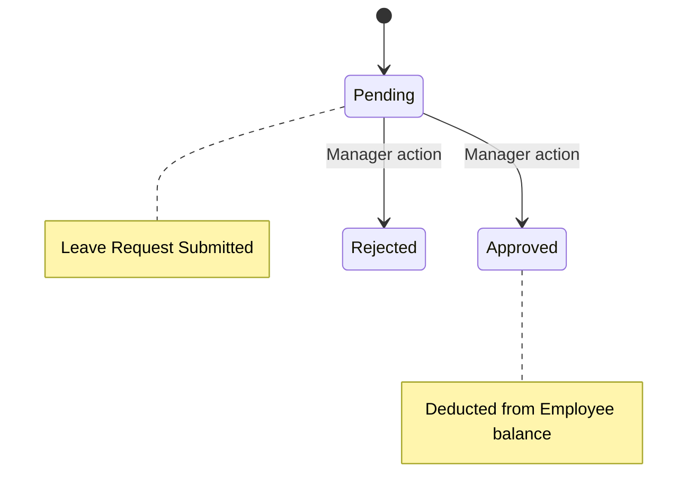

# Leave & Attendance Service

## 📌 Overview
The **Leave Service** manages employee time off, vacation days, sick leave, and daily attendance logs. It encapsulates complex domain rules involving office hours, late marks, early departures, and geo-fenced check-ins to ensure that human resources can be tracked seamlessly.

By extracting leave logic into a separate microservice, the HRMS system guarantees that calculating attendance and processing workflows (e.g., manager approvals) occurs safely without burdening other core operations.

## 🏗️ Architecture & Flow



### 🔑 Key Responsibilities:
1. **Attendance Tracking**: Records daily clock-ins and clock-outs.
2. **Geo-Fencing**: Validates check-ins against a strict physical radius to ensure employees are actually at the office location.
3. **Threshold Rules**: Automatically flags employees as "Late" or marks an "Early Departure" based on predefined configurable rules.
4. **Leave Management**: Manages employees' leave balance, applying deductions automatically after supervisor approvals.

## 💻 Technical Details

### Technologies & Dependencies
- **Spring Data JPA & Hibernate**: For ORM mapping to the `workforce` database.
- **MySQL Driver**: Stores attendance logs, leave balances, and request histories.

### Configuration Highlights (`application.properties`)
The service defines strict HR parameters inside its configuration file, making role rules widely customizable without altering the code:
```properties
spring.application.name=leave-service
server.port=8082

# DB Properties
spring.datasource.url=jdbc:mysql://localhost:3306/workforce?createDatabaseIfNotExist=true

# Attendance Business Rules
attendance.office-start-time=09:00
attendance.office-end-time=18:00
attendance.late-threshold-minutes=15
attendance.early-departure-threshold-minutes=30

# Geo-Fencing Constraints
geo-attendance.default-radius-meters=200
```
*In the configuration above, arriving at 09:16 marks an employee as late. Leaving at 17:29 marks them as an early departure.*

### API Documentation (Swagger)
Access interactive Swagger UI at:
👉 **[http://localhost:8082/swagger-ui.html](http://localhost:8082/swagger-ui.html)**

## 🚀 How to Run
**Using Maven:**
```bash
mvn spring-boot:run
```

**Using Docker:**
```bash
docker run -p 8082:8082 leave-service:latest
```


## 🛑 Deep Dive Component Codes & Project Structure
This section contains the full, exhaustive breakdown of the microservice's source code, project structure, and dependencies. It operates as the fundamental source of truth replacing isolated snippets with the actual working code.

### 🌳 Complete Project Tree
```text
leave-service/
├── .dockerignore
├── .gitattributes
├── .gitignore
├── Dockerfile
├── hs_err_pid22616.log
├── mvnw
├── mvnw.cmd
├── pom.xml
├── replay_pid22616.log
└── src
    ├── main
    │   ├── java
    │   │   └── com
    │   │       └── revworkforce
    │   │           └── leaveservice
    │   │               ├── LeaveServiceApplication.java
    │   │               ├── config
    │   │               │   ├── GatewayHeaderAuthenticationFilter.java
    │   │               │   └── SecurityConfig.java
    │   │               ├── controller
    │   │               │   ├── AdminAttendanceController.java
    │   │               │   ├── AdminLeaveController.java
    │   │               │   ├── AdminOfficeLocationController.java
    │   │               │   ├── EmployeeAttendanceController.java
    │   │               │   ├── EmployeeLeaveController.java
    │   │               │   ├── LeaveAnalysisController.java
    │   │               │   ├── ManagerAttendanceController.java
    │   │               │   └── ManagerLeaveController.java
    │   │               ├── dto
    │   │               │   ├── AdjustLeaveBalanceRequest.java
    │   │               │   ├── ApiResponse.java
    │   │               │   ├── AttendanceResponse.java
    │   │               │   ├── AttendanceSummaryResponse.java
    │   │               │   ├── ChatMessageResponse.java
    │   │               │   ├── CheckInRequest.java
    │   │               │   ├── CheckOutRequest.java
    │   │               │   ├── HolidayRequest.java
    │   │               │   ├── LeaveActionRequest.java
    │   │               │   ├── LeaveAnalysisResponse.java
    │   │               │   ├── LeaveApplyRequest.java
    │   │               │   ├── LeaveTypeRequest.java
    │   │               │   ├── OfficeLocationRequest.java
    │   │               │   ├── OfficeLocationResponse.java
    │   │               │   ├── TeamLeaveCalendarEntry.java
    │   │               │   └── TypingIndicator.java
    │   │               ├── exception
    │   │               │   ├── AccessDeniedException.java
    │   │               │   ├── AccountDeactivatedException.java
    │   │               │   ├── BadRequestException.java
    │   │               │   ├── DuplicateResourceException.java
    │   │               │   ├── GlobalExceptionHandler.java
    │   │               │   ├── InsufficientBalanceException.java
    │   │               │   ├── InvalidActionException.java
    │   │               │   ├── IpBlockedException.java
    │   │               │   ├── ResourceNotFoundException.java
    │   │               │   └── UnauthorizedException.java
    │   │               ├── feign
    │   │               │   └── NotificationFeignClient.java
    │   │               ├── integration
    │   │               │   └── OllamaClient.java
    │   │               ├── model
    │   │               │   ├── Attendance.java
    │   │               │   ├── Department.java
    │   │               │   ├── Designation.java
    │   │               │   ├── Employee.java
    │   │               │   ├── Holiday.java
    │   │               │   ├── LeaveApplication.java
    │   │               │   ├── LeaveBalance.java
    │   │               │   ├── LeaveType.java
    │   │               │   ├── Notification.java
    │   │               │   ├── OfficeLocation.java
    │   │               │   └── enums
    │   │               │       ├── AttendanceStatus.java
    │   │               │       ├── Gender.java
    │   │               │       ├── LeaveStatus.java
    │   │               │       ├── NotificationType.java
    │   │               │       └── Role.java
    │   │               ├── repository
    │   │               │   ├── AttendanceRepository.java
    │   │               │   ├── EmployeeRepository.java
    │   │               │   ├── HolidayRepository.java
    │   │               │   ├── LeaveApplicationRepository.java
    │   │               │   ├── LeaveBalanceRepository.java
    │   │               │   ├── LeaveTypeRepository.java
    │   │               │   ├── NotificationRepository.java
    │   │               │   └── OfficeLocationRepository.java
    │   │               └── service
    │   │                   ├── AttendanceService.java
    │   │                   ├── GeoAttendanceService.java
    │   │                   ├── LeaveAnalysisService.java
    │   │                   ├── LeaveService.java
    │   │                   ├── NotificationService.java
    │   │                   ├── OfficeLocationService.java
    │   │                   ├── PresenceService.java
    │   │                   └── WebSocketNotificationService.java
    │   └── resources
    │       └── application.properties
    └── test
        └── java
            └── com
                └── revworkforce
                    └── leaveservice
                        └── LeaveServiceApplicationTests.java
```

### 📦 Dependencies (`pom.xml`)
```xml
<?xml version="1.0" encoding="UTF-8"?>
<project xmlns="http://maven.apache.org/POM/4.0.0" xmlns:xsi="http://www.w3.org/2001/XMLSchema-instance"
         xsi:schemaLocation="http://maven.apache.org/POM/4.0.0 https://maven.apache.org/xsd/maven-4.0.0.xsd">
    <modelVersion>4.0.0</modelVersion>
    <parent>
        <groupId>org.springframework.boot</groupId>
        <artifactId>spring-boot-starter-parent</artifactId>
        <version>3.3.5</version>
        <relativePath/>
    </parent>
    <groupId>com.revworkforce</groupId>
    <artifactId>leave-service</artifactId>
    <version>0.0.1-SNAPSHOT</version>
    <name>leave-service</name>
    <description>Leave balances, applications, approval/rejection, attendance, holidays</description>
    <properties>
        <java.version>17</java.version>
        <spring-cloud.version>2023.0.3</spring-cloud.version>
        <lombok.version>1.18.38</lombok.version>
    </properties>
    <dependencies>
        <dependency><groupId>org.springframework.boot</groupId><artifactId>spring-boot-starter-actuator</artifactId></dependency>
        <dependency><groupId>org.springframework.boot</groupId><artifactId>spring-boot-starter-data-jpa</artifactId></dependency>
        <dependency><groupId>org.springframework.boot</groupId><artifactId>spring-boot-starter-validation</artifactId></dependency>
        <dependency><groupId>org.springframework.boot</groupId><artifactId>spring-boot-starter-web</artifactId></dependency>
        <dependency><groupId>org.springframework.boot</groupId><artifactId>spring-boot-starter-security</artifactId></dependency>
        <dependency><groupId>org.springframework.boot</groupId><artifactId>spring-boot-starter-websocket</artifactId></dependency>
        <dependency><groupId>org.springframework.cloud</groupId><artifactId>spring-cloud-starter-config</artifactId></dependency>
        <dependency><groupId>org.springframework.cloud</groupId><artifactId>spring-cloud-starter-netflix-eureka-client</artifactId></dependency>
        <dependency><groupId>org.springframework.cloud</groupId><artifactId>spring-cloud-starter-openfeign</artifactId></dependency>
        <dependency><groupId>org.springdoc</groupId><artifactId>springdoc-openapi-starter-webmvc-ui</artifactId><version>2.6.0</version></dependency>
        <dependency><groupId>com.mysql</groupId><artifactId>mysql-connector-j</artifactId><scope>runtime</scope></dependency>
        <dependency><groupId>org.projectlombok</groupId><artifactId>lombok</artifactId><version>${lombok.version}</version><optional>true</optional></dependency>
        <dependency><groupId>org.springframework.boot</groupId><artifactId>spring-boot-starter-test</artifactId><scope>test</scope></dependency>
    </dependencies>
    <dependencyManagement>
        <dependencies>
            <dependency><groupId>org.springframework.cloud</groupId><artifactId>spring-cloud-dependencies</artifactId><version>${spring-cloud.version}</version><type>pom</type><scope>import</scope></dependency>
        </dependencies>
    </dependencyManagement>
    <build>
        <plugins>
            <plugin><groupId>org.apache.maven.plugins</groupId><artifactId>maven-compiler-plugin</artifactId><version>3.14.1</version>
                <configuration><release>17</release><annotationProcessorPaths><path><groupId>org.projectlombok</groupId><artifactId>lombok</artifactId><version>${lombok.version}</version></path></annotationProcessorPaths></configuration>
            </plugin>
            <plugin><groupId>org.springframework.boot</groupId><artifactId>spring-boot-maven-plugin</artifactId>
                <configuration><excludes><exclude><groupId>org.projectlombok</groupId><artifactId>lombok</artifactId></exclude></excludes></configuration>
            </plugin>
        </plugins>
    </build>
</project>

```

### ⚙️ Configurations (`src/main/resources`)
**`application.properties`**
```properties
spring.application.name=leave-service
spring.config.import=optional:configserver:http://localhost:8888
eureka.client.service-url.defaultZone=http://localhost:8761/eureka/
eureka.instance.hostname=localhost
eureka.instance.prefer-ip-address=false
eureka.instance.instance-id=${spring.application.name}:${server.port}
server.port=8082

spring.datasource.url=jdbc:mysql://localhost:3306/workforce?createDatabaseIfNotExist=true
spring.datasource.username=root
spring.datasource.password=1234
spring.datasource.driver-class-name=com.mysql.cj.jdbc.Driver
spring.jpa.hibernate.ddl-auto=update
spring.jpa.show-sql=false
spring.jpa.properties.hibernate.dialect=org.hibernate.dialect.MySQLDialect

attendance.office-start-time=09:00
attendance.office-end-time=18:00
attendance.late-threshold-minutes=15
attendance.early-departure-threshold-minutes=30
geo-attendance.default-radius-meters=200

springdoc.api-docs.path=/v3/api-docs
springdoc.swagger-ui.path=/swagger-ui.html

```
