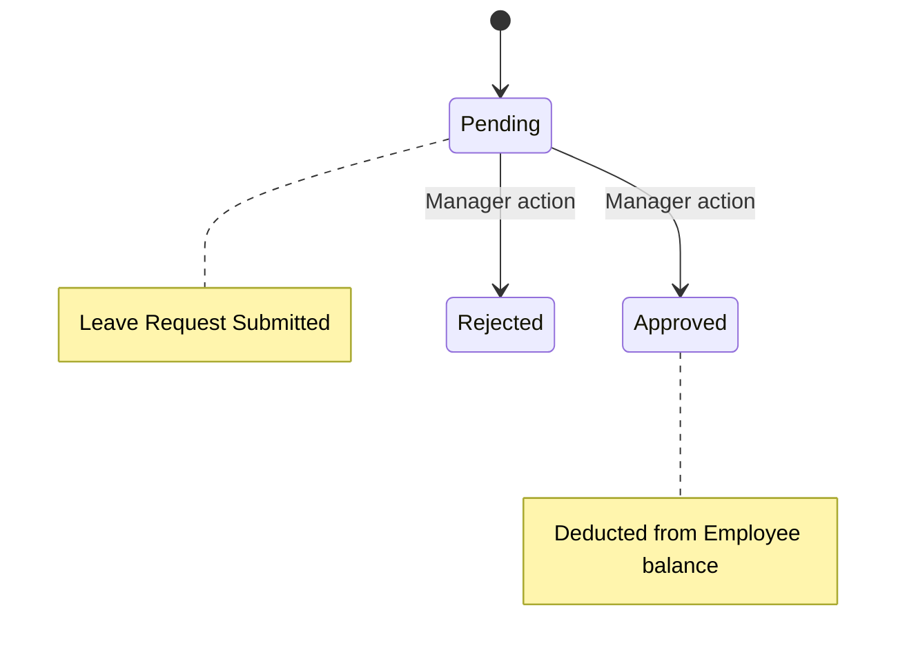

# Leave & Attendance Service

## 📌 Overview
The **Leave Service** manages employee time off, vacation days, sick leave, and daily attendance logs. It encapsulates complex domain rules involving office hours, late marks, early departures, and geo-fenced check-ins to ensure that human resources can be tracked seamlessly.

By extracting leave logic into a separate microservice, the HRMS system guarantees that calculating attendance and processing workflows (e.g., manager approvals) occurs safely without burdening other core operations.

## 🏗️ Architecture & Flow



### 🔑 Key Responsibilities:
1. **Attendance Tracking**: Records daily clock-ins and clock-outs.
2. **Geo-Fencing**: Validates check-ins against a strict physical radius to ensure employees are actually at the office location.
3. **Threshold Rules**: Automatically flags employees as "Late" or marks an "Early Departure" based on predefined configurable rules.
4. **Leave Management**: Manages employees' leave balance, applying deductions automatically after supervisor approvals.

## 💻 Technical Details

### Technologies & Dependencies
- **Spring Data JPA & Hibernate**: For ORM mapping to the `workforce` database.
- **MySQL Driver**: Stores attendance logs, leave balances, and request histories.

### Configuration Highlights (`application.properties`)
The service defines strict HR parameters inside its configuration file, making role rules widely customizable without altering the code:
```properties
spring.application.name=leave-service
server.port=8082

# DB Properties
spring.datasource.url=jdbc:mysql://localhost:3306/workforce?createDatabaseIfNotExist=true

# Attendance Business Rules
attendance.office-start-time=09:00
attendance.office-end-time=18:00
attendance.late-threshold-minutes=15
attendance.early-departure-threshold-minutes=30

# Geo-Fencing Constraints
geo-attendance.default-radius-meters=200
```
*In the configuration above, arriving at 09:16 marks an employee as late. Leaving at 17:29 marks them as an early departure.*

### API Documentation (Swagger)
Access interactive Swagger UI at:
👉 **[http://localhost:8082/swagger-ui.html](http://localhost:8082/swagger-ui.html)**

## 🚀 How to Run
**Using Maven:**
```bash
mvn spring-boot:run
```

**Using Docker:**
```bash
docker run -p 8082:8082 leave-service:latest
```


## 🛑 Deep Dive Component Codes & Project Structure
This section contains the full, exhaustive breakdown of the microservice's source code, project structure, and dependencies. It operates as the fundamental source of truth replacing isolated snippets with the actual working code.

### 🌳 Complete Project Tree
```text
📦 leave-service
    📜 .dockerignore
    📜 .gitattributes
    📜 .gitignore
    📜 Dockerfile
    📜 hs_err_pid22616.log
    📜 mvnw
    📜 mvnw.cmd
    📜 pom.xml
    📜 replay_pid22616.log
    📂 src
        📂 main
            📂 java
                📂 com
                    📂 revworkforce
                        📂 leaveservice
                            📜 LeaveServiceApplication.java
                            📂 config
                                📜 GatewayHeaderAuthenticationFilter.java
                                📜 SecurityConfig.java
                            📂 controller
                                📜 AdminAttendanceController.java
                                📜 AdminLeaveController.java
                                📜 AdminOfficeLocationController.java
                                📜 EmployeeAttendanceController.java
                                📜 EmployeeLeaveController.java
                                📜 LeaveAnalysisController.java
                                📜 ManagerAttendanceController.java
                                📜 ManagerLeaveController.java
                            📂 dto
                                📜 AdjustLeaveBalanceRequest.java
                                📜 ApiResponse.java
                                📜 AttendanceResponse.java
                                📜 AttendanceSummaryResponse.java
                                📜 ChatMessageResponse.java
                                📜 CheckInRequest.java
                                📜 CheckOutRequest.java
                                📜 HolidayRequest.java
                                📜 LeaveActionRequest.java
                                📜 LeaveAnalysisResponse.java
                                📜 LeaveApplyRequest.java
                                📜 LeaveTypeRequest.java
                                📜 OfficeLocationRequest.java
                                📜 OfficeLocationResponse.java
                                📜 TeamLeaveCalendarEntry.java
                                📜 TypingIndicator.java
                            📂 exception
                                📜 AccessDeniedException.java
                                📜 AccountDeactivatedException.java
                                📜 BadRequestException.java
                                📜 DuplicateResourceException.java
                                📜 GlobalExceptionHandler.java
                                📜 InsufficientBalanceException.java
                                📜 InvalidActionException.java
                                📜 IpBlockedException.java
                                📜 ResourceNotFoundException.java
                                📜 UnauthorizedException.java
                            📂 feign
                                📜 NotificationFeignClient.java
                            📂 integration
                                📜 OllamaClient.java
                            📂 model
                                📜 Attendance.java
                                📜 Department.java
                                📜 Designation.java
                                📜 Employee.java
                                📜 Holiday.java
                                📜 LeaveApplication.java
                                📜 LeaveBalance.java
                                📜 LeaveType.java
                                📜 Notification.java
                                📜 OfficeLocation.java
                                📂 enums
                                    📜 AttendanceStatus.java
                                    📜 Gender.java
                                    📜 LeaveStatus.java
                                    📜 NotificationType.java
                                    📜 Role.java
                            📂 repository
                                📜 AttendanceRepository.java
                                📜 EmployeeRepository.java
                                📜 HolidayRepository.java
                                📜 LeaveApplicationRepository.java
                                📜 LeaveBalanceRepository.java
                                📜 LeaveTypeRepository.java
                                📜 NotificationRepository.java
                                📜 OfficeLocationRepository.java
                            📂 service
                                📜 AttendanceService.java
                                📜 GeoAttendanceService.java
                                📜 LeaveAnalysisService.java
                                📜 LeaveService.java
                                📜 NotificationService.java
                                📜 OfficeLocationService.java
                                📜 PresenceService.java
                                📜 WebSocketNotificationService.java
            📂 resources
                📜 application.properties
        📂 test
            📂 java
                📂 com
                    📂 revworkforce
                        📂 leaveservice
                            📜 LeaveServiceApplicationTests.java
```

### 📦 Dependencies (`pom.xml`)
```xml
<?xml version="1.0" encoding="UTF-8"?>
<project xmlns="http://maven.apache.org/POM/4.0.0" xmlns:xsi="http://www.w3.org/2001/XMLSchema-instance"
         xsi:schemaLocation="http://maven.apache.org/POM/4.0.0 https://maven.apache.org/xsd/maven-4.0.0.xsd">
    <modelVersion>4.0.0</modelVersion>
    <parent>
        <groupId>org.springframework.boot</groupId>
        <artifactId>spring-boot-starter-parent</artifactId>
        <version>3.3.5</version>
        <relativePath/>
    </parent>
    <groupId>com.revworkforce</groupId>
    <artifactId>leave-service</artifactId>
    <version>0.0.1-SNAPSHOT</version>
    <name>leave-service</name>
    <description>Leave balances, applications, approval/rejection, attendance, holidays</description>
    <properties>
        <java.version>17</java.version>
        <spring-cloud.version>2023.0.3</spring-cloud.version>
        <lombok.version>1.18.38</lombok.version>
    </properties>
    <dependencies>
        <dependency><groupId>org.springframework.boot</groupId><artifactId>spring-boot-starter-actuator</artifactId></dependency>
        <dependency><groupId>org.springframework.boot</groupId><artifactId>spring-boot-starter-data-jpa</artifactId></dependency>
        <dependency><groupId>org.springframework.boot</groupId><artifactId>spring-boot-starter-validation</artifactId></dependency>
        <dependency><groupId>org.springframework.boot</groupId><artifactId>spring-boot-starter-web</artifactId></dependency>
        <dependency><groupId>org.springframework.boot</groupId><artifactId>spring-boot-starter-security</artifactId></dependency>
        <dependency><groupId>org.springframework.boot</groupId><artifactId>spring-boot-starter-websocket</artifactId></dependency>
        <dependency><groupId>org.springframework.cloud</groupId><artifactId>spring-cloud-starter-config</artifactId></dependency>
        <dependency><groupId>org.springframework.cloud</groupId><artifactId>spring-cloud-starter-netflix-eureka-client</artifactId></dependency>
        <dependency><groupId>org.springframework.cloud</groupId><artifactId>spring-cloud-starter-openfeign</artifactId></dependency>
        <dependency><groupId>org.springdoc</groupId><artifactId>springdoc-openapi-starter-webmvc-ui</artifactId><version>2.6.0</version></dependency>
        <dependency><groupId>com.mysql</groupId><artifactId>mysql-connector-j</artifactId><scope>runtime</scope></dependency>
        <dependency><groupId>org.projectlombok</groupId><artifactId>lombok</artifactId><version>${lombok.version}</version><optional>true</optional></dependency>
        <dependency><groupId>org.springframework.boot</groupId><artifactId>spring-boot-starter-test</artifactId><scope>test</scope></dependency>
    </dependencies>
    <dependencyManagement>
        <dependencies>
            <dependency><groupId>org.springframework.cloud</groupId><artifactId>spring-cloud-dependencies</artifactId><version>${spring-cloud.version}</version><type>pom</type><scope>import</scope></dependency>
        </dependencies>
    </dependencyManagement>
    <build>
        <plugins>
            <plugin><groupId>org.apache.maven.plugins</groupId><artifactId>maven-compiler-plugin</artifactId><version>3.14.1</version>
                <configuration><release>17</release><annotationProcessorPaths><path><groupId>org.projectlombok</groupId><artifactId>lombok</artifactId><version>${lombok.version}</version></path></annotationProcessorPaths></configuration>
            </plugin>
            <plugin><groupId>org.springframework.boot</groupId><artifactId>spring-boot-maven-plugin</artifactId>
                <configuration><excludes><exclude><groupId>org.projectlombok</groupId><artifactId>lombok</artifactId></exclude></excludes></configuration>
            </plugin>
        </plugins>
    </build>
</project>

```

### ⚙️ Configurations (`src/main/resources`)
**`application.properties`**
```properties
spring.application.name=leave-service
spring.config.import=optional:configserver:http://localhost:8888
eureka.client.service-url.defaultZone=http://localhost:8761/eureka/
eureka.instance.hostname=localhost
eureka.instance.prefer-ip-address=false
eureka.instance.instance-id=${spring.application.name}:${server.port}
server.port=8082

spring.datasource.url=jdbc:mysql://localhost:3306/workforce?createDatabaseIfNotExist=true
spring.datasource.username=root
spring.datasource.password=1234
spring.datasource.driver-class-name=com.mysql.cj.jdbc.Driver
spring.jpa.hibernate.ddl-auto=update
spring.jpa.show-sql=false
spring.jpa.properties.hibernate.dialect=org.hibernate.dialect.MySQLDialect

attendance.office-start-time=09:00
attendance.office-end-time=18:00
attendance.late-threshold-minutes=15
attendance.early-departure-threshold-minutes=30
geo-attendance.default-radius-meters=200

springdoc.api-docs.path=/v3/api-docs
springdoc.swagger-ui.path=/swagger-ui.html

```

### ☕ Source Code Files
#### **`src/main/java/com/revworkforce/leaveservice/LeaveServiceApplication.java`**
```java
package com.revworkforce.leaveservice;
import org.springframework.boot.SpringApplication;
import org.springframework.boot.autoconfigure.SpringBootApplication;
import org.springframework.cloud.client.discovery.EnableDiscoveryClient;
import org.springframework.cloud.openfeign.EnableFeignClients;

@SpringBootApplication @EnableDiscoveryClient @EnableFeignClients
public class LeaveServiceApplication {
    public static void main(String[] args) { SpringApplication.run(LeaveServiceApplication.class, args); }
}

```

#### **`src/main/java/com/revworkforce/leaveservice/config/GatewayHeaderAuthenticationFilter.java`**
```java
package com.revworkforce.leaveservice.config;

import jakarta.servlet.FilterChain;
import jakarta.servlet.ServletException;
import jakarta.servlet.http.HttpServletRequest;
import jakarta.servlet.http.HttpServletResponse;
import org.springframework.security.authentication.UsernamePasswordAuthenticationToken;
import org.springframework.security.core.authority.SimpleGrantedAuthority;
import org.springframework.security.core.context.SecurityContextHolder;
import org.springframework.stereotype.Component;
import org.springframework.web.filter.OncePerRequestFilter;

import java.io.IOException;
import java.util.List;

@Component
public class GatewayHeaderAuthenticationFilter extends OncePerRequestFilter {
    private static final String USER_EMAIL_HEADER = "X-User-Email";
    private static final String USER_ROLE_HEADER = "X-User-Role";

    @Override
    protected void doFilterInternal(HttpServletRequest request,
                                    HttpServletResponse response,
                                    FilterChain filterChain) throws ServletException, IOException {
        if (SecurityContextHolder.getContext().getAuthentication() == null) {
            String email = request.getHeader(USER_EMAIL_HEADER);
            String role = request.getHeader(USER_ROLE_HEADER);

            if (email != null && !email.isBlank()) {
                String normalizedRole = (role == null || role.isBlank()) ? "USER" : role.trim();
                if (normalizedRole.startsWith("ROLE_")) {
                    normalizedRole = normalizedRole.substring(5);
                }

                UsernamePasswordAuthenticationToken authentication =
                        new UsernamePasswordAuthenticationToken(
                                email,
                                null,
                                List.of(new SimpleGrantedAuthority("ROLE_" + normalizedRole))
                        );
                SecurityContextHolder.getContext().setAuthentication(authentication);
            }
        }

        filterChain.doFilter(request, response);
    }
}

```

#### **`src/main/java/com/revworkforce/leaveservice/config/SecurityConfig.java`**
```java
package com.revworkforce.leaveservice.config;

import jakarta.servlet.http.HttpServletResponse;
import org.springframework.beans.factory.annotation.Value;
import org.springframework.context.annotation.Bean;
import org.springframework.context.annotation.Configuration;
import org.springframework.security.config.annotation.web.builders.HttpSecurity;
import org.springframework.security.config.annotation.web.configuration.EnableWebSecurity;
import org.springframework.security.config.http.SessionCreationPolicy;
import org.springframework.security.web.SecurityFilterChain;
import org.springframework.security.web.authentication.UsernamePasswordAuthenticationFilter;
import org.springframework.web.cors.CorsConfiguration;

import java.util.Arrays;
import java.util.List;

@Configuration
@EnableWebSecurity
public class SecurityConfig {
    @Value("${app.cors.allowed-origins:http://localhost:4200}")
    private String allowedOrigins;

    @Bean
    public SecurityFilterChain filterChain(HttpSecurity http,
                                           GatewayHeaderAuthenticationFilter gatewayHeaderAuthenticationFilter) throws Exception {
        http
                .cors(cors -> cors.configurationSource(request -> {
                    CorsConfiguration config = new CorsConfiguration();
                    config.setAllowedOrigins(Arrays.asList(allowedOrigins.split(",")));
                    config.setAllowedMethods(List.of("GET", "POST", "PUT", "PATCH", "DELETE", "OPTIONS"));
                    config.setAllowedHeaders(List.of("*"));
                    config.setAllowCredentials(true);
                    return config;
                }))
                .csrf(csrf -> csrf.disable())
                .httpBasic(httpBasic -> httpBasic.disable())
                .formLogin(formLogin -> formLogin.disable())
                .sessionManagement(session -> session.sessionCreationPolicy(SessionCreationPolicy.STATELESS))
                .authorizeHttpRequests(auth -> auth
                        .requestMatchers("/swagger-ui/**", "/v3/api-docs/**", "/swagger-ui.html").permitAll()
                        .requestMatchers("/actuator/**").permitAll()
                        .anyRequest().authenticated()
                )
                .exceptionHandling(ex -> ex
                        .authenticationEntryPoint((request, response, authException) -> {
                            response.setContentType("application/json");
                            response.setStatus(HttpServletResponse.SC_UNAUTHORIZED);
                            response.getWriter().write("{\"success\":false,\"message\":\"Unauthorized\"}");
                        })
                        .accessDeniedHandler((request, response, accessDeniedException) -> {
                            response.setContentType("application/json");
                            response.setStatus(HttpServletResponse.SC_FORBIDDEN);
                            response.getWriter().write("{\"success\":false,\"message\":\"Access denied\"}");
                        })
                )
                .addFilterBefore(gatewayHeaderAuthenticationFilter, UsernamePasswordAuthenticationFilter.class);

        return http.build();
    }
}

```

#### **`src/main/java/com/revworkforce/leaveservice/controller/AdminAttendanceController.java`**
```java
package com.revworkforce.leaveservice.controller;

import com.revworkforce.leaveservice.dto.ApiResponse;
import com.revworkforce.leaveservice.dto.AttendanceResponse;
import com.revworkforce.leaveservice.dto.AttendanceSummaryResponse;
import com.revworkforce.leaveservice.service.AttendanceService;
import org.springframework.beans.factory.annotation.Autowired;
import org.springframework.data.domain.Page;
import org.springframework.data.domain.PageRequest;
import org.springframework.data.domain.Pageable;
import org.springframework.data.domain.Sort;
import org.springframework.format.annotation.DateTimeFormat;
import org.springframework.http.ResponseEntity;
import org.springframework.web.bind.annotation.*;

import java.time.LocalDate;

@RestController
@RequestMapping("/api/admin/attendance")
public class AdminAttendanceController {
    @Autowired
    private AttendanceService attendanceService;

    @GetMapping
    public ResponseEntity<ApiResponse> getAllAttendanceByDate(
            @RequestParam(required = false) @DateTimeFormat(iso = DateTimeFormat.ISO.DATE) LocalDate date,
            @RequestParam(defaultValue = "0") int page,
            @RequestParam(defaultValue = "20") int size,
            @RequestParam(defaultValue = "attendanceDate") String sortBy,
            @RequestParam(defaultValue = "desc") String direction) {
        Sort sort = direction.equalsIgnoreCase("desc") ? Sort.by(sortBy).descending() : Sort.by(sortBy).ascending();
        Pageable pageable = PageRequest.of(page, size, sort);
        Page<AttendanceResponse> attendance = attendanceService.getAllAttendanceByDate(date, pageable);
        return ResponseEntity.ok(new ApiResponse(true, "Attendance records fetched", attendance));
    }

    @GetMapping("/{employeeCode}/summary")
    public ResponseEntity<ApiResponse> getEmployeeAttendanceSummary(
            @PathVariable String employeeCode,
            @RequestParam(required = false) Integer month,
            @RequestParam(required = false) Integer year) {
        AttendanceSummaryResponse summary = attendanceService.getEmployeeSummary(employeeCode, month, year);
        return ResponseEntity.ok(new ApiResponse(true, "Employee attendance summary fetched", summary));
    }
}

```

#### **`src/main/java/com/revworkforce/leaveservice/controller/AdminLeaveController.java`**
```java
package com.revworkforce.leaveservice.controller;

import jakarta.validation.Valid;
import com.revworkforce.leaveservice.dto.AdjustLeaveBalanceRequest;
import com.revworkforce.leaveservice.dto.ApiResponse;
import com.revworkforce.leaveservice.dto.HolidayRequest;
import com.revworkforce.leaveservice.dto.LeaveActionRequest;
import com.revworkforce.leaveservice.dto.LeaveTypeRequest;
import com.revworkforce.leaveservice.exception.UnauthorizedException;
import com.revworkforce.leaveservice.model.Holiday;
import com.revworkforce.leaveservice.model.LeaveApplication;
import com.revworkforce.leaveservice.model.LeaveBalance;
import com.revworkforce.leaveservice.model.LeaveType;
import com.revworkforce.leaveservice.model.enums.LeaveStatus;
import com.revworkforce.leaveservice.service.LeaveService;
import org.springframework.beans.factory.annotation.Autowired;
import org.springframework.data.domain.Page;
import org.springframework.data.domain.PageRequest;
import org.springframework.data.domain.Pageable;
import org.springframework.data.domain.Sort;
import org.springframework.http.HttpStatus;
import org.springframework.http.ResponseEntity;
import org.springframework.security.core.Authentication;
import org.springframework.security.core.context.SecurityContextHolder;
import org.springframework.web.bind.annotation.*;

import java.util.List;

@RestController
@RequestMapping("/api/admin/leaves")
public class AdminLeaveController {
    @Autowired
    private LeaveService leaveService;

    @PostMapping("/types")
    public ResponseEntity<ApiResponse> createLeaveType(@Valid @RequestBody LeaveTypeRequest request) {
        LeaveType leaveType = leaveService.createLeaveType(request);
        return ResponseEntity.status(HttpStatus.CREATED).body(new ApiResponse(true, "Leave type created successfully", leaveType));
    }

    @GetMapping("/types")
    public ResponseEntity<ApiResponse> getAllLeaveType() {
        List<LeaveType> types = leaveService.getAllLeaveType();
        return ResponseEntity.ok(new ApiResponse(true, "Leave types fetched successfully", types));
    }

    @PutMapping("/types/{leaveTypeId}")
    public ResponseEntity<ApiResponse> updateLeaveType(@PathVariable Integer leaveTypeId, @Valid @RequestBody LeaveTypeRequest request) {
        LeaveType leaveType = leaveService.updateLeaveType(leaveTypeId, request);
        return ResponseEntity.ok(new ApiResponse(true, "Leave type updated successfully", leaveType));
    }

    @PostMapping("/balance/{employeeCode}")
    public ResponseEntity<ApiResponse> assignLeaveQuota(@PathVariable String employeeCode, @Valid @RequestBody AdjustLeaveBalanceRequest request) {
        String adminEmail = getAdminEmail();
        LeaveBalance balance = leaveService.assignLeaveQuota(employeeCode, request, adminEmail);
        return ResponseEntity.ok(new ApiResponse(true, "Leave quota assigned successfully", balance));
    }

    @GetMapping("/balance/{employeeCode}")
    public ResponseEntity<ApiResponse> getEmployeeLeaveBalance(@PathVariable String employeeCode) {
        List<LeaveBalance> balances = leaveService.getEmployeeBalance(employeeCode);
        return ResponseEntity.ok(new ApiResponse(true, "Employee leave balance fetched successfully", balances));
    }

    @PostMapping("/holidays")
    public ResponseEntity<ApiResponse> createHoliday(@Valid @RequestBody HolidayRequest request) {
        Holiday holiday = leaveService.createHoliday(request);
        return ResponseEntity.status(HttpStatus.CREATED).body(new ApiResponse(true, "Holiday created successfully", holiday));
    }

    @PutMapping("/holidays/{holidayId}")
    public ResponseEntity<ApiResponse> updateHoliday(@PathVariable Integer holidayId, @Valid @RequestBody HolidayRequest request) {
        Holiday holiday = leaveService.updateHoliday(holidayId, request);
        return ResponseEntity.ok(new ApiResponse(true, "Holiday updated successfully", holiday));
    }

    @DeleteMapping("/holidays/{holidayId}")
    public ResponseEntity<ApiResponse> deleteHoliday(@PathVariable Integer holidayId) {
        leaveService.deleteHoliday(holidayId);
        return ResponseEntity.ok(new ApiResponse(true, "Holiday deleted successfully"));
    }

    @GetMapping("/applications")
    public ResponseEntity<ApiResponse> getAllLeaveApplications(
            @RequestParam(required = false) LeaveStatus status,
            @RequestParam(defaultValue = "0") int page,
            @RequestParam(defaultValue = "10") int size,
            @RequestParam(defaultValue = "appliedDate") String sortBy,
            @RequestParam(defaultValue = "desc") String direction) {
        Sort sort = direction.equalsIgnoreCase("desc") ? Sort.by(sortBy).descending() : Sort.by(sortBy).ascending();
        Pageable pageable = PageRequest.of(page, size, sort);
        Page<LeaveApplication> applications = leaveService.getAllLeaveApplications(status, pageable);
        return ResponseEntity.ok(new ApiResponse(true, "All leave applications fetched successfully", applications));
    }

    @PatchMapping("/{leaveId}/action")
    public ResponseEntity<ApiResponse> actionLeave(@PathVariable Integer leaveId, @Valid @RequestBody LeaveActionRequest request) {
        String adminEmail = getAdminEmail();
        LeaveApplication leave = leaveService.adminActionLeave(adminEmail, leaveId, request);
        return ResponseEntity.ok(new ApiResponse(true, "Leave " + leave.getStatus().name().toLowerCase() + " successfully", leave));
    }

    @GetMapping("/holidays")
    public ResponseEntity<ApiResponse> getHolidays(@RequestParam(required = false) Integer year) {
        return ResponseEntity.ok(new ApiResponse(true, "Holiday fetched successfully", leaveService.getHolidays(year)));
    }

    private String getAdminEmail() {
        Authentication auth = SecurityContextHolder.getContext().getAuthentication();
        if (auth == null || !auth.isAuthenticated()) {
            throw new UnauthorizedException("Admin not authenticated");
        }
        return auth.getName();
    }
}

```

#### **`src/main/java/com/revworkforce/leaveservice/controller/AdminOfficeLocationController.java`**
```java
package com.revworkforce.leaveservice.controller;

import jakarta.validation.Valid;
import com.revworkforce.leaveservice.dto.ApiResponse;
import com.revworkforce.leaveservice.dto.OfficeLocationRequest;
import com.revworkforce.leaveservice.dto.OfficeLocationResponse;
import com.revworkforce.leaveservice.model.OfficeLocation;
import com.revworkforce.leaveservice.service.OfficeLocationService;
import org.springframework.beans.factory.annotation.Autowired;
import org.springframework.http.HttpStatus;
import org.springframework.http.ResponseEntity;
import org.springframework.web.bind.annotation.*;

import java.util.List;

@RestController
@RequestMapping("/api/admin/office-locations")
public class AdminOfficeLocationController {
    @Autowired
    private OfficeLocationService officeLocationService;

    @GetMapping
    public ResponseEntity<ApiResponse> getAllLocations() {
        List<OfficeLocation> locations = officeLocationService.getAllLocations();
        List<OfficeLocationResponse> response = locations.stream()
                .map(this::mapToResponse)
                .toList();
        return ResponseEntity.ok(new ApiResponse(true, "Office locations fetched", response));
    }

    @GetMapping("/{id}")
    public ResponseEntity<ApiResponse> getLocation(@PathVariable Integer id) {
        OfficeLocation location = officeLocationService.getLocationById(id);
        return ResponseEntity.ok(new ApiResponse(true, "Office location fetched", mapToResponse(location)));
    }

    @PostMapping
    public ResponseEntity<ApiResponse> addLocation(@Valid @RequestBody OfficeLocationRequest request) {
        OfficeLocation created = officeLocationService.addLocation(request);
        return ResponseEntity.status(HttpStatus.CREATED)
                .body(new ApiResponse(true, "Office location created", mapToResponse(created)));
    }

    @PutMapping("/{id}")
    public ResponseEntity<ApiResponse> updateLocation(@PathVariable Integer id,
                                                       @Valid @RequestBody OfficeLocationRequest request) {
        OfficeLocation updated = officeLocationService.updateLocation(id, request);
        return ResponseEntity.ok(new ApiResponse(true, "Office location updated", mapToResponse(updated)));
    }

    @PatchMapping("/{id}/toggle")
    public ResponseEntity<ApiResponse> toggleLocation(@PathVariable Integer id) {
        OfficeLocation toggled = officeLocationService.toggleLocation(id);
        return ResponseEntity.ok(new ApiResponse(true,
                "Office location " + (toggled.getIsActive() ? "activated" : "deactivated"),
                mapToResponse(toggled)));
    }

    @DeleteMapping("/{id}")
    public ResponseEntity<ApiResponse> deleteLocation(@PathVariable Integer id) {
        officeLocationService.deleteLocation(id);
        return ResponseEntity.ok(new ApiResponse(true, "Office location deleted"));
    }

    @GetMapping("/active")
    public ResponseEntity<ApiResponse> getActiveLocations() {
        List<OfficeLocation> locations = officeLocationService.getActiveLocations();
        List<OfficeLocationResponse> response = locations.stream()
                .map(this::mapToResponse)
                .toList();
        return ResponseEntity.ok(new ApiResponse(true, "Active office locations fetched", response));
    }

    private OfficeLocationResponse mapToResponse(OfficeLocation entity) {
        return OfficeLocationResponse.builder()
                .locationId(entity.getLocationId())
                .locationName(entity.getLocationName())
                .address(entity.getAddress())
                .latitude(entity.getLatitude())
                .longitude(entity.getLongitude())
                .radiusMeters(entity.getRadiusMeters())
                .isActive(entity.getIsActive())
                .createdAt(entity.getCreatedAt())
                .updatedAt(entity.getUpdatedAt())
                .build();
    }
}

```

#### **`src/main/java/com/revworkforce/leaveservice/controller/EmployeeAttendanceController.java`**
```java
package com.revworkforce.leaveservice.controller;

import com.revworkforce.leaveservice.dto.*;
import com.revworkforce.leaveservice.exception.UnauthorizedException;
import com.revworkforce.leaveservice.service.AttendanceService;
import org.springframework.beans.factory.annotation.Autowired;
import org.springframework.data.domain.Page;
import org.springframework.data.domain.PageRequest;
import org.springframework.data.domain.Pageable;
import org.springframework.data.domain.Sort;
import org.springframework.format.annotation.DateTimeFormat;
import org.springframework.http.HttpStatus;
import org.springframework.http.ResponseEntity;
import org.springframework.security.core.Authentication;
import org.springframework.security.core.context.SecurityContextHolder;
import org.springframework.web.bind.annotation.*;

import jakarta.servlet.http.HttpServletRequest;
import java.time.LocalDate;

@RestController
@RequestMapping("/api/employees/attendance")
public class EmployeeAttendanceController {
    @Autowired
    private AttendanceService attendanceService;

    @PostMapping("/check-in")
    public ResponseEntity<ApiResponse> checkIn(@RequestBody(required = false) CheckInRequest request,
                                                HttpServletRequest httpRequest) {
        String email = getCurrentUserEmail();
        String ipAddress = getClientIp(httpRequest);
        AttendanceResponse response = attendanceService.checkIn(email, request, ipAddress);
        return ResponseEntity.status(HttpStatus.CREATED)
                .body(new ApiResponse(true, "Checked in successfully", response));
    }

    @PostMapping("/check-out")
    public ResponseEntity<ApiResponse> checkOut(@RequestBody(required = false) CheckOutRequest request,
                                                 HttpServletRequest httpRequest) {
        String email = getCurrentUserEmail();
        String ipAddress = getClientIp(httpRequest);
        AttendanceResponse response = attendanceService.checkOut(email, request, ipAddress);
        return ResponseEntity.ok(new ApiResponse(true, "Checked out successfully", response));
    }

    @GetMapping("/today")
    public ResponseEntity<ApiResponse> getTodayStatus() {
        String email = getCurrentUserEmail();
        AttendanceResponse response = attendanceService.getTodayStatus(email);
        return ResponseEntity.ok(new ApiResponse(true, "Today's attendance status fetched", response));
    }

    @GetMapping("/history")
    public ResponseEntity<ApiResponse> getMyAttendanceHistory(
            @RequestParam(required = false) @DateTimeFormat(iso = DateTimeFormat.ISO.DATE) LocalDate startDate,
            @RequestParam(required = false) @DateTimeFormat(iso = DateTimeFormat.ISO.DATE) LocalDate endDate,
            @RequestParam(defaultValue = "0") int page,
            @RequestParam(defaultValue = "10") int size,
            @RequestParam(defaultValue = "attendanceDate") String sortBy,
            @RequestParam(defaultValue = "desc") String direction) {
        String email = getCurrentUserEmail();
        Sort sort = direction.equalsIgnoreCase("desc") ? Sort.by(sortBy).descending() : Sort.by(sortBy).ascending();
        Pageable pageable = PageRequest.of(page, size, sort);
        Page<AttendanceResponse> history = attendanceService.getMyAttendance(email, startDate, endDate, pageable);
        return ResponseEntity.ok(new ApiResponse(true, "Attendance history fetched", history));
    }

    @GetMapping("/summary")
    public ResponseEntity<ApiResponse> getMySummary(
            @RequestParam(required = false) Integer month,
            @RequestParam(required = false) Integer year) {
        String email = getCurrentUserEmail();
        AttendanceSummaryResponse summary = attendanceService.getMySummary(email, month, year);
        return ResponseEntity.ok(new ApiResponse(true, "Attendance summary fetched", summary));
    }

    private String getCurrentUserEmail() {
        Authentication authentication = SecurityContextHolder.getContext().getAuthentication();
        if (authentication == null || !authentication.isAuthenticated()) {
            throw new UnauthorizedException("User not authenticated");
        }
        return authentication.getName();
    }

    private String getClientIp(HttpServletRequest request) {
        String xForwardedFor = request.getHeader("X-Forwarded-For");
        if (xForwardedFor != null && !xForwardedFor.isEmpty()) {
            return xForwardedFor.split(",")[0].trim();
        }
        String xRealIp = request.getHeader("X-Real-IP");
        if (xRealIp != null && !xRealIp.isEmpty()) {
            return xRealIp;
        }
        return request.getRemoteAddr();
    }
}

```

#### **`src/main/java/com/revworkforce/leaveservice/controller/EmployeeLeaveController.java`**
```java
package com.revworkforce.leaveservice.controller;

import jakarta.validation.Valid;
import com.revworkforce.leaveservice.dto.ApiResponse;
import com.revworkforce.leaveservice.dto.LeaveApplyRequest;
import com.revworkforce.leaveservice.exception.UnauthorizedException;
import com.revworkforce.leaveservice.model.Holiday;
import com.revworkforce.leaveservice.model.LeaveBalance;
import com.revworkforce.leaveservice.model.LeaveType;
import com.revworkforce.leaveservice.model.enums.LeaveStatus;
import com.revworkforce.leaveservice.service.LeaveService;
import com.revworkforce.leaveservice.model.LeaveApplication;
import org.springframework.beans.factory.annotation.Autowired;
import org.springframework.data.domain.Page;
import org.springframework.data.domain.PageRequest;
import org.springframework.data.domain.Pageable;
import org.springframework.data.domain.Sort;
import org.springframework.http.HttpStatus;
import org.springframework.http.ResponseEntity;
import org.springframework.security.core.Authentication;
import org.springframework.security.core.context.SecurityContextHolder;
import org.springframework.web.bind.annotation.*;

import java.util.List;

@RestController
@RequestMapping("/api/employees/leaves")
public class EmployeeLeaveController {
    @Autowired
    private LeaveService leaveService;

    @PostMapping("/apply")
    public ResponseEntity<ApiResponse> applyLeave(@Valid @RequestBody LeaveApplyRequest request) {
        String email = getCurrentUserEmail();
        LeaveApplication leave = leaveService.applyLeave(email, request);
        return ResponseEntity.status(HttpStatus.CREATED).body(new ApiResponse(true, "Leave applied successfully", leave));
    }

    @GetMapping
    public ResponseEntity<ApiResponse> getMyLeaves(
            @RequestParam(required = false) LeaveStatus status,
            @RequestParam(defaultValue = "0") int page,
            @RequestParam(defaultValue = "10") int size,
            @RequestParam(defaultValue = "appliedDate") String sortBy,
            @RequestParam(defaultValue = "desc") String direction) {
        String email = getCurrentUserEmail();
        Sort sort = direction.equalsIgnoreCase("desc") ? Sort.by(sortBy).descending() : Sort.by(sortBy).ascending();
        Pageable pageable = PageRequest.of(page, size, sort);
        Page<LeaveApplication> leaves = leaveService.getMyLeaves(email, status, pageable);
        return ResponseEntity.ok(new ApiResponse(true, "Leaves fetched successfully", leaves));
    }

    @PatchMapping("/{leaveId}/cancel")
    public ResponseEntity<ApiResponse> cancelLeave(@PathVariable Integer leaveId) {
        String email = getCurrentUserEmail();
        LeaveApplication leave = leaveService.cancelLeave(email, leaveId);
        return ResponseEntity.ok(new ApiResponse(true, "Leave cancelled successfully", leave));
    }

    @GetMapping("/balance")
    public ResponseEntity<ApiResponse> getMyLeaveBalance() {
        String email = getCurrentUserEmail();
        List<LeaveBalance> balances = leaveService.getMyLeaveBalance(email);
        return ResponseEntity.ok(new ApiResponse(true, "Leave balance fetched successfully", balances));
    }

    @GetMapping("/holidays")
    public ResponseEntity<ApiResponse> getHolidays(@RequestParam(required = false) Integer year) {
        List<Holiday> holidays = leaveService.getHolidays(year);
        return ResponseEntity.ok(new ApiResponse(true, "Holidays fetched successfully", holidays));
    }

    @GetMapping("/types")
    public ResponseEntity<ApiResponse> getActiveLeaveTypes() {
        List<LeaveType> leaveTypes = leaveService.getActiveLeaveTypes();
        return ResponseEntity.ok(new ApiResponse(true, "Active leave types fetched successfully", leaveTypes));
    }

    private String getCurrentUserEmail() {
        Authentication authentication = SecurityContextHolder.getContext().getAuthentication();
        if (authentication == null || !authentication.isAuthenticated()) {
            throw new UnauthorizedException("User not authenticated");
        }
        return authentication.getName();
    }
}

```

#### **`src/main/java/com/revworkforce/leaveservice/controller/LeaveAnalysisController.java`**
```java
package com.revworkforce.leaveservice.controller;

import com.revworkforce.leaveservice.dto.LeaveAnalysisResponse;
import com.revworkforce.leaveservice.service.LeaveAnalysisService;
import org.springframework.beans.factory.annotation.Autowired;
import org.springframework.http.ResponseEntity;
import org.springframework.web.bind.annotation.*;

@RestController
@RequestMapping("/api/manager/leave-analysis")
public class LeaveAnalysisController {
    @Autowired private LeaveAnalysisService leaveAnalysisService;

    @GetMapping("/{leaveId}")
    public ResponseEntity<LeaveAnalysisResponse> analyzeLeave(@PathVariable Integer leaveId) {
        return ResponseEntity.ok(leaveAnalysisService.analyzeLeaveRequest(leaveId));
    }
}


```

#### **`src/main/java/com/revworkforce/leaveservice/controller/ManagerAttendanceController.java`**
```java
package com.revworkforce.leaveservice.controller;

import com.revworkforce.leaveservice.dto.ApiResponse;
import com.revworkforce.leaveservice.dto.AttendanceResponse;
import com.revworkforce.leaveservice.exception.UnauthorizedException;
import com.revworkforce.leaveservice.service.AttendanceService;
import org.springframework.beans.factory.annotation.Autowired;
import org.springframework.format.annotation.DateTimeFormat;
import org.springframework.http.ResponseEntity;
import org.springframework.security.core.Authentication;
import org.springframework.security.core.context.SecurityContextHolder;
import org.springframework.web.bind.annotation.*;

import java.time.LocalDate;
import java.util.List;

@RestController
@RequestMapping("/api/manager/attendance")
public class ManagerAttendanceController {
    @Autowired
    private AttendanceService attendanceService;

    @GetMapping("/team/today")
    public ResponseEntity<ApiResponse> getTeamAttendanceToday() {
        String managerEmail = getManagerEmail();
        List<AttendanceResponse> teamAttendance = attendanceService.getTeamAttendanceToday(managerEmail);
        return ResponseEntity.ok(new ApiResponse(true, "Team attendance for today fetched", teamAttendance));
    }

    @GetMapping("/team")
    public ResponseEntity<ApiResponse> getTeamAttendance(
            @RequestParam(required = false) @DateTimeFormat(iso = DateTimeFormat.ISO.DATE) LocalDate startDate,
            @RequestParam(required = false) @DateTimeFormat(iso = DateTimeFormat.ISO.DATE) LocalDate endDate) {
        String managerEmail = getManagerEmail();
        List<AttendanceResponse> teamAttendance = attendanceService.getTeamAttendanceBetween(managerEmail, startDate, endDate);
        return ResponseEntity.ok(new ApiResponse(true, "Team attendance fetched", teamAttendance));
    }

    private String getManagerEmail() {
        Authentication auth = SecurityContextHolder.getContext().getAuthentication();
        if (auth == null || !auth.isAuthenticated()) {
            throw new UnauthorizedException("Manager not authenticated");
        }
        return auth.getName();
    }
}

```

#### **`src/main/java/com/revworkforce/leaveservice/controller/ManagerLeaveController.java`**
```java
package com.revworkforce.leaveservice.controller;

import jakarta.validation.Valid;
import com.revworkforce.leaveservice.dto.ApiResponse;
import com.revworkforce.leaveservice.dto.LeaveActionRequest;
import com.revworkforce.leaveservice.dto.TeamLeaveCalendarEntry;
import com.revworkforce.leaveservice.exception.UnauthorizedException;
import com.revworkforce.leaveservice.model.LeaveApplication;
import com.revworkforce.leaveservice.model.LeaveBalance;
import com.revworkforce.leaveservice.model.enums.LeaveStatus;
import com.revworkforce.leaveservice.service.LeaveService;
import org.springframework.beans.factory.annotation.Autowired;
import org.springframework.data.domain.Page;
import org.springframework.data.domain.PageRequest;
import org.springframework.data.domain.Pageable;
import org.springframework.data.domain.Sort;
import org.springframework.format.annotation.DateTimeFormat;
import org.springframework.http.ResponseEntity;
import org.springframework.security.core.Authentication;
import org.springframework.security.core.context.SecurityContextHolder;
import org.springframework.web.bind.annotation.*;

import java.time.LocalDate;
import java.util.List;

@RestController
@RequestMapping("/api/manager/leaves")
public class ManagerLeaveController {
    @Autowired
    private LeaveService leaveService;

    @GetMapping("/team")
    public ResponseEntity<ApiResponse> getTeamLeaves(
            @RequestParam(required = false) LeaveStatus status,
            @RequestParam(defaultValue = "0") int page,
            @RequestParam(defaultValue = "10") int size,
            @RequestParam(defaultValue = "appliedDate") String sortBy,
            @RequestParam(defaultValue = "desc") String direction) {
        String email = getManagerEmail();
        Sort sort = direction.equalsIgnoreCase("desc") ? Sort.by(sortBy).descending() : Sort.by(sortBy).ascending();
        Pageable pageable = PageRequest.of(page, size, sort);
        Page<LeaveApplication> leaves = leaveService.getTeamLeaves(email, status, pageable);
        return ResponseEntity.ok(new ApiResponse(true, "Team leaves fetched successfully", leaves));
    }

    @PatchMapping("/{leaveId}/action")
    public ResponseEntity<ApiResponse> actionLeave(@PathVariable Integer leaveId, @Valid @RequestBody LeaveActionRequest request) {
        String email = getManagerEmail();
        LeaveApplication leave = leaveService.actionLeave(email, leaveId, request);
        return ResponseEntity.ok(new ApiResponse(true, "Leave " + leave.getStatus().name().toLowerCase() + " successfully", leave));
    }

    @GetMapping("/team/calendar")
    public ResponseEntity<ApiResponse> getTeamLeaveCalendar(
            @RequestParam(required = false) @DateTimeFormat(iso = DateTimeFormat.ISO.DATE) LocalDate startDate,
            @RequestParam(required = false) @DateTimeFormat(iso = DateTimeFormat.ISO.DATE) LocalDate endDate) {
        String email = getManagerEmail();
        List<TeamLeaveCalendarEntry> calendar = leaveService.getTeamLeaveCalendar(email, startDate, endDate);
        return ResponseEntity.ok(new ApiResponse(true, "Team leave calendar fetched successfully", calendar));
    }

    @GetMapping("/team/{employeeCode}/balance")
    public ResponseEntity<ApiResponse> getTeamMemberBalance(@PathVariable String employeeCode) {
        String email = getManagerEmail();
        List<LeaveBalance> balance = leaveService.getTeamMemberBalance(email, employeeCode);
        return ResponseEntity.ok(new ApiResponse(true, "Team member balance fetched successfully", balance));
    }

    private String getManagerEmail() {
        Authentication auth = SecurityContextHolder.getContext().getAuthentication();
        if (auth == null || !auth.isAuthenticated()) {
            throw new UnauthorizedException("Manager not authenticated");
        }
        return auth.getName();
    }
}

```

#### **`src/main/java/com/revworkforce/leaveservice/dto/AdjustLeaveBalanceRequest.java`**
```java
package com.revworkforce.leaveservice.dto;

import jakarta.validation.constraints.NotBlank;
import jakarta.validation.constraints.NotNull;
import lombok.AllArgsConstructor;
import lombok.Data;
import lombok.NoArgsConstructor;

@Data
@NoArgsConstructor
@AllArgsConstructor
public class AdjustLeaveBalanceRequest {
    @NotNull(message = "Leave type ID is required")
    private Integer leaveTypeId;
    @NotNull(message = "Total leave is required")
    private Integer totalLeaves;
    @NotBlank(message = "Reason for adjustment is required")
    private String reason;
}

```

#### **`src/main/java/com/revworkforce/leaveservice/dto/ApiResponse.java`**
```java
package com.revworkforce.leaveservice.dto;
import lombok.AllArgsConstructor;
import lombok.Data;
import lombok.NoArgsConstructor;

@Data
@NoArgsConstructor
@AllArgsConstructor
public class ApiResponse {
    private boolean success;
    private String message;
    private Object data;

    public ApiResponse(boolean success, String message) {
        this.success = success;
        this.message = message;
        this.data = null;
    }
}

```

#### **`src/main/java/com/revworkforce/leaveservice/dto/AttendanceResponse.java`**
```java
package com.revworkforce.leaveservice.dto;

import lombok.AllArgsConstructor;
import lombok.Builder;
import lombok.Data;
import lombok.NoArgsConstructor;

import java.time.LocalDate;
import java.time.LocalDateTime;

@Data
@NoArgsConstructor
@AllArgsConstructor
@Builder
public class AttendanceResponse {
    private Integer attendanceId;
    private Integer employeeId;
    private String employeeCode;
    private String employeeName;
    private LocalDate attendanceDate;
    private LocalDateTime checkInTime;
    private LocalDateTime checkOutTime;
    private Double totalHours;
    private String status;
    private String checkInIp;
    private String checkOutIp;

    private Double checkInLatitude;
    private Double checkInLongitude;
    private Double checkOutLatitude;
    private Double checkOutLongitude;
    private Boolean locationVerified;
    private Double checkInDistanceMeters;
    private Double checkOutDistanceMeters;
    private String officeLocationName;

    private String notes;
    private Boolean isLate;
    private Boolean isEarlyDeparture;
    private LocalDateTime createdAt;
}

```

#### **`src/main/java/com/revworkforce/leaveservice/dto/AttendanceSummaryResponse.java`**
```java
package com.revworkforce.leaveservice.dto;

import lombok.AllArgsConstructor;
import lombok.Builder;
import lombok.Data;
import lombok.NoArgsConstructor;

@Data
@NoArgsConstructor
@AllArgsConstructor
@Builder
public class AttendanceSummaryResponse {
    private String employeeCode;
    private String employeeName;
    private long totalPresent;
    private long totalAbsent;
    private long totalHalfDay;
    private long totalOnLeave;
    private long totalLateArrivals;
    private long totalEarlyDepartures;
    private Double totalHoursWorked;
    private String month;
    private Integer year;
}

```

#### **`src/main/java/com/revworkforce/leaveservice/dto/ChatMessageResponse.java`**
```java
package com.revworkforce.leaveservice.dto;

import lombok.AllArgsConstructor;
import lombok.Builder;
import lombok.Data;
import lombok.NoArgsConstructor;

import java.time.LocalDateTime;

@Data
@NoArgsConstructor
@AllArgsConstructor
@Builder
public class ChatMessageResponse {
    private Long messageId;
    private Long conversationId;
    private Integer senderId;
    private String senderName;
    private String senderCode;
    private Integer recipientId;
    private String content;
    private String messageType;
    private String fileUrl;
    private String fileName;
    private Boolean isRead;
    private LocalDateTime createdAt;
}

```

#### **`src/main/java/com/revworkforce/leaveservice/dto/CheckInRequest.java`**
```java
package com.revworkforce.leaveservice.dto;

import lombok.AllArgsConstructor;
import lombok.Data;
import lombok.NoArgsConstructor;

@Data
@NoArgsConstructor
@AllArgsConstructor
public class CheckInRequest {
    private String notes;

    private Double latitude;

    private Double longitude;
}

```

#### **`src/main/java/com/revworkforce/leaveservice/dto/CheckOutRequest.java`**
```java
package com.revworkforce.leaveservice.dto;

import lombok.AllArgsConstructor;
import lombok.Data;
import lombok.NoArgsConstructor;

@Data
@NoArgsConstructor
@AllArgsConstructor
public class CheckOutRequest {
    private String notes;

    private Double latitude;

    private Double longitude;
}

```

#### **`src/main/java/com/revworkforce/leaveservice/dto/HolidayRequest.java`**
```java
package com.revworkforce.leaveservice.dto;
import jakarta.validation.constraints.NotBlank;
import jakarta.validation.constraints.NotNull;
import lombok.AllArgsConstructor;
import lombok.Data;
import lombok.NoArgsConstructor;
import java.time.LocalDate;

@Data
@NoArgsConstructor
@AllArgsConstructor
public class HolidayRequest {
    @NotBlank(message = "Holiday name is required")
    private String holidayName;
    @NotNull(message = "Holiday date is required")
    private LocalDate holidayDate;
    private String description;
}

```

#### **`src/main/java/com/revworkforce/leaveservice/dto/LeaveActionRequest.java`**
```java
package com.revworkforce.leaveservice.dto;

import jakarta.validation.constraints.NotBlank;
import lombok.AllArgsConstructor;
import lombok.Data;
import lombok.NoArgsConstructor;

@Data
@NoArgsConstructor
@AllArgsConstructor
public class LeaveActionRequest {
    @NotBlank(message = "Action is required (APPROVED or REJECTED)")
    private String action;
    private String comments;
}

```

#### **`src/main/java/com/revworkforce/leaveservice/dto/LeaveAnalysisResponse.java`**
```java
package com.revworkforce.leaveservice.dto;

import lombok.*;
import java.util.List;
import java.util.Map;

@Getter @Setter @NoArgsConstructor @AllArgsConstructor @Builder
public class LeaveAnalysisResponse {
    private String employeeName;
    private String department;
    private String designation;

    private int totalLeavesTakenThisYear;
    private int totalLeavesTakenLastYear;
    private Map<String, Integer> leavesByType;
    private Map<String, Integer> leavesByMonth;
    private int pendingLeaveRequests;
    private double averageLeaveDuration;

    private Map<String, Integer> currentBalances;

    private List<String> patterns;
    private String frequencyTrend;
    private int teamMembersOnLeaveToday;

    private int requestedDays;
    private String requestedType;
    private int balanceAfterApproval;

    private String aiSummary;
    private String aiRecommendation;
    private List<String> aiReasons;
}


```

#### **`src/main/java/com/revworkforce/leaveservice/dto/LeaveApplyRequest.java`**
```java
package com.revworkforce.leaveservice.dto;

import jakarta.validation.constraints.NotBlank;
import jakarta.validation.constraints.NotNull;
import lombok.AllArgsConstructor;
import lombok.Data;
import lombok.NoArgsConstructor;

import java.time.LocalDate;

@Data
@NoArgsConstructor
@AllArgsConstructor
public class LeaveApplyRequest {
    @NotNull(message = "Leave type ID is required")
    private Integer leaveTypeId;
    @NotNull(message = "Start date is required")
    private LocalDate startDate;
    @NotNull(message = "End date is required")
    private LocalDate endDate;
    @NotBlank(message = "Reason is required")
    private String reason;
}

```

#### **`src/main/java/com/revworkforce/leaveservice/dto/LeaveTypeRequest.java`**
```java
package com.revworkforce.leaveservice.dto;
import jakarta.validation.constraints.Min;
import jakarta.validation.constraints.NotBlank;
import jakarta.validation.constraints.NotNull;
import lombok.AllArgsConstructor;
import lombok.Data;
import lombok.NoArgsConstructor;

@Data
@NoArgsConstructor
@AllArgsConstructor
public class LeaveTypeRequest {
    @NotBlank(message = "Leave type name is required")
    private String leaveTypeName;

    private String description;

    @NotNull(message = "Default days is required")
    @Min(value = 0, message = "Default days must be 0 or more")
    private Integer defaultDays;

    private Boolean isPaidLeave;

    private Boolean isCarryForwardEnabled;

    @Min(value = 0, message = "Max carry forward days must be 0 or more")
    private Integer maxCarryForwardDays;

    private Boolean isLossOfPay;
}

```

#### **`src/main/java/com/revworkforce/leaveservice/dto/OfficeLocationRequest.java`**
```java
package com.revworkforce.leaveservice.dto;

import jakarta.validation.constraints.NotBlank;
import jakarta.validation.constraints.NotNull;
import jakarta.validation.constraints.Size;
import lombok.AllArgsConstructor;
import lombok.Data;
import lombok.NoArgsConstructor;

@Data
@NoArgsConstructor
@AllArgsConstructor
public class OfficeLocationRequest {
    @NotBlank(message = "Location name is required")
    @Size(max = 100, message = "Location name must not exceed 100 characters")
    private String locationName;

    @Size(max = 500, message = "Address must not exceed 500 characters")
    private String address;

    @NotNull(message = "Latitude is required")
    private Double latitude;

    @NotNull(message = "Longitude is required")
    private Double longitude;

    private Integer radiusMeters;

    private Boolean isActive;
}

```

#### **`src/main/java/com/revworkforce/leaveservice/dto/OfficeLocationResponse.java`**
```java
package com.revworkforce.leaveservice.dto;

import lombok.AllArgsConstructor;
import lombok.Builder;
import lombok.Data;
import lombok.NoArgsConstructor;

import java.time.LocalDateTime;

@Data
@NoArgsConstructor
@AllArgsConstructor
@Builder
public class OfficeLocationResponse {
    private Integer locationId;
    private String locationName;
    private String address;
    private Double latitude;
    private Double longitude;
    private Integer radiusMeters;
    private Boolean isActive;
    private LocalDateTime createdAt;
    private LocalDateTime updatedAt;
}

```

#### **`src/main/java/com/revworkforce/leaveservice/dto/TeamLeaveCalendarEntry.java`**
```java
package com.revworkforce.leaveservice.dto;

import lombok.*;
import java.time.LocalDate;

@Data
@NoArgsConstructor
@AllArgsConstructor
@Builder
public class TeamLeaveCalendarEntry {
    private String employeeCode;
    private String employeeName;
    private String leaveTypeName;
    private LocalDate startDate;
    private LocalDate endDate;
    private int totalDays;
    private String status;
}

```

#### **`src/main/java/com/revworkforce/leaveservice/dto/TypingIndicator.java`**
```java
package com.revworkforce.leaveservice.dto;

import lombok.AllArgsConstructor;
import lombok.Data;
import lombok.NoArgsConstructor;

@Data
@NoArgsConstructor
@AllArgsConstructor
public class TypingIndicator {
    private Long conversationId;
    private Integer senderId;
    private String senderName;
    private boolean typing;
}

```

#### **`src/main/java/com/revworkforce/leaveservice/exception/AccessDeniedException.java`**
```java
package com.revworkforce.leaveservice.exception;

public class AccessDeniedException extends RuntimeException {
    public AccessDeniedException(String message) {
        super(message);
    }
}

```

#### **`src/main/java/com/revworkforce/leaveservice/exception/AccountDeactivatedException.java`**
```java
package com.revworkforce.leaveservice.exception;

public class AccountDeactivatedException extends RuntimeException {
    public AccountDeactivatedException(String message) {
        super(message);
    }

    public AccountDeactivatedException(String employeeCode, String reason) {
        super(String.format("Account '%s' is deactivated. %s", employeeCode, reason));
    }
}

```

#### **`src/main/java/com/revworkforce/leaveservice/exception/BadRequestException.java`**
```java
package com.revworkforce.leaveservice.exception;

public class BadRequestException extends RuntimeException {
    public BadRequestException(String message) {
        super(message);
    }
}

```

#### **`src/main/java/com/revworkforce/leaveservice/exception/DuplicateResourceException.java`**
```java
package com.revworkforce.leaveservice.exception;

public class DuplicateResourceException extends RuntimeException {
    public DuplicateResourceException(String message) {
        super(message);
    }

    public DuplicateResourceException(String resourceName, String fieldName, Object fieldValue) {
        super(String.format("%s already exists with %s: '%s'", resourceName, fieldName, fieldValue));
    }
}

```

#### **`src/main/java/com/revworkforce/leaveservice/exception/GlobalExceptionHandler.java`**
```java
package com.revworkforce.leaveservice.exception;

import com.revworkforce.leaveservice.dto.ApiResponse;
import org.springframework.http.HttpStatus;
import org.springframework.http.ResponseEntity;
import org.springframework.security.authentication.BadCredentialsException;
import org.springframework.security.authentication.DisabledException;
import org.springframework.validation.FieldError;
import org.springframework.web.bind.MethodArgumentNotValidException;
import org.springframework.web.bind.annotation.ExceptionHandler;
import org.springframework.web.bind.annotation.RestControllerAdvice;
import org.springframework.web.method.annotation.MethodArgumentTypeMismatchException;
import org.springframework.web.servlet.resource.NoResourceFoundException;

import java.util.HashMap;
import java.util.Map;

@RestControllerAdvice
public class GlobalExceptionHandler {
    @ExceptionHandler(ResourceNotFoundException.class)
    public ResponseEntity<ApiResponse> handleResourceNotFound(ResourceNotFoundException ex) {
        return ResponseEntity.status(HttpStatus.NOT_FOUND)
                .body(new ApiResponse(false, ex.getMessage()));
    }

    @ExceptionHandler(BadRequestException.class)
    public ResponseEntity<ApiResponse> handleBadRequest(BadRequestException ex) {
        return ResponseEntity.status(HttpStatus.BAD_REQUEST)
                .body(new ApiResponse(false, ex.getMessage()));
    }

    @ExceptionHandler(DuplicateResourceException.class)
    public ResponseEntity<ApiResponse> handleDuplicateResource(DuplicateResourceException ex) {
        return ResponseEntity.status(HttpStatus.CONFLICT)
                .body(new ApiResponse(false, ex.getMessage()));
    }

    @ExceptionHandler(InsufficientBalanceException.class)
    public ResponseEntity<ApiResponse> handleInsufficientBalance(InsufficientBalanceException ex) {
        return ResponseEntity.status(HttpStatus.BAD_REQUEST)
                .body(new ApiResponse(false, ex.getMessage()));
    }

    @ExceptionHandler(UnauthorizedException.class)
    public ResponseEntity<ApiResponse> handleUnauthorized(UnauthorizedException ex) {
        return ResponseEntity.status(HttpStatus.UNAUTHORIZED)
                .body(new ApiResponse(false, ex.getMessage()));
    }

    @ExceptionHandler(AccessDeniedException.class)
    public ResponseEntity<ApiResponse> handleAccessDenied(AccessDeniedException ex) {
        return ResponseEntity.status(HttpStatus.FORBIDDEN)
                .body(new ApiResponse(false, ex.getMessage()));
    }

    @ExceptionHandler(InvalidActionException.class)
    public ResponseEntity<ApiResponse> handleInvalidAction(InvalidActionException ex) {
        return ResponseEntity.status(HttpStatus.BAD_REQUEST)
                .body(new ApiResponse(false, ex.getMessage()));
    }

    @ExceptionHandler(AccountDeactivatedException.class)
    public ResponseEntity<ApiResponse> handleAccountDeactivated(AccountDeactivatedException ex) {
        return ResponseEntity.status(HttpStatus.FORBIDDEN)
                .body(new ApiResponse(false, ex.getMessage()));
    }

    @ExceptionHandler(IpBlockedException.class)
    public ResponseEntity<ApiResponse> handleIpBlocked(IpBlockedException ex) {
        return ResponseEntity.status(HttpStatus.FORBIDDEN)
                .body(new ApiResponse(false, ex.getMessage()));
    }

    @ExceptionHandler(BadCredentialsException.class)
    public ResponseEntity<ApiResponse> handleBadCredentials(BadCredentialsException ex) {
        return ResponseEntity.status(HttpStatus.UNAUTHORIZED)
                .body(new ApiResponse(false, "Invalid email or password"));
    }

    @ExceptionHandler(DisabledException.class)
    public ResponseEntity<ApiResponse> handleDisabled(DisabledException ex) {
        return ResponseEntity.status(HttpStatus.FORBIDDEN)
                .body(new ApiResponse(false, ex.getMessage()));
    }

    @ExceptionHandler(MethodArgumentNotValidException.class)
    public ResponseEntity<ApiResponse> handleValidationErrors(MethodArgumentNotValidException ex) {
        Map<String, String> errors = new HashMap<>();
        for (FieldError fieldError : ex.getBindingResult().getFieldErrors()) {
            errors.put(fieldError.getField(), fieldError.getDefaultMessage());
        }
        return ResponseEntity.status(HttpStatus.BAD_REQUEST)
                .body(new ApiResponse(false, "Validation failed", errors));
    }

    @ExceptionHandler(MethodArgumentTypeMismatchException.class)
    public ResponseEntity<ApiResponse> handleTypeMismatch(MethodArgumentTypeMismatchException ex) {
        String message = String.format("Invalid value '%s' for parameter '%s'. Expected type: %s",
                ex.getValue(), ex.getName(),
                ex.getRequiredType() != null ? ex.getRequiredType().getSimpleName() : "unknown");
        return ResponseEntity.status(HttpStatus.BAD_REQUEST)
                .body(new ApiResponse(false, message));
    }

    @ExceptionHandler(NoResourceFoundException.class)
    public ResponseEntity<ApiResponse> handleNoResourceFound(NoResourceFoundException ex) {
        return ResponseEntity.status(HttpStatus.NOT_FOUND)
                .body(new ApiResponse(false, "The requested resource was not found"));
    }

    @ExceptionHandler(IllegalArgumentException.class)
    public ResponseEntity<ApiResponse> handleIllegalArgument(IllegalArgumentException ex) {
        return ResponseEntity.status(HttpStatus.BAD_REQUEST)
                .body(new ApiResponse(false, ex.getMessage()));
    }

    @ExceptionHandler(Exception.class)
    public ResponseEntity<ApiResponse> handleGenericException(Exception ex) {
        return ResponseEntity.status(HttpStatus.INTERNAL_SERVER_ERROR)
                .body(new ApiResponse(false, "An unexpected error occurred: " + ex.getMessage()));
    }
}

```

#### **`src/main/java/com/revworkforce/leaveservice/exception/InsufficientBalanceException.java`**
```java
package com.revworkforce.leaveservice.exception;

public class InsufficientBalanceException extends RuntimeException {
    public InsufficientBalanceException(String message) {
        super(message);
    }

    public InsufficientBalanceException(int available, int requested) {
        super(String.format("Insufficient leave balance. Available: %d, Requested: %d", available, requested));
    }
}

```

#### **`src/main/java/com/revworkforce/leaveservice/exception/InvalidActionException.java`**
```java
package com.revworkforce.leaveservice.exception;

public class InvalidActionException extends RuntimeException {
    public InvalidActionException(String message) {
        super(message);
    }

    public InvalidActionException(String action, String allowedActions) {
        super(String.format("Invalid action '%s'. Allowed actions: %s", action, allowedActions));
    }
}

```

#### **`src/main/java/com/revworkforce/leaveservice/exception/IpBlockedException.java`**
```java
package com.revworkforce.leaveservice.exception;

public class IpBlockedException extends RuntimeException {
    public IpBlockedException(String message) {
        super(message);
    }
}

```

#### **`src/main/java/com/revworkforce/leaveservice/exception/ResourceNotFoundException.java`**
```java
package com.revworkforce.leaveservice.exception;

public class ResourceNotFoundException extends RuntimeException {
    public ResourceNotFoundException(String message) {
        super(message);
    }

    public ResourceNotFoundException(String resourceName, String fieldName, Object fieldValue) {
        super(String.format("%s not found with %s: '%s'", resourceName, fieldName, fieldValue));
    }
}

```

#### **`src/main/java/com/revworkforce/leaveservice/exception/UnauthorizedException.java`**
```java
package com.revworkforce.leaveservice.exception;

public class UnauthorizedException extends RuntimeException {
    public UnauthorizedException(String message) {
        super(message);
    }
}

```

#### **`src/main/java/com/revworkforce/leaveservice/feign/NotificationFeignClient.java`**
```java
package com.revworkforce.leaveservice.feign;
import org.springframework.cloud.openfeign.FeignClient;
import org.springframework.web.bind.annotation.PostMapping;
import org.springframework.web.bind.annotation.RequestBody;
import java.util.Map;

@FeignClient(name = "NOTIFICATION-SERVICE", path = "/api/notifications")
public interface NotificationFeignClient {
    @PostMapping("/send")
    void sendNotification(@RequestBody Map<String, Object> notification);
}

```

#### **`src/main/java/com/revworkforce/leaveservice/integration/OllamaClient.java`**
```java
package com.revworkforce.leaveservice.integration;

import com.fasterxml.jackson.databind.JsonNode;
import com.fasterxml.jackson.databind.ObjectMapper;
import org.slf4j.Logger;
import org.slf4j.LoggerFactory;
import org.springframework.beans.factory.annotation.Value;
import org.springframework.http.HttpEntity;
import org.springframework.http.HttpHeaders;
import org.springframework.http.MediaType;
import org.springframework.http.ResponseEntity;
import org.springframework.http.client.SimpleClientHttpRequestFactory;
import org.springframework.stereotype.Component;
import org.springframework.web.client.RestTemplate;

import java.util.HashMap;
import java.util.Map;

@Component
public class OllamaClient {
    private static final Logger log = LoggerFactory.getLogger(OllamaClient.class);

    @Value("${ollama.base-url:http://localhost:11434}")
    private String baseUrl;

    @Value("${ollama.model:phi3}")
    private String model;

    @Value("${ollama.timeout:60000}")
    private int timeout;

    private final ObjectMapper objectMapper = new ObjectMapper();

    private volatile Boolean cachedAvailable = null;
    private volatile long cachedAt = 0;
    private static final long CACHE_TTL_MS = 60_000;

    private volatile RestTemplate cachedRestTemplate;

    private RestTemplate getRestTemplate() {
        if (cachedRestTemplate == null) {
            synchronized (this) {
                if (cachedRestTemplate == null) {
                    SimpleClientHttpRequestFactory factory = new SimpleClientHttpRequestFactory();
                    factory.setConnectTimeout(java.time.Duration.ofMillis(5000));
                    factory.setReadTimeout(java.time.Duration.ofMillis(timeout));
                    cachedRestTemplate = new RestTemplate(factory);
                }
            }
        }
        return cachedRestTemplate;
    }

    public boolean isAvailable() {
        long now = System.currentTimeMillis();
        if (cachedAvailable != null && (now - cachedAt) < CACHE_TTL_MS) {
            return cachedAvailable;
        }
        boolean result = checkAvailability();
        cachedAvailable = result;
        cachedAt = now;
        return result;
    }

    private boolean checkAvailability() {
        try {
            SimpleClientHttpRequestFactory factory = new SimpleClientHttpRequestFactory();
            factory.setConnectTimeout(java.time.Duration.ofMillis(2000));
            factory.setReadTimeout(java.time.Duration.ofMillis(2000));
            RestTemplate quickTemplate = new RestTemplate(factory);
            ResponseEntity<String> response = quickTemplate.getForEntity(baseUrl + "/api/tags", String.class);
            boolean ok = response.getStatusCode().is2xxSuccessful();
            if (ok) {
                log.info("Ollama is available at {}", baseUrl);
            }
            return ok;
        } catch (Exception e) {
            log.debug("Ollama not reachable at {}: {}", baseUrl, e.getMessage());
            return false;
        }
    }

    public String generate(String prompt, int maxTokens) {
        String url = baseUrl + "/api/generate";
        Map<String, Object> body = new HashMap<>();
        body.put("model", model);
        body.put("prompt", prompt);
        body.put("stream", false);

        Map<String, Object> options = new HashMap<>();
        options.put("num_predict", maxTokens);
        options.put("temperature", 0);
        options.put("top_k", 1);
        options.put("num_ctx", 1024);
        options.put("repeat_penalty", 1.0);
        options.put("num_thread", 4);
        body.put("options", options);

        HttpHeaders headers = new HttpHeaders();
        headers.setContentType(MediaType.APPLICATION_JSON);

        try {
            String jsonBody = objectMapper.writeValueAsString(body);
            HttpEntity<String> request = new HttpEntity<>(jsonBody, headers);
            ResponseEntity<String> response = getRestTemplate().postForEntity(url, request, String.class);
            if (response.getStatusCode().is2xxSuccessful() && response.getBody() != null) {
                JsonNode root = objectMapper.readTree(response.getBody());
                return root.has("response") ? root.get("response").asText() : "No response from AI model.";
            }
            return "Error: Received status " + response.getStatusCode();
        } catch (Exception e) {
            log.error("Error communicating with Ollama: {}", e.getMessage());
            return "Error communicating with AI model: " + e.getMessage();
        }
    }
}

```

#### **`src/main/java/com/revworkforce/leaveservice/model/Attendance.java`**
```java
package com.revworkforce.leaveservice.model;
import com.fasterxml.jackson.annotation.JsonIgnoreProperties;
import jakarta.persistence.*;
import lombok.*;
import com.revworkforce.leaveservice.model.enums.AttendanceStatus;
import org.hibernate.annotations.CreationTimestamp;
import org.hibernate.annotations.UpdateTimestamp;
import java.time.Duration;
import java.time.LocalDate;
import java.time.LocalDateTime;

@Entity
@Table(name = "attendance", uniqueConstraints = {
        @UniqueConstraint(name = "uk_emp_attendance_date", columnNames = {"employee_id", "attendance_date"})
}, indexes = {
        @Index(name = "idx_attendance_emp", columnList = "employee_id"),
        @Index(name = "idx_attendance_date", columnList = "attendance_date"),
        @Index(name = "idx_attendance_status", columnList = "status")
})
@Getter
@Setter
@NoArgsConstructor
@AllArgsConstructor
@Builder
@ToString(exclude = {"employee"})
@EqualsAndHashCode(onlyExplicitlyIncluded = true)
public class Attendance {
    @Id
    @GeneratedValue(strategy = GenerationType.IDENTITY)
    @Column(name = "attendance_id")
    @EqualsAndHashCode.Include
    private Integer attendanceId;

    @ManyToOne(fetch = FetchType.EAGER)
    @JoinColumn(name = "employee_id", nullable = false)
    @JsonIgnoreProperties({"hibernateLazyInitializer", "handler"})
    private Employee employee;

    @Column(name = "attendance_date", nullable = false)
    private LocalDate attendanceDate;

    @Column(name = "check_in_time")
    private LocalDateTime checkInTime;

    @Column(name = "check_out_time")
    private LocalDateTime checkOutTime;

    @Column(name = "total_hours")
    private Double totalHours;

    @Enumerated(EnumType.STRING)
    @Column(name = "status", length = 20, nullable = false)
    @Builder.Default
    private AttendanceStatus status = AttendanceStatus.PRESENT;

    @Column(name = "check_in_ip", length = 45)
    private String checkInIp;

    @Column(name = "check_out_ip", length = 45)
    private String checkOutIp;

    @Column(name = "check_in_latitude")
    private Double checkInLatitude;

    @Column(name = "check_in_longitude")
    private Double checkInLongitude;

    @Column(name = "check_out_latitude")
    private Double checkOutLatitude;

    @Column(name = "check_out_longitude")
    private Double checkOutLongitude;

    @Column(name = "location_verified")
    @Builder.Default
    private Boolean locationVerified = false;

    @Column(name = "check_in_distance_meters")
    private Double checkInDistanceMeters;

    @Column(name = "check_out_distance_meters")
    private Double checkOutDistanceMeters;

    @Column(name = "office_location_name", length = 100)
    private String officeLocationName;

    @Column(name = "notes", length = 500)
    private String notes;

    @Column(name = "is_late")
    @Builder.Default
    private Boolean isLate = false;

    @Column(name = "is_early_departure")
    @Builder.Default
    private Boolean isEarlyDeparture = false;

    @CreationTimestamp
    @Column(name = "created_at", updatable = false)
    private LocalDateTime createdAt;

    @UpdateTimestamp
    @Column(name = "updated_at")
    private LocalDateTime updatedAt;

    @Transient
    public Double getCalculatedHours() {
        if (checkInTime != null && checkOutTime != null) {
            Duration duration = Duration.between(checkInTime, checkOutTime);
            return Math.round(duration.toMinutes() / 60.0 * 100.0) / 100.0;
        }
        return 0.0;
    }
}

```

#### **`src/main/java/com/revworkforce/leaveservice/model/Department.java`**
```java
package com.revworkforce.leaveservice.model;
import jakarta.persistence.*;
import lombok.*;
import org.hibernate.annotations.CreationTimestamp;
import org.hibernate.annotations.UpdateTimestamp;
import java.time.LocalDateTime;

@Entity
@Table(name = "department")
@Data
@NoArgsConstructor
@AllArgsConstructor
@Builder
public class Department {
    @Id
    @GeneratedValue(strategy = GenerationType.IDENTITY)
    @Column(name = "department_id")
    private Integer departmentId;
    @Column(name = "department_name", nullable = false, unique = true, length = 100)
    private String departmentName;
    @Column(columnDefinition = "TEXT")
    private String description;
    @Column(name = "is_active")
    @Builder.Default
    private Boolean isActive = true;
    @CreationTimestamp
    @Column(name="created_at", updatable = false)
    private LocalDateTime createdAt;
    @UpdateTimestamp
    @Column(name = "updated_at")
    private LocalDateTime updatedAt;
}

```

#### **`src/main/java/com/revworkforce/leaveservice/model/Designation.java`**
```java
package com.revworkforce.leaveservice.model;
import jakarta.persistence.*;
import lombok.*;
import org.hibernate.annotations.CreationTimestamp;
import org.hibernate.annotations.UpdateTimestamp;
import java.time.LocalDateTime;

@Entity
@Table(name="designation")
@Data
@NoArgsConstructor
@AllArgsConstructor
@Builder
public class Designation {
    @Id
    @GeneratedValue(strategy = GenerationType.IDENTITY)
    @Column(name = "designation_id")
    private Integer designationId;
    @Column(name = "designation_name", nullable = false, unique = true, length = 100)
    private String designationName;
    @Column(columnDefinition = "TEXT")
    private String description;
    @Column(name = "is_active")
    @Builder.Default
    private Boolean isActive = true;
    @CreationTimestamp
    @Column(name = "created_at", updatable = false)
    private LocalDateTime createdAt;
    @UpdateTimestamp
    @Column(name = "updated_at")
    private LocalDateTime updatedAt;
}

```

#### **`src/main/java/com/revworkforce/leaveservice/model/Employee.java`**
```java
package com.revworkforce.leaveservice.model;
import com.fasterxml.jackson.annotation.JsonIgnore;
import com.fasterxml.jackson.annotation.JsonIgnoreProperties;
import jakarta.persistence.*;
import lombok.*;
import com.revworkforce.leaveservice.model.enums.Gender;
import com.revworkforce.leaveservice.model.enums.Role;
import org.hibernate.annotations.CreationTimestamp;
import org.hibernate.annotations.UpdateTimestamp;
import java.math.BigDecimal;
import java.time.LocalDateTime;
import java.time.LocalDate;

@Entity
@Table(name = "employee", indexes = {
        @Index(name ="idx_emp_email", columnList = "email"),
        @Index(name = "idx_emp_name", columnList = "first_name, last_name"),
        @Index(name = "idx_emp_dept", columnList = "department_id"),
        @Index(name = "idx_emp_manager", columnList = "manager_code"),
        @Index(name = "idx_emp_role", columnList = "role")
})
@Getter
@Setter
@NoArgsConstructor
@AllArgsConstructor
@Builder
@ToString(exclude = {"manager", "department", "designation"})
@EqualsAndHashCode(onlyExplicitlyIncluded = true)
public class Employee {
    @Id
    @GeneratedValue(strategy = GenerationType.IDENTITY)
    @Column(name = "employee_id")
    @EqualsAndHashCode.Include
    private Integer employeeId;
    @Column(name = "employee_code", nullable = false, unique = true, length = 20)
    private String employeeCode;
    @Column(name = "first_name", nullable = false, length = 100)
    private String firstName;
    @Column(name = "last_name", nullable = false, length = 100)
    private String lastName;
    @Column(nullable = false, unique = true, length = 255)
    private String email;
    @JsonIgnore
    @Column(name = "password_hash", nullable = false, length = 255)
    private String passwordHash;
    @Column(length = 20)
    private String phone;
    @Column(name = "date_of_birth")
    private LocalDate dateOfBirth;
    @Enumerated(EnumType.STRING)
    @Column(length = 10)
    private Gender gender;
    @Column(columnDefinition = "TEXT")
    private String address;
    @Column(name = "emergency_contact_name", length = 100)
    private String emergencyContactName;
    @Column(name = "emergency_contact_phone", length = 20)
    private String emergencyContactPhone;
    @ManyToOne(fetch = FetchType.EAGER)
    @JoinColumn(name = "department_id")
    @JsonIgnoreProperties({"hibernateLazyInitializer", "handler"})
    private Department department;
    @ManyToOne(fetch = FetchType.EAGER)
    @JoinColumn(name = "designation_id")
    @JsonIgnoreProperties({"hibernateLazyInitializer", "handler"})
    private Designation designation;
    @Column(name = "joining_date", nullable = false)
    private LocalDate joiningDate;
    @Column(precision = 12, scale = 2)
    private BigDecimal salary;
    @ManyToOne(fetch = FetchType.EAGER)
    @JoinColumn(name = "manager_code", referencedColumnName = "employee_code")
    @JsonIgnoreProperties({"hibernateLazyInitializer", "handler", "manager"})
    private Employee manager;
    @Enumerated(EnumType.STRING)
    @Column(nullable = false, length = 10)
    @Builder.Default
    private Role role = Role.EMPLOYEE;
    @Column(name = "is_active")
    @Builder.Default
    private Boolean isActive = true;
    @Column(name = "two_factor_enabled")
    @Builder.Default
    private Boolean twoFactorEnabled = false;
    @CreationTimestamp
    @Column(name = "created_at", updatable = false)
    private LocalDateTime createdAt;
    @UpdateTimestamp
    @Column(name = "updated_at")
    private LocalDateTime updatedAt;
}

```

#### **`src/main/java/com/revworkforce/leaveservice/model/Holiday.java`**
```java
package com.revworkforce.leaveservice.model;
import jakarta.persistence.*;
import lombok.*;
import org.hibernate.annotations.CreationTimestamp;
import org.hibernate.annotations.UpdateTimestamp;
import java.time.LocalDate;
import java.time.LocalDateTime;

@Entity
@Table(name = "holiday", indexes = {@Index(name = "idx_holiday_year", columnList = "`year`")})
@Data
@NoArgsConstructor
@AllArgsConstructor
@Builder
public class Holiday {
    @Id
    @GeneratedValue(strategy = GenerationType.IDENTITY)
    @Column(name = "holiday_id")
    private Integer holidayId;
    @Column(name = "holiday_name", nullable = false, length = 200)
    private String holidayName;
    @Column(name = "holiday_date", nullable = false, unique = true)
    private LocalDate holidayDate;
    @Column(length = 500)
    private String description;
    @Column(name = "`year`", nullable = false)
    private Integer year;
    @CreationTimestamp
    @Column(name = "created_at", updatable = false)
    private LocalDateTime createdAt;
    @UpdateTimestamp
    @Column(name = "updated_at")
    private LocalDateTime updatedAt;
}

```

#### **`src/main/java/com/revworkforce/leaveservice/model/LeaveApplication.java`**
```java
package com.revworkforce.leaveservice.model;
import com.fasterxml.jackson.annotation.JsonIgnoreProperties;
import jakarta.persistence.*;
import lombok.*;
import com.revworkforce.leaveservice.model.enums.LeaveStatus;
import org.hibernate.annotations.CreationTimestamp;
import org.hibernate.annotations.UpdateTimestamp;
import java.time.LocalDateTime;
import java.time.LocalDate;

@Entity
@Table(name = "leave_application", indexes = {
        @Index(name = "idx_leave_emp", columnList = "employee_id"),
        @Index(name = "idx_leave_status", columnList = "status"),
        @Index(name = "idx_leave_dates", columnList = "start_date, end_date")
})
@Getter
@Setter
@NoArgsConstructor
@AllArgsConstructor
@Builder
@ToString(exclude = {"employee", "leaveType", "actionedBy"})
@EqualsAndHashCode(onlyExplicitlyIncluded = true)
public class LeaveApplication {
    @Id
    @GeneratedValue(strategy = GenerationType.IDENTITY)
    @Column(name = "leave_id")
    @EqualsAndHashCode.Include
    private Integer leaveId;
    @ManyToOne(fetch = FetchType.EAGER)
    @JoinColumn(name = "employee_id", nullable = false)
    @JsonIgnoreProperties({"hibernateLazyInitializer", "handler"})
    private Employee employee;
    @ManyToOne(fetch = FetchType.EAGER)
    @JoinColumn(name = "leave_type_id", nullable = false)
    @JsonIgnoreProperties({"hibernateLazyInitializer", "handler"})
    private LeaveType leaveType;
    @Column(name = "start_date", nullable = false)
    private LocalDate startDate;
    @Column(name = "end_date", nullable = false)
    private LocalDate endDate;
    @Column(name = "total_days", nullable = false)
    private Integer totalDays;
    @Column(nullable = false, columnDefinition = "TEXT")
    private String reason;
    @Enumerated(EnumType.STRING)
    @Column(length = 20)
    @Builder.Default
    private LeaveStatus status = LeaveStatus.PENDING;
    @Column(name = "manager_comments", columnDefinition = "TEXT")
    private String managerComments;
    @ManyToOne(fetch = FetchType.EAGER)
    @JoinColumn(name = "actioned_by")
    @JsonIgnoreProperties({"hibernateLazyInitializer", "handler"})
    private Employee actionedBy;
    @Column(name = "applied_date", updatable = false)
    private LocalDateTime appliedDate;
    @Column(name = "action_date")
    private LocalDateTime actionDate;
    @CreationTimestamp
    @Column(name = "created_at", updatable = false)
    private LocalDateTime createdAt;
    @UpdateTimestamp
    @Column(name = "updated_at")
    private LocalDateTime updatedAt;
}

```

#### **`src/main/java/com/revworkforce/leaveservice/model/LeaveBalance.java`**
```java
package com.revworkforce.leaveservice.model;
import com.fasterxml.jackson.annotation.JsonIgnoreProperties;
import jakarta.persistence.*;
import lombok.*;
import org.hibernate.annotations.CreationTimestamp;
import org.hibernate.annotations.UpdateTimestamp;
import java.time.LocalDateTime;

@Entity
@Table(name = "leave_balance", uniqueConstraints = {
        @UniqueConstraint(name = "uk_emp_leave_year", columnNames = {"employee_id", "leave_type_id", "`year`"})
}, indexes = {@Index(name = "idx_balance_year", columnList = "`year`")})
@Getter
@Setter
@NoArgsConstructor
@AllArgsConstructor
@Builder
@ToString(exclude = {"employee", "leaveType", "adjustedBy"})
@EqualsAndHashCode(onlyExplicitlyIncluded = true)
public class LeaveBalance {
    @Id
    @GeneratedValue(strategy = GenerationType.IDENTITY)
    @Column(name = "balance_id")
    @EqualsAndHashCode.Include
    private Integer balanceId;
    @ManyToOne(fetch = FetchType.EAGER)
    @JoinColumn(name = "employee_id", nullable = false)
    @JsonIgnoreProperties({"hibernateLazyInitializer", "handler"})
    private Employee employee;
    @ManyToOne(fetch = FetchType.EAGER)
    @JoinColumn(name = "leave_type_id", nullable = false)
    @JsonIgnoreProperties({"hibernateLazyInitializer", "handler"})
    private LeaveType leaveType;
    @Column(name = "`year`", nullable = false)
    private Integer year;
    @Column(name = "total_leaves")
    @Builder.Default
    private Integer totalLeaves = 0;
    @Column(name = "used_leaves")
    @Builder.Default
    private Integer usedLeaves = 0;
    @Transient
    public Integer getAvailableBalance() {
        return (totalLeaves != null ? totalLeaves : 0) - (usedLeaves != null ? usedLeaves : 0);
    }
    @Column(name = "adjustment_reason", length = 500)
    private String adjustmentReason;
    @ManyToOne(fetch = FetchType.EAGER)
    @JoinColumn(name = "adjusted_by")
    @JsonIgnoreProperties({"hibernateLazyInitializer", "handler"})
    private Employee adjustedBy;
    @CreationTimestamp
    @Column(name = "created_at", updatable = false)
    private LocalDateTime createdAt;
    @UpdateTimestamp
    @Column(name = "updated_at")
    private LocalDateTime updatedAt;
}

```

#### **`src/main/java/com/revworkforce/leaveservice/model/LeaveType.java`**
```java
package com.revworkforce.leaveservice.model;
import jakarta.persistence.*;
import lombok.*;
import org.hibernate.annotations.CreationTimestamp;
import org.hibernate.annotations.UpdateTimestamp;
import java.time.LocalDateTime;

@Entity
@Table(name="leave_type")
@Getter
@Setter
@NoArgsConstructor
@AllArgsConstructor
@Builder
@ToString
@EqualsAndHashCode(onlyExplicitlyIncluded = true)
public class LeaveType {
    @Id
    @GeneratedValue(strategy = GenerationType.IDENTITY)
    @Column(name = "leave_type_id")
    @EqualsAndHashCode.Include
    private Integer leaveTypeId;

    @Column(name = "leave_type_name", nullable = false, unique = true, length = 50)
    private String leaveTypeName;

    @Column(columnDefinition = "TEXT")
    private String description;

    @Column(name = "default_days")
    @Builder.Default
    private Integer defaultDays = 0;

    @Column(name = "is_paid_leave")
    @Builder.Default
    private Boolean isPaidLeave = true;

    @Column(name = "is_carry_forward_enabled")
    @Builder.Default
    private Boolean isCarryForwardEnabled = false;

    @Column(name = "max_carry_forward_days")
    @Builder.Default
    private Integer maxCarryForwardDays = 0;

    @Column(name = "is_loss_of_pay")
    @Builder.Default
    private Boolean isLossOfPay = false;

    @Column(name = "is_active")
    @Builder.Default
    private Boolean isActive = true;

    @CreationTimestamp
    @Column(name = "created_at", updatable = false)
    private LocalDateTime createdAt;

    @UpdateTimestamp
    @Column(name = "updated_at")
    private LocalDateTime updatedAt;
}

```

#### **`src/main/java/com/revworkforce/leaveservice/model/Notification.java`**
```java
package com.revworkforce.leaveservice.model;
import com.fasterxml.jackson.annotation.JsonIgnoreProperties;
import jakarta.persistence.*;
import lombok.*;
import com.revworkforce.leaveservice.model.enums.NotificationType;
import org.hibernate.annotations.CreationTimestamp;
import java.time.LocalDateTime;

@Entity
@Table(name = "notification", indexes = {
        @Index(name = "idx_notif_recipient", columnList = "recipient_id"),
        @Index(name = "idx_notif_read", columnList = "is_read")
})
@Getter
@Setter
@NoArgsConstructor
@AllArgsConstructor
@Builder
@ToString(exclude = {"recipient"})
@EqualsAndHashCode(onlyExplicitlyIncluded = true)
public class Notification {
    @Id
    @GeneratedValue(strategy = GenerationType.IDENTITY)
    @Column(name = "notification_id")
    @EqualsAndHashCode.Include
    private Integer notificationId;
    @ManyToOne(fetch = FetchType.EAGER)
    @JoinColumn(name = "recipient_id", nullable = false)
    @JsonIgnoreProperties({"hibernateLazyInitializer", "handler"})
    private Employee recipient;
    @Column(nullable = false, length = 200)
    private String title;
    @Column(nullable = false, columnDefinition = "TEXT")
    private String message;
    @Enumerated(EnumType.STRING)
    @Column(nullable = false, length = 20)
    private NotificationType type;
    @Column(name = "is_read")
    @Builder.Default
    private Boolean isRead = false;
    @Column(name = "reference_id")
    private Integer referenceId;
    @Column(name = "reference_type", length = 50)
    private String referenceType;
    @CreationTimestamp
    @Column(name = "created_at", updatable = false)
    private LocalDateTime createdAt;
}

```

#### **`src/main/java/com/revworkforce/leaveservice/model/OfficeLocation.java`**
```java
package com.revworkforce.leaveservice.model;

import jakarta.persistence.*;
import lombok.*;
import org.hibernate.annotations.CreationTimestamp;
import org.hibernate.annotations.UpdateTimestamp;

import java.time.LocalDateTime;

@Entity
@Table(name = "office_location", indexes = {
        @Index(name = "idx_office_location_active", columnList = "is_active")
})
@Getter @Setter @NoArgsConstructor @AllArgsConstructor @Builder
@EqualsAndHashCode(onlyExplicitlyIncluded = true)
public class OfficeLocation {
    @Id
    @GeneratedValue(strategy = GenerationType.IDENTITY)
    @Column(name = "location_id")
    @EqualsAndHashCode.Include
    private Integer locationId;

    @Column(name = "location_name", nullable = false, length = 100)
    private String locationName;

    @Column(name = "address", length = 500)
    private String address;

    @Column(name = "latitude", nullable = false)
    private Double latitude;

    @Column(name = "longitude", nullable = false)
    private Double longitude;

    @Column(name = "radius_meters", nullable = false)
    @Builder.Default
    private Integer radiusMeters = 200;

    @Column(name = "is_active")
    @Builder.Default
    private Boolean isActive = true;

    @CreationTimestamp
    @Column(name = "created_at", updatable = false)
    private LocalDateTime createdAt;

    @UpdateTimestamp
    @Column(name = "updated_at")
    private LocalDateTime updatedAt;
}

```

#### **`src/main/java/com/revworkforce/leaveservice/model/enums/AttendanceStatus.java`**
```java
package com.revworkforce.leaveservice.model.enums;

public enum AttendanceStatus {
    PRESENT,
    ABSENT,
    HALF_DAY,
    ON_LEAVE,
    HOLIDAY,
    WEEKEND
}

```

#### **`src/main/java/com/revworkforce/leaveservice/model/enums/Gender.java`**
```java
package com.revworkforce.leaveservice.model.enums;

public enum Gender {
    MALE,
    FEMALE,
    OTHER
}

```

#### **`src/main/java/com/revworkforce/leaveservice/model/enums/LeaveStatus.java`**
```java
package com.revworkforce.leaveservice.model.enums;

public enum LeaveStatus {
    PENDING,
    APPROVED,
    REJECTED,
    CANCELLED
}

```

#### **`src/main/java/com/revworkforce/leaveservice/model/enums/NotificationType.java`**
```java
package com.revworkforce.leaveservice.model.enums;

public enum NotificationType {
    LEAVE_APPLIED,
    LEAVE_APPROVED,
    LEAVE_REJECTED,
    LEAVE_CANCELLED,
    REVIEW_SUBMITTED,
    REVIEW_FEEDBACK,
    GOAL_UPDATED,
    GOAL_COMMENT,
    ANNOUNCEMENT,
    CHAT_MESSAGE,
    EXPENSE_SUBMITTED,
    EXPENSE_APPROVED,
    EXPENSE_REJECTED,
    EXPENSE_REIMBURSED,
    GENERAL
}

```

#### **`src/main/java/com/revworkforce/leaveservice/model/enums/Role.java`**
```java
package com.revworkforce.leaveservice.model.enums;

public enum Role {
    EMPLOYEE,
    MANAGER,
    ADMIN
}

```

#### **`src/main/java/com/revworkforce/leaveservice/repository/AttendanceRepository.java`**
```java
package com.revworkforce.leaveservice.repository;

import com.revworkforce.leaveservice.model.Attendance;
import com.revworkforce.leaveservice.model.enums.AttendanceStatus;
import org.springframework.data.domain.Page;
import org.springframework.data.domain.Pageable;
import org.springframework.data.jpa.repository.JpaRepository;
import org.springframework.data.jpa.repository.Query;
import org.springframework.data.repository.query.Param;
import org.springframework.stereotype.Repository;

import java.time.LocalDate;
import java.util.List;
import java.util.Optional;

@Repository
public interface AttendanceRepository extends JpaRepository<Attendance, Integer> {
    Optional<Attendance> findByEmployee_EmployeeIdAndAttendanceDate(Integer employeeId, LocalDate attendanceDate);

    Page<Attendance> findByEmployee_EmployeeIdOrderByAttendanceDateDesc(Integer employeeId, Pageable pageable);

    Page<Attendance> findByEmployee_EmployeeIdAndAttendanceDateBetweenOrderByAttendanceDateDesc(
            Integer employeeId, LocalDate startDate, LocalDate endDate, Pageable pageable);

    List<Attendance> findByEmployee_EmployeeIdAndAttendanceDateBetween(
            Integer employeeId, LocalDate startDate, LocalDate endDate);

    @Query("SELECT a FROM Attendance a WHERE a.employee.manager.employeeCode = :managerCode " +
           "AND a.attendanceDate = :date ORDER BY a.checkInTime ASC")
    List<Attendance> findTeamAttendanceByDate(
            @Param("managerCode") String managerCode, @Param("date") LocalDate date);

    @Query("SELECT a FROM Attendance a WHERE a.employee.manager.employeeCode = :managerCode " +
           "AND a.attendanceDate BETWEEN :startDate AND :endDate ORDER BY a.attendanceDate DESC, a.checkInTime ASC")
    List<Attendance> findTeamAttendanceBetween(
            @Param("managerCode") String managerCode,
            @Param("startDate") LocalDate startDate,
            @Param("endDate") LocalDate endDate);

    @Query("SELECT COUNT(a) FROM Attendance a WHERE a.employee.employeeId = :employeeId " +
           "AND a.attendanceDate BETWEEN :startDate AND :endDate AND a.status = :status")
    long countByEmployeeAndDateRangeAndStatus(
            @Param("employeeId") Integer employeeId,
            @Param("startDate") LocalDate startDate,
            @Param("endDate") LocalDate endDate,
            @Param("status") AttendanceStatus status);

    @Query("SELECT COALESCE(SUM(a.totalHours), 0) FROM Attendance a WHERE a.employee.employeeId = :employeeId " +
           "AND a.attendanceDate BETWEEN :startDate AND :endDate")
    Double getTotalHoursByEmployeeAndDateRange(
            @Param("employeeId") Integer employeeId,
            @Param("startDate") LocalDate startDate,
            @Param("endDate") LocalDate endDate);

    boolean existsByEmployee_EmployeeIdAndAttendanceDate(Integer employeeId, LocalDate attendanceDate);

    @Query("SELECT a FROM Attendance a WHERE a.attendanceDate = :date ORDER BY a.employee.firstName ASC")
    Page<Attendance> findAllByDate(@Param("date") LocalDate date, Pageable pageable);

    @Query("SELECT a.employee.employeeId, COUNT(a) FROM Attendance a " +
           "WHERE a.attendanceDate BETWEEN :startDate AND :endDate AND a.isLate = true " +
           "GROUP BY a.employee.employeeId")
    List<Object[]> countLateArrivalsPerEmployee(
            @Param("startDate") LocalDate startDate,
            @Param("endDate") LocalDate endDate);
}

```

#### **`src/main/java/com/revworkforce/leaveservice/repository/EmployeeRepository.java`**
```java
package com.revworkforce.leaveservice.repository;
import com.revworkforce.leaveservice.model.Employee;
import com.revworkforce.leaveservice.model.enums.Role;
import org.springframework.data.jpa.repository.JpaRepository;
import org.springframework.data.jpa.repository.Query;
import org.springframework.data.repository.query.Param;
import org.springframework.stereotype.Repository;
import org.springframework.data.domain.Page;
import org.springframework.data.domain.Pageable;
import java.util.List;
import java.util.Optional;

@Repository
public interface EmployeeRepository extends JpaRepository<Employee, Integer> {
    Optional<Employee> findByEmail(String email);
    Optional<Employee> findByEmployeeCode(String employeeCode);
    boolean existsByEmail(String email);
    boolean existsByEmployeeCode(String employeeCode);
    boolean existsByRole(Role role);
    @Query(value = "SELECT employee_code FROM employee WHERE employee_code LIKE CONCAT(:prefix, '%') ORDER BY employee_code DESC LIMIT 1", nativeQuery = true)
    Optional<String> findLatestEmployeeCodeByPrefix(@Param("prefix") String prefix);
    Page<Employee> findByIsActive(Boolean isActive, Pageable pageable);
    Page<Employee> findByRole(Role role, Pageable pageable);
    Page<Employee> findByDepartment_DepartmentId(Integer departmentId, Pageable pageable);
    @Query("SELECT e FROM Employee e WHERE LOWER(e.firstName) LIKE LOWER(CONCAT('%', :keyword, '%')) OR LOWER(e.lastName) LIKE LOWER(CONCAT('%', :keyword, '%')) OR LOWER(e.email) LIKE LOWER(CONCAT('%', :keyword, '%')) OR LOWER(e.employeeCode) LIKE LOWER(CONCAT('%', :keyword, '%'))")
    Page<Employee> searchByKeyword(@Param("keyword") String keyword, Pageable pageable);
    Page<Employee> findByManager_EmployeeCode(String employeeCode, Pageable pageable);
    List<Employee> findByManager_EmployeeCode(String employeeCode);
    long countByIsActive(Boolean isActive);
    long countByRole(Role role);
    long countByRoleAndIsActive(Role role, Boolean isActive);
    @Query("SELECT e.department.departmentName, COUNT(e) FROM Employee e WHERE e.department IS NOT NULL AND e.isActive = true GROUP BY e.department.departmentName")
    List<Object[]> countActiveByDepartment();
    long countByDepartment_DepartmentId(Integer departmentId);

    @Query("SELECT FUNCTION('YEAR', e.joiningDate), FUNCTION('MONTH', e.joiningDate), COUNT(e) FROM Employee e WHERE e.isActive = true GROUP BY FUNCTION('YEAR', e.joiningDate), FUNCTION('MONTH', e.joiningDate) ORDER BY FUNCTION('YEAR', e.joiningDate) DESC, FUNCTION('MONTH', e.joiningDate) DESC")
    List<Object[]> getJoiningTrends();

    @Query("SELECT e.role, COUNT(e) FROM Employee e WHERE e.isActive = true GROUP BY e.role")
    List<Object[]> countActiveByRole();

    List<Employee> findByRoleAndIsActive(Role role, Boolean isActive);
}

```

#### **`src/main/java/com/revworkforce/leaveservice/repository/HolidayRepository.java`**
```java
package com.revworkforce.leaveservice.repository;
import com.revworkforce.leaveservice.model.Holiday;
import org.springframework.data.jpa.repository.JpaRepository;
import org.springframework.stereotype.Repository;

import java.time.LocalDate;
import java.util.List;

@Repository
public interface HolidayRepository extends JpaRepository<Holiday, Integer>{
    List<Holiday> findByYearOrderByHolidayDateAsc(Integer year);
    boolean existsByHolidayDate(LocalDate holidayDate);
    List<Holiday> findByHolidayDateBetween(LocalDate startDate, LocalDate endDate);
}

```

#### **`src/main/java/com/revworkforce/leaveservice/repository/LeaveApplicationRepository.java`**
```java
package com.revworkforce.leaveservice.repository;
import com.revworkforce.leaveservice.model.LeaveApplication;
import com.revworkforce.leaveservice.model.enums.LeaveStatus;
import org.springframework.data.domain.Page;
import org.springframework.data.domain.Pageable;
import org.springframework.data.jpa.repository.JpaRepository;
import org.springframework.data.jpa.repository.Query;
import org.springframework.data.repository.query.Param;
import org.springframework.stereotype.Repository;
import java.time.LocalDate;
import java.util.List;

@Repository
public interface LeaveApplicationRepository extends JpaRepository<LeaveApplication, Integer>{
    Page<LeaveApplication> findByEmployee_EmployeeId(Integer employeeId, Pageable pageable);
    Page<LeaveApplication> findByEmployee_EmployeeIdAndStatus(Integer employeeId, LeaveStatus status, Pageable pageable);
    @Query("select la from LeaveApplication la where la.employee.manager.employeeCode = :managerCode")
    Page<LeaveApplication> findByManagerCode(@Param("managerCode") String managerCode, Pageable pageable);
    @Query("select la from LeaveApplication la where la.employee.manager.employeeCode = :managerCode AND la.status = :status")
    Page<LeaveApplication> findByManagerCodeAndStatus(@Param("managerCode") String managerCode, @Param("status") LeaveStatus status, Pageable pageable);
    @Query("select la from LeaveApplication la where la.employee.employeeId = :employeeId and la.status <> :cancelledStatus and la.status <> :rejectedStatus and la.startDate <= :endDate and la.endDate >= :startDate")
    List<LeaveApplication> findOverlappingLeaves(@Param("employeeId") Integer employeeId, @Param("startDate") LocalDate startDate, @Param("endDate") LocalDate endDate, @Param("cancelledStatus") LeaveStatus cancelledStatus, @Param("rejectedStatus") LeaveStatus rejectedStatus);
    long countByStatus(LeaveStatus status);
    @Query("SELECT la FROM LeaveApplication la WHERE la.status = :status AND la.startDate <= :today AND la.endDate >= :today")
    List<LeaveApplication> findActiveLeavesToday(@Param("status") LeaveStatus status, @Param("today") LocalDate today);
    @Query("SELECT la FROM LeaveApplication la WHERE la.employee.department.departmentId = :departmentId")
    Page<LeaveApplication> findByDepartmentId(@Param("departmentId") Integer departmentId, Pageable pageable);

    long countByEmployee_EmployeeIdAndStatus(Integer employeeId, LeaveStatus status);

    Page<LeaveApplication> findByStatus(LeaveStatus status, Pageable pageable);

    List<LeaveApplication> findByEmployeeEmployeeId(Integer employeeId);

    @Query("SELECT COUNT(DISTINCT la.employee.employeeId) FROM LeaveApplication la " +
           "WHERE la.employee.manager.employeeId = :managerId AND la.status = :status " +
           "AND la.startDate <= :date AND la.endDate >= :date")
    int countTeamOnLeave(@Param("managerId") Integer managerId,
                         @Param("status") LeaveStatus status,
                         @Param("date") LocalDate date);

    @Query("SELECT la FROM LeaveApplication la WHERE la.employee.manager.employeeCode = :managerCode AND la.status = :status AND la.startDate <= :endDate AND la.endDate >= :startDate")
    List<LeaveApplication> findTeamLeavesBetween(@Param("managerCode") String managerCode, @Param("status") LeaveStatus status, @Param("startDate") LocalDate startDate, @Param("endDate") LocalDate endDate);

    @Query("select la from LeaveApplication la where la.employee.manager.employeeCode = :managerCode AND la.employee.role <> com.revworkforce.leaveservice.model.enums.Role.MANAGER")
    Page<LeaveApplication> findByManagerCodeExcludingManagers(@Param("managerCode") String managerCode, Pageable pageable);

    @Query("select la from LeaveApplication la where la.employee.manager.employeeCode = :managerCode AND la.status = :status AND la.employee.role <> com.revworkforce.leaveservice.model.enums.Role.MANAGER")
    Page<LeaveApplication> findByManagerCodeAndStatusExcludingManagers(@Param("managerCode") String managerCode, @Param("status") LeaveStatus status, Pageable pageable);
}

```

#### **`src/main/java/com/revworkforce/leaveservice/repository/LeaveBalanceRepository.java`**
```java
package com.revworkforce.leaveservice.repository;
import com.revworkforce.leaveservice.model.LeaveBalance;
import org.springframework.data.jpa.repository.JpaRepository;
import org.springframework.stereotype.Repository;

import java.util.List;
import java.util.Optional;

@Repository
public interface LeaveBalanceRepository extends JpaRepository<LeaveBalance, Integer> {
    List<LeaveBalance> findByEmployee_EmployeeIdAndYear(Integer employeeId, Integer year);
    Optional<LeaveBalance> findByEmployee_EmployeeIdAndLeaveType_LeaveTypeIdAndYear(Integer employeeId, Integer leaveTypeId, Integer year);
    boolean existsByEmployee_EmployeeIdAndLeaveType_LeaveTypeIdAndYear(Integer employeeId, Integer leaveTypeId, Integer year);
}

```

#### **`src/main/java/com/revworkforce/leaveservice/repository/LeaveTypeRepository.java`**
```java
package com.revworkforce.leaveservice.repository;
import com.revworkforce.leaveservice.model.LeaveType;
import org.springframework.data.jpa.repository.JpaRepository;
import org.springframework.stereotype.Repository;

import java.util.List;
import java.util.Optional;

@Repository
public interface LeaveTypeRepository extends JpaRepository<LeaveType, Integer> {
    Optional<LeaveType> findByLeaveTypeName(String leaveTypeName);
    List<LeaveType> findByIsActive(Boolean isActive);
    boolean existsByLeaveTypeName(String leaveTypeName);
}

```

#### **`src/main/java/com/revworkforce/leaveservice/repository/NotificationRepository.java`**
```java
package com.revworkforce.leaveservice.repository;
import com.revworkforce.leaveservice.model.Notification;
import com.revworkforce.leaveservice.model.enums.NotificationType;
import org.springframework.data.domain.Page;
import org.springframework.data.domain.Pageable;
import org.springframework.data.jpa.repository.JpaRepository;
import org.springframework.data.jpa.repository.Modifying;
import org.springframework.data.jpa.repository.Query;
import org.springframework.data.repository.query.Param;
import org.springframework.stereotype.Repository;

@Repository
public interface NotificationRepository extends JpaRepository<Notification, Integer> {
    Page<Notification> findByRecipient_EmployeeIdOrderByCreatedAtDesc(Integer employeeId, Pageable pageable);
    Page<Notification> findByRecipient_EmployeeIdAndIsReadOrderByCreatedAtDesc(Integer employeeId, Boolean isRead, Pageable pageable);
    long countByRecipient_EmployeeIdAndIsRead(Integer employeeId, Boolean isRead);
    @Modifying
    @Query("UPDATE Notification n SET n.isRead = true WHERE n.recipient.employeeId = :employeeId AND n.isRead = false")
    int markAllAsRead(@Param("employeeId") Integer employeeId);
    Page<Notification> findByRecipient_EmployeeIdAndTypeOrderByCreatedAtDesc(Integer employeeId, NotificationType type, Pageable pageable);
}

```

#### **`src/main/java/com/revworkforce/leaveservice/repository/OfficeLocationRepository.java`**
```java
package com.revworkforce.leaveservice.repository;

import com.revworkforce.leaveservice.model.OfficeLocation;
import org.springframework.data.jpa.repository.JpaRepository;
import org.springframework.stereotype.Repository;

import java.util.List;

@Repository
public interface OfficeLocationRepository extends JpaRepository<OfficeLocation, Integer> {
    List<OfficeLocation> findByIsActiveTrue();

    List<OfficeLocation> findAllByOrderByCreatedAtDesc();

    boolean existsByLocationName(String locationName);
}

```

#### **`src/main/java/com/revworkforce/leaveservice/service/AttendanceService.java`**
```java
package com.revworkforce.leaveservice.service;

import com.revworkforce.leaveservice.dto.AttendanceResponse;
import com.revworkforce.leaveservice.dto.AttendanceSummaryResponse;
import com.revworkforce.leaveservice.dto.CheckInRequest;
import com.revworkforce.leaveservice.dto.CheckOutRequest;
import com.revworkforce.leaveservice.exception.*;
import com.revworkforce.leaveservice.model.Attendance;
import com.revworkforce.leaveservice.model.Employee;
import com.revworkforce.leaveservice.model.enums.AttendanceStatus;
import com.revworkforce.leaveservice.repository.AttendanceRepository;
import com.revworkforce.leaveservice.repository.EmployeeRepository;
import com.revworkforce.leaveservice.service.GeoAttendanceService;
import com.revworkforce.leaveservice.service.GeoAttendanceService.GeoVerificationResult;
import org.springframework.beans.factory.annotation.Autowired;
import org.springframework.beans.factory.annotation.Value;
import org.springframework.data.domain.Page;
import org.springframework.data.domain.Pageable;
import org.springframework.stereotype.Service;
import org.springframework.transaction.annotation.Transactional;

import java.time.LocalDate;
import java.time.LocalDateTime;
import java.time.LocalTime;
import java.util.List;
import java.util.stream.Collectors;

@Service
public class AttendanceService {
    @Autowired
    private AttendanceRepository attendanceRepository;
    @Autowired
    private EmployeeRepository employeeRepository;
    @Autowired
    private GeoAttendanceService geoAttendanceService;

    @Value("${attendance.office-start-time:09:00}")
    private String officeStartTime;

    @Value("${attendance.office-end-time:18:00}")
    private String officeEndTime;

    @Value("${attendance.late-threshold-minutes:15}")
    private int lateThresholdMinutes;

    @Value("${attendance.early-departure-threshold-minutes:30}")
    private int earlyDepartureThresholdMinutes;

    @Transactional
    public AttendanceResponse checkIn(String email, CheckInRequest request, String ipAddress) {
        Employee employee = employeeRepository.findByEmail(email)
                .orElseThrow(() -> new ResourceNotFoundException("Employee not found with email: " + email));

        LocalDate today = LocalDate.now();
        if (attendanceRepository.existsByEmployee_EmployeeIdAndAttendanceDate(employee.getEmployeeId(), today)) {
            Attendance existing = attendanceRepository
                    .findByEmployee_EmployeeIdAndAttendanceDate(employee.getEmployeeId(), today)
                    .orElseThrow(() -> new ResourceNotFoundException("Attendance record not found"));
            if (existing.getCheckInTime() != null) {
                throw new DuplicateResourceException("You have already checked in today at " + existing.getCheckInTime());
            }
        }

        LocalDateTime now = LocalDateTime.now();
        LocalTime startTime = LocalTime.parse(officeStartTime);
        boolean isLate = now.toLocalTime().isAfter(startTime.plusMinutes(lateThresholdMinutes));

        boolean locationVerified = false;
        Double checkInDistance = null;
        String officeLocationName = null;

        if (request != null && request.getLatitude() != null && request.getLongitude() != null) {
            GeoVerificationResult geoResult = geoAttendanceService.verifyLocation(
                    request.getLatitude(), request.getLongitude());

            if (!geoResult.withinFence()) {
                throw new InvalidActionException("Geo-fence check failed: " + geoResult.message());
            }

            locationVerified = true;
            checkInDistance = geoResult.distanceMeters();
            officeLocationName = geoResult.message();
        }

        Attendance attendance = Attendance.builder()
                .employee(employee)
                .attendanceDate(today)
                .checkInTime(now)
                .status(AttendanceStatus.PRESENT)
                .checkInIp(ipAddress)
                .checkInLatitude(request != null ? request.getLatitude() : null)
                .checkInLongitude(request != null ? request.getLongitude() : null)
                .locationVerified(locationVerified)
                .checkInDistanceMeters(checkInDistance)
                .officeLocationName(officeLocationName)
                .notes(request != null ? request.getNotes() : null)
                .isLate(isLate)
                .build();

        Attendance saved = attendanceRepository.save(attendance);
        return mapToResponse(saved);
    }

    @Transactional
    public AttendanceResponse checkOut(String email, CheckOutRequest request, String ipAddress) {
        Employee employee = employeeRepository.findByEmail(email)
                .orElseThrow(() -> new ResourceNotFoundException("Employee not found with email: " + email));

        LocalDate today = LocalDate.now();
        Attendance attendance = attendanceRepository
                .findByEmployee_EmployeeIdAndAttendanceDate(employee.getEmployeeId(), today)
                .orElseThrow(() -> new ResourceNotFoundException("No check-in record found for today. Please check in first."));

        if (attendance.getCheckInTime() == null) {
            throw new InvalidActionException("You must check in before checking out.");
        }
        if (attendance.getCheckOutTime() != null) {
            throw new DuplicateResourceException("You have already checked out today at " + attendance.getCheckOutTime());
        }

        LocalDateTime now = LocalDateTime.now();
        LocalTime endTime = LocalTime.parse(officeEndTime);
        boolean isEarlyDeparture = now.toLocalTime().isBefore(endTime.minusMinutes(earlyDepartureThresholdMinutes));

        if (request != null && request.getLatitude() != null && request.getLongitude() != null) {
            GeoVerificationResult geoResult = geoAttendanceService.verifyLocation(
                    request.getLatitude(), request.getLongitude());

            attendance.setCheckOutLatitude(request.getLatitude());
            attendance.setCheckOutLongitude(request.getLongitude());
            attendance.setCheckOutDistanceMeters(geoResult.distanceMeters());
        }

        attendance.setCheckOutTime(now);
        attendance.setCheckOutIp(ipAddress);
        attendance.setIsEarlyDeparture(isEarlyDeparture);
        attendance.setTotalHours(attendance.getCalculatedHours());

        if (request != null && request.getNotes() != null) {
            String existingNotes = attendance.getNotes() != null ? attendance.getNotes() + " | " : "";
            attendance.setNotes(existingNotes + request.getNotes());
        }

        if (attendance.getTotalHours() != null && attendance.getTotalHours() < 4.0) {
            attendance.setStatus(AttendanceStatus.HALF_DAY);
        }

        Attendance saved = attendanceRepository.save(attendance);
        return mapToResponse(saved);
    }

    @Transactional(readOnly = true)
    public AttendanceResponse getTodayStatus(String email) {
        Employee employee = employeeRepository.findByEmail(email)
                .orElseThrow(() -> new ResourceNotFoundException("Employee not found with email: " + email));

        LocalDate today = LocalDate.now();
        Attendance attendance = attendanceRepository
                .findByEmployee_EmployeeIdAndAttendanceDate(employee.getEmployeeId(), today)
                .orElse(null);

        if (attendance == null) {
            return AttendanceResponse.builder()
                    .employeeId(employee.getEmployeeId())
                    .employeeCode(employee.getEmployeeCode())
                    .employeeName(employee.getFirstName() + " " + employee.getLastName())
                    .attendanceDate(today)
                    .status("NOT_CHECKED_IN")
                    .build();
        }
        return mapToResponse(attendance);
    }

    @Transactional(readOnly = true)
    public Page<AttendanceResponse> getMyAttendance(String email, LocalDate startDate, LocalDate endDate, Pageable pageable) {
        Employee employee = employeeRepository.findByEmail(email)
                .orElseThrow(() -> new ResourceNotFoundException("Employee not found with email: " + email));

        Page<Attendance> attendancePage;
        if (startDate != null && endDate != null) {
            attendancePage = attendanceRepository.findByEmployee_EmployeeIdAndAttendanceDateBetweenOrderByAttendanceDateDesc(
                    employee.getEmployeeId(), startDate, endDate, pageable);
        } else {
            attendancePage = attendanceRepository.findByEmployee_EmployeeIdOrderByAttendanceDateDesc(
                    employee.getEmployeeId(), pageable);
        }
        return attendancePage.map(this::mapToResponse);
    }

    @Transactional(readOnly = true)
    public AttendanceSummaryResponse getMySummary(String email, Integer month, Integer year) {
        Employee employee = employeeRepository.findByEmail(email)
                .orElseThrow(() -> new ResourceNotFoundException("Employee not found with email: " + email));

        int targetYear = year != null ? year : LocalDate.now().getYear();
        int targetMonth = month != null ? month : LocalDate.now().getMonthValue();

        LocalDate startDate = LocalDate.of(targetYear, targetMonth, 1);
        LocalDate endDate = startDate.plusMonths(1).minusDays(1);

        return buildSummary(employee, startDate, endDate, targetMonth, targetYear);
    }

    @Transactional(readOnly = true)
    public List<AttendanceResponse> getTeamAttendanceToday(String managerEmail) {
        Employee manager = employeeRepository.findByEmail(managerEmail)
                .orElseThrow(() -> new ResourceNotFoundException("Manager not found with email: " + managerEmail));

        List<Attendance> teamAttendance = attendanceRepository.findTeamAttendanceByDate(
                manager.getEmployeeCode(), LocalDate.now());

        return teamAttendance.stream().map(this::mapToResponse).collect(Collectors.toList());
    }

    @Transactional(readOnly = true)
    public List<AttendanceResponse> getTeamAttendanceBetween(String managerEmail, LocalDate startDate, LocalDate endDate) {
        Employee manager = employeeRepository.findByEmail(managerEmail)
                .orElseThrow(() -> new ResourceNotFoundException("Manager not found with email: " + managerEmail));

        if (startDate == null) startDate = LocalDate.now().withDayOfMonth(1);
        if (endDate == null) endDate = LocalDate.now();

        List<Attendance> teamAttendance = attendanceRepository.findTeamAttendanceBetween(
                manager.getEmployeeCode(), startDate, endDate);

        return teamAttendance.stream().map(this::mapToResponse).collect(Collectors.toList());
    }

    @Transactional(readOnly = true)
    public Page<AttendanceResponse> getAllAttendanceByDate(LocalDate date, Pageable pageable) {
        if (date == null) date = LocalDate.now();
        Page<Attendance> attendancePage = attendanceRepository.findAllByDate(date, pageable);
        return attendancePage.map(this::mapToResponse);
    }

    @Transactional(readOnly = true)
    public AttendanceSummaryResponse getEmployeeSummary(String employeeCode, Integer month, Integer year) {
        Employee employee = employeeRepository.findByEmployeeCode(employeeCode)
                .orElseThrow(() -> new ResourceNotFoundException("Employee not found with code: " + employeeCode));

        int targetYear = year != null ? year : LocalDate.now().getYear();
        int targetMonth = month != null ? month : LocalDate.now().getMonthValue();

        LocalDate startDate = LocalDate.of(targetYear, targetMonth, 1);
        LocalDate endDate = startDate.plusMonths(1).minusDays(1);

        return buildSummary(employee, startDate, endDate, targetMonth, targetYear);
    }

    private AttendanceSummaryResponse buildSummary(Employee employee, LocalDate startDate, LocalDate endDate,
                                                    int month, int year) {
        long present = attendanceRepository.countByEmployeeAndDateRangeAndStatus(
                employee.getEmployeeId(), startDate, endDate, AttendanceStatus.PRESENT);
        long absent = attendanceRepository.countByEmployeeAndDateRangeAndStatus(
                employee.getEmployeeId(), startDate, endDate, AttendanceStatus.ABSENT);
        long halfDay = attendanceRepository.countByEmployeeAndDateRangeAndStatus(
                employee.getEmployeeId(), startDate, endDate, AttendanceStatus.HALF_DAY);
        long onLeave = attendanceRepository.countByEmployeeAndDateRangeAndStatus(
                employee.getEmployeeId(), startDate, endDate, AttendanceStatus.ON_LEAVE);

        Double totalHours = attendanceRepository.getTotalHoursByEmployeeAndDateRange(
                employee.getEmployeeId(), startDate, endDate);

        List<Attendance> records = attendanceRepository.findByEmployee_EmployeeIdAndAttendanceDateBetween(
                employee.getEmployeeId(), startDate, endDate);
        long lateCount = records.stream().filter(a -> Boolean.TRUE.equals(a.getIsLate())).count();
        long earlyDepartureCount = records.stream().filter(a -> Boolean.TRUE.equals(a.getIsEarlyDeparture())).count();

        return AttendanceSummaryResponse.builder()
                .employeeCode(employee.getEmployeeCode())
                .employeeName(employee.getFirstName() + " " + employee.getLastName())
                .totalPresent(present)
                .totalAbsent(absent)
                .totalHalfDay(halfDay)
                .totalOnLeave(onLeave)
                .totalLateArrivals(lateCount)
                .totalEarlyDepartures(earlyDepartureCount)
                .totalHoursWorked(totalHours)
                .month(java.time.Month.of(month).name())
                .year(year)
                .build();
    }

    private AttendanceResponse mapToResponse(Attendance attendance) {
        return AttendanceResponse.builder()
                .attendanceId(attendance.getAttendanceId())
                .employeeId(attendance.getEmployee().getEmployeeId())
                .employeeCode(attendance.getEmployee().getEmployeeCode())
                .employeeName(attendance.getEmployee().getFirstName() + " " + attendance.getEmployee().getLastName())
                .attendanceDate(attendance.getAttendanceDate())
                .checkInTime(attendance.getCheckInTime())
                .checkOutTime(attendance.getCheckOutTime())
                .totalHours(attendance.getTotalHours())
                .status(attendance.getStatus().name())
                .checkInIp(attendance.getCheckInIp())
                .checkOutIp(attendance.getCheckOutIp())

                .checkInLatitude(attendance.getCheckInLatitude())
                .checkInLongitude(attendance.getCheckInLongitude())
                .checkOutLatitude(attendance.getCheckOutLatitude())
                .checkOutLongitude(attendance.getCheckOutLongitude())
                .locationVerified(attendance.getLocationVerified())
                .checkInDistanceMeters(attendance.getCheckInDistanceMeters())
                .checkOutDistanceMeters(attendance.getCheckOutDistanceMeters())
                .officeLocationName(attendance.getOfficeLocationName())
                .notes(attendance.getNotes())
                .isLate(attendance.getIsLate())
                .isEarlyDeparture(attendance.getIsEarlyDeparture())
                .createdAt(attendance.getCreatedAt())
                .build();
    }
}

```

#### **`src/main/java/com/revworkforce/leaveservice/service/GeoAttendanceService.java`**
```java
package com.revworkforce.leaveservice.service;

import com.revworkforce.leaveservice.model.OfficeLocation;
import com.revworkforce.leaveservice.repository.OfficeLocationRepository;
import org.springframework.beans.factory.annotation.Autowired;
import org.springframework.stereotype.Service;
import org.springframework.transaction.annotation.Transactional;

import java.util.List;

@Service
public class GeoAttendanceService {
    @Autowired
    private OfficeLocationRepository officeLocationRepository;

    private static final double EARTH_RADIUS_METERS = 6_371_000;

    @Transactional(readOnly = true)
    public GeoVerificationResult verifyLocation(double latitude, double longitude) {
        List<OfficeLocation> activeLocations = officeLocationRepository.findByIsActiveTrue();

        if (activeLocations.isEmpty()) {
            return new GeoVerificationResult(true, null, 0,
                    "Geo-fencing not configured — attendance allowed from any location");
        }

        OfficeLocation nearest = null;
        double nearestDistance = Double.MAX_VALUE;

        for (OfficeLocation loc : activeLocations) {
            double dist = haversineDistance(latitude, longitude,
                    loc.getLatitude(), loc.getLongitude());
            if (dist < nearestDistance) {
                nearestDistance = dist;
                nearest = loc;
            }
        }

        if (nearest != null && nearestDistance <= nearest.getRadiusMeters()) {
            return new GeoVerificationResult(
                    true,
                    nearest.getLocationId(),
                    nearestDistance,
                    "Within " + nearest.getLocationName()
                            + " (" + Math.round(nearestDistance) + "m away)"
            );
        }

        String msg = "You are " + Math.round(nearestDistance) + "m away from the nearest office ("
                + (nearest != null ? nearest.getLocationName() : "unknown")
                + "). Maximum allowed: "
                + (nearest != null ? nearest.getRadiusMeters() : 0) + "m";

        return new GeoVerificationResult(
                false,
                nearest != null ? nearest.getLocationId() : null,
                nearestDistance,
                msg
        );
    }

    public double haversineDistance(double lat1, double lon1,
                                   double lat2, double lon2) {
        double dLat = Math.toRadians(lat2 - lat1);
        double dLon = Math.toRadians(lon2 - lon1);

        double a = Math.sin(dLat / 2) * Math.sin(dLat / 2)
                + Math.cos(Math.toRadians(lat1)) * Math.cos(Math.toRadians(lat2))
                * Math.sin(dLon / 2) * Math.sin(dLon / 2);

        double c = 2 * Math.atan2(Math.sqrt(a), Math.sqrt(1 - a));

        return EARTH_RADIUS_METERS * c;
    }

    public record GeoVerificationResult(
            boolean withinFence,
            Integer officeLocationId,
            double distanceMeters,
            String message
    ) {}
}

```

#### **`src/main/java/com/revworkforce/leaveservice/service/LeaveAnalysisService.java`**
```java
package com.revworkforce.leaveservice.service;

import com.revworkforce.leaveservice.dto.LeaveAnalysisResponse;
import com.revworkforce.leaveservice.integration.OllamaClient;
import com.revworkforce.leaveservice.model.*;
import com.revworkforce.leaveservice.model.enums.LeaveStatus;
import com.revworkforce.leaveservice.repository.LeaveApplicationRepository;
import com.revworkforce.leaveservice.repository.LeaveBalanceRepository;
import org.slf4j.Logger;
import org.slf4j.LoggerFactory;
import org.springframework.beans.factory.annotation.Autowired;
import org.springframework.stereotype.Service;

import java.time.DayOfWeek;
import java.time.LocalDate;
import java.time.format.TextStyle;
import java.time.temporal.ChronoUnit;
import java.util.*;
import java.util.stream.Collectors;

@Service
public class LeaveAnalysisService {
    private static final Logger log = LoggerFactory.getLogger(LeaveAnalysisService.class);

    @Autowired private LeaveApplicationRepository leaveApplicationRepository;
    @Autowired private LeaveBalanceRepository leaveBalanceRepository;
    @Autowired private OllamaClient ollamaClient;

    public LeaveAnalysisResponse analyzeLeaveRequest(Integer leaveId) {
        LeaveApplication request = leaveApplicationRepository.findById(leaveId)
                .orElseThrow(() -> new RuntimeException("Leave application not found: " + leaveId));

        Employee employee = request.getEmployee();
        LocalDate today = LocalDate.now();
        int currentYear = today.getYear();

        List<LeaveApplication> allLeaves = leaveApplicationRepository
                .findByEmployeeEmployeeId(employee.getEmployeeId().intValue());

        List<LeaveApplication> thisYearLeaves = allLeaves.stream()
                .filter(l -> l.getStartDate().getYear() == currentYear)
                .filter(l -> l.getStatus() == LeaveStatus.APPROVED || l.getStatus() == LeaveStatus.PENDING)
                .toList();

        List<LeaveApplication> lastYearLeaves = allLeaves.stream()
                .filter(l -> l.getStartDate().getYear() == currentYear - 1)
                .filter(l -> l.getStatus() == LeaveStatus.APPROVED)
                .toList();

        Map<String, Integer> leavesByType = thisYearLeaves.stream()
                .filter(l -> l.getStatus() == LeaveStatus.APPROVED)
                .collect(Collectors.groupingBy(
                        l -> l.getLeaveType().getLeaveTypeName(),
                        Collectors.summingInt(LeaveApplication::getTotalDays)));

        Map<String, Integer> leavesByMonth = thisYearLeaves.stream()
                .filter(l -> l.getStatus() == LeaveStatus.APPROVED)
                .collect(Collectors.groupingBy(
                        l -> l.getStartDate().getMonth().getDisplayName(TextStyle.FULL, Locale.ENGLISH),
                        Collectors.summingInt(LeaveApplication::getTotalDays)));

        double avgDuration = thisYearLeaves.stream()
                .filter(l -> l.getStatus() == LeaveStatus.APPROVED)
                .mapToInt(LeaveApplication::getTotalDays)
                .average().orElse(0);

        List<LeaveBalance> balances = leaveBalanceRepository
                .findByEmployee_EmployeeIdAndYear(employee.getEmployeeId(), currentYear);
        Map<String, Integer> currentBalances = balances.stream()
                .collect(Collectors.toMap(
                        b -> b.getLeaveType().getLeaveTypeName(),
                        LeaveBalance::getAvailableBalance));

        String requestedType = request.getLeaveType().getLeaveTypeName();
        int currentBalance = currentBalances.getOrDefault(requestedType, 0);
        int balanceAfterApproval = currentBalance - request.getTotalDays();

        List<String> patterns = detectPatterns(thisYearLeaves);

        int thisYearCount = thisYearLeaves.stream()
                .filter(l -> l.getStatus() == LeaveStatus.APPROVED)
                .mapToInt(LeaveApplication::getTotalDays).sum();
        int lastYearCount = lastYearLeaves.stream()
                .mapToInt(LeaveApplication::getTotalDays).sum();
        String trend = thisYearCount > lastYearCount * 1.2 ? "INCREASING" :
                thisYearCount < lastYearCount * 0.8 ? "DECREASING" : "STABLE";

        int teamOnLeave = 0;
        if (employee.getManager() != null) {
            teamOnLeave = countTeamMembersOnLeave(employee.getManager().getEmployeeId(), today);
        }

        long pendingCount = allLeaves.stream()
                .filter(l -> l.getStatus() == LeaveStatus.PENDING)
                .count();

        LeaveAnalysisResponse response = LeaveAnalysisResponse.builder()
                .employeeName(employee.getFirstName() + " " + employee.getLastName())
                .department(employee.getDepartment() != null ? employee.getDepartment().getDepartmentName() : "N/A")
                .designation(employee.getDesignation() != null ? employee.getDesignation().getDesignationName() : "N/A")
                .totalLeavesTakenThisYear(thisYearCount)
                .totalLeavesTakenLastYear(lastYearCount)
                .leavesByType(leavesByType)
                .leavesByMonth(leavesByMonth)
                .pendingLeaveRequests((int) pendingCount)
                .averageLeaveDuration(Math.round(avgDuration * 10.0) / 10.0)
                .currentBalances(currentBalances)
                .patterns(patterns)
                .frequencyTrend(trend)
                .teamMembersOnLeaveToday(teamOnLeave)
                .requestedDays(request.getTotalDays())
                .requestedType(requestedType)
                .balanceAfterApproval(balanceAfterApproval)
                .build();

        generateAiAnalysis(response, request);

        return response;
    }

    private List<String> detectPatterns(List<LeaveApplication> leaves) {
        List<String> patterns = new ArrayList<>();
        List<LeaveApplication> approved = leaves.stream()
                .filter(l -> l.getStatus() == LeaveStatus.APPROVED).toList();

        if (approved.isEmpty()) {
            patterns.add("No approved leave history this year");
            return patterns;
        }

        long mondayFriday = approved.stream()
                .filter(l -> {
                    DayOfWeek dow = l.getStartDate().getDayOfWeek();
                    return dow == DayOfWeek.MONDAY || dow == DayOfWeek.FRIDAY;
                }).count();
        if (mondayFriday > approved.size() * 0.5 && approved.size() >= 3) {
            patterns.add("Frequently takes leave on Mondays/Fridays (" + mondayFriday + "/" + approved.size() + " requests)");
        }

        long singleDays = approved.stream().filter(l -> l.getTotalDays() == 1).count();
        if (singleDays > 3) {
            patterns.add("Takes many single-day leaves (" + singleDays + " this year)");
        }

        Map<Integer, Long> byMonth = approved.stream()
                .collect(Collectors.groupingBy(l -> l.getStartDate().getMonthValue(), Collectors.counting()));
        byMonth.entrySet().stream()
                .filter(e -> e.getValue() >= 3)
                .forEach(e -> patterns.add("High leave frequency in " +
                        java.time.Month.of(e.getKey()).getDisplayName(TextStyle.FULL, Locale.ENGLISH)));

        if (patterns.isEmpty()) {
            patterns.add("No unusual patterns detected");
        }

        return patterns;
    }

    private int countTeamMembersOnLeave(Integer managerId, LocalDate date) {
        return leaveApplicationRepository.countTeamOnLeave(managerId, LeaveStatus.APPROVED, date);
    }

    private void generateAiAnalysis(LeaveAnalysisResponse response, LeaveApplication request) {
        if (!ollamaClient.isAvailable()) {
            log.info("Ollama not available — using data-driven analysis fallback");
            setDefaultAnalysis(response);
            return;
        }

        try {
            String prompt = String.format("""
                    Analyze this leave request concisely (2-3 sentences).
                    Employee: %s | Dept: %s | Request: %d days %s
                    Balance after: %d | Trend: %s | Team on leave: %d
                    Patterns: %s
                    Respond EXACTLY as:
                    SUMMARY: [analysis]
                    RECOMMENDATION: [APPROVE or REVIEW_FURTHER]
                    REASONS: [reason1, reason2]
                    """,
                    response.getEmployeeName(), response.getDepartment(),
                    request.getTotalDays(), response.getRequestedType(),
                    response.getBalanceAfterApproval(),
                    response.getFrequencyTrend(), response.getTeamMembersOnLeaveToday(),
                    String.join("; ", response.getPatterns()));

            String aiResponse = ollamaClient.generate(prompt, 150);

            if (aiResponse != null && !aiResponse.startsWith("Error")) {
                String summary = extractField(aiResponse, "SUMMARY:");
                String recommendation = extractField(aiResponse, "RECOMMENDATION:");
                String reasons = extractField(aiResponse, "REASONS:");

                response.setAiSummary(summary != null ? summary : aiResponse.trim());
                response.setAiRecommendation(recommendation != null && recommendation.contains("REVIEW") ?
                        "REVIEW_FURTHER" : "APPROVE");
                response.setAiReasons(reasons != null ?
                        Arrays.asList(reasons.split(",\\s*")) :
                        List.of("Based on available data"));
            } else {
                setDefaultAnalysis(response);
            }
        } catch (Exception e) {
            setDefaultAnalysis(response);
        }
    }

    private void setDefaultAnalysis(LeaveAnalysisResponse response) {
        List<String> reasons = new ArrayList<>();
        StringBuilder summary = new StringBuilder();

        boolean recommend = true;

        if (response.getBalanceAfterApproval() >= 0) {
            reasons.add("Sufficient leave balance (" + (response.getBalanceAfterApproval() + response.getRequestedDays()) + " available, " + response.getBalanceAfterApproval() + " remaining after)");
        } else {
            recommend = false;
            reasons.add("Insufficient leave balance (would be " + response.getBalanceAfterApproval() + " after approval)");
        }

        if (response.getTeamMembersOnLeaveToday() >= 3) {
            recommend = false;
            reasons.add("High team absence — " + response.getTeamMembersOnLeaveToday() + " team members already on leave today");
        } else if (response.getTeamMembersOnLeaveToday() > 0) {
            reasons.add(response.getTeamMembersOnLeaveToday() + " team member(s) on leave today — manageable impact");
        } else {
            reasons.add("No team members currently on leave — minimal team impact");
        }

        if ("INCREASING".equals(response.getFrequencyTrend()) && response.getTotalLeavesTakenThisYear() > 10) {
            reasons.add("Leave frequency is increasing compared to last year (" + response.getTotalLeavesTakenThisYear() + " vs " + response.getTotalLeavesTakenLastYear() + " days)");
        } else if ("STABLE".equals(response.getFrequencyTrend()) || "DECREASING".equals(response.getFrequencyTrend())) {
            reasons.add("Leave usage trend is " + response.getFrequencyTrend().toLowerCase() + " compared to last year");
        }

        boolean hasWarningPattern = response.getPatterns() != null &&
                response.getPatterns().stream().anyMatch(p -> p.contains("Frequently") || p.contains("High leave frequency"));
        if (hasWarningPattern) {
            reasons.add("Some leave patterns detected — review patterns section for details");
        }

        if (response.getPendingLeaveRequests() > 3) {
            reasons.add(response.getPendingLeaveRequests() + " pending leave requests — consider reviewing all together");
        }

        summary.append(response.getEmployeeName()).append(" (").append(response.getDepartment()).append(") ")
                .append("is requesting ").append(response.getRequestedDays()).append(" day(s) of ").append(response.getRequestedType()).append(". ");

        if (response.getBalanceAfterApproval() >= 0) {
            summary.append("They have sufficient balance with ").append(response.getBalanceAfterApproval()).append(" days remaining after approval. ");
        } else {
            summary.append("This would exceed their available balance by ").append(Math.abs(response.getBalanceAfterApproval())).append(" day(s). ");
        }

        summary.append("This year they've taken ").append(response.getTotalLeavesTakenThisYear()).append(" days ")
                .append("(last year: ").append(response.getTotalLeavesTakenLastYear()).append(" days). ");

        if (response.getTeamMembersOnLeaveToday() == 0) {
            summary.append("No team members are on leave today, so team coverage looks fine.");
        } else {
            summary.append(response.getTeamMembersOnLeaveToday()).append(" team member(s) are on leave today.");
        }

        response.setAiSummary(summary.toString());
        response.setAiRecommendation(recommend ? "APPROVE" : "REVIEW_FURTHER");
        response.setAiReasons(reasons);
    }

    private String extractField(String text, String fieldName) {
        int idx = text.indexOf(fieldName);
        if (idx < 0) return null;
        String after = text.substring(idx + fieldName.length()).trim();
        int newline = after.indexOf('\n');
        return newline >= 0 ? after.substring(0, newline).trim() : after.trim();
    }
}


```

#### **`src/main/java/com/revworkforce/leaveservice/service/LeaveService.java`**
```java
package com.revworkforce.leaveservice.service;

import com.revworkforce.leaveservice.dto.*;
import com.revworkforce.leaveservice.exception.*;
import com.revworkforce.leaveservice.model.*;
import com.revworkforce.leaveservice.model.enums.LeaveStatus;
import com.revworkforce.leaveservice.model.enums.Role;
import com.revworkforce.leaveservice.repository.*;
import org.springframework.beans.factory.annotation.Autowired;
import org.springframework.data.domain.Page;
import org.springframework.data.domain.Pageable;
import org.springframework.stereotype.Service;
import org.springframework.transaction.annotation.Transactional;

import java.time.DayOfWeek;
import java.time.LocalDate;
import java.time.LocalDateTime;
import java.util.List;
import java.util.Set;
import java.util.stream.Collectors;

@Service
public class LeaveService {
    @Autowired
    private LeaveApplicationRepository leaveApplicationRepository;
    @Autowired
    private LeaveBalanceRepository leaveBalanceRepository;
    @Autowired
    private LeaveTypeRepository leaveTypeRepository;
    @Autowired
    private HolidayRepository holidayRepository;
    @Autowired
    private EmployeeRepository employeeRepository;
    @Autowired
    private NotificationService notificationService;

    @Transactional
    public LeaveApplication applyLeave(String email, LeaveApplyRequest request) {
        Employee employee = employeeRepository.findByEmail(email)
                .orElseThrow(() -> new ResourceNotFoundException("Employee not found with email: " + email));
        LeaveType leaveType = leaveTypeRepository.findById(request.getLeaveTypeId())
                .orElseThrow(() -> new ResourceNotFoundException("Leave type not found with id: " + request.getLeaveTypeId()));
        if (!leaveType.getIsActive()) {
            throw new InvalidActionException("This leave type is not active");
        }
        if (request.getEndDate().isBefore(request.getStartDate())) {
            throw new BadRequestException("End date cannot be before start date");
        }
        if (request.getStartDate().isBefore(LocalDate.now())) {
            throw new BadRequestException("Cannot apply leave for past dates");
        }
        List<LeaveApplication> overlapping = leaveApplicationRepository.findOverlappingLeaves(
                employee.getEmployeeId(), request.getStartDate(), request.getEndDate(),
                LeaveStatus.CANCELLED, LeaveStatus.REJECTED);
        if (!overlapping.isEmpty()) {
            throw new DuplicateResourceException("You already have a leave application overlapping with these dates");
        }
        int totalDays = calculateWorkingDays(request.getStartDate(), request.getEndDate());
        if (totalDays <= 0) {
            throw new BadRequestException("No working days in the selected date range");
        }
        int currentYear = request.getStartDate().getYear();

        LeaveBalance balance = leaveBalanceRepository
                .findByEmployee_EmployeeIdAndLeaveType_LeaveTypeIdAndYear(
                        employee.getEmployeeId(), leaveType.getLeaveTypeId(), currentYear)
                .orElseGet(() -> {
                    Integer defaultTotal = leaveType.getIsLossOfPay() ? 0 :
                            (leaveType.getDefaultDays() != null ? leaveType.getDefaultDays() : 0);

                    LeaveBalance newBalance = LeaveBalance.builder()
                            .employee(employee)
                            .leaveType(leaveType)
                            .year(currentYear)
                            .totalLeaves(defaultTotal)
                            .usedLeaves(0)
                            .adjustmentReason("Auto-created on leave application")
                            .build();
                    return leaveBalanceRepository.save(newBalance);
                });

        if (!leaveType.getIsLossOfPay() && balance.getAvailableBalance() < totalDays) {
            throw new InsufficientBalanceException(
                    "Insufficient leave balance. Available: " + balance.getAvailableBalance() + ", Requested: " + totalDays);
        }
        LeaveApplication leave = LeaveApplication.builder()
                .employee(employee).leaveType(leaveType)
                .startDate(request.getStartDate()).endDate(request.getEndDate())
                .totalDays(totalDays).reason(request.getReason())
                .status(LeaveStatus.PENDING).appliedDate(LocalDateTime.now())
                .build();
        LeaveApplication savedLeave = leaveApplicationRepository.save(leave);
        notificationService.notifyLeaveApplied(employee);
        return savedLeave;
    }

    public Page<LeaveApplication> getMyLeaves(String email, LeaveStatus status, Pageable pageable) {
        Employee employee = employeeRepository.findByEmail(email)
                .orElseThrow(() -> new ResourceNotFoundException("Employee not found with email: " + email));
        if (status != null) {
            return leaveApplicationRepository.findByEmployee_EmployeeIdAndStatus(employee.getEmployeeId(), status, pageable);
        }
        return leaveApplicationRepository.findByEmployee_EmployeeId(employee.getEmployeeId(), pageable);
    }

    @Transactional
    public LeaveApplication cancelLeave(String email, Integer leaveId) {
        Employee employee = employeeRepository.findByEmail(email)
                .orElseThrow(() -> new ResourceNotFoundException("Employee not found with email: " + email));
        LeaveApplication leave = leaveApplicationRepository.findById(leaveId)
                .orElseThrow(() -> new ResourceNotFoundException("Leave application not found with id: " + leaveId));
        if (!leave.getEmployee().getEmployeeId().equals(employee.getEmployeeId())) {
            throw new AccessDeniedException("You can only cancel your own leave applications");
        }
        if (leave.getStatus() != LeaveStatus.PENDING && leave.getStatus() != LeaveStatus.APPROVED) {
            throw new InvalidActionException("Only pending or approved leaves can be cancelled. Current status: " + leave.getStatus());
        }

        if (leave.getStatus() == LeaveStatus.APPROVED) {
            int year = leave.getStartDate().getYear();
            leaveBalanceRepository.findByEmployee_EmployeeIdAndLeaveType_LeaveTypeIdAndYear(
                    employee.getEmployeeId(), leave.getLeaveType().getLeaveTypeId(), year)
                    .ifPresent(balance -> {
                        int restored = Math.max(balance.getUsedLeaves() - leave.getTotalDays(), 0);
                        balance.setUsedLeaves(restored);
                        leaveBalanceRepository.save(balance);
                    });
        }

        leave.setStatus(LeaveStatus.CANCELLED);
        LeaveApplication cancelledLeave = leaveApplicationRepository.save(leave);
        notificationService.notifyLeaveCancelled(employee, leaveId);
        return cancelledLeave;
    }

    public List<LeaveBalance> getMyLeaveBalance(String email) {
        Employee employee = employeeRepository.findByEmail(email)
                .orElseThrow(() -> new ResourceNotFoundException("Employee not found with email: " + email));
        int currentYear = LocalDate.now().getYear();

        List<LeaveBalance> balances = leaveBalanceRepository.findByEmployee_EmployeeIdAndYear(employee.getEmployeeId(), currentYear);

        List<LeaveType> allActiveLeaveTypes = leaveTypeRepository.findByIsActive(true);

        Set<Integer> existingLeaveTypeIds = balances.stream()
                .map(b -> b.getLeaveType().getLeaveTypeId())
                .collect(Collectors.toSet());

        for (LeaveType leaveType : allActiveLeaveTypes) {
            if (!existingLeaveTypeIds.contains(leaveType.getLeaveTypeId())) {
                LeaveBalance zeroBalance = LeaveBalance.builder()
                        .employee(employee)
                        .leaveType(leaveType)
                        .year(currentYear)
                        .totalLeaves(leaveType.getDefaultDays() != null ? leaveType.getDefaultDays() : 0)
                        .usedLeaves(0)
                        .build();
                balances.add(zeroBalance);
            }
        }

        return balances;
    }

    public List<Holiday> getHolidays(Integer year) {
        return holidayRepository.findByYearOrderByHolidayDateAsc(year != null ? year : LocalDate.now().getYear());
    }

    public Page<LeaveApplication> getTeamLeaves(String managerEmail, LeaveStatus status, Pageable pageable) {
        Employee manager = employeeRepository.findByEmail(managerEmail)
                .orElseThrow(() -> new ResourceNotFoundException("Manager not found with email: " + managerEmail));

        if (status != null) {
            return leaveApplicationRepository.findByManagerCodeAndStatusExcludingManagers(manager.getEmployeeCode(), status, pageable);
        }
        return leaveApplicationRepository.findByManagerCodeExcludingManagers(manager.getEmployeeCode(), pageable);
    }

    @Transactional
    public LeaveApplication actionLeave(String managerEmail, Integer leaveId, LeaveActionRequest request) {
        Employee manager = employeeRepository.findByEmail(managerEmail)
                .orElseThrow(() -> new ResourceNotFoundException("Manager not found with email: " + managerEmail));
        LeaveApplication leave = leaveApplicationRepository.findById(leaveId)
                .orElseThrow(() -> new ResourceNotFoundException("Leave application not found with id: " + leaveId));
        if (leave.getEmployee().getManager() == null ||
                !leave.getEmployee().getManager().getEmployeeCode().equals(manager.getEmployeeCode())) {
            throw new AccessDeniedException("This leave application does not belong to your team");
        }

        if (leave.getEmployee().getRole() == Role.MANAGER) {
            throw new AccessDeniedException("Manager leave applications can only be actioned by an admin");
        }
        if (leave.getStatus() != LeaveStatus.PENDING) {
            throw new InvalidActionException("Only pending leaves can be approved/rejected. Current status: " + leave.getStatus());
        }
        LeaveStatus newStatus;
        if ("APPROVED".equalsIgnoreCase(request.getAction())) {
            newStatus = LeaveStatus.APPROVED;
        } else if ("REJECTED".equalsIgnoreCase(request.getAction())) {
            if (request.getComments() == null || request.getComments().isBlank()) {
                throw new BadRequestException("Comments are mandatory when rejecting a leave");
            }
            newStatus = LeaveStatus.REJECTED;
        } else {
            throw new BadRequestException("Invalid action. Use APPROVED or REJECTED");
        }
        leave.setStatus(newStatus);
        leave.setManagerComments(request.getComments());
        leave.setActionedBy(manager);
        leave.setActionDate(LocalDateTime.now());
        if (newStatus == LeaveStatus.APPROVED) {
            int year = leave.getStartDate().getYear();
            LeaveBalance balance = leaveBalanceRepository
                    .findByEmployee_EmployeeIdAndLeaveType_LeaveTypeIdAndYear(
                            leave.getEmployee().getEmployeeId(), leave.getLeaveType().getLeaveTypeId(), year)
                    .orElseThrow(() -> new ResourceNotFoundException("Leave balance not found for employee"));
            balance.setUsedLeaves(balance.getUsedLeaves() + leave.getTotalDays());
            leaveBalanceRepository.save(balance);
        }
        LeaveApplication actionedLeave = leaveApplicationRepository.save(leave);
        if (newStatus == LeaveStatus.APPROVED) {
            notificationService.notifyLeaveApproved(leave.getEmployee(), actionedLeave.getLeaveId());
        } else if (newStatus == LeaveStatus.REJECTED) {
            notificationService.notifyLeaveRejected(leave.getEmployee(), actionedLeave.getLeaveId());
        }
        return actionedLeave;
    }

    @Transactional
    public LeaveApplication adminActionLeave(String adminEmail, Integer leaveId, LeaveActionRequest request) {
        Employee admin = employeeRepository.findByEmail(adminEmail)
                .orElseThrow(() -> new ResourceNotFoundException("Admin not found with email: " + adminEmail));
        LeaveApplication leave = leaveApplicationRepository.findById(leaveId)
                .orElseThrow(() -> new ResourceNotFoundException("Leave application not found with id: " + leaveId));
        if (leave.getStatus() != LeaveStatus.PENDING) {
            throw new InvalidActionException("Only pending leaves can be approved/rejected. Current status: " + leave.getStatus());
        }
        LeaveStatus newStatus;
        if ("APPROVED".equalsIgnoreCase(request.getAction())) {
            newStatus = LeaveStatus.APPROVED;
        } else if ("REJECTED".equalsIgnoreCase(request.getAction())) {
            if (request.getComments() == null || request.getComments().isBlank()) {
                throw new BadRequestException("Comments are mandatory when rejecting a leave");
            }
            newStatus = LeaveStatus.REJECTED;
        } else {
            throw new BadRequestException("Invalid action. Use APPROVED or REJECTED");
        }
        leave.setStatus(newStatus);
        leave.setManagerComments(request.getComments());
        leave.setActionedBy(admin);
        leave.setActionDate(LocalDateTime.now());
        if (newStatus == LeaveStatus.APPROVED) {
            int year = leave.getStartDate().getYear();
            LeaveBalance balance = leaveBalanceRepository
                    .findByEmployee_EmployeeIdAndLeaveType_LeaveTypeIdAndYear(
                            leave.getEmployee().getEmployeeId(), leave.getLeaveType().getLeaveTypeId(), year)
                    .orElseThrow(() -> new ResourceNotFoundException("Leave balance not found for employee"));
            balance.setUsedLeaves(balance.getUsedLeaves() + leave.getTotalDays());
            leaveBalanceRepository.save(balance);
        }
        LeaveApplication actionedLeave = leaveApplicationRepository.save(leave);
        if (newStatus == LeaveStatus.APPROVED) {
            notificationService.notifyLeaveApproved(leave.getEmployee(), actionedLeave.getLeaveId());
        } else if (newStatus == LeaveStatus.REJECTED) {
            notificationService.notifyLeaveRejected(leave.getEmployee(), actionedLeave.getLeaveId());
        }
        return actionedLeave;
    }

    public List<LeaveBalance> getTeamMemberBalance(String managerEmail, String employeeCode) {
        Employee manager = employeeRepository.findByEmail(managerEmail)
                .orElseThrow(() -> new ResourceNotFoundException("Manager not found with email: " + managerEmail));
        Employee employee = employeeRepository.findByEmployeeCode(employeeCode)
                .orElseThrow(() -> new ResourceNotFoundException("Employee not found with code: " + employeeCode));
        if (employee.getManager() == null ||
                !employee.getManager().getEmployeeCode().equals(manager.getEmployeeCode())) {
            throw new AccessDeniedException("This employee is not in your team");
        }
        int currentYear = LocalDate.now().getYear();
        return leaveBalanceRepository.findByEmployee_EmployeeIdAndYear(employee.getEmployeeId(), currentYear);
    }

    public LeaveType createLeaveType(LeaveTypeRequest request) {
        if (leaveTypeRepository.existsByLeaveTypeName(request.getLeaveTypeName())) {
            throw new DuplicateResourceException("Leave type '" + request.getLeaveTypeName() + "' already exists");
        }
        LeaveType leaveType = LeaveType.builder()
                .leaveTypeName(request.getLeaveTypeName())
                .description(request.getDescription())
                .defaultDays(request.getDefaultDays())
                .isPaidLeave(request.getIsPaidLeave() != null ? request.getIsPaidLeave() : true)
                .isCarryForwardEnabled(request.getIsCarryForwardEnabled() != null ? request.getIsCarryForwardEnabled() : false)
                .maxCarryForwardDays(request.getMaxCarryForwardDays() != null ? request.getMaxCarryForwardDays() : 0)
                .isLossOfPay(request.getIsLossOfPay() != null ? request.getIsLossOfPay() : false)
                .build();
        return leaveTypeRepository.save(leaveType);
    }

    public List<LeaveType> getAllLeaveType() {
        return leaveTypeRepository.findAll();
    }

    public List<LeaveType> getActiveLeaveTypes() {
        return leaveTypeRepository.findByIsActive(true);
    }

    public LeaveType updateLeaveType(Integer leaveTypeId, LeaveTypeRequest request) {
        LeaveType leaveType = leaveTypeRepository.findById(leaveTypeId)
                .orElseThrow(() -> new ResourceNotFoundException("Leave type not found with id: " + leaveTypeId));
        leaveTypeRepository.findByLeaveTypeName(request.getLeaveTypeName()).ifPresent(existing -> {
            if (!existing.getLeaveTypeId().equals(leaveTypeId)) {
                throw new DuplicateResourceException("Leave type '" + request.getLeaveTypeName() + "' already exists");
            }
        });
        leaveType.setLeaveTypeName(request.getLeaveTypeName());
        leaveType.setDescription(request.getDescription());
        leaveType.setDefaultDays(request.getDefaultDays());
        if (request.getIsPaidLeave() != null) {
            leaveType.setIsPaidLeave(request.getIsPaidLeave());
        }
        if (request.getIsCarryForwardEnabled() != null) {
            leaveType.setIsCarryForwardEnabled(request.getIsCarryForwardEnabled());
        }
        if (request.getMaxCarryForwardDays() != null) {
            leaveType.setMaxCarryForwardDays(request.getMaxCarryForwardDays());
        }
        if (request.getIsLossOfPay() != null) {
            leaveType.setIsLossOfPay(request.getIsLossOfPay());
        }
        return leaveTypeRepository.save(leaveType);
    }

    @Transactional
    public LeaveBalance assignLeaveQuota(String employeeCode, AdjustLeaveBalanceRequest request, String adminEmail) {
        Employee employee = employeeRepository.findByEmployeeCode(employeeCode)
                .orElseThrow(() -> new ResourceNotFoundException("Employee not found with code: " + employeeCode));
        Employee admin = employeeRepository.findByEmail(adminEmail)
                .orElseThrow(() -> new ResourceNotFoundException("Admin not found with email: " + adminEmail));
        LeaveType leaveType = leaveTypeRepository.findById(request.getLeaveTypeId())
                .orElseThrow(() -> new ResourceNotFoundException("Leave type not found with id: " + request.getLeaveTypeId()));
        int currentYear = LocalDate.now().getYear();
        LeaveBalance balance = leaveBalanceRepository
                .findByEmployee_EmployeeIdAndLeaveType_LeaveTypeIdAndYear(
                        employee.getEmployeeId(), leaveType.getLeaveTypeId(), currentYear)
                .orElse(LeaveBalance.builder()
                        .employee(employee).leaveType(leaveType).year(currentYear).usedLeaves(0)
                        .build());
        balance.setTotalLeaves(request.getTotalLeaves());
        balance.setAdjustmentReason(request.getReason());
        balance.setAdjustedBy(admin);
        return leaveBalanceRepository.save(balance);
    }

    public List<LeaveBalance> getEmployeeBalance(String employeeCode) {
        Employee employee = employeeRepository.findByEmployeeCode(employeeCode)
                .orElseThrow(() -> new ResourceNotFoundException("Employee not found with code: " + employeeCode));
        int currentYear = LocalDate.now().getYear();
        return leaveBalanceRepository.findByEmployee_EmployeeIdAndYear(employee.getEmployeeId(), currentYear);
    }

    public Holiday createHoliday(HolidayRequest request) {
        if (holidayRepository.existsByHolidayDate(request.getHolidayDate())) {
            throw new DuplicateResourceException("A holiday already exists on date: " + request.getHolidayDate());
        }
        Holiday holiday = Holiday.builder()
                .holidayName(request.getHolidayName())
                .holidayDate(request.getHolidayDate())
                .description(request.getDescription())
                .year(request.getHolidayDate().getYear())
                .build();
        return holidayRepository.save(holiday);
    }

    public Holiday updateHoliday(Integer holidayId, HolidayRequest request) {
        Holiday holiday = holidayRepository.findById(holidayId)
                .orElseThrow(() -> new ResourceNotFoundException("Holiday not found with id: " + holidayId));
        if (!holiday.getHolidayDate().equals(request.getHolidayDate()) &&
                holidayRepository.existsByHolidayDate(request.getHolidayDate())) {
            throw new DuplicateResourceException("A holiday already exists on date: " + request.getHolidayDate());
        }
        holiday.setHolidayName(request.getHolidayName());
        holiday.setHolidayDate(request.getHolidayDate());
        holiday.setDescription(request.getDescription());
        holiday.setYear(request.getHolidayDate().getYear());
        return holidayRepository.save(holiday);
    }

    public void deleteHoliday(Integer holidayId) {
        if (!holidayRepository.existsById(holidayId)) {
            throw new ResourceNotFoundException("Holiday not found with id: " + holidayId);
        }
        holidayRepository.deleteById(holidayId);
    }

    public List<TeamLeaveCalendarEntry> getTeamLeaveCalendar(String managerEmail, LocalDate startDate, LocalDate endDate) {
        Employee manager = employeeRepository.findByEmail(managerEmail)
                .orElseThrow(() -> new ResourceNotFoundException("Manager not found with email: " + managerEmail));

        if (startDate == null) startDate = LocalDate.now().withDayOfMonth(1);
        if (endDate == null) endDate = startDate.plusMonths(1).minusDays(1);

        List<LeaveApplication> approvedLeaves = leaveApplicationRepository.findTeamLeavesBetween(
                manager.getEmployeeCode(), LeaveStatus.APPROVED, startDate, endDate);

        return approvedLeaves.stream()
                .map(la -> TeamLeaveCalendarEntry.builder()
                        .employeeCode(la.getEmployee().getEmployeeCode())
                        .employeeName(la.getEmployee().getFirstName() + " " + la.getEmployee().getLastName())
                        .leaveTypeName(la.getLeaveType().getLeaveTypeName())
                        .startDate(la.getStartDate())
                        .endDate(la.getEndDate())
                        .totalDays(la.getTotalDays())
                        .status(la.getStatus().name())
                        .build())
                .collect(Collectors.toList());
    }

    public Page<LeaveApplication> getAllLeaveApplications(LeaveStatus status, Pageable pageable) {
        if (status != null) {
            return leaveApplicationRepository.findByStatus(status, pageable);
        }
        return leaveApplicationRepository.findAll(pageable);
    }

    private int calculateWorkingDays(LocalDate startDate, LocalDate endDate) {
        List<Holiday> holidays = holidayRepository.findByHolidayDateBetween(startDate, endDate);
        int workingDays = 0;
        LocalDate date = startDate;
        while (!date.isAfter(endDate)) {
            DayOfWeek day = date.getDayOfWeek();
            if (day != DayOfWeek.SATURDAY && day != DayOfWeek.SUNDAY) {
                LocalDate findDate = date;
                boolean isHoliday = holidays.stream().anyMatch(h -> h.getHolidayDate().equals(findDate));
                if (!isHoliday) {
                    workingDays++;
                }
            }
            date = date.plusDays(1);
        }
        return workingDays;
    }
}

```

#### **`src/main/java/com/revworkforce/leaveservice/service/NotificationService.java`**
```java
package com.revworkforce.leaveservice.service;

import com.revworkforce.leaveservice.exception.AccessDeniedException;
import com.revworkforce.leaveservice.exception.ResourceNotFoundException;
import com.revworkforce.leaveservice.model.Employee;
import com.revworkforce.leaveservice.model.Notification;
import com.revworkforce.leaveservice.model.enums.NotificationType;
import com.revworkforce.leaveservice.model.enums.Role;
import com.revworkforce.leaveservice.repository.EmployeeRepository;
import com.revworkforce.leaveservice.repository.NotificationRepository;
import org.springframework.beans.factory.annotation.Autowired;
import org.springframework.data.domain.Page;
import org.springframework.data.domain.Pageable;
import org.springframework.stereotype.Service;
import org.springframework.transaction.annotation.Transactional;

import java.util.List;

@Service
public class NotificationService {
    @Autowired
    private NotificationRepository notificationRepository;
    @Autowired
    private EmployeeRepository employeeRepository;
    @Autowired
    private WebSocketNotificationService wsNotificationService;

    public void sendNotification(Employee recipient, String title, String message, NotificationType type, Integer referenceId, String referenceType) {
        Notification notification = Notification.builder()
                .recipient(recipient)
                .title(title)
                .message(message).type(type).referenceId(referenceId).referenceType(referenceType).build();
        notification = notificationRepository.save(notification);

        try {
            long unreadCount = notificationRepository.countByRecipient_EmployeeIdAndIsRead(recipient.getEmployeeId(), false);
            wsNotificationService.pushNotification(recipient.getEmail(), java.util.Map.of(
                    "notificationId", notification.getNotificationId(),
                    "title", title,
                    "message", message,
                    "type", type.name(),
                    "referenceId", referenceId != null ? referenceId : "",
                    "referenceType", referenceType != null ? referenceType : "",
                    "unreadCount", unreadCount
            ));
        } catch (Exception e) {
        }
    }

    public Page<Notification> getMyNotifications(String email, Boolean isRead, Pageable pageable) {
        Employee employee = employeeRepository.findByEmail(email)
                .orElseThrow(() -> new ResourceNotFoundException("Employee not found with email: " + email));
        if (isRead != null) {
            return notificationRepository.findByRecipient_EmployeeIdAndIsReadOrderByCreatedAtDesc(employee.getEmployeeId(), isRead, pageable);
        }
        return notificationRepository.findByRecipient_EmployeeIdOrderByCreatedAtDesc(employee.getEmployeeId(), pageable);
    }

    public long getUnreadCount(String email) {
        Employee employee = employeeRepository.findByEmail(email)
                .orElseThrow(() -> new ResourceNotFoundException("Employee not found with email: " + email));
        return notificationRepository.countByRecipient_EmployeeIdAndIsRead(employee.getEmployeeId(), false);
    }

    @Transactional
    public Notification markAsRead(String email, Integer notificationId) {
        Employee employee = employeeRepository.findByEmail(email)
                .orElseThrow(() -> new ResourceNotFoundException("Employee not found with email: " + email));
        Notification notification = notificationRepository.findById(notificationId)
                .orElseThrow(() -> new ResourceNotFoundException("Notification not found with id: " + notificationId));
        if (!notification.getRecipient().getEmployeeId().equals(employee.getEmployeeId())) {
            throw new AccessDeniedException("You can only mark your own notifications as read");
        }
        notification.setIsRead(true);
        return notificationRepository.save(notification);
    }

    @Transactional
    public int markAllAsRead(String email) {
        Employee employee = employeeRepository.findByEmail(email)
                .orElseThrow(() -> new ResourceNotFoundException("Employee not found with email: " + email));
        return notificationRepository.markAllAsRead(employee.getEmployeeId());
    }

    public void notifyLeaveApplied(Employee employee) {
        String empName = employee.getFirstName() + " " + employee.getLastName();

        if (employee.getManager() != null) {
            sendNotification(employee.getManager(), "New Leave Application",
                    empName + " has applied for leave.",
                    NotificationType.LEAVE_APPLIED, null, "LEAVE_APPLICATION");
        }

        List<Employee> admins = employeeRepository.findByRoleAndIsActive(Role.ADMIN, true);
        for (Employee admin : admins) {
            if (employee.getManager() != null
                    && admin.getEmployeeId().equals(employee.getManager().getEmployeeId())) {
                continue;
            }
            sendNotification(admin, "New Leave Application",
                    empName + " has applied for leave.",
                    NotificationType.LEAVE_APPLIED, null, "LEAVE_APPLICATION");
        }
    }

    public void notifyLeaveApproved(Employee employee, Integer leaveId) {
        sendNotification(employee, "Leave Approved", "Your leave application has been approved.",
                NotificationType.LEAVE_APPROVED, leaveId, "LEAVE_APPLICATION");
    }

    public void notifyLeaveRejected(Employee employee, Integer leaveId) {
        sendNotification(employee, "Leave Rejected",
                "Your leave application has been rejected. Please check the comments.",
                NotificationType.LEAVE_REJECTED, leaveId, "LEAVE_APPLICATION");
    }

    public void notifyLeaveCancelled(Employee employee, Integer leaveId) {
        if (employee.getManager() != null) {
            sendNotification(employee.getManager(), "Leave Cancelled",
                    employee.getFirstName() + " " + employee.getLastName() + " has cancelled a leave application.",
                    NotificationType.LEAVE_CANCELLED, leaveId, "LEAVE_APPLICATION");
        }
    }

    public void notifyReviewSubmitted(Employee employee, Integer reviewId) {
        if (employee.getManager() != null) {
            sendNotification(employee.getManager(), "Performance Review Submitted",
                    employee.getFirstName() + " " + employee.getLastName() + " has submitted a performance review.",
                    NotificationType.REVIEW_SUBMITTED, reviewId, "PERFORMANCE_REVIEW");
        }
    }

    public void notifyReviewFeedback(Employee employee, Integer reviewId) {
        sendNotification(employee, "Manager Feedback Received",
                "Your manager has provided feedback on your performance review.",
                NotificationType.REVIEW_FEEDBACK, reviewId, "PERFORMANCE_REVIEW");
    }

    public void notifyGoalComment(Employee employee, Integer goalId) {
        sendNotification(employee, "Goal Comment from Manager",
                "Your manager has commented on your goal.",
                NotificationType.GOAL_COMMENT, goalId, "GOAL");
    }

    public void notifyAnnouncement(Employee employee, Integer announcementId, String announcementTitle) {
        sendNotification(employee, "New Announcement", "New announcement: " + announcementTitle,
                NotificationType.ANNOUNCEMENT, announcementId, "ANNOUNCEMENT");
    }
}

```

#### **`src/main/java/com/revworkforce/leaveservice/service/OfficeLocationService.java`**
```java
package com.revworkforce.leaveservice.service;

import com.revworkforce.leaveservice.dto.OfficeLocationRequest;
import com.revworkforce.leaveservice.exception.DuplicateResourceException;
import com.revworkforce.leaveservice.exception.ResourceNotFoundException;
import com.revworkforce.leaveservice.model.OfficeLocation;
import com.revworkforce.leaveservice.repository.OfficeLocationRepository;
import org.springframework.beans.factory.annotation.Autowired;
import org.springframework.stereotype.Service;
import org.springframework.transaction.annotation.Transactional;

import java.util.List;

@Service
public class OfficeLocationService {
    @Autowired
    private OfficeLocationRepository officeLocationRepository;

    @Transactional(readOnly = true)
    public List<OfficeLocation> getAllLocations() {
        return officeLocationRepository.findAllByOrderByCreatedAtDesc();
    }

    @Transactional(readOnly = true)
    public List<OfficeLocation> getActiveLocations() {
        return officeLocationRepository.findByIsActiveTrue();
    }

    @Transactional(readOnly = true)
    public OfficeLocation getLocationById(Integer id) {
        return officeLocationRepository.findById(id)
                .orElseThrow(() -> new ResourceNotFoundException("Office location not found with id: " + id));
    }

    @Transactional
    public OfficeLocation addLocation(OfficeLocationRequest request) {
        if (officeLocationRepository.existsByLocationName(request.getLocationName())) {
            throw new DuplicateResourceException("Office location with name '" + request.getLocationName() + "' already exists");
        }

        validateCoordinates(request.getLatitude(), request.getLongitude());

        OfficeLocation location = OfficeLocation.builder()
                .locationName(request.getLocationName())
                .address(request.getAddress())
                .latitude(request.getLatitude())
                .longitude(request.getLongitude())
                .radiusMeters(request.getRadiusMeters() != null ? request.getRadiusMeters() : 200)
                .isActive(request.getIsActive() != null ? request.getIsActive() : true)
                .build();

        return officeLocationRepository.save(location);
    }

    @Transactional
    public OfficeLocation updateLocation(Integer id, OfficeLocationRequest request) {
        OfficeLocation existing = getLocationById(id);

        officeLocationRepository.findAllByOrderByCreatedAtDesc().stream()
                .filter(loc -> !loc.getLocationId().equals(id)
                        && loc.getLocationName().equalsIgnoreCase(request.getLocationName()))
                .findFirst()
                .ifPresent(loc -> {
                    throw new DuplicateResourceException("Office location with name '" + request.getLocationName() + "' already exists");
                });

        validateCoordinates(request.getLatitude(), request.getLongitude());

        existing.setLocationName(request.getLocationName());
        existing.setAddress(request.getAddress());
        existing.setLatitude(request.getLatitude());
        existing.setLongitude(request.getLongitude());
        if (request.getRadiusMeters() != null) {
            existing.setRadiusMeters(request.getRadiusMeters());
        }
        if (request.getIsActive() != null) {
            existing.setIsActive(request.getIsActive());
        }

        return officeLocationRepository.save(existing);
    }

    @Transactional
    public OfficeLocation toggleLocation(Integer id) {
        OfficeLocation location = getLocationById(id);
        location.setIsActive(!location.getIsActive());
        return officeLocationRepository.save(location);
    }

    @Transactional
    public void deleteLocation(Integer id) {
        OfficeLocation location = getLocationById(id);
        officeLocationRepository.delete(location);
    }

    private void validateCoordinates(Double latitude, Double longitude) {
        if (latitude < -90 || latitude > 90) {
            throw new IllegalArgumentException("Latitude must be between -90 and 90");
        }
        if (longitude < -180 || longitude > 180) {
            throw new IllegalArgumentException("Longitude must be between -180 and 180");
        }
    }
}

```

#### **`src/main/java/com/revworkforce/leaveservice/service/PresenceService.java`**
```java
package com.revworkforce.leaveservice.service;

import org.springframework.stereotype.Service;

import java.util.Collections;
import java.util.Set;
import java.util.concurrent.ConcurrentHashMap;

@Service
public class PresenceService {
    private final Set<String> onlineUsers = ConcurrentHashMap.newKeySet();

    public void userConnected(String email) {
        onlineUsers.add(email);
    }

    public void userDisconnected(String email) {
        onlineUsers.remove(email);
    }

    public boolean isOnline(String email) {
        return onlineUsers.contains(email);
    }

    public Set<String> getOnlineUsers() {
        return Collections.unmodifiableSet(onlineUsers);
    }
}

```

#### **`src/main/java/com/revworkforce/leaveservice/service/WebSocketNotificationService.java`**
```java
package com.revworkforce.leaveservice.service;

import com.revworkforce.leaveservice.dto.ChatMessageResponse;
import com.revworkforce.leaveservice.dto.TypingIndicator;
import org.springframework.beans.factory.annotation.Autowired;
import org.springframework.messaging.simp.SimpMessagingTemplate;
import org.slf4j.Logger;
import org.slf4j.LoggerFactory;
import org.springframework.stereotype.Service;

import java.util.Map;

@Service
public class WebSocketNotificationService {
    private static final Logger log = LoggerFactory.getLogger(WebSocketNotificationService.class);

    @Autowired(required = false)
    private SimpMessagingTemplate messagingTemplate;

    public void sendChatMessage(String recipientEmail, ChatMessageResponse message) {
        if (messagingTemplate == null) {
            log.debug("WebSocket broker not configured; skipping chat message push");
            return;
        }
        messagingTemplate.convertAndSendToUser(
                recipientEmail, "/queue/messages", message);
    }

    public void sendTypingIndicator(String recipientEmail, TypingIndicator indicator) {
        if (messagingTemplate == null) {
            log.debug("WebSocket broker not configured; skipping typing indicator push");
            return;
        }
        messagingTemplate.convertAndSendToUser(
                recipientEmail, "/queue/typing", indicator);
    }

    public void pushNotification(String recipientEmail, Map<String, Object> notification) {
        if (messagingTemplate == null) {
            log.debug("WebSocket broker not configured; skipping notification push");
            return;
        }
        messagingTemplate.convertAndSendToUser(
                recipientEmail, "/queue/notifications", notification);
    }

    public void sendUnreadChatCount(String recipientEmail, long count) {
        if (messagingTemplate == null) {
            log.debug("WebSocket broker not configured; skipping unread count push");
            return;
        }
        messagingTemplate.convertAndSendToUser(
                recipientEmail, "/queue/chat-unread", Map.of("unreadCount", count));
    }
}

```
