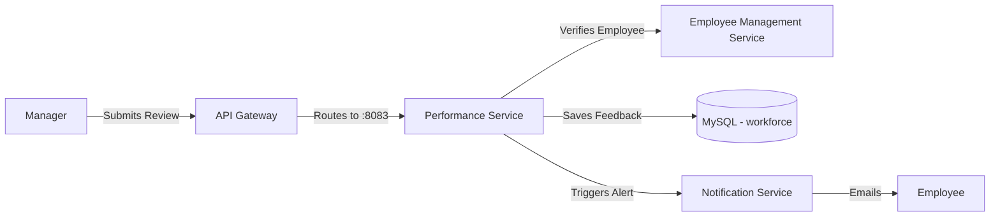

# Performance Service

## 📌 Overview
The **Performance Service** is dedicated to managing employee appraisals, feedback cycles, goal tracking, and overall performance metrics. It provides tools for managers to review their team members and for individuals to track their own professional growth within the company.

By keeping this domain isolated, the HRMS can independently scale its review cycles (which typically see high traffic during end-of-quarter or end-of-year periods) without affecting day-to-day operations like time-tracking or log-ins.

## 🏗️ Architecture & Flow



### 🔑 Key Responsibilities:
1. **Goal Management**: Allowing employees and managers to establish, track, and update Key Performance Indicators (KPIs).
2. **Review Cycles**: Structuring 30-day, 90-day, or annual reviews.
3. **Feedback Mechanism**: Storing qualitative and quantitative feedback securely.
4. **Scoring**: Calculating performance scores that might be leveraged later for promotions or salary adjustments.

## 💻 Technical Details

### Technologies & Dependencies
- **Spring Data JPA & Hibernate**: For mapping performance evaluation entities.
- **MySQL Driver**: Connects to the primary relational database to store permanent records.

### Configuration Highlights (`application.properties`)
```properties
spring.application.name=performance-service
server.port=8083

# DB Properties
spring.datasource.url=jdbc:mysql://localhost:3306/workforce?createDatabaseIfNotExist=true
spring.jpa.hibernate.ddl-auto=update

# API Documentation
springdoc.api-docs.path=/v3/api-docs
```

## 🚀 How to Run
**Using Maven:**
```bash
mvn spring-boot:run
```

**Using Docker:**
```bash
docker run -p 8083:8083 performance-service:latest
```


## 🛑 Deep Dive Component Codes & Project Structure
This section contains the full, exhaustive breakdown of the microservice's source code, project structure, and dependencies. It operates as the fundamental source of truth replacing isolated snippets with the actual working code.

### 🌳 Complete Project Tree
```text
📦 performance-service
    📜 .dockerignore
    📜 .gitattributes
    📜 .gitignore
    📜 Dockerfile
    📜 mvnw
    📜 mvnw.cmd
    📜 pom.xml
    📂 src
        📂 main
            📂 java
                📂 com
                    📂 revworkforce
                        📂 performanceservice
                            📜 PerformanceServiceApplication.java
                            📂 controller
                                📜 AdminPerformanceController.java
                                📜 EmployeePerformanceController.java
                                📜 ManagerPerformanceController.java
                            📂 dto
                                📜 ApiResponse.java
                                📜 GoalProgressRequest.java
                                📜 GoalRequest.java
                                📜 ManagerFeedbackRequest.java
                                📜 ManagerGoalCommentRequest.java
                                📜 PerformanceReviewRequest.java
                            📂 exception
                                📜 AccessDeniedException.java
                                📜 AccountDeactivatedException.java
                                📜 BadRequestException.java
                                📜 DuplicateResourceException.java
                                📜 GlobalExceptionHandler.java
                                📜 InsufficientBalanceException.java
                                📜 InvalidActionException.java
                                📜 IpBlockedException.java
                                📜 ResourceNotFoundException.java
                                📜 UnauthorizedException.java
                            📂 feign
                                📜 NotificationFeignClient.java
                            📂 model
                                📜 Department.java
                                📜 Designation.java
                                📜 Employee.java
                                📜 Goal.java
                                📜 Notification.java
                                📜 PerformanceReview.java
                                📂 enums
                                    📜 Gender.java
                                    📜 GoalPriority.java
                                    📜 GoalStatus.java
                                    📜 NotificationType.java
                                    📜 ReviewStatus.java
                                    📜 Role.java
                            📂 repository
                                📜 EmployeeRepository.java
                                📜 GoalRepository.java
                                📜 NotificationRepository.java
                                📜 PerformanceReviewRepository.java
                            📂 service
                                📜 NotificationService.java
                                📜 PerformanceService.java
                                📜 PresenceService.java
            📂 resources
                📜 application.properties
        📂 test
            📂 java
                📂 com
                    📂 revworkforce
                        📂 performanceservice
                            📜 PerformanceServiceApplicationTests.java
```

### 📦 Dependencies (`pom.xml`)
```xml
<?xml version="1.0" encoding="UTF-8"?>
<project xmlns="http://maven.apache.org/POM/4.0.0" xmlns:xsi="http://www.w3.org/2001/XMLSchema-instance"
         xsi:schemaLocation="http://maven.apache.org/POM/4.0.0 https://maven.apache.org/xsd/maven-4.0.0.xsd">
    <modelVersion>4.0.0</modelVersion>
    <parent>
        <groupId>org.springframework.boot</groupId>
        <artifactId>spring-boot-starter-parent</artifactId>
        <version>4.0.3</version>
        <relativePath/>
    </parent>
    <groupId>com.revworkforce</groupId>
    <artifactId>performance-service</artifactId>
    <version>0.0.1-SNAPSHOT</version>
    <name>performance-service</name>
    <description>Reviews, goals, manager feedback, ratings</description>
    <properties>
        <java.version>17</java.version>
        <spring-cloud.version>2025.1.0</spring-cloud.version>
    </properties>
    <dependencies>
        <dependency><groupId>org.springframework.boot</groupId><artifactId>spring-boot-starter-actuator</artifactId></dependency>
        <dependency><groupId>org.springframework.boot</groupId><artifactId>spring-boot-starter-data-jpa</artifactId></dependency>
        <dependency><groupId>org.springframework.boot</groupId><artifactId>spring-boot-starter-validation</artifactId></dependency>
        <dependency><groupId>org.springframework.boot</groupId><artifactId>spring-boot-starter-webmvc</artifactId></dependency>
        <dependency><groupId>org.springframework.cloud</groupId><artifactId>spring-cloud-starter-config</artifactId></dependency>
        <dependency><groupId>org.springframework.cloud</groupId><artifactId>spring-cloud-starter-netflix-eureka-client</artifactId></dependency>
        <dependency><groupId>org.springframework.cloud</groupId><artifactId>spring-cloud-starter-openfeign</artifactId></dependency>
        <dependency><groupId>org.springdoc</groupId><artifactId>springdoc-openapi-starter-webmvc-ui</artifactId><version>2.8.4</version></dependency>
        <dependency><groupId>com.mysql</groupId><artifactId>mysql-connector-j</artifactId><scope>runtime</scope></dependency>
        <dependency><groupId>org.projectlombok</groupId><artifactId>lombok</artifactId><optional>true</optional></dependency>
        <dependency><groupId>org.springframework.boot</groupId><artifactId>spring-boot-starter-test</artifactId><scope>test</scope></dependency>
    </dependencies>
    <dependencyManagement>
        <dependencies>
            <dependency><groupId>org.springframework.cloud</groupId><artifactId>spring-cloud-dependencies</artifactId><version>${spring-cloud.version}</version><type>pom</type><scope>import</scope></dependency>
        </dependencies>
    </dependencyManagement>
    <build>
        <plugins>
            <plugin><groupId>org.apache.maven.plugins</groupId><artifactId>maven-compiler-plugin</artifactId>
                <configuration><annotationProcessorPaths><path><groupId>org.projectlombok</groupId><artifactId>lombok</artifactId></path></annotationProcessorPaths></configuration>
            </plugin>
            <plugin><groupId>org.springframework.boot</groupId><artifactId>spring-boot-maven-plugin</artifactId>
                <configuration><excludes><exclude><groupId>org.projectlombok</groupId><artifactId>lombok</artifactId></exclude></excludes></configuration>
            </plugin>
        </plugins>
    </build>
</project>

```

### ⚙️ Configurations (`src/main/resources`)
**`application.properties`**
```properties
spring.application.name=performance-service
spring.config.import=optional:configserver:http://localhost:8888
eureka.client.service-url.defaultZone=http://localhost:8761/eureka/
eureka.instance.hostname=localhost
eureka.instance.prefer-ip-address=false
eureka.instance.instance-id=${spring.application.name}:${server.port}
server.port=8083

spring.datasource.url=jdbc:mysql://localhost:3306/workforce?createDatabaseIfNotExist=true
spring.datasource.username=root
spring.datasource.password=1234
spring.datasource.driver-class-name=com.mysql.cj.jdbc.Driver
spring.jpa.hibernate.ddl-auto=update
spring.jpa.show-sql=false
spring.jpa.properties.hibernate.dialect=org.hibernate.dialect.MySQLDialect

springdoc.api-docs.path=/v3/api-docs
springdoc.swagger-ui.path=/swagger-ui.html

```

### ☕ Source Code Files
#### **`src/main/java/com/revworkforce/performanceservice/PerformanceServiceApplication.java`**
```java
package com.revworkforce.performanceservice;
import org.springframework.boot.SpringApplication;
import org.springframework.boot.autoconfigure.SpringBootApplication;
import org.springframework.cloud.client.discovery.EnableDiscoveryClient;
import org.springframework.cloud.openfeign.EnableFeignClients;

@SpringBootApplication @EnableDiscoveryClient @EnableFeignClients
public class PerformanceServiceApplication {
    public static void main(String[] args) { SpringApplication.run(PerformanceServiceApplication.class, args); }
}

```

#### **`src/main/java/com/revworkforce/performanceservice/controller/AdminPerformanceController.java`**
```java
package com.revworkforce.performanceservice.controller;

import jakarta.validation.Valid;
import com.revworkforce.performanceservice.dto.ApiResponse;
import com.revworkforce.performanceservice.dto.ManagerFeedbackRequest;
import com.revworkforce.performanceservice.model.PerformanceReview;
import com.revworkforce.performanceservice.model.enums.ReviewStatus;
import com.revworkforce.performanceservice.service.PerformanceService;
import org.springframework.beans.factory.annotation.Autowired;
import org.springframework.data.domain.Page;
import org.springframework.data.domain.PageRequest;
import org.springframework.data.domain.Pageable;
import org.springframework.data.domain.Sort;
import org.springframework.http.ResponseEntity;
import org.springframework.web.bind.annotation.*;

@RestController
@RequestMapping("/api/admin/performance")
public class AdminPerformanceController {
    @Autowired
    private PerformanceService performanceService;

    @GetMapping("/reviews")
    public ResponseEntity<ApiResponse> getAllReviews(
            @RequestParam(required = false) ReviewStatus status,
            @RequestParam(defaultValue = "0") int page,
            @RequestParam(defaultValue = "10") int size,
            @RequestParam(defaultValue = "createdAt") String sortBy,
            @RequestParam(defaultValue = "desc") String direction) {
        Sort sort = direction.equalsIgnoreCase("desc") ? Sort.by(sortBy).descending() : Sort.by(sortBy).ascending();
        Pageable pageable = PageRequest.of(page, size, sort);
        Page<PerformanceReview> reviews = performanceService.getAllReviews(status, pageable);
        return ResponseEntity.ok(new ApiResponse(true, "All reviews fetched successfully", reviews));
    }

    @GetMapping("/reviews/{reviewId}")
    public ResponseEntity<ApiResponse> getReviewById(@PathVariable Integer reviewId) {
        PerformanceReview review = performanceService.getAdminReviewById(reviewId);
        return ResponseEntity.ok(new ApiResponse(true, "Review fetched successfully", review));
    }

    @PatchMapping("/reviews/{reviewId}/feedback")
    public ResponseEntity<ApiResponse> provideReviewFeedback(
            @PathVariable Integer reviewId,
            @Valid @RequestBody ManagerFeedbackRequest request,
            @RequestHeader("X-User-Email") String email) {
        PerformanceReview review = performanceService.provideAdminReviewFeedback(email, reviewId, request);
        return ResponseEntity.ok(new ApiResponse(true, "Feedback submitted successfully", review));
    }
}

```

#### **`src/main/java/com/revworkforce/performanceservice/controller/EmployeePerformanceController.java`**
```java
package com.revworkforce.performanceservice.controller;

import jakarta.validation.Valid;
import com.revworkforce.performanceservice.dto.*;
import com.revworkforce.performanceservice.model.Goal;
import com.revworkforce.performanceservice.model.PerformanceReview;
import com.revworkforce.performanceservice.model.enums.GoalStatus;
import com.revworkforce.performanceservice.model.enums.ReviewStatus;
import com.revworkforce.performanceservice.service.PerformanceService;
import org.springframework.beans.factory.annotation.Autowired;
import org.springframework.data.domain.Page;
import org.springframework.data.domain.PageRequest;
import org.springframework.data.domain.Pageable;
import org.springframework.data.domain.Sort;
import org.springframework.http.HttpStatus;
import org.springframework.http.ResponseEntity;
import org.springframework.web.bind.annotation.*;

@RestController
@RequestMapping("/api/employees")
public class EmployeePerformanceController {
    @Autowired
    private PerformanceService performanceService;

    @PostMapping("/reviews")
    public ResponseEntity<ApiResponse> createReview(@Valid @RequestBody PerformanceReviewRequest request,
                                                       @RequestHeader("X-User-Email") String email) {
        PerformanceReview review = performanceService.createReview(email, request);
        return ResponseEntity.status(HttpStatus.CREATED)
                .body(new ApiResponse(true, "Performance review created as draft", review));
    }

    @PutMapping("/reviews/{reviewId}")
    public ResponseEntity<ApiResponse> updateReview(@PathVariable Integer reviewId, @Valid @RequestBody PerformanceReviewRequest request,
                                                       @RequestHeader("X-User-Email") String email) {
        PerformanceReview review = performanceService.updateReview(email, reviewId, request);
        return ResponseEntity.ok(new ApiResponse(true, "Performance review updated successfully", review));
    }

    @PatchMapping("/reviews/{reviewId}/submit")
    public ResponseEntity<ApiResponse> submitReview(@PathVariable Integer reviewId,
                                                       @RequestHeader("X-User-Email") String email) {
        PerformanceReview review = performanceService.submitReview(email, reviewId);
        return ResponseEntity.ok(new ApiResponse(true, "Performance review submitted to manager", review));
    }

    @GetMapping("/reviews")
    public ResponseEntity<ApiResponse> getMyReviews(
            @RequestParam(required = false) ReviewStatus status,
            @RequestParam(defaultValue = "0") int page,
            @RequestParam(defaultValue = "10") int size,
            @RequestParam(defaultValue = "createdAt") String sortBy,
            @RequestParam(defaultValue = "desc") String direction,
            @RequestHeader("X-User-Email") String email) {
        Sort sort = direction.equalsIgnoreCase("desc") ? Sort.by(sortBy).descending() : Sort.by(sortBy).ascending();
        Pageable pageable = PageRequest.of(page, size, sort);
        Page<PerformanceReview> reviews = performanceService.getMyReviews(email, status, pageable);
        return ResponseEntity.ok(new ApiResponse(true, "Reviews fetched successfully", reviews));
    }

    @GetMapping("/reviews/{reviewId}")
    public ResponseEntity<ApiResponse> getReviewById(@PathVariable Integer reviewId,
                                                        @RequestHeader("X-User-Email") String email) {
        PerformanceReview review = performanceService.getReviewById(email, reviewId);
        return ResponseEntity.ok(new ApiResponse(true, "Review fetched successfully", review));
    }

    @PostMapping("/goals")
    public ResponseEntity<ApiResponse> createGoal(@Valid @RequestBody GoalRequest request,
                                                     @RequestHeader("X-User-Email") String email) {
        Goal goal = performanceService.createGoal(email, request);
        return ResponseEntity.status(HttpStatus.CREATED).body(new ApiResponse(true, "Goal created successfully", goal));
    }

    @GetMapping("/goals")
    public ResponseEntity<ApiResponse> getMyGoals(
            @RequestParam(required = false) Integer year,
            @RequestParam(required = false) GoalStatus status,
            @RequestParam(defaultValue = "0") int page,
            @RequestParam(defaultValue = "10") int size,
            @RequestParam(defaultValue = "createdAt") String sortBy,
            @RequestParam(defaultValue = "desc") String direction,
            @RequestHeader("X-User-Email") String email) {
        Sort sort = direction.equalsIgnoreCase("desc") ? Sort.by(sortBy).descending() : Sort.by(sortBy).ascending();
        Pageable pageable = PageRequest.of(page, size, sort);
        Page<Goal> goals = performanceService.getMyGoals(email, year, status, pageable);
        return ResponseEntity.ok(new ApiResponse(true, "Goals fetched successfully", goals));
    }

    @PatchMapping("/goals/{goalId}/progress")
    public ResponseEntity<ApiResponse> updateGoalProgress(@PathVariable Integer goalId, @Valid @RequestBody GoalProgressRequest request,
                                                             @RequestHeader("X-User-Email") String email) {
        Goal goal = performanceService.updateGoalProgress(email, goalId, request);
        return ResponseEntity.ok(new ApiResponse(true, "Goal progress updated successfully", goal));
    }
}

```

#### **`src/main/java/com/revworkforce/performanceservice/controller/ManagerPerformanceController.java`**
```java
package com.revworkforce.performanceservice.controller;

import jakarta.validation.Valid;
import com.revworkforce.performanceservice.dto.ApiResponse;
import com.revworkforce.performanceservice.dto.ManagerFeedbackRequest;
import com.revworkforce.performanceservice.dto.ManagerGoalCommentRequest;
import com.revworkforce.performanceservice.model.Goal;
import com.revworkforce.performanceservice.model.PerformanceReview;
import com.revworkforce.performanceservice.model.enums.ReviewStatus;
import com.revworkforce.performanceservice.service.PerformanceService;
import org.springframework.beans.factory.annotation.Autowired;
import org.springframework.data.domain.Page;
import org.springframework.data.domain.PageRequest;
import org.springframework.data.domain.Pageable;
import org.springframework.data.domain.Sort;
import org.springframework.http.ResponseEntity;
import org.springframework.web.bind.annotation.*;

@RestController
@RequestMapping("/api/manager")
public class ManagerPerformanceController {
    @Autowired
    private PerformanceService performanceService;

    @GetMapping("/reviews")
    public ResponseEntity<ApiResponse> getTeamReviews(
            @RequestParam(required = false) ReviewStatus status,
            @RequestParam(defaultValue = "0") int page,
            @RequestParam(defaultValue = "10") int size,
            @RequestParam(defaultValue = "submittedDate") String sortBy,
            @RequestParam(defaultValue = "desc") String direction,
            @RequestHeader("X-User-Email") String email) {
        Sort sort = direction.equalsIgnoreCase("desc") ? Sort.by(sortBy).descending() : Sort.by(sortBy).ascending();
        Pageable pageable = PageRequest.of(page, size, sort);
        Page<PerformanceReview> reviews = performanceService.getTeamReviews(email, status, pageable);
        return ResponseEntity.ok(new ApiResponse(true, "Team reviews fetched successfully", reviews));
    }

    @GetMapping("/reviews/{reviewId}")
    public ResponseEntity<ApiResponse> getTeamReviewById(@PathVariable Integer reviewId,
                                                            @RequestHeader("X-User-Email") String email) {
        PerformanceReview review = performanceService.getTeamReviewById(email, reviewId);
        return ResponseEntity.ok(new ApiResponse(true, "Review fetched successfully", review));
    }

    @PatchMapping("/reviews/{reviewId}/feedback")
    public ResponseEntity<ApiResponse> provideReviewFeedback(@PathVariable Integer reviewId, @Valid @RequestBody ManagerFeedbackRequest request,
                                                               @RequestHeader("X-User-Email") String email) {
        PerformanceReview review = performanceService.provideReviewFeedback(email, reviewId, request);
        return ResponseEntity.ok(new ApiResponse(true, "Feedback submitted successfully", review));
    }

    @GetMapping("/goals")
    public ResponseEntity<ApiResponse> getAllTeamGoals(
            @RequestParam(defaultValue = "0") int page,
            @RequestParam(defaultValue = "10") int size,
            @RequestParam(defaultValue = "createdAt") String sortBy,
            @RequestParam(defaultValue = "desc") String direction,
            @RequestHeader("X-User-Email") String email) {
        Sort sort = direction.equalsIgnoreCase("desc") ? Sort.by(sortBy).descending() : Sort.by(sortBy).ascending();
        Pageable pageable = PageRequest.of(page, size, sort);
        Page<Goal> goals = performanceService.getAllTeamGoals(email, pageable);
        return ResponseEntity.ok(new ApiResponse(true, "Team goals fetched successfully", goals));
    }

    @GetMapping("/goals/{employeeCode}")
    public ResponseEntity<ApiResponse> getTeamMemberGoals(
            @PathVariable String employeeCode,
            @RequestParam(defaultValue = "0") int page,
            @RequestParam(defaultValue = "10") int size,
            @RequestParam(defaultValue = "createdAt") String sortBy,
            @RequestParam(defaultValue = "desc") String direction,
            @RequestHeader("X-User-Email") String email) {
        Sort sort = direction.equalsIgnoreCase("desc") ? Sort.by(sortBy).descending() : Sort.by(sortBy).ascending();
        Pageable pageable = PageRequest.of(page, size, sort);
        Page<Goal> goals = performanceService.getTeamMemberGoals(email, employeeCode, pageable);
        return ResponseEntity.ok(new ApiResponse(true, "Team member goals fetched successfully", goals));
    }

    @PatchMapping("/goals/{goalId}/comment")
    public ResponseEntity<ApiResponse> commentOnGoal(@PathVariable Integer goalId, @Valid @RequestBody ManagerGoalCommentRequest request,
                                                        @RequestHeader("X-User-Email") String email) {
        Goal goal = performanceService.commentOnGoal(email, goalId, request);
        return ResponseEntity.ok(new ApiResponse(true, "Comment added to goal successfully", goal));
    }
}

```

#### **`src/main/java/com/revworkforce/performanceservice/dto/ApiResponse.java`**
```java
package com.revworkforce.performanceservice.dto;
import lombok.AllArgsConstructor;
import lombok.Data;
import lombok.NoArgsConstructor;

@Data
@NoArgsConstructor
@AllArgsConstructor
public class ApiResponse {
    private boolean success;
    private String message;
    private Object data;

    public ApiResponse(boolean success, String message) {
        this.success = success;
        this.message = message;
        this.data = null;
    }
}

```

#### **`src/main/java/com/revworkforce/performanceservice/dto/GoalProgressRequest.java`**
```java
package com.revworkforce.performanceservice.dto;

import jakarta.validation.constraints.Max;
import jakarta.validation.constraints.Min;
import jakarta.validation.constraints.NotNull;
import lombok.AllArgsConstructor;
import lombok.Data;
import lombok.NoArgsConstructor;

@Data
@NoArgsConstructor
@AllArgsConstructor
public class GoalProgressRequest {
    @NotNull(message = "Progress percentage is required")
    @Min(value = 0, message = "Progress must be between 0 and 100")
    @Max(value = 100, message = "Progress must be between 0 and 100")
    private Integer progress;
    private String status;
}

```

#### **`src/main/java/com/revworkforce/performanceservice/dto/GoalRequest.java`**
```java
package com.revworkforce.performanceservice.dto;

import jakarta.validation.constraints.NotBlank;
import jakarta.validation.constraints.NotNull;
import lombok.AllArgsConstructor;
import lombok.Data;
import lombok.NoArgsConstructor;

import java.time.LocalDate;

@Data
@NoArgsConstructor
@AllArgsConstructor
public class GoalRequest {
    @NotBlank(message = "Goal title is required")
    private String title;
    private String description;
    @NotNull(message = "Deadline is required")
    private LocalDate deadline;
    @NotNull(message = "Priority is required (HIGH, MEDIUM, LOW)")
    private String priority;
}

```

#### **`src/main/java/com/revworkforce/performanceservice/dto/ManagerFeedbackRequest.java`**
```java
package com.revworkforce.performanceservice.dto;

import jakarta.validation.constraints.Max;
import jakarta.validation.constraints.Min;
import jakarta.validation.constraints.NotBlank;
import jakarta.validation.constraints.NotNull;
import lombok.AllArgsConstructor;
import lombok.Data;
import lombok.NoArgsConstructor;

@Data
@AllArgsConstructor
@NoArgsConstructor
public class ManagerFeedbackRequest {
    @NotNull(message = "Manager rating is required")
    @Min(value = 1, message = "Rating must be between 1 and 5")
    @Max(value = 5, message = "Rating must be between 1 and 5")
    private Integer managerRating;
    @NotBlank(message = "Feedback is required")
    private String managerFeedback;
}

```

#### **`src/main/java/com/revworkforce/performanceservice/dto/ManagerGoalCommentRequest.java`**
```java
package com.revworkforce.performanceservice.dto;

import jakarta.validation.constraints.NotBlank;
import lombok.AllArgsConstructor;
import lombok.Data;
import lombok.NoArgsConstructor;

@Data
@NoArgsConstructor
@AllArgsConstructor
public class ManagerGoalCommentRequest {
    @NotBlank(message = "Comment is required")
    private String managerComments;
}

```

#### **`src/main/java/com/revworkforce/performanceservice/dto/PerformanceReviewRequest.java`**
```java
package com.revworkforce.performanceservice.dto;

import jakarta.validation.constraints.Max;
import jakarta.validation.constraints.Min;
import jakarta.validation.constraints.NotBlank;
import lombok.AllArgsConstructor;
import lombok.Data;
import lombok.NoArgsConstructor;

@Data
@NoArgsConstructor
@AllArgsConstructor
public class PerformanceReviewRequest {
    @NotBlank(message = "Review period is required (e.g., 2026-H1, 2026-Q1)")
    private String reviewPeriod;
    private String keyDeliverables;
    private String accomplishments;
    private String areasOfImprovement;
    @Min(value = 1, message = "Self assessment rating must be between 1 and 5")
    @Max(value = 5, message = "Self assessment rating must be between 1 and 5")
    private Integer selfAssessmentRating;
}

```

#### **`src/main/java/com/revworkforce/performanceservice/exception/AccessDeniedException.java`**
```java
package com.revworkforce.performanceservice.exception;

public class AccessDeniedException extends RuntimeException {
    public AccessDeniedException(String message) {
        super(message);
    }
}

```

#### **`src/main/java/com/revworkforce/performanceservice/exception/AccountDeactivatedException.java`**
```java
package com.revworkforce.performanceservice.exception;

public class AccountDeactivatedException extends RuntimeException {
    public AccountDeactivatedException(String message) {
        super(message);
    }

    public AccountDeactivatedException(String employeeCode, String reason) {
        super(String.format("Account '%s' is deactivated. %s", employeeCode, reason));
    }
}

```

#### **`src/main/java/com/revworkforce/performanceservice/exception/BadRequestException.java`**
```java
package com.revworkforce.performanceservice.exception;

public class BadRequestException extends RuntimeException {
    public BadRequestException(String message) {
        super(message);
    }
}

```

#### **`src/main/java/com/revworkforce/performanceservice/exception/DuplicateResourceException.java`**
```java
package com.revworkforce.performanceservice.exception;

public class DuplicateResourceException extends RuntimeException {
    public DuplicateResourceException(String message) {
        super(message);
    }

    public DuplicateResourceException(String resourceName, String fieldName, Object fieldValue) {
        super(String.format("%s already exists with %s: '%s'", resourceName, fieldName, fieldValue));
    }
}

```

#### **`src/main/java/com/revworkforce/performanceservice/exception/GlobalExceptionHandler.java`**
```java
package com.revworkforce.performanceservice.exception;

import com.revworkforce.performanceservice.dto.ApiResponse;
import org.springframework.http.HttpStatus;
import org.springframework.http.ResponseEntity;
import org.springframework.validation.FieldError;
import org.springframework.web.bind.MethodArgumentNotValidException;
import org.springframework.web.bind.annotation.ExceptionHandler;
import org.springframework.web.bind.annotation.RestControllerAdvice;
import org.springframework.web.method.annotation.MethodArgumentTypeMismatchException;
import org.springframework.web.servlet.resource.NoResourceFoundException;

import java.util.HashMap;
import java.util.Map;

@RestControllerAdvice
public class GlobalExceptionHandler {
    @ExceptionHandler(ResourceNotFoundException.class)
    public ResponseEntity<ApiResponse> handleResourceNotFound(ResourceNotFoundException ex) {
        return ResponseEntity.status(HttpStatus.NOT_FOUND)
                .body(new ApiResponse(false, ex.getMessage()));
    }

    @ExceptionHandler(BadRequestException.class)
    public ResponseEntity<ApiResponse> handleBadRequest(BadRequestException ex) {
        return ResponseEntity.status(HttpStatus.BAD_REQUEST)
                .body(new ApiResponse(false, ex.getMessage()));
    }

    @ExceptionHandler(DuplicateResourceException.class)
    public ResponseEntity<ApiResponse> handleDuplicateResource(DuplicateResourceException ex) {
        return ResponseEntity.status(HttpStatus.CONFLICT)
                .body(new ApiResponse(false, ex.getMessage()));
    }

    @ExceptionHandler(InsufficientBalanceException.class)
    public ResponseEntity<ApiResponse> handleInsufficientBalance(InsufficientBalanceException ex) {
        return ResponseEntity.status(HttpStatus.BAD_REQUEST)
                .body(new ApiResponse(false, ex.getMessage()));
    }

    @ExceptionHandler(UnauthorizedException.class)
    public ResponseEntity<ApiResponse> handleUnauthorized(UnauthorizedException ex) {
        return ResponseEntity.status(HttpStatus.UNAUTHORIZED)
                .body(new ApiResponse(false, ex.getMessage()));
    }

    @ExceptionHandler(AccessDeniedException.class)
    public ResponseEntity<ApiResponse> handleAccessDenied(AccessDeniedException ex) {
        return ResponseEntity.status(HttpStatus.FORBIDDEN)
                .body(new ApiResponse(false, ex.getMessage()));
    }

    @ExceptionHandler(InvalidActionException.class)
    public ResponseEntity<ApiResponse> handleInvalidAction(InvalidActionException ex) {
        return ResponseEntity.status(HttpStatus.BAD_REQUEST)
                .body(new ApiResponse(false, ex.getMessage()));
    }

    @ExceptionHandler(AccountDeactivatedException.class)
    public ResponseEntity<ApiResponse> handleAccountDeactivated(AccountDeactivatedException ex) {
        return ResponseEntity.status(HttpStatus.FORBIDDEN)
                .body(new ApiResponse(false, ex.getMessage()));
    }

    @ExceptionHandler(IpBlockedException.class)
    public ResponseEntity<ApiResponse> handleIpBlocked(IpBlockedException ex) {
        return ResponseEntity.status(HttpStatus.FORBIDDEN)
                .body(new ApiResponse(false, ex.getMessage()));
    }

    @ExceptionHandler(MethodArgumentNotValidException.class)
    public ResponseEntity<ApiResponse> handleValidationErrors(MethodArgumentNotValidException ex) {
        Map<String, String> errors = new HashMap<>();
        for (FieldError fieldError : ex.getBindingResult().getFieldErrors()) {
            errors.put(fieldError.getField(), fieldError.getDefaultMessage());
        }
        return ResponseEntity.status(HttpStatus.BAD_REQUEST)
                .body(new ApiResponse(false, "Validation failed", errors));
    }

    @ExceptionHandler(MethodArgumentTypeMismatchException.class)
    public ResponseEntity<ApiResponse> handleTypeMismatch(MethodArgumentTypeMismatchException ex) {
        String message = String.format("Invalid value '%s' for parameter '%s'. Expected type: %s",
                ex.getValue(), ex.getName(),
                ex.getRequiredType() != null ? ex.getRequiredType().getSimpleName() : "unknown");
        return ResponseEntity.status(HttpStatus.BAD_REQUEST)
                .body(new ApiResponse(false, message));
    }

    @ExceptionHandler(NoResourceFoundException.class)
    public ResponseEntity<ApiResponse> handleNoResourceFound(NoResourceFoundException ex) {
        return ResponseEntity.status(HttpStatus.NOT_FOUND)
                .body(new ApiResponse(false, "The requested resource was not found"));
    }

    @ExceptionHandler(IllegalArgumentException.class)
    public ResponseEntity<ApiResponse> handleIllegalArgument(IllegalArgumentException ex) {
        return ResponseEntity.status(HttpStatus.BAD_REQUEST)
                .body(new ApiResponse(false, ex.getMessage()));
    }

    @ExceptionHandler(Exception.class)
    public ResponseEntity<ApiResponse> handleGenericException(Exception ex) {
        return ResponseEntity.status(HttpStatus.INTERNAL_SERVER_ERROR)
                .body(new ApiResponse(false, "An unexpected error occurred: " + ex.getMessage()));
    }
}

```

#### **`src/main/java/com/revworkforce/performanceservice/exception/InsufficientBalanceException.java`**
```java
package com.revworkforce.performanceservice.exception;

public class InsufficientBalanceException extends RuntimeException {
    public InsufficientBalanceException(String message) {
        super(message);
    }

    public InsufficientBalanceException(int available, int requested) {
        super(String.format("Insufficient leave balance. Available: %d, Requested: %d", available, requested));
    }
}

```

#### **`src/main/java/com/revworkforce/performanceservice/exception/InvalidActionException.java`**
```java
package com.revworkforce.performanceservice.exception;

public class InvalidActionException extends RuntimeException {
    public InvalidActionException(String message) {
        super(message);
    }

    public InvalidActionException(String action, String allowedActions) {
        super(String.format("Invalid action '%s'. Allowed actions: %s", action, allowedActions));
    }
}

```

#### **`src/main/java/com/revworkforce/performanceservice/exception/IpBlockedException.java`**
```java
package com.revworkforce.performanceservice.exception;

public class IpBlockedException extends RuntimeException {
    public IpBlockedException(String message) {
        super(message);
    }
}

```

#### **`src/main/java/com/revworkforce/performanceservice/exception/ResourceNotFoundException.java`**
```java
package com.revworkforce.performanceservice.exception;

public class ResourceNotFoundException extends RuntimeException {
    public ResourceNotFoundException(String message) {
        super(message);
    }

    public ResourceNotFoundException(String resourceName, String fieldName, Object fieldValue) {
        super(String.format("%s not found with %s: '%s'", resourceName, fieldName, fieldValue));
    }
}

```

#### **`src/main/java/com/revworkforce/performanceservice/exception/UnauthorizedException.java`**
```java
package com.revworkforce.performanceservice.exception;

public class UnauthorizedException extends RuntimeException {
    public UnauthorizedException(String message) {
        super(message);
    }
}

```

#### **`src/main/java/com/revworkforce/performanceservice/feign/NotificationFeignClient.java`**
```java
package com.revworkforce.performanceservice.feign;
import org.springframework.cloud.openfeign.FeignClient;
import org.springframework.web.bind.annotation.PostMapping;
import org.springframework.web.bind.annotation.RequestBody;
import java.util.Map;

@FeignClient(name = "NOTIFICATION-SERVICE", path = "/api/notifications")
public interface NotificationFeignClient {
    @PostMapping("/send")
    void sendNotification(@RequestBody Map<String, Object> notification);
}

```

#### **`src/main/java/com/revworkforce/performanceservice/model/Department.java`**
```java
package com.revworkforce.performanceservice.model;
import jakarta.persistence.*;
import lombok.*;
import org.hibernate.annotations.CreationTimestamp;
import org.hibernate.annotations.UpdateTimestamp;
import java.time.LocalDateTime;

@Entity
@Table(name = "department")
@Data
@NoArgsConstructor
@AllArgsConstructor
@Builder
public class Department {
    @Id
    @GeneratedValue(strategy = GenerationType.IDENTITY)
    @Column(name = "department_id")
    private Integer departmentId;
    @Column(name = "department_name", nullable = false, unique = true, length = 100)
    private String departmentName;
    @Column(columnDefinition = "TEXT")
    private String description;
    @Column(name = "is_active")
    @Builder.Default
    private Boolean isActive = true;
    @CreationTimestamp
    @Column(name="created_at", updatable = false)
    private LocalDateTime createdAt;
    @UpdateTimestamp
    @Column(name = "updated_at")
    private LocalDateTime updatedAt;
}

```

#### **`src/main/java/com/revworkforce/performanceservice/model/Designation.java`**
```java
package com.revworkforce.performanceservice.model;
import jakarta.persistence.*;
import lombok.*;
import org.hibernate.annotations.CreationTimestamp;
import org.hibernate.annotations.UpdateTimestamp;
import java.time.LocalDateTime;

@Entity
@Table(name="designation")
@Data
@NoArgsConstructor
@AllArgsConstructor
@Builder
public class Designation {
    @Id
    @GeneratedValue(strategy = GenerationType.IDENTITY)
    @Column(name = "designation_id")
    private Integer designationId;
    @Column(name = "designation_name", nullable = false, unique = true, length = 100)
    private String designationName;
    @Column(columnDefinition = "TEXT")
    private String description;
    @Column(name = "is_active")
    @Builder.Default
    private Boolean isActive = true;
    @CreationTimestamp
    @Column(name = "created_at", updatable = false)
    private LocalDateTime createdAt;
    @UpdateTimestamp
    @Column(name = "updated_at")
    private LocalDateTime updatedAt;
}

```

#### **`src/main/java/com/revworkforce/performanceservice/model/Employee.java`**
```java
package com.revworkforce.performanceservice.model;
import com.fasterxml.jackson.annotation.JsonIgnore;
import com.fasterxml.jackson.annotation.JsonIgnoreProperties;
import jakarta.persistence.*;
import lombok.*;
import com.revworkforce.performanceservice.model.enums.Gender;
import com.revworkforce.performanceservice.model.enums.Role;
import org.hibernate.annotations.CreationTimestamp;
import org.hibernate.annotations.UpdateTimestamp;
import java.math.BigDecimal;
import java.time.LocalDateTime;
import java.time.LocalDate;

@Entity
@Table(name = "employee", indexes = {
        @Index(name ="idx_emp_email", columnList = "email"),
        @Index(name = "idx_emp_name", columnList = "first_name, last_name"),
        @Index(name = "idx_emp_dept", columnList = "department_id"),
        @Index(name = "idx_emp_manager", columnList = "manager_code"),
        @Index(name = "idx_emp_role", columnList = "role")
})
@Getter
@Setter
@NoArgsConstructor
@AllArgsConstructor
@Builder
@ToString(exclude = {"manager", "department", "designation"})
@EqualsAndHashCode(onlyExplicitlyIncluded = true)
public class Employee {
    @Id
    @GeneratedValue(strategy = GenerationType.IDENTITY)
    @Column(name = "employee_id")
    @EqualsAndHashCode.Include
    private Integer employeeId;
    @Column(name = "employee_code", nullable = false, unique = true, length = 20)
    private String employeeCode;
    @Column(name = "first_name", nullable = false, length = 100)
    private String firstName;
    @Column(name = "last_name", nullable = false, length = 100)
    private String lastName;
    @Column(nullable = false, unique = true, length = 255)
    private String email;
    @JsonIgnore
    @Column(name = "password_hash", nullable = false, length = 255)
    private String passwordHash;
    @Column(length = 20)
    private String phone;
    @Column(name = "date_of_birth")
    private LocalDate dateOfBirth;
    @Enumerated(EnumType.STRING)
    @Column(length = 10)
    private Gender gender;
    @Column(columnDefinition = "TEXT")
    private String address;
    @Column(name = "emergency_contact_name", length = 100)
    private String emergencyContactName;
    @Column(name = "emergency_contact_phone", length = 20)
    private String emergencyContactPhone;
    @ManyToOne(fetch = FetchType.EAGER)
    @JoinColumn(name = "department_id")
    @JsonIgnoreProperties({"hibernateLazyInitializer", "handler"})
    private Department department;
    @ManyToOne(fetch = FetchType.EAGER)
    @JoinColumn(name = "designation_id")
    @JsonIgnoreProperties({"hibernateLazyInitializer", "handler"})
    private Designation designation;
    @Column(name = "joining_date", nullable = false)
    private LocalDate joiningDate;
    @Column(precision = 12, scale = 2)
    private BigDecimal salary;
    @ManyToOne(fetch = FetchType.EAGER)
    @JoinColumn(name = "manager_code", referencedColumnName = "employee_code")
    @JsonIgnoreProperties({"hibernateLazyInitializer", "handler", "manager"})
    private Employee manager;
    @Enumerated(EnumType.STRING)
    @Column(nullable = false, length = 10)
    @Builder.Default
    private Role role = Role.EMPLOYEE;
    @Column(name = "is_active")
    @Builder.Default
    private Boolean isActive = true;
    @Column(name = "two_factor_enabled")
    @Builder.Default
    private Boolean twoFactorEnabled = false;
    @CreationTimestamp
    @Column(name = "created_at", updatable = false)
    private LocalDateTime createdAt;
    @UpdateTimestamp
    @Column(name = "updated_at")
    private LocalDateTime updatedAt;
}

```

#### **`src/main/java/com/revworkforce/performanceservice/model/Goal.java`**
```java
package com.revworkforce.performanceservice.model;
import com.fasterxml.jackson.annotation.JsonIgnoreProperties;
import jakarta.persistence.*;
import lombok.*;
import com.revworkforce.performanceservice.model.enums.GoalPriority;
import com.revworkforce.performanceservice.model.enums.GoalStatus;
import org.hibernate.annotations.CreationTimestamp;
import org.hibernate.annotations.UpdateTimestamp;
import java.time.LocalDate;
import java.time.LocalDateTime;

@Entity
@Table(name = "goal", indexes = {
        @Index(name = "idx_goal_emp", columnList = "employee_id"),
        @Index(name = "idx_goal_year", columnList = "`year`")
})
@Getter
@Setter
@NoArgsConstructor
@AllArgsConstructor
@Builder
@ToString(exclude = {"employee"})
@EqualsAndHashCode(onlyExplicitlyIncluded = true)
public class Goal {
    @Id
    @GeneratedValue(strategy = GenerationType.IDENTITY)
    @Column(name = "goal_id")
    @EqualsAndHashCode.Include
    private Integer goalId;
    @ManyToOne(fetch = FetchType.EAGER)
    @JoinColumn(name = "employee_id", nullable = false)
    @JsonIgnoreProperties({"hibernateLazyInitializer", "handler"})
    private Employee employee;
    @Column(nullable = false, length = 200)
    private String title;
    @Column(columnDefinition = "TEXT")
    private String description;
    @Column(name = "`year`", nullable = false)
    private Integer year;
    @Column(nullable = false)
    private LocalDate deadline;
    @Enumerated(EnumType.STRING)
    @Column(length = 20)
    @Builder.Default
    private GoalPriority priority = GoalPriority.MEDIUM;
    @Enumerated(EnumType.STRING)
    @Column(length = 15)
    @Builder.Default
    private GoalStatus status = GoalStatus.NOT_STARTED;
    @Column
    @Builder.Default
    private Integer progress = 0;
    @Column(name = "manager_comments", columnDefinition = "TEXT")
    private String managerComments;
    @CreationTimestamp
    @Column(name = "created_at", updatable = false)
    private LocalDateTime createdAt;
    @UpdateTimestamp
    @Column(name = "updated_at")
    private LocalDateTime updatedAt;
}

```

#### **`src/main/java/com/revworkforce/performanceservice/model/Notification.java`**
```java
package com.revworkforce.performanceservice.model;
import com.fasterxml.jackson.annotation.JsonIgnoreProperties;
import jakarta.persistence.*;
import lombok.*;
import com.revworkforce.performanceservice.model.enums.NotificationType;
import org.hibernate.annotations.CreationTimestamp;
import java.time.LocalDateTime;

@Entity
@Table(name = "notification", indexes = {
        @Index(name = "idx_notif_recipient", columnList = "recipient_id"),
        @Index(name = "idx_notif_read", columnList = "is_read")
})
@Getter
@Setter
@NoArgsConstructor
@AllArgsConstructor
@Builder
@ToString(exclude = {"recipient"})
@EqualsAndHashCode(onlyExplicitlyIncluded = true)
public class Notification {
    @Id
    @GeneratedValue(strategy = GenerationType.IDENTITY)
    @Column(name = "notification_id")
    @EqualsAndHashCode.Include
    private Integer notificationId;
    @ManyToOne(fetch = FetchType.EAGER)
    @JoinColumn(name = "recipient_id", nullable = false)
    @JsonIgnoreProperties({"hibernateLazyInitializer", "handler"})
    private Employee recipient;
    @Column(nullable = false, length = 200)
    private String title;
    @Column(nullable = false, columnDefinition = "TEXT")
    private String message;
    @Enumerated(EnumType.STRING)
    @Column(nullable = false, length = 20)
    private NotificationType type;
    @Column(name = "is_read")
    @Builder.Default
    private Boolean isRead = false;
    @Column(name = "reference_id")
    private Integer referenceId;
    @Column(name = "reference_type", length = 50)
    private String referenceType;
    @CreationTimestamp
    @Column(name = "created_at", updatable = false)
    private LocalDateTime createdAt;
}

```

#### **`src/main/java/com/revworkforce/performanceservice/model/PerformanceReview.java`**
```java
package com.revworkforce.performanceservice.model;
import com.fasterxml.jackson.annotation.JsonIgnoreProperties;
import jakarta.persistence.*;
import lombok.*;
import com.revworkforce.performanceservice.model.enums.ReviewStatus;
import org.hibernate.annotations.CreationTimestamp;
import org.hibernate.annotations.UpdateTimestamp;
import java.time.LocalDateTime;

@Entity
@Table(name = "performance_review", indexes = {
        @Index(name = "idx_review_emp", columnList = "employee_id"),
        @Index(name = "idx_review_status", columnList = "status")
})
@Getter
@Setter
@NoArgsConstructor
@AllArgsConstructor
@Builder
@ToString(exclude = {"employee", "reviewer"})
@EqualsAndHashCode(onlyExplicitlyIncluded = true)
public class PerformanceReview {
    @Id
    @GeneratedValue(strategy = GenerationType.IDENTITY)
    @Column(name = "review_id")
    @EqualsAndHashCode.Include
    private Integer reviewId;
    @ManyToOne(fetch = FetchType.EAGER)
    @JoinColumn(name = "employee_id", nullable = false)
    @JsonIgnoreProperties({"hibernateLazyInitializer", "handler"})
    private Employee employee;
    @ManyToOne(fetch = FetchType.EAGER)
    @JoinColumn(name = "reviewer_id")
    @JsonIgnoreProperties({"hibernateLazyInitializer", "handler"})
    private Employee reviewer;
    @Column(name = "review_period", nullable = false, length = 50)
    private String reviewPeriod;
    @Column(name = "key_deliverables", columnDefinition = "TEXT")
    private String keyDeliverables;
    @Column(columnDefinition = "TEXT")
    private String accomplishments;
    @Column(name = "areas_of_improvement", columnDefinition = "TEXT")
    private String areasOfImprovement;
    @Column(name = "self_assessment_rating")
    private Integer selfAssessmentRating;
    @Column(name = "manager_rating")
    private Integer managerRating;
    @Column(name = "manager_feedback", columnDefinition = "TEXT")
    private String managerFeedback;
    @Enumerated(EnumType.STRING)
    @Column(length = 20)
    @Builder.Default
    private ReviewStatus status = ReviewStatus.DRAFT;
    @Column(name = "submitted_date")
    private LocalDateTime submittedDate;
    @Column(name = "reviewed_date")
    private LocalDateTime reviewedDate;
    @CreationTimestamp
    @Column(name = "created_at", updatable = false)
    private LocalDateTime createdAt;
    @UpdateTimestamp
    @Column(name = "updated_at")
    private LocalDateTime updatedAt;
}

```

#### **`src/main/java/com/revworkforce/performanceservice/model/enums/Gender.java`**
```java
package com.revworkforce.performanceservice.model.enums;

public enum Gender {
    MALE,
    FEMALE,
    OTHER
}

```

#### **`src/main/java/com/revworkforce/performanceservice/model/enums/GoalPriority.java`**
```java
package com.revworkforce.performanceservice.model.enums;

public enum GoalPriority {
    HIGH,
    MEDIUM,
    LOW
}

```

#### **`src/main/java/com/revworkforce/performanceservice/model/enums/GoalStatus.java`**
```java
package com.revworkforce.performanceservice.model.enums;

public enum GoalStatus {
    NOT_STARTED,
    IN_PROGRESS,
    COMPLETED
}

```

#### **`src/main/java/com/revworkforce/performanceservice/model/enums/NotificationType.java`**
```java
package com.revworkforce.performanceservice.model.enums;

public enum NotificationType {
    LEAVE_APPLIED,
    LEAVE_APPROVED,
    LEAVE_REJECTED,
    LEAVE_CANCELLED,
    REVIEW_SUBMITTED,
    REVIEW_FEEDBACK,
    GOAL_UPDATED,
    GOAL_COMMENT,
    ANNOUNCEMENT,
    CHAT_MESSAGE,
    EXPENSE_SUBMITTED,
    EXPENSE_APPROVED,
    EXPENSE_REJECTED,
    EXPENSE_REIMBURSED,
    GENERAL
}

```

#### **`src/main/java/com/revworkforce/performanceservice/model/enums/ReviewStatus.java`**
```java
package com.revworkforce.performanceservice.model.enums;

public enum ReviewStatus {
    DRAFT,
    SUBMITTED,
    REVIEWED
}

```

#### **`src/main/java/com/revworkforce/performanceservice/model/enums/Role.java`**
```java
package com.revworkforce.performanceservice.model.enums;

public enum Role {
    EMPLOYEE,
    MANAGER,
    ADMIN
}

```

#### **`src/main/java/com/revworkforce/performanceservice/repository/EmployeeRepository.java`**
```java
package com.revworkforce.performanceservice.repository;
import com.revworkforce.performanceservice.model.Employee;
import com.revworkforce.performanceservice.model.enums.Role;
import org.springframework.data.jpa.repository.JpaRepository;
import org.springframework.data.jpa.repository.Query;
import org.springframework.data.repository.query.Param;
import org.springframework.stereotype.Repository;
import org.springframework.data.domain.Page;
import org.springframework.data.domain.Pageable;
import java.util.List;
import java.util.Optional;

@Repository
public interface EmployeeRepository extends JpaRepository<Employee, Integer> {
    Optional<Employee> findByEmail(String email);
    Optional<Employee> findByEmployeeCode(String employeeCode);
    boolean existsByEmail(String email);
    boolean existsByEmployeeCode(String employeeCode);
    boolean existsByRole(Role role);
    @Query(value = "SELECT employee_code FROM employee WHERE employee_code LIKE CONCAT(:prefix, '%') ORDER BY employee_code DESC LIMIT 1", nativeQuery = true)
    Optional<String> findLatestEmployeeCodeByPrefix(@Param("prefix") String prefix);
    Page<Employee> findByIsActive(Boolean isActive, Pageable pageable);
    Page<Employee> findByRole(Role role, Pageable pageable);
    Page<Employee> findByDepartment_DepartmentId(Integer departmentId, Pageable pageable);
    @Query("SELECT e FROM Employee e WHERE LOWER(e.firstName) LIKE LOWER(CONCAT('%', :keyword, '%')) OR LOWER(e.lastName) LIKE LOWER(CONCAT('%', :keyword, '%')) OR LOWER(e.email) LIKE LOWER(CONCAT('%', :keyword, '%')) OR LOWER(e.employeeCode) LIKE LOWER(CONCAT('%', :keyword, '%'))")
    Page<Employee> searchByKeyword(@Param("keyword") String keyword, Pageable pageable);
    Page<Employee> findByManager_EmployeeCode(String employeeCode, Pageable pageable);
    List<Employee> findByManager_EmployeeCode(String employeeCode);
    long countByIsActive(Boolean isActive);
    long countByRole(Role role);
    long countByRoleAndIsActive(Role role, Boolean isActive);
    @Query("SELECT e.department.departmentName, COUNT(e) FROM Employee e WHERE e.department IS NOT NULL AND e.isActive = true GROUP BY e.department.departmentName")
    List<Object[]> countActiveByDepartment();
    long countByDepartment_DepartmentId(Integer departmentId);

    @Query("SELECT FUNCTION('YEAR', e.joiningDate), FUNCTION('MONTH', e.joiningDate), COUNT(e) FROM Employee e WHERE e.isActive = true GROUP BY FUNCTION('YEAR', e.joiningDate), FUNCTION('MONTH', e.joiningDate) ORDER BY FUNCTION('YEAR', e.joiningDate) DESC, FUNCTION('MONTH', e.joiningDate) DESC")
    List<Object[]> getJoiningTrends();

    @Query("SELECT e.role, COUNT(e) FROM Employee e WHERE e.isActive = true GROUP BY e.role")
    List<Object[]> countActiveByRole();

    List<Employee> findByRoleAndIsActive(Role role, Boolean isActive);
}

```

#### **`src/main/java/com/revworkforce/performanceservice/repository/GoalRepository.java`**
```java
package com.revworkforce.performanceservice.repository;

import com.revworkforce.performanceservice.model.Goal;
import com.revworkforce.performanceservice.model.enums.GoalStatus;
import org.springframework.data.domain.Page;
import org.springframework.data.domain.Pageable;
import org.springframework.data.jpa.repository.JpaRepository;
import org.springframework.data.jpa.repository.Query;
import org.springframework.data.repository.query.Param;
import org.springframework.stereotype.Repository;
import java.util.List;

@Repository
public interface GoalRepository extends JpaRepository<Goal, Integer> {
    Page<Goal> findByEmployee_EmployeeId(Integer employeeId, Pageable pageable);
    Page<Goal> findByEmployee_EmployeeIdAndYear(Integer employeeId, Integer year, Pageable pageable);

    List<Goal> findByEmployeeEmployeeIdAndYear(Integer employeeId, Integer year);
    Page<Goal> findByEmployee_EmployeeIdAndStatus(Integer employeeId, GoalStatus status, Pageable pageable);
    @Query("select g from Goal g where g.employee.employeeCode = :employeeCode and g.employee.manager.employeeCode = :managerCode")
    Page<Goal> findByEmployeeCodeAndManagerCode(@Param("employeeCode") String employeeCode, @Param("managerCode") String managerCode, Pageable pageable);
    @Query("select g from Goal g where g.employee.manager.employeeCode = :managerCode")
    Page<Goal> findByManagerCode(@Param("managerCode") String managerCode, Pageable pageable);
}

```

#### **`src/main/java/com/revworkforce/performanceservice/repository/NotificationRepository.java`**
```java
package com.revworkforce.performanceservice.repository;
import com.revworkforce.performanceservice.model.Notification;
import com.revworkforce.performanceservice.model.enums.NotificationType;
import org.springframework.data.domain.Page;
import org.springframework.data.domain.Pageable;
import org.springframework.data.jpa.repository.JpaRepository;
import org.springframework.data.jpa.repository.Modifying;
import org.springframework.data.jpa.repository.Query;
import org.springframework.data.repository.query.Param;
import org.springframework.stereotype.Repository;

@Repository
public interface NotificationRepository extends JpaRepository<Notification, Integer> {
    Page<Notification> findByRecipient_EmployeeIdOrderByCreatedAtDesc(Integer employeeId, Pageable pageable);
    Page<Notification> findByRecipient_EmployeeIdAndIsReadOrderByCreatedAtDesc(Integer employeeId, Boolean isRead, Pageable pageable);
    long countByRecipient_EmployeeIdAndIsRead(Integer employeeId, Boolean isRead);
    @Modifying
    @Query("UPDATE Notification n SET n.isRead = true WHERE n.recipient.employeeId = :employeeId AND n.isRead = false")
    int markAllAsRead(@Param("employeeId") Integer employeeId);
    Page<Notification> findByRecipient_EmployeeIdAndTypeOrderByCreatedAtDesc(Integer employeeId, NotificationType type, Pageable pageable);
}

```

#### **`src/main/java/com/revworkforce/performanceservice/repository/PerformanceReviewRepository.java`**
```java
package com.revworkforce.performanceservice.repository;

import com.revworkforce.performanceservice.model.PerformanceReview;
import com.revworkforce.performanceservice.model.enums.ReviewStatus;
import org.springframework.data.domain.Page;
import org.springframework.data.domain.Pageable;
import org.springframework.data.jpa.repository.JpaRepository;
import org.springframework.data.jpa.repository.Query;
import org.springframework.data.repository.query.Param;
import org.springframework.stereotype.Repository;

import java.util.List;
import java.util.Optional;

@Repository
public interface PerformanceReviewRepository extends JpaRepository<PerformanceReview, Integer> {
    Page<PerformanceReview> findByEmployee_EmployeeId(Integer employeeId, Pageable pageable);
    Page<PerformanceReview> findByEmployee_EmployeeIdAndStatus(Integer employeeId, ReviewStatus status, Pageable pageable);

    List<PerformanceReview> findByEmployeeEmployeeId(Integer employeeId);
    Optional<PerformanceReview> findByEmployee_EmployeeIdAndReviewPeriod(Integer employeeId, String reviewPeriod);
    @Query("SELECT pr from PerformanceReview pr where pr.employee.manager.employeeCode = :managerCode AND pr.status = :status")
    Page<PerformanceReview> findByManagerCodeAndStatus(@Param("managerCode") String managerCode, @Param("status") ReviewStatus status, Pageable pageable);
    @Query("select pr from PerformanceReview pr where pr.employee.manager.employeeCode = :managerCode")
    Page<PerformanceReview> findByManagerCode(@Param("managerCode") String managerCode, Pageable pageable);

    @Query("select pr from PerformanceReview pr where pr.employee.manager.employeeCode = :managerCode AND pr.status <> :status")
    Page<PerformanceReview> findByManagerCodeAndStatusNot(@Param("managerCode") String managerCode, @Param("status") ReviewStatus status, Pageable pageable);

    long countByEmployee_EmployeeIdAndStatus(Integer employeeId, ReviewStatus status);

    Page<PerformanceReview> findByStatus(ReviewStatus status, Pageable pageable);
    Page<PerformanceReview> findByStatusNot(ReviewStatus status, Pageable pageable);
}

```

#### **`src/main/java/com/revworkforce/performanceservice/service/NotificationService.java`**
```java
package com.revworkforce.performanceservice.service;

import com.revworkforce.performanceservice.exception.AccessDeniedException;
import com.revworkforce.performanceservice.exception.ResourceNotFoundException;
import com.revworkforce.performanceservice.model.Employee;
import com.revworkforce.performanceservice.model.Notification;
import com.revworkforce.performanceservice.model.enums.NotificationType;
import com.revworkforce.performanceservice.model.enums.Role;
import com.revworkforce.performanceservice.repository.EmployeeRepository;
import com.revworkforce.performanceservice.repository.NotificationRepository;
import org.springframework.beans.factory.annotation.Autowired;
import org.springframework.data.domain.Page;
import org.springframework.data.domain.Pageable;
import org.springframework.stereotype.Service;
import org.springframework.transaction.annotation.Transactional;

import java.util.List;

@Service
public class NotificationService {
    @Autowired
    private NotificationRepository notificationRepository;
    @Autowired
    private EmployeeRepository employeeRepository;

    public void sendNotification(Employee recipient, String title, String message, NotificationType type, Integer referenceId, String referenceType) {
        Notification notification = Notification.builder()
                .recipient(recipient)
                .title(title)
                .message(message).type(type).referenceId(referenceId).referenceType(referenceType).build();
        notification = notificationRepository.save(notification);
    }

    public Page<Notification> getMyNotifications(String email, Boolean isRead, Pageable pageable) {
        Employee employee = employeeRepository.findByEmail(email)
                .orElseThrow(() -> new ResourceNotFoundException("Employee not found with email: " + email));
        if (isRead != null) {
            return notificationRepository.findByRecipient_EmployeeIdAndIsReadOrderByCreatedAtDesc(employee.getEmployeeId(), isRead, pageable);
        }
        return notificationRepository.findByRecipient_EmployeeIdOrderByCreatedAtDesc(employee.getEmployeeId(), pageable);
    }

    public long getUnreadCount(String email) {
        Employee employee = employeeRepository.findByEmail(email)
                .orElseThrow(() -> new ResourceNotFoundException("Employee not found with email: " + email));
        return notificationRepository.countByRecipient_EmployeeIdAndIsRead(employee.getEmployeeId(), false);
    }

    @Transactional
    public Notification markAsRead(String email, Integer notificationId) {
        Employee employee = employeeRepository.findByEmail(email)
                .orElseThrow(() -> new ResourceNotFoundException("Employee not found with email: " + email));
        Notification notification = notificationRepository.findById(notificationId)
                .orElseThrow(() -> new ResourceNotFoundException("Notification not found with id: " + notificationId));
        if (!notification.getRecipient().getEmployeeId().equals(employee.getEmployeeId())) {
            throw new AccessDeniedException("You can only mark your own notifications as read");
        }
        notification.setIsRead(true);
        return notificationRepository.save(notification);
    }

    @Transactional
    public int markAllAsRead(String email) {
        Employee employee = employeeRepository.findByEmail(email)
                .orElseThrow(() -> new ResourceNotFoundException("Employee not found with email: " + email));
        return notificationRepository.markAllAsRead(employee.getEmployeeId());
    }

    public void notifyLeaveApplied(Employee employee) {
        String empName = employee.getFirstName() + " " + employee.getLastName();

        if (employee.getManager() != null) {
            sendNotification(employee.getManager(), "New Leave Application",
                    empName + " has applied for leave.",
                    NotificationType.LEAVE_APPLIED, null, "LEAVE_APPLICATION");
        }

        List<Employee> admins = employeeRepository.findByRoleAndIsActive(Role.ADMIN, true);
        for (Employee admin : admins) {
            if (employee.getManager() != null
                    && admin.getEmployeeId().equals(employee.getManager().getEmployeeId())) {
                continue;
            }
            sendNotification(admin, "New Leave Application",
                    empName + " has applied for leave.",
                    NotificationType.LEAVE_APPLIED, null, "LEAVE_APPLICATION");
        }
    }

    public void notifyLeaveApproved(Employee employee, Integer leaveId) {
        sendNotification(employee, "Leave Approved", "Your leave application has been approved.",
                NotificationType.LEAVE_APPROVED, leaveId, "LEAVE_APPLICATION");
    }

    public void notifyLeaveRejected(Employee employee, Integer leaveId) {
        sendNotification(employee, "Leave Rejected",
                "Your leave application has been rejected. Please check the comments.",
                NotificationType.LEAVE_REJECTED, leaveId, "LEAVE_APPLICATION");
    }

    public void notifyLeaveCancelled(Employee employee, Integer leaveId) {
        if (employee.getManager() != null) {
            sendNotification(employee.getManager(), "Leave Cancelled",
                    employee.getFirstName() + " " + employee.getLastName() + " has cancelled a leave application.",
                    NotificationType.LEAVE_CANCELLED, leaveId, "LEAVE_APPLICATION");
        }
    }

    public void notifyReviewSubmitted(Employee employee, Integer reviewId) {
        if (employee.getManager() != null) {
            sendNotification(employee.getManager(), "Performance Review Submitted",
                    employee.getFirstName() + " " + employee.getLastName() + " has submitted a performance review.",
                    NotificationType.REVIEW_SUBMITTED, reviewId, "PERFORMANCE_REVIEW");
        }
    }

    public void notifyReviewFeedback(Employee employee, Integer reviewId) {
        sendNotification(employee, "Manager Feedback Received",
                "Your manager has provided feedback on your performance review.",
                NotificationType.REVIEW_FEEDBACK, reviewId, "PERFORMANCE_REVIEW");
    }

    public void notifyGoalComment(Employee employee, Integer goalId) {
        sendNotification(employee, "Goal Comment from Manager",
                "Your manager has commented on your goal.",
                NotificationType.GOAL_COMMENT, goalId, "GOAL");
    }

    public void notifyAnnouncement(Employee employee, Integer announcementId, String announcementTitle) {
        sendNotification(employee, "New Announcement", "New announcement: " + announcementTitle,
                NotificationType.ANNOUNCEMENT, announcementId, "ANNOUNCEMENT");
    }
}

```

#### **`src/main/java/com/revworkforce/performanceservice/service/PerformanceService.java`**
```java
package com.revworkforce.performanceservice.service;

import com.revworkforce.performanceservice.dto.*;
import com.revworkforce.performanceservice.exception.*;
import com.revworkforce.performanceservice.model.Employee;
import com.revworkforce.performanceservice.model.Goal;
import com.revworkforce.performanceservice.model.PerformanceReview;
import com.revworkforce.performanceservice.model.enums.GoalPriority;
import com.revworkforce.performanceservice.model.enums.GoalStatus;
import com.revworkforce.performanceservice.model.enums.ReviewStatus;
import com.revworkforce.performanceservice.repository.EmployeeRepository;
import com.revworkforce.performanceservice.repository.GoalRepository;
import com.revworkforce.performanceservice.repository.PerformanceReviewRepository;
import org.springframework.beans.factory.annotation.Autowired;
import org.springframework.data.domain.Page;
import org.springframework.data.domain.Pageable;
import org.springframework.stereotype.Service;
import org.springframework.transaction.annotation.Transactional;

import java.time.LocalDateTime;

@Service
public class PerformanceService {
    @Autowired
    private PerformanceReviewRepository reviewRepository;
    @Autowired
    private GoalRepository goalRepository;
    @Autowired
    private EmployeeRepository employeeRepository;
    @Autowired
    private NotificationService notificationService;

    @Transactional
    public PerformanceReview createReview(String email, PerformanceReviewRequest request) {
        Employee employee = getEmployeeByEmail(email);
        reviewRepository.findByEmployee_EmployeeIdAndReviewPeriod(employee.getEmployeeId(), request.getReviewPeriod())
                .ifPresent(existing -> {
                    throw new DuplicateResourceException("A performance review already exists for period: " + request.getReviewPeriod());
                });
        PerformanceReview review = PerformanceReview.builder()
                .employee(employee).reviewPeriod(request.getReviewPeriod())
                .keyDeliverables(request.getKeyDeliverables())
                .accomplishments(request.getAccomplishments())
                .areasOfImprovement(request.getAreasOfImprovement())
                .selfAssessmentRating(request.getSelfAssessmentRating())
                .status(ReviewStatus.DRAFT).build();
        return reviewRepository.save(review);
    }

    @Transactional
    public PerformanceReview updateReview(String email, Integer reviewId, PerformanceReviewRequest request) {
        Employee employee = getEmployeeByEmail(email);
        PerformanceReview review = reviewRepository.findById(reviewId)
                .orElseThrow(() -> new ResourceNotFoundException("Performance review not found with id: " + reviewId));
        if (!review.getEmployee().getEmployeeId().equals(employee.getEmployeeId())) {
            throw new AccessDeniedException("You can only update your own performance reviews");
        }
        if (review.getStatus() != ReviewStatus.DRAFT) {
            throw new InvalidActionException("Only draft reviews can be updated. Current status: " + review.getStatus());
        }
        review.setKeyDeliverables(request.getKeyDeliverables());
        review.setAccomplishments(request.getAccomplishments());
        review.setAreasOfImprovement(request.getAreasOfImprovement());
        review.setSelfAssessmentRating(request.getSelfAssessmentRating());
        return reviewRepository.save(review);
    }

    @Transactional
    public PerformanceReview submitReview(String email, Integer reviewId) {
        Employee employee = getEmployeeByEmail(email);
        PerformanceReview review = reviewRepository.findById(reviewId)
                .orElseThrow(() -> new ResourceNotFoundException("Performance review not found with id: " + reviewId));
        if (!review.getEmployee().getEmployeeId().equals(employee.getEmployeeId())) {
            throw new AccessDeniedException("You can only submit your own performance reviews");
        }
        if (review.getStatus() != ReviewStatus.DRAFT) {
            throw new InvalidActionException("Only draft reviews can be submitted. Current status: " + review.getStatus());
        }
        if (review.getKeyDeliverables() == null || review.getKeyDeliverables().isBlank()) {
            throw new BadRequestException("Key deliverables are required before submitting");
        }
        if (review.getSelfAssessmentRating() == null) {
            throw new BadRequestException("Self assessment rating is required before submitting");
        }
        review.setStatus(ReviewStatus.SUBMITTED);
        review.setSubmittedDate(LocalDateTime.now());
        PerformanceReview savedReview = reviewRepository.save(review);
        notificationService.notifyReviewSubmitted(employee, savedReview.getReviewId());
        return savedReview;
    }

    public Page<PerformanceReview> getMyReviews(String email, ReviewStatus status, Pageable pageable) {
        Employee employee = getEmployeeByEmail(email);
        if (status != null) {
            return reviewRepository.findByEmployee_EmployeeIdAndStatus(employee.getEmployeeId(), status, pageable);
        }
        return reviewRepository.findByEmployee_EmployeeId(employee.getEmployeeId(), pageable);
    }

    public PerformanceReview getReviewById(String email, Integer reviewId) {
        Employee employee = getEmployeeByEmail(email);
        PerformanceReview review = reviewRepository.findById(reviewId)
                .orElseThrow(() -> new ResourceNotFoundException("Performance review not found with id: " + reviewId));
        if (!review.getEmployee().getEmployeeId().equals(employee.getEmployeeId())) {
            throw new AccessDeniedException("You can only view your own performance reviews");
        }
        return review;
    }

    @Transactional
    public Goal createGoal(String email, GoalRequest request) {
        Employee employee = getEmployeeByEmail(email);
        GoalPriority priority;
        try {
            priority = GoalPriority.valueOf(request.getPriority().toUpperCase());
        } catch (IllegalArgumentException e) {
            throw new BadRequestException("Invalid priority: " + request.getPriority() + ". Use HIGH, MEDIUM, or LOW");
        }
        Goal goal = Goal.builder()
                .employee(employee).title(request.getTitle())
                .description(request.getDescription())
                .year(request.getDeadline().getYear())
                .deadline(request.getDeadline())
                .priority(priority).status(GoalStatus.NOT_STARTED).progress(0).build();
        return goalRepository.save(goal);
    }

    public Page<Goal> getMyGoals(String email, Integer year, GoalStatus status, Pageable pageable) {
        Employee employee = getEmployeeByEmail(email);
        if (status != null) {
            return goalRepository.findByEmployee_EmployeeIdAndStatus(employee.getEmployeeId(), status, pageable);
        }
        if (year != null) {
            return goalRepository.findByEmployee_EmployeeIdAndYear(employee.getEmployeeId(), year, pageable);
        }
        return goalRepository.findByEmployee_EmployeeId(employee.getEmployeeId(), pageable);
    }

    @Transactional
    public Goal updateGoalProgress(String email, Integer goalId, GoalProgressRequest request) {
        Employee employee = getEmployeeByEmail(email);
        Goal goal = goalRepository.findById(goalId)
                .orElseThrow(() -> new ResourceNotFoundException("Goal not found with id: " + goalId));
        if (!goal.getEmployee().getEmployeeId().equals(employee.getEmployeeId())) {
            throw new AccessDeniedException("You can only update your own goals");
        }
        if (goal.getStatus() == GoalStatus.COMPLETED) {
            throw new InvalidActionException("This goal is already marked as completed");
        }
        goal.setProgress(request.getProgress());
        if (request.getProgress() == 100) {
            goal.setStatus(GoalStatus.COMPLETED);
        } else if (request.getProgress() > 0) {
            goal.setStatus(GoalStatus.IN_PROGRESS);
        } else {
            goal.setStatus(GoalStatus.NOT_STARTED);
        }
        if (request.getStatus() != null && !request.getStatus().isBlank()) {
            try {
                goal.setStatus(GoalStatus.valueOf(request.getStatus().toUpperCase()));
            } catch (IllegalArgumentException e) {
                throw new BadRequestException("Invalid status: " + request.getStatus() + ". Use NOT_STARTED, IN_PROGRESS, or COMPLETED");
            }
        }
        return goalRepository.save(goal);
    }

    public Page<PerformanceReview> getTeamReviews(String managerEmail, ReviewStatus status, Pageable pageable) {
        Employee manager = getEmployeeByEmail(managerEmail);
        if (status != null) {
            return reviewRepository.findByManagerCodeAndStatus(manager.getEmployeeCode(), status, pageable);
        }

        return reviewRepository.findByManagerCodeAndStatusNot(manager.getEmployeeCode(), ReviewStatus.DRAFT, pageable);
    }

    public PerformanceReview getTeamReviewById(String managerEmail, Integer reviewId) {
        Employee manager = getEmployeeByEmail(managerEmail);
        PerformanceReview review = reviewRepository.findById(reviewId)
                .orElseThrow(() -> new ResourceNotFoundException("Performance review not found with id: " + reviewId));
        if (review.getEmployee().getManager() == null ||
                !review.getEmployee().getManager().getEmployeeCode().equals(manager.getEmployeeCode())) {
            throw new AccessDeniedException("This review does not belong to your team member");
        }
        return review;
    }

    @Transactional
    public PerformanceReview provideReviewFeedback(String managerEmail, Integer reviewId, ManagerFeedbackRequest request) {
        Employee manager = getEmployeeByEmail(managerEmail);
        PerformanceReview review = reviewRepository.findById(reviewId)
                .orElseThrow(() -> new ResourceNotFoundException("Performance review not found with id: " + reviewId));
        if (review.getEmployee().getManager() == null ||
                !review.getEmployee().getManager().getEmployeeCode().equals(manager.getEmployeeCode())) {
            throw new AccessDeniedException("This review does not belong to your team member");
        }
        if (review.getStatus() != ReviewStatus.SUBMITTED) {
            throw new InvalidActionException("Only submitted reviews can be reviewed. Current status: " + review.getStatus());
        }
        review.setReviewer(manager);
        review.setManagerRating(request.getManagerRating());
        review.setManagerFeedback(request.getManagerFeedback());
        review.setStatus(ReviewStatus.REVIEWED);
        review.setReviewedDate(LocalDateTime.now());
        PerformanceReview savedReview = reviewRepository.save(review);
        notificationService.notifyReviewFeedback(review.getEmployee(), savedReview.getReviewId());
        return savedReview;
    }

    public Page<Goal> getTeamMemberGoals(String managerEmail, String employeeCode, Pageable pageable) {
        Employee manager = getEmployeeByEmail(managerEmail);
        return goalRepository.findByEmployeeCodeAndManagerCode(employeeCode, manager.getEmployeeCode(), pageable);
    }

    public Page<Goal> getAllTeamGoals(String managerEmail, Pageable pageable) {
        Employee manager = getEmployeeByEmail(managerEmail);
        return goalRepository.findByManagerCode(manager.getEmployeeCode(), pageable);
    }

    @Transactional
    public Goal commentOnGoal(String managerEmail, Integer goalId, ManagerGoalCommentRequest request) {
        Employee manager = getEmployeeByEmail(managerEmail);
        Goal goal = goalRepository.findById(goalId)
                .orElseThrow(() -> new ResourceNotFoundException("Goal not found with id: " + goalId));
        if (goal.getEmployee().getManager() == null ||
                !goal.getEmployee().getManager().getEmployeeCode().equals(manager.getEmployeeCode())) {
            throw new AccessDeniedException("This goal does not belong to your team member");
        }
        goal.setManagerComments(request.getManagerComments());
        Goal savedGoal = goalRepository.save(goal);
        notificationService.notifyGoalComment(goal.getEmployee(), savedGoal.getGoalId());
        return savedGoal;
    }

    public Page<PerformanceReview> getAllReviews(ReviewStatus status, Pageable pageable) {
        if (status != null) {
            return reviewRepository.findByStatus(status, pageable);
        }

        return reviewRepository.findByStatusNot(ReviewStatus.DRAFT, pageable);
    }

    public PerformanceReview getAdminReviewById(Integer reviewId) {
        return reviewRepository.findById(reviewId)
                .orElseThrow(() -> new ResourceNotFoundException("Performance review not found with id: " + reviewId));
    }

    @Transactional
    public PerformanceReview provideAdminReviewFeedback(String adminEmail, Integer reviewId, ManagerFeedbackRequest request) {
        Employee admin = getEmployeeByEmail(adminEmail);
        PerformanceReview review = reviewRepository.findById(reviewId)
                .orElseThrow(() -> new ResourceNotFoundException("Performance review not found with id: " + reviewId));
        if (review.getStatus() != ReviewStatus.SUBMITTED) {
            throw new InvalidActionException("Only submitted reviews can be reviewed. Current status: " + review.getStatus());
        }
        review.setReviewer(admin);
        review.setManagerRating(request.getManagerRating());
        review.setManagerFeedback(request.getManagerFeedback());
        review.setStatus(ReviewStatus.REVIEWED);
        review.setReviewedDate(LocalDateTime.now());
        PerformanceReview savedReview = reviewRepository.save(review);
        notificationService.notifyReviewFeedback(review.getEmployee(), savedReview.getReviewId());
        return savedReview;
    }

    private Employee getEmployeeByEmail(String email) {
        return employeeRepository.findByEmail(email)
                .orElseThrow(() -> new ResourceNotFoundException("Employee not found with email: " + email));
    }
}

```

#### **`src/main/java/com/revworkforce/performanceservice/service/PresenceService.java`**
```java
package com.revworkforce.performanceservice.service;

import org.springframework.stereotype.Service;

import java.util.Collections;
import java.util.Set;
import java.util.concurrent.ConcurrentHashMap;

@Service
public class PresenceService {
    private final Set<String> onlineUsers = ConcurrentHashMap.newKeySet();

    public void userConnected(String email) {
        onlineUsers.add(email);
    }

    public void userDisconnected(String email) {
        onlineUsers.remove(email);
    }

    public boolean isOnline(String email) {
        return onlineUsers.contains(email);
    }

    public Set<String> getOnlineUsers() {
        return Collections.unmodifiableSet(onlineUsers);
    }
}

```
