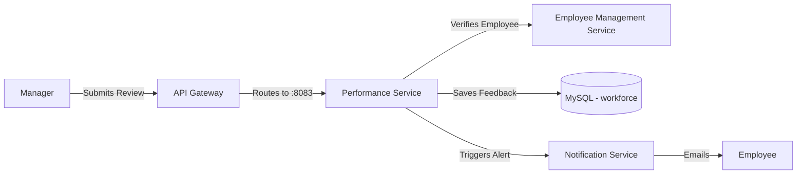

# Performance Service

## 📌 Overview
The **Performance Service** is dedicated to managing employee appraisals, feedback cycles, goal tracking, and overall performance metrics. It provides tools for managers to review their team members and for individuals to track their own professional growth within the company.

By keeping this domain isolated, the HRMS can independently scale its review cycles (which typically see high traffic during end-of-quarter or end-of-year periods) without affecting day-to-day operations like time-tracking or log-ins.

## 🏗️ Architecture & Flow



### 🔑 Key Responsibilities:
1. **Goal Management**: Allowing employees and managers to establish, track, and update Key Performance Indicators (KPIs).
2. **Review Cycles**: Structuring 30-day, 90-day, or annual reviews.
3. **Feedback Mechanism**: Storing qualitative and quantitative feedback securely.
4. **Scoring**: Calculating performance scores that might be leveraged later for promotions or salary adjustments.

## 💻 Technical Details

### Technologies & Dependencies
- **Spring Data JPA & Hibernate**: For mapping performance evaluation entities.
- **MySQL Driver**: Connects to the primary relational database to store permanent records.

### Configuration Highlights (`application.properties`)
```properties
spring.application.name=performance-service
server.port=8083

# DB Properties
spring.datasource.url=jdbc:mysql://localhost:3306/workforce?createDatabaseIfNotExist=true
spring.jpa.hibernate.ddl-auto=update

# API Documentation
springdoc.api-docs.path=/v3/api-docs
```

## 🚀 How to Run
**Using Maven:**
```bash
mvn spring-boot:run
```

**Using Docker:**
```bash
docker run -p 8083:8083 performance-service:latest
```


## 🛑 Deep Dive Component Codes & Project Structure
This section contains the full, exhaustive breakdown of the microservice's source code, project structure, and dependencies. It operates as the fundamental source of truth replacing isolated snippets with the actual working code.

### 🌳 Complete Project Tree
```text
performance-service/
├── .dockerignore
├── .gitattributes
├── .gitignore
├── Dockerfile
├── mvnw
├── mvnw.cmd
├── pom.xml
└── src
    ├── main
    │   ├── java
    │   │   └── com
    │   │       └── revworkforce
    │   │           └── performanceservice
    │   │               ├── PerformanceServiceApplication.java
    │   │               ├── controller
    │   │               │   ├── AdminPerformanceController.java
    │   │               │   ├── EmployeePerformanceController.java
    │   │               │   └── ManagerPerformanceController.java
    │   │               ├── dto
    │   │               │   ├── ApiResponse.java
    │   │               │   ├── GoalProgressRequest.java
    │   │               │   ├── GoalRequest.java
    │   │               │   ├── ManagerFeedbackRequest.java
    │   │               │   ├── ManagerGoalCommentRequest.java
    │   │               │   └── PerformanceReviewRequest.java
    │   │               ├── exception
    │   │               │   ├── AccessDeniedException.java
    │   │               │   ├── AccountDeactivatedException.java
    │   │               │   ├── BadRequestException.java
    │   │               │   ├── DuplicateResourceException.java
    │   │               │   ├── GlobalExceptionHandler.java
    │   │               │   ├── InsufficientBalanceException.java
    │   │               │   ├── InvalidActionException.java
    │   │               │   ├── IpBlockedException.java
    │   │               │   ├── ResourceNotFoundException.java
    │   │               │   └── UnauthorizedException.java
    │   │               ├── feign
    │   │               │   └── NotificationFeignClient.java
    │   │               ├── model
    │   │               │   ├── Department.java
    │   │               │   ├── Designation.java
    │   │               │   ├── Employee.java
    │   │               │   ├── Goal.java
    │   │               │   ├── Notification.java
    │   │               │   ├── PerformanceReview.java
    │   │               │   └── enums
    │   │               │       ├── Gender.java
    │   │               │       ├── GoalPriority.java
    │   │               │       ├── GoalStatus.java
    │   │               │       ├── NotificationType.java
    │   │               │       ├── ReviewStatus.java
    │   │               │       └── Role.java
    │   │               ├── repository
    │   │               │   ├── EmployeeRepository.java
    │   │               │   ├── GoalRepository.java
    │   │               │   ├── NotificationRepository.java
    │   │               │   └── PerformanceReviewRepository.java
    │   │               └── service
    │   │                   ├── NotificationService.java
    │   │                   ├── PerformanceService.java
    │   │                   └── PresenceService.java
    │   └── resources
    │       └── application.properties
    └── test
        └── java
            └── com
                └── revworkforce
                    └── performanceservice
                        └── PerformanceServiceApplicationTests.java
```

### 📦 Dependencies (`pom.xml`)
```xml
<?xml version="1.0" encoding="UTF-8"?>
<project xmlns="http://maven.apache.org/POM/4.0.0" xmlns:xsi="http://www.w3.org/2001/XMLSchema-instance"
         xsi:schemaLocation="http://maven.apache.org/POM/4.0.0 https://maven.apache.org/xsd/maven-4.0.0.xsd">
    <modelVersion>4.0.0</modelVersion>
    <parent>
        <groupId>org.springframework.boot</groupId>
        <artifactId>spring-boot-starter-parent</artifactId>
        <version>4.0.3</version>
        <relativePath/>
    </parent>
    <groupId>com.revworkforce</groupId>
    <artifactId>performance-service</artifactId>
    <version>0.0.1-SNAPSHOT</version>
    <name>performance-service</name>
    <description>Reviews, goals, manager feedback, ratings</description>
    <properties>
        <java.version>17</java.version>
        <spring-cloud.version>2025.1.0</spring-cloud.version>
    </properties>
    <dependencies>
        <dependency><groupId>org.springframework.boot</groupId><artifactId>spring-boot-starter-actuator</artifactId></dependency>
        <dependency><groupId>org.springframework.boot</groupId><artifactId>spring-boot-starter-data-jpa</artifactId></dependency>
        <dependency><groupId>org.springframework.boot</groupId><artifactId>spring-boot-starter-validation</artifactId></dependency>
        <dependency><groupId>org.springframework.boot</groupId><artifactId>spring-boot-starter-webmvc</artifactId></dependency>
        <dependency><groupId>org.springframework.cloud</groupId><artifactId>spring-cloud-starter-config</artifactId></dependency>
        <dependency><groupId>org.springframework.cloud</groupId><artifactId>spring-cloud-starter-netflix-eureka-client</artifactId></dependency>
        <dependency><groupId>org.springframework.cloud</groupId><artifactId>spring-cloud-starter-openfeign</artifactId></dependency>
        <dependency><groupId>org.springdoc</groupId><artifactId>springdoc-openapi-starter-webmvc-ui</artifactId><version>2.8.4</version></dependency>
        <dependency><groupId>com.mysql</groupId><artifactId>mysql-connector-j</artifactId><scope>runtime</scope></dependency>
        <dependency><groupId>org.projectlombok</groupId><artifactId>lombok</artifactId><optional>true</optional></dependency>
        <dependency><groupId>org.springframework.boot</groupId><artifactId>spring-boot-starter-test</artifactId><scope>test</scope></dependency>
    </dependencies>
    <dependencyManagement>
        <dependencies>
            <dependency><groupId>org.springframework.cloud</groupId><artifactId>spring-cloud-dependencies</artifactId><version>${spring-cloud.version}</version><type>pom</type><scope>import</scope></dependency>
        </dependencies>
    </dependencyManagement>
    <build>
        <plugins>
            <plugin><groupId>org.apache.maven.plugins</groupId><artifactId>maven-compiler-plugin</artifactId>
                <configuration><annotationProcessorPaths><path><groupId>org.projectlombok</groupId><artifactId>lombok</artifactId></path></annotationProcessorPaths></configuration>
            </plugin>
            <plugin><groupId>org.springframework.boot</groupId><artifactId>spring-boot-maven-plugin</artifactId>
                <configuration><excludes><exclude><groupId>org.projectlombok</groupId><artifactId>lombok</artifactId></exclude></excludes></configuration>
            </plugin>
        </plugins>
    </build>
</project>

```

### ⚙️ Configurations (`src/main/resources`)
**`application.properties`**
```properties
spring.application.name=performance-service
spring.config.import=optional:configserver:http://localhost:8888
eureka.client.service-url.defaultZone=http://localhost:8761/eureka/
eureka.instance.hostname=localhost
eureka.instance.prefer-ip-address=false
eureka.instance.instance-id=${spring.application.name}:${server.port}
server.port=8083

spring.datasource.url=jdbc:mysql://localhost:3306/workforce?createDatabaseIfNotExist=true
spring.datasource.username=root
spring.datasource.password=1234
spring.datasource.driver-class-name=com.mysql.cj.jdbc.Driver
spring.jpa.hibernate.ddl-auto=update
spring.jpa.show-sql=false
spring.jpa.properties.hibernate.dialect=org.hibernate.dialect.MySQLDialect

springdoc.api-docs.path=/v3/api-docs
springdoc.swagger-ui.path=/swagger-ui.html

```
