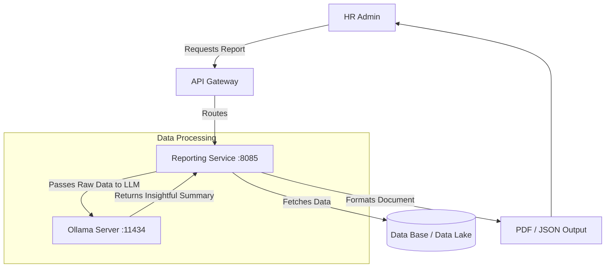

# Reporting Service

## 📌 Overview
The **Reporting Service** is an analytical engine built to aggregate data across the entire platform and generate actionable insights for HR administrators and C-level executives.

What makes this service unique is its integration with **Ollama**, allowing it to not only generate static CSV/PDF reports but also leverage local AI (`phi3` LLM) to produce narrative summaries, trends analysis, and predictive insights based on company data.

## 🏗️ Architecture & Flow



### 🔑 Key Responsibilities:
1. **Data Aggregation**: Pulling metrics regarding leave, performance, and general employee demographics.
2. **AI-Driven Analytics**: Using local instances of large language models to analyze large datasets and output human-readable summaries without sending proprietary company data to external cloud APIs like OpenAI.
3. **Format Generation**: Creating structured endpoints to consume report data.

## 💻 Technical Details

### Technologies & Dependencies
- **Spring Data JPA & Hibernate**: Database interactions.
- **MySQL Driver**: Stores analytical queries or cache results.
- **Ollama AI Integration**: Talks directly to the `phi3` endpoint for inference logic.

### Configuration Highlights (`application.properties`)
```properties
spring.application.name=reporting-service
server.port=8085

# Analytics & Local LLM Integration
ollama.base-url=http://localhost:11434
# Uses the phi3 model for text-based data summarization
ollama.model=phi3 
ollama.timeout=120000 
```

## 🚀 How to Run
**Prerequisite:** Ensure Ollama is running locally with the `phi3` model pulled.
```bash
ollama run phi3
```

**Using Maven:**
```bash
mvn spring-boot:run
```

**Using Docker:**
```bash
docker run -p 8085:8085 reporting-service:latest
```


## 🛑 Deep Dive Component Codes & Project Structure
This section contains the full, exhaustive breakdown of the microservice's source code, project structure, and dependencies. It operates as the fundamental source of truth replacing isolated snippets with the actual working code.

### 🌳 Complete Project Tree
```text
📦 reporting-service
    📜 .gitattributes
    📜 .gitignore
    📜 Dockerfile
    📜 hs_err_pid12196.log
    📜 mvnw
    📜 mvnw.cmd
    📜 pom.xml
    📂 src
        📂 main
            📂 java
                📂 com
                    📂 revworkforce
                        📂 reportingservice
                            📜 ReportingServiceApplication.java
                            📂 config
                                📜 OllamaConfig.java
                            📂 controller
                                📜 ReportGeneratorController.java
                            📂 dto
                                📜 ApiResponse.java
                                📜 AttendanceResponse.java
                                📜 AttendanceSummaryResponse.java
                                📜 CheckInRequest.java
                                📜 CheckOutRequest.java
                                📜 DashboardResponse.java
                                📜 EmployeeDashboardResponse.java
                                📜 EmployeeReportResponse.java
                                📜 LeaveReportResponse.java
                                📜 OfficeLocationRequest.java
                                📜 OfficeLocationResponse.java
                                📜 PerformanceReportResponse.java
                            📂 exception
                                📜 AccessDeniedException.java
                                📜 AccountDeactivatedException.java
                                📜 BadRequestException.java
                                📜 DuplicateResourceException.java
                                📜 GlobalExceptionHandler.java
                                📜 InsufficientBalanceException.java
                                📜 InvalidActionException.java
                                📜 IpBlockedException.java
                                📜 ResourceNotFoundException.java
                                📜 UnauthorizedException.java
                            📂 integration
                                📜 OllamaClient.java
                            📂 model
                                📜 Attendance.java
                                📜 Department.java
                                📜 Designation.java
                                📜 Employee.java
                                📜 Goal.java
                                📜 Holiday.java
                                📜 LeaveApplication.java
                                📜 LeaveBalance.java
                                📜 LeaveType.java
                                📜 Notification.java
                                📜 OfficeLocation.java
                                📜 PerformanceReview.java
                                📂 enums
                                    📜 AttendanceStatus.java
                                    📜 ExpenseCategory.java
                                    📜 ExpenseStatus.java
                                    📜 Gender.java
                                    📜 GoalPriority.java
                                    📜 GoalStatus.java
                                    📜 LeaveStatus.java
                                    📜 MessageType.java
                                    📜 NotificationType.java
                                    📜 ReviewStatus.java
                                    📜 Role.java
                            📂 repository
                                📜 AttendanceRepository.java
                                📜 DepartmentRepository.java
                                📜 DesignationRepository.java
                                📜 EmployeeRepository.java
                                📜 GoalRepository.java
                                📜 HolidayRepository.java
                                📜 LeaveApplicationRepository.java
                                📜 LeaveBalanceRepository.java
                                📜 LeaveTypeRepository.java
                                📜 NotificationRepository.java
                                📜 OfficeLocationRepository.java
                                📜 PerformanceReviewRepository.java
                            📂 service
                                📜 AttendanceService.java
                                📜 DashboardService.java
                                📜 GeoAttendanceService.java
                                📜 OfficeLocationService.java
                                📜 ReportGeneratorService.java
            📂 resources
                📜 application.properties
        📂 test
            📂 java
                📂 com
                    📂 revworkforce
                        📂 reportingservice
                            📜 ReportingServiceApplicationTests.java
```

### 📦 Dependencies (`pom.xml`)
```xml
<?xml version="1.0" encoding="UTF-8"?>
<project xmlns="http://maven.apache.org/POM/4.0.0" xmlns:xsi="http://www.w3.org/2001/XMLSchema-instance"
         xsi:schemaLocation="http://maven.apache.org/POM/4.0.0 https://maven.apache.org/xsd/maven-4.0.0.xsd">
    <modelVersion>4.0.0</modelVersion>
    <parent>
        <groupId>org.springframework.boot</groupId>
        <artifactId>spring-boot-starter-parent</artifactId>
        <version>4.0.3</version>
        <relativePath/>
    </parent>
    <groupId>com.revworkforce</groupId>
    <artifactId>reporting-service</artifactId>
    <version>0.0.1-SNAPSHOT</version>
    <name>reporting-service</name>
    <description>HR dashboards, leave reports, employee reports, AI-powered performance reports</description>
    <properties>
        <java.version>17</java.version>
        <spring-cloud.version>2025.1.0</spring-cloud.version>
    </properties>
    <dependencies>
        <dependency><groupId>org.springframework.boot</groupId><artifactId>spring-boot-starter-actuator</artifactId></dependency>
        <dependency><groupId>org.springframework.boot</groupId><artifactId>spring-boot-starter-data-jpa</artifactId></dependency>
        <dependency><groupId>org.springframework.boot</groupId><artifactId>spring-boot-starter-validation</artifactId></dependency>
        <dependency><groupId>org.springframework.boot</groupId><artifactId>spring-boot-starter-webmvc</artifactId></dependency>
        <dependency><groupId>org.springframework.cloud</groupId><artifactId>spring-cloud-starter-config</artifactId></dependency>
        <dependency><groupId>org.springframework.cloud</groupId><artifactId>spring-cloud-starter-netflix-eureka-client</artifactId></dependency>
        <dependency><groupId>org.springframework.cloud</groupId><artifactId>spring-cloud-starter-openfeign</artifactId></dependency>
        <dependency><groupId>org.springdoc</groupId><artifactId>springdoc-openapi-starter-webmvc-ui</artifactId><version>2.8.4</version></dependency>
        <dependency><groupId>com.mysql</groupId><artifactId>mysql-connector-j</artifactId><scope>runtime</scope></dependency>
        <dependency><groupId>org.projectlombok</groupId><artifactId>lombok</artifactId><optional>true</optional></dependency>
        <dependency><groupId>org.springframework.boot</groupId><artifactId>spring-boot-starter-test</artifactId><scope>test</scope></dependency>
    </dependencies>
    <dependencyManagement>
        <dependencies>
            <dependency><groupId>org.springframework.cloud</groupId><artifactId>spring-cloud-dependencies</artifactId><version>${spring-cloud.version}</version><type>pom</type><scope>import</scope></dependency>
        </dependencies>
    </dependencyManagement>
    <build>
        <plugins>
            <plugin><groupId>org.apache.maven.plugins</groupId><artifactId>maven-compiler-plugin</artifactId>
                <configuration><annotationProcessorPaths><path><groupId>org.projectlombok</groupId><artifactId>lombok</artifactId></path></annotationProcessorPaths></configuration>
            </plugin>
            <plugin><groupId>org.springframework.boot</groupId><artifactId>spring-boot-maven-plugin</artifactId>
                <configuration><excludes><exclude><groupId>org.projectlombok</groupId><artifactId>lombok</artifactId></exclude></excludes></configuration>
            </plugin>
        </plugins>
    </build>
</project>

```

### ⚙️ Configurations (`src/main/resources`)
**`application.properties`**
```properties
spring.application.name=reporting-service
spring.config.import=optional:configserver:http://localhost:8888
eureka.client.service-url.defaultZone=http://localhost:8761/eureka/
eureka.instance.hostname=localhost
eureka.instance.prefer-ip-address=false
eureka.instance.instance-id=${spring.application.name}:${server.port}
server.port=8085

spring.datasource.url=jdbc:mysql://localhost:3306/workforce?createDatabaseIfNotExist=true
spring.datasource.username=root
spring.datasource.password=1234
spring.datasource.driver-class-name=com.mysql.cj.jdbc.Driver
spring.jpa.hibernate.ddl-auto=update
spring.jpa.show-sql=false
spring.jpa.properties.hibernate.dialect=org.hibernate.dialect.MySQLDialect

ollama.base-url=http://localhost:11434
ollama.model=phi3
ollama.timeout=120000
springdoc.api-docs.path=/v3/api-docs
springdoc.swagger-ui.path=/swagger-ui.html

```

### ☕ Source Code Files
#### **`src/main/java/com/revworkforce/reportingservice/ReportingServiceApplication.java`**
```java
package com.revworkforce.reportingservice;
import org.springframework.boot.SpringApplication;
import org.springframework.boot.autoconfigure.SpringBootApplication;
import org.springframework.cloud.client.discovery.EnableDiscoveryClient;
import org.springframework.cloud.openfeign.EnableFeignClients;

@SpringBootApplication @EnableDiscoveryClient @EnableFeignClients
public class ReportingServiceApplication {
    public static void main(String[] args) { SpringApplication.run(ReportingServiceApplication.class, args); }
}

```

#### **`src/main/java/com/revworkforce/reportingservice/config/OllamaConfig.java`**
```java
package com.revworkforce.reportingservice.config;

import org.springframework.beans.factory.annotation.Value;
import org.springframework.context.annotation.Bean;
import org.springframework.context.annotation.Configuration;
import org.springframework.http.client.SimpleClientHttpRequestFactory;
import org.springframework.web.client.RestTemplate;

@Configuration
public class OllamaConfig {
    @Value("${ollama.timeout:60000}")
    private int timeout;
    @Bean(name = "ollamaRestTemplate")
    public RestTemplate ollamaRestTemplate() {
        SimpleClientHttpRequestFactory factory = new SimpleClientHttpRequestFactory();
        factory.setConnectTimeout(timeout);
        factory.setReadTimeout(timeout);
        return new RestTemplate(factory);
    }
}
```

#### **`src/main/java/com/revworkforce/reportingservice/controller/ReportGeneratorController.java`**
```java
package com.revworkforce.reportingservice.controller;

import com.revworkforce.reportingservice.dto.PerformanceReportResponse;
import com.revworkforce.reportingservice.service.ReportGeneratorService;
import org.springframework.beans.factory.annotation.Autowired;
import org.springframework.http.ResponseEntity;
import org.springframework.web.bind.annotation.*;

@RestController
@RequestMapping("/api/admin/reports")
public class ReportGeneratorController {
    @Autowired private ReportGeneratorService reportGeneratorService;

    @GetMapping("/performance/{employeeId}")
    public ResponseEntity<PerformanceReportResponse> generateReport(
            @PathVariable Integer employeeId,
            @RequestParam(required = false) String period) {
        return ResponseEntity.ok(reportGeneratorService.generateReport(employeeId, period));
    }
}


```

#### **`src/main/java/com/revworkforce/reportingservice/dto/ApiResponse.java`**
```java
package com.revworkforce.reportingservice.dto;
import lombok.AllArgsConstructor;
import lombok.Data;
import lombok.NoArgsConstructor;

@Data
@NoArgsConstructor
@AllArgsConstructor
public class ApiResponse {
    private boolean success;
    private String message;
    private Object data;

    public ApiResponse(boolean success, String message) {
        this.success = success;
        this.message = message;
        this.data = null;
    }
}

```

#### **`src/main/java/com/revworkforce/reportingservice/dto/AttendanceResponse.java`**
```java
package com.revworkforce.reportingservice.dto;

import lombok.AllArgsConstructor;
import lombok.Builder;
import lombok.Data;
import lombok.NoArgsConstructor;

import java.time.LocalDate;
import java.time.LocalDateTime;

@Data
@NoArgsConstructor
@AllArgsConstructor
@Builder
public class AttendanceResponse {
    private Integer attendanceId;
    private Integer employeeId;
    private String employeeCode;
    private String employeeName;
    private LocalDate attendanceDate;
    private LocalDateTime checkInTime;
    private LocalDateTime checkOutTime;
    private Double totalHours;
    private String status;
    private String checkInIp;
    private String checkOutIp;

    private Double checkInLatitude;
    private Double checkInLongitude;
    private Double checkOutLatitude;
    private Double checkOutLongitude;
    private Boolean locationVerified;
    private Double checkInDistanceMeters;
    private Double checkOutDistanceMeters;
    private String officeLocationName;

    private String notes;
    private Boolean isLate;
    private Boolean isEarlyDeparture;
    private LocalDateTime createdAt;
}

```

#### **`src/main/java/com/revworkforce/reportingservice/dto/AttendanceSummaryResponse.java`**
```java
package com.revworkforce.reportingservice.dto;

import lombok.AllArgsConstructor;
import lombok.Builder;
import lombok.Data;
import lombok.NoArgsConstructor;

@Data
@NoArgsConstructor
@AllArgsConstructor
@Builder
public class AttendanceSummaryResponse {
    private String employeeCode;
    private String employeeName;
    private long totalPresent;
    private long totalAbsent;
    private long totalHalfDay;
    private long totalOnLeave;
    private long totalLateArrivals;
    private long totalEarlyDepartures;
    private Double totalHoursWorked;
    private String month;
    private Integer year;
}

```

#### **`src/main/java/com/revworkforce/reportingservice/dto/CheckInRequest.java`**
```java
package com.revworkforce.reportingservice.dto;

import lombok.AllArgsConstructor;
import lombok.Data;
import lombok.NoArgsConstructor;

@Data
@NoArgsConstructor
@AllArgsConstructor
public class CheckInRequest {
    private String notes;

    private Double latitude;

    private Double longitude;
}

```

#### **`src/main/java/com/revworkforce/reportingservice/dto/CheckOutRequest.java`**
```java
package com.revworkforce.reportingservice.dto;

import lombok.AllArgsConstructor;
import lombok.Data;
import lombok.NoArgsConstructor;

@Data
@NoArgsConstructor
@AllArgsConstructor
public class CheckOutRequest {
    private String notes;

    private Double latitude;

    private Double longitude;
}

```

#### **`src/main/java/com/revworkforce/reportingservice/dto/DashboardResponse.java`**
```java
package com.revworkforce.reportingservice.dto;
import lombok.AllArgsConstructor;
import lombok.Builder;
import lombok.Data;
import lombok.NoArgsConstructor;
import java.util.Map;

@Data
@NoArgsConstructor
@AllArgsConstructor
@Builder
public class DashboardResponse {
    private long totalEmployees;
    private long activeEmployees;
    private long inactiveEmployees;
    private long totalManagers;
    private long totalAdmins;
    private long totalRegularEmployees;
    private long pendingLeaves;
    private long approvedLeavesToday;
    private long totalDepartments;
    private long totalDesignations;
    private Map<String, Long> employeesByDepartment;
}

```

#### **`src/main/java/com/revworkforce/reportingservice/dto/EmployeeDashboardResponse.java`**
```java
package com.revworkforce.reportingservice.dto;

import lombok.AllArgsConstructor;
import lombok.Builder;
import lombok.Data;
import lombok.NoArgsConstructor;

import java.time.LocalDate;
import java.util.List;

@Data
@Builder
@NoArgsConstructor
@AllArgsConstructor
public class EmployeeDashboardResponse {
    private String employeeName;
    private String employeeCode;
    private String departmentName;
    private String designationTitle;
    private long pendingLeaveRequests;
    private long approvedLeaves;
    private long unreadNotifications;
    private List<LeaveBalanceSummary> leaveBalances;
    private List<UpcomingHolidaySummary> upcomingHolidays;

    @Data
    @Builder
    @NoArgsConstructor
    @AllArgsConstructor
    public static class LeaveBalanceSummary {
        private String leaveTypeName;
        private Integer totalLeaves;
        private Integer usedLeaves;
        private Integer availableBalance;
    }

    @Data
    @Builder
    @NoArgsConstructor
    @AllArgsConstructor
    public static class UpcomingHolidaySummary {
        private String holidayName;
        private LocalDate holidayDate;
        private String description;
    }
}

```

#### **`src/main/java/com/revworkforce/reportingservice/dto/EmployeeReportResponse.java`**
```java
package com.revworkforce.reportingservice.dto;

import lombok.*;
import java.util.List;
import java.util.Map;

@Data
@NoArgsConstructor
@AllArgsConstructor
@Builder
public class EmployeeReportResponse {
    private long totalEmployees;
    private long activeEmployees;
    private long inactiveEmployees;
    private Map<String, Long> headcountByDepartment;
    private Map<String, Long> headcountByRole;
    private List<JoiningTrend> joiningTrends;
    private double averageTenureMonths;

    @Data
    @NoArgsConstructor
    @AllArgsConstructor
    @Builder
    public static class JoiningTrend {
        private String period;
        private long count;
    }
}

```

#### **`src/main/java/com/revworkforce/reportingservice/dto/LeaveReportResponse.java`**
```java
package com.revworkforce.reportingservice.dto;
import lombok.AllArgsConstructor;
import lombok.Builder;
import lombok.Data;
import lombok.NoArgsConstructor;

@Data
@NoArgsConstructor
@AllArgsConstructor
@Builder
public class LeaveReportResponse {
    private String employeeCode;
    private String employeeName;
    private String departmentName;
    private String leaveTypeName;
    private Integer totalLeaves;
    private Integer usedLeaves;
    private Integer availableBalance;
    private Integer year;
}

```

#### **`src/main/java/com/revworkforce/reportingservice/dto/OfficeLocationRequest.java`**
```java
package com.revworkforce.reportingservice.dto;

import jakarta.validation.constraints.NotBlank;
import jakarta.validation.constraints.NotNull;
import jakarta.validation.constraints.Size;
import lombok.AllArgsConstructor;
import lombok.Data;
import lombok.NoArgsConstructor;

@Data
@NoArgsConstructor
@AllArgsConstructor
public class OfficeLocationRequest {
    @NotBlank(message = "Location name is required")
    @Size(max = 100, message = "Location name must not exceed 100 characters")
    private String locationName;

    @Size(max = 500, message = "Address must not exceed 500 characters")
    private String address;

    @NotNull(message = "Latitude is required")
    private Double latitude;

    @NotNull(message = "Longitude is required")
    private Double longitude;

    private Integer radiusMeters;

    private Boolean isActive;
}

```

#### **`src/main/java/com/revworkforce/reportingservice/dto/OfficeLocationResponse.java`**
```java
package com.revworkforce.reportingservice.dto;

import lombok.AllArgsConstructor;
import lombok.Builder;
import lombok.Data;
import lombok.NoArgsConstructor;

import java.time.LocalDateTime;

@Data
@NoArgsConstructor
@AllArgsConstructor
@Builder
public class OfficeLocationResponse {
    private Integer locationId;
    private String locationName;
    private String address;
    private Double latitude;
    private Double longitude;
    private Integer radiusMeters;
    private Boolean isActive;
    private LocalDateTime createdAt;
    private LocalDateTime updatedAt;
}

```

#### **`src/main/java/com/revworkforce/reportingservice/dto/PerformanceReportResponse.java`**
```java
package com.revworkforce.reportingservice.dto;

import lombok.*;
import java.util.List;
import java.util.Map;

@Getter @Setter @NoArgsConstructor @AllArgsConstructor @Builder
public class PerformanceReportResponse {
    private String employeeName;
    private String employeeCode;
    private String department;
    private String designation;
    private String reportPeriod;

    private int totalPresentDays;
    private int totalAbsentDays;
    private int lateArrivals;
    private double averageHoursPerDay;

    private int totalLeavesTaken;
    private Map<String, Integer> leaveBreakdown;

    private int totalGoals;
    private int completedGoals;
    private int inProgressGoals;
    private double averageGoalProgress;
    private List<GoalSummary> goals;

    private List<ReviewSummary> reviews;
    private Double averageSelfRating;
    private Double averageManagerRating;

    private String aiOverallAssessment;
    private String aiStrengths;
    private String aiAreasForImprovement;
    private String aiRecommendations;
    private String aiRating;

    @Getter @Setter @NoArgsConstructor @AllArgsConstructor @Builder
    public static class GoalSummary {
        private String title;
        private String status;
        private int progress;
        private String priority;
    }

    @Getter @Setter @NoArgsConstructor @AllArgsConstructor @Builder
    public static class ReviewSummary {
        private String period;
        private Integer selfRating;
        private Integer managerRating;
        private String status;
    }
}


```

#### **`src/main/java/com/revworkforce/reportingservice/exception/AccessDeniedException.java`**
```java
package com.revworkforce.reportingservice.exception;

public class AccessDeniedException extends RuntimeException {
    public AccessDeniedException(String message) {
        super(message);
    }
}

```

#### **`src/main/java/com/revworkforce/reportingservice/exception/AccountDeactivatedException.java`**
```java
package com.revworkforce.reportingservice.exception;

public class AccountDeactivatedException extends RuntimeException {
    public AccountDeactivatedException(String message) {
        super(message);
    }

    public AccountDeactivatedException(String employeeCode, String reason) {
        super(String.format("Account '%s' is deactivated. %s", employeeCode, reason));
    }
}

```

#### **`src/main/java/com/revworkforce/reportingservice/exception/BadRequestException.java`**
```java
package com.revworkforce.reportingservice.exception;

public class BadRequestException extends RuntimeException {
    public BadRequestException(String message) {
        super(message);
    }
}

```

#### **`src/main/java/com/revworkforce/reportingservice/exception/DuplicateResourceException.java`**
```java
package com.revworkforce.reportingservice.exception;

public class DuplicateResourceException extends RuntimeException {
    public DuplicateResourceException(String message) {
        super(message);
    }

    public DuplicateResourceException(String resourceName, String fieldName, Object fieldValue) {
        super(String.format("%s already exists with %s: '%s'", resourceName, fieldName, fieldValue));
    }
}

```

#### **`src/main/java/com/revworkforce/reportingservice/exception/GlobalExceptionHandler.java`**
```java
package com.revworkforce.reportingservice.exception;

import com.revworkforce.reportingservice.dto.ApiResponse;
import org.springframework.http.HttpStatus;
import org.springframework.http.ResponseEntity;
import org.springframework.validation.FieldError;
import org.springframework.web.bind.MethodArgumentNotValidException;
import org.springframework.web.bind.annotation.ExceptionHandler;
import org.springframework.web.bind.annotation.RestControllerAdvice;
import org.springframework.web.method.annotation.MethodArgumentTypeMismatchException;
import org.springframework.web.servlet.resource.NoResourceFoundException;

import java.util.HashMap;
import java.util.Map;

@RestControllerAdvice
public class GlobalExceptionHandler {
    @ExceptionHandler(ResourceNotFoundException.class)
    public ResponseEntity<ApiResponse> handleResourceNotFound(ResourceNotFoundException ex) {
        return ResponseEntity.status(HttpStatus.NOT_FOUND)
                .body(new ApiResponse(false, ex.getMessage()));
    }

    @ExceptionHandler(BadRequestException.class)
    public ResponseEntity<ApiResponse> handleBadRequest(BadRequestException ex) {
        return ResponseEntity.status(HttpStatus.BAD_REQUEST)
                .body(new ApiResponse(false, ex.getMessage()));
    }

    @ExceptionHandler(DuplicateResourceException.class)
    public ResponseEntity<ApiResponse> handleDuplicateResource(DuplicateResourceException ex) {
        return ResponseEntity.status(HttpStatus.CONFLICT)
                .body(new ApiResponse(false, ex.getMessage()));
    }

    @ExceptionHandler(InsufficientBalanceException.class)
    public ResponseEntity<ApiResponse> handleInsufficientBalance(InsufficientBalanceException ex) {
        return ResponseEntity.status(HttpStatus.BAD_REQUEST)
                .body(new ApiResponse(false, ex.getMessage()));
    }

    @ExceptionHandler(UnauthorizedException.class)
    public ResponseEntity<ApiResponse> handleUnauthorized(UnauthorizedException ex) {
        return ResponseEntity.status(HttpStatus.UNAUTHORIZED)
                .body(new ApiResponse(false, ex.getMessage()));
    }

    @ExceptionHandler(AccessDeniedException.class)
    public ResponseEntity<ApiResponse> handleAccessDenied(AccessDeniedException ex) {
        return ResponseEntity.status(HttpStatus.FORBIDDEN)
                .body(new ApiResponse(false, ex.getMessage()));
    }

    @ExceptionHandler(InvalidActionException.class)
    public ResponseEntity<ApiResponse> handleInvalidAction(InvalidActionException ex) {
        return ResponseEntity.status(HttpStatus.BAD_REQUEST)
                .body(new ApiResponse(false, ex.getMessage()));
    }

    @ExceptionHandler(AccountDeactivatedException.class)
    public ResponseEntity<ApiResponse> handleAccountDeactivated(AccountDeactivatedException ex) {
        return ResponseEntity.status(HttpStatus.FORBIDDEN)
                .body(new ApiResponse(false, ex.getMessage()));
    }

    @ExceptionHandler(IpBlockedException.class)
    public ResponseEntity<ApiResponse> handleIpBlocked(IpBlockedException ex) {
        return ResponseEntity.status(HttpStatus.FORBIDDEN)
                .body(new ApiResponse(false, ex.getMessage()));
    }

    @ExceptionHandler(MethodArgumentNotValidException.class)
    public ResponseEntity<ApiResponse> handleValidationErrors(MethodArgumentNotValidException ex) {
        Map<String, String> errors = new HashMap<>();
        for (FieldError fieldError : ex.getBindingResult().getFieldErrors()) {
            errors.put(fieldError.getField(), fieldError.getDefaultMessage());
        }
        return ResponseEntity.status(HttpStatus.BAD_REQUEST)
                .body(new ApiResponse(false, "Validation failed", errors));
    }

    @ExceptionHandler(MethodArgumentTypeMismatchException.class)
    public ResponseEntity<ApiResponse> handleTypeMismatch(MethodArgumentTypeMismatchException ex) {
        String message = String.format("Invalid value '%s' for parameter '%s'. Expected type: %s",
                ex.getValue(), ex.getName(),
                ex.getRequiredType() != null ? ex.getRequiredType().getSimpleName() : "unknown");
        return ResponseEntity.status(HttpStatus.BAD_REQUEST)
                .body(new ApiResponse(false, message));
    }

    @ExceptionHandler(NoResourceFoundException.class)
    public ResponseEntity<ApiResponse> handleNoResourceFound(NoResourceFoundException ex) {
        return ResponseEntity.status(HttpStatus.NOT_FOUND)
                .body(new ApiResponse(false, "The requested resource was not found"));
    }

    @ExceptionHandler(IllegalArgumentException.class)
    public ResponseEntity<ApiResponse> handleIllegalArgument(IllegalArgumentException ex) {
        return ResponseEntity.status(HttpStatus.BAD_REQUEST)
                .body(new ApiResponse(false, ex.getMessage()));
    }

    @ExceptionHandler(Exception.class)
    public ResponseEntity<ApiResponse> handleGenericException(Exception ex) {
        return ResponseEntity.status(HttpStatus.INTERNAL_SERVER_ERROR)
                .body(new ApiResponse(false, "An unexpected error occurred: " + ex.getMessage()));
    }
}

```

#### **`src/main/java/com/revworkforce/reportingservice/exception/InsufficientBalanceException.java`**
```java
package com.revworkforce.reportingservice.exception;

public class InsufficientBalanceException extends RuntimeException {
    public InsufficientBalanceException(String message) {
        super(message);
    }

    public InsufficientBalanceException(int available, int requested) {
        super(String.format("Insufficient leave balance. Available: %d, Requested: %d", available, requested));
    }
}

```

#### **`src/main/java/com/revworkforce/reportingservice/exception/InvalidActionException.java`**
```java
package com.revworkforce.reportingservice.exception;

public class InvalidActionException extends RuntimeException {
    public InvalidActionException(String message) {
        super(message);
    }

    public InvalidActionException(String action, String allowedActions) {
        super(String.format("Invalid action '%s'. Allowed actions: %s", action, allowedActions));
    }
}

```

#### **`src/main/java/com/revworkforce/reportingservice/exception/IpBlockedException.java`**
```java
package com.revworkforce.reportingservice.exception;

public class IpBlockedException extends RuntimeException {
    public IpBlockedException(String message) {
        super(message);
    }
}

```

#### **`src/main/java/com/revworkforce/reportingservice/exception/ResourceNotFoundException.java`**
```java
package com.revworkforce.reportingservice.exception;

public class ResourceNotFoundException extends RuntimeException {
    public ResourceNotFoundException(String message) {
        super(message);
    }

    public ResourceNotFoundException(String resourceName, String fieldName, Object fieldValue) {
        super(String.format("%s not found with %s: '%s'", resourceName, fieldName, fieldValue));
    }
}

```

#### **`src/main/java/com/revworkforce/reportingservice/exception/UnauthorizedException.java`**
```java
package com.revworkforce.reportingservice.exception;

public class UnauthorizedException extends RuntimeException {
    public UnauthorizedException(String message) {
        super(message);
    }
}

```

#### **`src/main/java/com/revworkforce/reportingservice/integration/OllamaClient.java`**
```java
package com.revworkforce.reportingservice.integration;

import com.fasterxml.jackson.databind.JsonNode;
import com.fasterxml.jackson.databind.ObjectMapper;
import org.slf4j.Logger;
import org.slf4j.LoggerFactory;
import org.springframework.beans.factory.annotation.Value;
import org.springframework.http.*;
import org.springframework.http.client.SimpleClientHttpRequestFactory;
import org.springframework.stereotype.Component;
import org.springframework.web.client.RestTemplate;

import java.util.HashMap;
import java.util.List;
import java.util.Map;

@Component
public class OllamaClient {
    private static final Logger log = LoggerFactory.getLogger(OllamaClient.class);

    @Value("${ollama.base-url:http://localhost:11434}")
    private String baseUrl;
    @Value("${ollama.model:phi3}")
    private String model;
    @Value("${ollama.vision-model:llava}")
    private String visionModel;
    @Value("${ollama.timeout:60000}")
    private int timeout;

    private final ObjectMapper objectMapper = new ObjectMapper();

    private volatile Boolean cachedAvailable = null;
    private volatile long cachedAt = 0;
    private static final long CACHE_TTL_MS = 60_000;

    private volatile RestTemplate cachedRestTemplate;

    private RestTemplate getRestTemplate() {
        if (cachedRestTemplate == null) {
            synchronized (this) {
                if (cachedRestTemplate == null) {
                    SimpleClientHttpRequestFactory factory = new SimpleClientHttpRequestFactory();
                    factory.setConnectTimeout(java.time.Duration.ofMillis(5000));
                    factory.setReadTimeout(java.time.Duration.ofMillis(timeout));
                    cachedRestTemplate = new RestTemplate(factory);
                }
            }
        }
        return cachedRestTemplate;
    }

    public boolean isAvailable() {
        long now = System.currentTimeMillis();
        if (cachedAvailable != null && (now - cachedAt) < CACHE_TTL_MS) {
            return cachedAvailable;
        }
        boolean result = checkAvailability();
        cachedAvailable = result;
        cachedAt = now;
        return result;
    }

    public void refreshAvailability() {
        cachedAvailable = null;
        cachedAt = 0;
    }

    private boolean checkAvailability() {
        try {
            SimpleClientHttpRequestFactory factory = new SimpleClientHttpRequestFactory();
            factory.setConnectTimeout(java.time.Duration.ofMillis(2000));
            factory.setReadTimeout(java.time.Duration.ofMillis(2000));
            RestTemplate quickTemplate = new RestTemplate(factory);
            ResponseEntity<String> response = quickTemplate.getForEntity(baseUrl + "/api/tags", String.class);
            boolean ok = response.getStatusCode().is2xxSuccessful();
            if (ok) log.info("Ollama is available at {}", baseUrl);
            return ok;
        } catch (Exception e) {
            log.debug("Ollama not reachable at {}: {}", baseUrl, e.getMessage());
            return false;
        }
    }

    public String generate(String prompt) {
        return generate(prompt, 150);
    }

    public String generate(String prompt, int maxTokens) {
        String url = baseUrl + "/api/generate";
        Map<String, Object> body = new HashMap<>();
        body.put("model", model);
        body.put("prompt", prompt);
        body.put("stream", false);

        Map<String, Object> options = new HashMap<>();
        options.put("num_predict", maxTokens);
        options.put("temperature", 0);
        options.put("top_k", 1);
        options.put("num_ctx", 1024);
        options.put("repeat_penalty", 1.0);
        options.put("num_thread", 4);
        body.put("options", options);

        HttpHeaders headers = new HttpHeaders();
        headers.setContentType(MediaType.APPLICATION_JSON);
        try {
            log.info("Sending text prompt to Ollama model '{}' (length: {} chars, maxTokens: {})", model, prompt.length(), maxTokens);
            String jsonBody = objectMapper.writeValueAsString(body);
            HttpEntity<String> request = new HttpEntity<>(jsonBody, headers);
            ResponseEntity<String> response = getRestTemplate().postForEntity(url, request, String.class);
            if (response.getStatusCode().is2xxSuccessful() && response.getBody() != null) {
                JsonNode root = objectMapper.readTree(response.getBody());
                String result = root.has("response") ? root.get("response").asText() : "No response from AI model.";
                log.info("Ollama responded successfully ({} chars)", result.length());
                return result;
            }
            log.error("Ollama returned status: {}", response.getStatusCode());
            return "Error: Received status " + response.getStatusCode();
        } catch (Exception e) {
            log.error("Error communicating with Ollama text model: {}", e.getMessage());
            return "Error communicating with AI model: " + e.getMessage();
        }
    }

    public String generateWithImage(String prompt, String base64Image) {
        String url = baseUrl + "/api/generate";
        Map<String, Object> body = new HashMap<>();
        body.put("model", visionModel);
        body.put("prompt", prompt);
        body.put("images", List.of(base64Image));
        body.put("stream", false);

        Map<String, Object> options = new HashMap<>();
        options.put("num_predict", 300);
        options.put("temperature", 0);
        options.put("top_k", 1);
        options.put("num_ctx", 1024);
        options.put("num_thread", 4);
        body.put("options", options);

        HttpHeaders headers = new HttpHeaders();
        headers.setContentType(MediaType.APPLICATION_JSON);
        try {
            log.info("Sending image prompt to Ollama vision model '{}'", visionModel);
            String jsonBody = objectMapper.writeValueAsString(body);
            HttpEntity<String> request = new HttpEntity<>(jsonBody, headers);
            ResponseEntity<String> response = getRestTemplate().postForEntity(url, request, String.class);
            if (response.getStatusCode().is2xxSuccessful() && response.getBody() != null) {
                JsonNode root = objectMapper.readTree(response.getBody());
                String result = root.has("response") ? root.get("response").asText() : "No response from AI model.";
                log.info("Ollama vision responded successfully ({} chars)", result.length());
                return result;
            }
            log.error("Ollama vision returned status: {}", response.getStatusCode());
            return "Error: Received status " + response.getStatusCode();
        } catch (Exception e) {
            log.error("Error communicating with Ollama vision model: {}", e.getMessage());
            return "Error: Vision model '" + visionModel + "' not available. " + e.getMessage();
        }
    }
}

```

#### **`src/main/java/com/revworkforce/reportingservice/model/Attendance.java`**
```java
package com.revworkforce.reportingservice.model;
import com.fasterxml.jackson.annotation.JsonIgnoreProperties;
import jakarta.persistence.*;
import lombok.*;
import com.revworkforce.reportingservice.model.enums.AttendanceStatus;
import org.hibernate.annotations.CreationTimestamp;
import org.hibernate.annotations.UpdateTimestamp;
import java.time.Duration;
import java.time.LocalDate;
import java.time.LocalDateTime;

@Entity
@Table(name = "attendance", uniqueConstraints = {
        @UniqueConstraint(name = "uk_emp_attendance_date", columnNames = {"employee_id", "attendance_date"})
}, indexes = {
        @Index(name = "idx_attendance_emp", columnList = "employee_id"),
        @Index(name = "idx_attendance_date", columnList = "attendance_date"),
        @Index(name = "idx_attendance_status", columnList = "status")
})
@Getter
@Setter
@NoArgsConstructor
@AllArgsConstructor
@Builder
@ToString(exclude = {"employee"})
@EqualsAndHashCode(onlyExplicitlyIncluded = true)
public class Attendance {
    @Id
    @GeneratedValue(strategy = GenerationType.IDENTITY)
    @Column(name = "attendance_id")
    @EqualsAndHashCode.Include
    private Integer attendanceId;

    @ManyToOne(fetch = FetchType.EAGER)
    @JoinColumn(name = "employee_id", nullable = false)
    @JsonIgnoreProperties({"hibernateLazyInitializer", "handler"})
    private Employee employee;

    @Column(name = "attendance_date", nullable = false)
    private LocalDate attendanceDate;

    @Column(name = "check_in_time")
    private LocalDateTime checkInTime;

    @Column(name = "check_out_time")
    private LocalDateTime checkOutTime;

    @Column(name = "total_hours")
    private Double totalHours;

    @Enumerated(EnumType.STRING)
    @Column(name = "status", length = 20, nullable = false)
    @Builder.Default
    private AttendanceStatus status = AttendanceStatus.PRESENT;

    @Column(name = "check_in_ip", length = 45)
    private String checkInIp;

    @Column(name = "check_out_ip", length = 45)
    private String checkOutIp;

    @Column(name = "check_in_latitude")
    private Double checkInLatitude;

    @Column(name = "check_in_longitude")
    private Double checkInLongitude;

    @Column(name = "check_out_latitude")
    private Double checkOutLatitude;

    @Column(name = "check_out_longitude")
    private Double checkOutLongitude;

    @Column(name = "location_verified")
    @Builder.Default
    private Boolean locationVerified = false;

    @Column(name = "check_in_distance_meters")
    private Double checkInDistanceMeters;

    @Column(name = "check_out_distance_meters")
    private Double checkOutDistanceMeters;

    @Column(name = "office_location_name", length = 100)
    private String officeLocationName;

    @Column(name = "notes", length = 500)
    private String notes;

    @Column(name = "is_late")
    @Builder.Default
    private Boolean isLate = false;

    @Column(name = "is_early_departure")
    @Builder.Default
    private Boolean isEarlyDeparture = false;

    @CreationTimestamp
    @Column(name = "created_at", updatable = false)
    private LocalDateTime createdAt;

    @UpdateTimestamp
    @Column(name = "updated_at")
    private LocalDateTime updatedAt;

    @Transient
    public Double getCalculatedHours() {
        if (checkInTime != null && checkOutTime != null) {
            Duration duration = Duration.between(checkInTime, checkOutTime);
            return Math.round(duration.toMinutes() / 60.0 * 100.0) / 100.0;
        }
        return 0.0;
    }
}

```

#### **`src/main/java/com/revworkforce/reportingservice/model/Department.java`**
```java
package com.revworkforce.reportingservice.model;
import jakarta.persistence.*;
import lombok.*;
import org.hibernate.annotations.CreationTimestamp;
import org.hibernate.annotations.UpdateTimestamp;
import java.time.LocalDateTime;

@Entity
@Table(name = "department")
@Data
@NoArgsConstructor
@AllArgsConstructor
@Builder
public class Department {
    @Id
    @GeneratedValue(strategy = GenerationType.IDENTITY)
    @Column(name = "department_id")
    private Integer departmentId;
    @Column(name = "department_name", nullable = false, unique = true, length = 100)
    private String departmentName;
    @Column(columnDefinition = "TEXT")
    private String description;
    @Column(name = "is_active")
    @Builder.Default
    private Boolean isActive = true;
    @CreationTimestamp
    @Column(name="created_at", updatable = false)
    private LocalDateTime createdAt;
    @UpdateTimestamp
    @Column(name = "updated_at")
    private LocalDateTime updatedAt;
}

```

#### **`src/main/java/com/revworkforce/reportingservice/model/Designation.java`**
```java
package com.revworkforce.reportingservice.model;
import jakarta.persistence.*;
import lombok.*;
import org.hibernate.annotations.CreationTimestamp;
import org.hibernate.annotations.UpdateTimestamp;
import java.time.LocalDateTime;

@Entity
@Table(name="designation")
@Data
@NoArgsConstructor
@AllArgsConstructor
@Builder
public class Designation {
    @Id
    @GeneratedValue(strategy = GenerationType.IDENTITY)
    @Column(name = "designation_id")
    private Integer designationId;
    @Column(name = "designation_name", nullable = false, unique = true, length = 100)
    private String designationName;
    @Column(columnDefinition = "TEXT")
    private String description;
    @Column(name = "is_active")
    @Builder.Default
    private Boolean isActive = true;
    @CreationTimestamp
    @Column(name = "created_at", updatable = false)
    private LocalDateTime createdAt;
    @UpdateTimestamp
    @Column(name = "updated_at")
    private LocalDateTime updatedAt;
}

```

#### **`src/main/java/com/revworkforce/reportingservice/model/Employee.java`**
```java
package com.revworkforce.reportingservice.model;
import com.fasterxml.jackson.annotation.JsonIgnore;
import com.fasterxml.jackson.annotation.JsonIgnoreProperties;
import jakarta.persistence.*;
import lombok.*;
import com.revworkforce.reportingservice.model.enums.Gender;
import com.revworkforce.reportingservice.model.enums.Role;
import org.hibernate.annotations.CreationTimestamp;
import org.hibernate.annotations.UpdateTimestamp;
import java.math.BigDecimal;
import java.time.LocalDateTime;
import java.time.LocalDate;

@Entity
@Table(name = "employee", indexes = {
        @Index(name ="idx_emp_email", columnList = "email"),
        @Index(name = "idx_emp_name", columnList = "first_name, last_name"),
        @Index(name = "idx_emp_dept", columnList = "department_id"),
        @Index(name = "idx_emp_manager", columnList = "manager_code"),
        @Index(name = "idx_emp_role", columnList = "role")
})
@Getter
@Setter
@NoArgsConstructor
@AllArgsConstructor
@Builder
@ToString(exclude = {"manager", "department", "designation"})
@EqualsAndHashCode(onlyExplicitlyIncluded = true)
public class Employee {
    @Id
    @GeneratedValue(strategy = GenerationType.IDENTITY)
    @Column(name = "employee_id")
    @EqualsAndHashCode.Include
    private Integer employeeId;
    @Column(name = "employee_code", nullable = false, unique = true, length = 20)
    private String employeeCode;
    @Column(name = "first_name", nullable = false, length = 100)
    private String firstName;
    @Column(name = "last_name", nullable = false, length = 100)
    private String lastName;
    @Column(nullable = false, unique = true, length = 255)
    private String email;
    @JsonIgnore
    @Column(name = "password_hash", nullable = false, length = 255)
    private String passwordHash;
    @Column(length = 20)
    private String phone;
    @Column(name = "date_of_birth")
    private LocalDate dateOfBirth;
    @Enumerated(EnumType.STRING)
    @Column(length = 10)
    private Gender gender;
    @Column(columnDefinition = "TEXT")
    private String address;
    @Column(name = "emergency_contact_name", length = 100)
    private String emergencyContactName;
    @Column(name = "emergency_contact_phone", length = 20)
    private String emergencyContactPhone;
    @ManyToOne(fetch = FetchType.EAGER)
    @JoinColumn(name = "department_id")
    @JsonIgnoreProperties({"hibernateLazyInitializer", "handler"})
    private Department department;
    @ManyToOne(fetch = FetchType.EAGER)
    @JoinColumn(name = "designation_id")
    @JsonIgnoreProperties({"hibernateLazyInitializer", "handler"})
    private Designation designation;
    @Column(name = "joining_date", nullable = false)
    private LocalDate joiningDate;
    @Column(precision = 12, scale = 2)
    private BigDecimal salary;
    @ManyToOne(fetch = FetchType.EAGER)
    @JoinColumn(name = "manager_code", referencedColumnName = "employee_code")
    @JsonIgnoreProperties({"hibernateLazyInitializer", "handler", "manager"})
    private Employee manager;
    @Enumerated(EnumType.STRING)
    @Column(nullable = false, length = 10)
    @Builder.Default
    private Role role = Role.EMPLOYEE;
    @Column(name = "is_active")
    @Builder.Default
    private Boolean isActive = true;
    @Column(name = "two_factor_enabled")
    @Builder.Default
    private Boolean twoFactorEnabled = false;
    @CreationTimestamp
    @Column(name = "created_at", updatable = false)
    private LocalDateTime createdAt;
    @UpdateTimestamp
    @Column(name = "updated_at")
    private LocalDateTime updatedAt;
}

```

#### **`src/main/java/com/revworkforce/reportingservice/model/Goal.java`**
```java
package com.revworkforce.reportingservice.model;
import com.fasterxml.jackson.annotation.JsonIgnoreProperties;
import jakarta.persistence.*;
import lombok.*;
import com.revworkforce.reportingservice.model.enums.GoalPriority;
import com.revworkforce.reportingservice.model.enums.GoalStatus;
import org.hibernate.annotations.CreationTimestamp;
import org.hibernate.annotations.UpdateTimestamp;
import java.time.LocalDate;
import java.time.LocalDateTime;

@Entity
@Table(name = "goal", indexes = {
        @Index(name = "idx_goal_emp", columnList = "employee_id"),
        @Index(name = "idx_goal_year", columnList = "`year`")
})
@Getter
@Setter
@NoArgsConstructor
@AllArgsConstructor
@Builder
@ToString(exclude = {"employee"})
@EqualsAndHashCode(onlyExplicitlyIncluded = true)
public class Goal {
    @Id
    @GeneratedValue(strategy = GenerationType.IDENTITY)
    @Column(name = "goal_id")
    @EqualsAndHashCode.Include
    private Integer goalId;
    @ManyToOne(fetch = FetchType.EAGER)
    @JoinColumn(name = "employee_id", nullable = false)
    @JsonIgnoreProperties({"hibernateLazyInitializer", "handler"})
    private Employee employee;
    @Column(nullable = false, length = 200)
    private String title;
    @Column(columnDefinition = "TEXT")
    private String description;
    @Column(name = "`year`", nullable = false)
    private Integer year;
    @Column(nullable = false)
    private LocalDate deadline;
    @Enumerated(EnumType.STRING)
    @Column(length = 20)
    @Builder.Default
    private GoalPriority priority = GoalPriority.MEDIUM;
    @Enumerated(EnumType.STRING)
    @Column(length = 15)
    @Builder.Default
    private GoalStatus status = GoalStatus.NOT_STARTED;
    @Column
    @Builder.Default
    private Integer progress = 0;
    @Column(name = "manager_comments", columnDefinition = "TEXT")
    private String managerComments;
    @CreationTimestamp
    @Column(name = "created_at", updatable = false)
    private LocalDateTime createdAt;
    @UpdateTimestamp
    @Column(name = "updated_at")
    private LocalDateTime updatedAt;
}

```

#### **`src/main/java/com/revworkforce/reportingservice/model/Holiday.java`**
```java
package com.revworkforce.reportingservice.model;
import jakarta.persistence.*;
import lombok.*;
import org.hibernate.annotations.CreationTimestamp;
import org.hibernate.annotations.UpdateTimestamp;
import java.time.LocalDate;
import java.time.LocalDateTime;

@Entity
@Table(name = "holiday", indexes = {@Index(name = "idx_holiday_year", columnList = "`year`")})
@Data
@NoArgsConstructor
@AllArgsConstructor
@Builder
public class Holiday {
    @Id
    @GeneratedValue(strategy = GenerationType.IDENTITY)
    @Column(name = "holiday_id")
    private Integer holidayId;
    @Column(name = "holiday_name", nullable = false, length = 200)
    private String holidayName;
    @Column(name = "holiday_date", nullable = false, unique = true)
    private LocalDate holidayDate;
    @Column(length = 500)
    private String description;
    @Column(name = "`year`", nullable = false)
    private Integer year;
    @CreationTimestamp
    @Column(name = "created_at", updatable = false)
    private LocalDateTime createdAt;
    @UpdateTimestamp
    @Column(name = "updated_at")
    private LocalDateTime updatedAt;
}

```

#### **`src/main/java/com/revworkforce/reportingservice/model/LeaveApplication.java`**
```java
package com.revworkforce.reportingservice.model;
import com.fasterxml.jackson.annotation.JsonIgnoreProperties;
import jakarta.persistence.*;
import lombok.*;
import com.revworkforce.reportingservice.model.enums.LeaveStatus;
import org.hibernate.annotations.CreationTimestamp;
import org.hibernate.annotations.UpdateTimestamp;
import java.time.LocalDateTime;
import java.time.LocalDate;

@Entity
@Table(name = "leave_application", indexes = {
        @Index(name = "idx_leave_emp", columnList = "employee_id"),
        @Index(name = "idx_leave_status", columnList = "status"),
        @Index(name = "idx_leave_dates", columnList = "start_date, end_date")
})
@Getter
@Setter
@NoArgsConstructor
@AllArgsConstructor
@Builder
@ToString(exclude = {"employee", "leaveType", "actionedBy"})
@EqualsAndHashCode(onlyExplicitlyIncluded = true)
public class LeaveApplication {
    @Id
    @GeneratedValue(strategy = GenerationType.IDENTITY)
    @Column(name = "leave_id")
    @EqualsAndHashCode.Include
    private Integer leaveId;
    @ManyToOne(fetch = FetchType.EAGER)
    @JoinColumn(name = "employee_id", nullable = false)
    @JsonIgnoreProperties({"hibernateLazyInitializer", "handler"})
    private Employee employee;
    @ManyToOne(fetch = FetchType.EAGER)
    @JoinColumn(name = "leave_type_id", nullable = false)
    @JsonIgnoreProperties({"hibernateLazyInitializer", "handler"})
    private LeaveType leaveType;
    @Column(name = "start_date", nullable = false)
    private LocalDate startDate;
    @Column(name = "end_date", nullable = false)
    private LocalDate endDate;
    @Column(name = "total_days", nullable = false)
    private Integer totalDays;
    @Column(nullable = false, columnDefinition = "TEXT")
    private String reason;
    @Enumerated(EnumType.STRING)
    @Column(length = 20)
    @Builder.Default
    private LeaveStatus status = LeaveStatus.PENDING;
    @Column(name = "manager_comments", columnDefinition = "TEXT")
    private String managerComments;
    @ManyToOne(fetch = FetchType.EAGER)
    @JoinColumn(name = "actioned_by")
    @JsonIgnoreProperties({"hibernateLazyInitializer", "handler"})
    private Employee actionedBy;
    @Column(name = "applied_date", updatable = false)
    private LocalDateTime appliedDate;
    @Column(name = "action_date")
    private LocalDateTime actionDate;
    @CreationTimestamp
    @Column(name = "created_at", updatable = false)
    private LocalDateTime createdAt;
    @UpdateTimestamp
    @Column(name = "updated_at")
    private LocalDateTime updatedAt;
}

```

#### **`src/main/java/com/revworkforce/reportingservice/model/LeaveBalance.java`**
```java
package com.revworkforce.reportingservice.model;
import com.fasterxml.jackson.annotation.JsonIgnoreProperties;
import jakarta.persistence.*;
import lombok.*;
import org.hibernate.annotations.CreationTimestamp;
import org.hibernate.annotations.UpdateTimestamp;
import java.time.LocalDateTime;

@Entity
@Table(name = "leave_balance", uniqueConstraints = {
        @UniqueConstraint(name = "uk_emp_leave_year", columnNames = {"employee_id", "leave_type_id", "`year`"})
}, indexes = {@Index(name = "idx_balance_year", columnList = "`year`")})
@Getter
@Setter
@NoArgsConstructor
@AllArgsConstructor
@Builder
@ToString(exclude = {"employee", "leaveType", "adjustedBy"})
@EqualsAndHashCode(onlyExplicitlyIncluded = true)
public class LeaveBalance {
    @Id
    @GeneratedValue(strategy = GenerationType.IDENTITY)
    @Column(name = "balance_id")
    @EqualsAndHashCode.Include
    private Integer balanceId;
    @ManyToOne(fetch = FetchType.EAGER)
    @JoinColumn(name = "employee_id", nullable = false)
    @JsonIgnoreProperties({"hibernateLazyInitializer", "handler"})
    private Employee employee;
    @ManyToOne(fetch = FetchType.EAGER)
    @JoinColumn(name = "leave_type_id", nullable = false)
    @JsonIgnoreProperties({"hibernateLazyInitializer", "handler"})
    private LeaveType leaveType;
    @Column(name = "`year`", nullable = false)
    private Integer year;
    @Column(name = "total_leaves")
    @Builder.Default
    private Integer totalLeaves = 0;
    @Column(name = "used_leaves")
    @Builder.Default
    private Integer usedLeaves = 0;
    @Transient
    public Integer getAvailableBalance() {
        return (totalLeaves != null ? totalLeaves : 0) - (usedLeaves != null ? usedLeaves : 0);
    }
    @Column(name = "adjustment_reason", length = 500)
    private String adjustmentReason;
    @ManyToOne(fetch = FetchType.EAGER)
    @JoinColumn(name = "adjusted_by")
    @JsonIgnoreProperties({"hibernateLazyInitializer", "handler"})
    private Employee adjustedBy;
    @CreationTimestamp
    @Column(name = "created_at", updatable = false)
    private LocalDateTime createdAt;
    @UpdateTimestamp
    @Column(name = "updated_at")
    private LocalDateTime updatedAt;
}

```

#### **`src/main/java/com/revworkforce/reportingservice/model/LeaveType.java`**
```java
package com.revworkforce.reportingservice.model;
import jakarta.persistence.*;
import lombok.*;
import org.hibernate.annotations.CreationTimestamp;
import org.hibernate.annotations.UpdateTimestamp;
import java.time.LocalDateTime;

@Entity
@Table(name="leave_type")
@Getter
@Setter
@NoArgsConstructor
@AllArgsConstructor
@Builder
@ToString
@EqualsAndHashCode(onlyExplicitlyIncluded = true)
public class LeaveType {
    @Id
    @GeneratedValue(strategy = GenerationType.IDENTITY)
    @Column(name = "leave_type_id")
    @EqualsAndHashCode.Include
    private Integer leaveTypeId;

    @Column(name = "leave_type_name", nullable = false, unique = true, length = 50)
    private String leaveTypeName;

    @Column(columnDefinition = "TEXT")
    private String description;

    @Column(name = "default_days")
    @Builder.Default
    private Integer defaultDays = 0;

    @Column(name = "is_paid_leave")
    @Builder.Default
    private Boolean isPaidLeave = true;

    @Column(name = "is_carry_forward_enabled")
    @Builder.Default
    private Boolean isCarryForwardEnabled = false;

    @Column(name = "max_carry_forward_days")
    @Builder.Default
    private Integer maxCarryForwardDays = 0;

    @Column(name = "is_loss_of_pay")
    @Builder.Default
    private Boolean isLossOfPay = false;

    @Column(name = "is_active")
    @Builder.Default
    private Boolean isActive = true;

    @CreationTimestamp
    @Column(name = "created_at", updatable = false)
    private LocalDateTime createdAt;

    @UpdateTimestamp
    @Column(name = "updated_at")
    private LocalDateTime updatedAt;
}

```

#### **`src/main/java/com/revworkforce/reportingservice/model/Notification.java`**
```java
package com.revworkforce.reportingservice.model;
import com.fasterxml.jackson.annotation.JsonIgnoreProperties;
import jakarta.persistence.*;
import lombok.*;
import com.revworkforce.reportingservice.model.enums.NotificationType;
import org.hibernate.annotations.CreationTimestamp;
import java.time.LocalDateTime;

@Entity
@Table(name = "notification", indexes = {
        @Index(name = "idx_notif_recipient", columnList = "recipient_id"),
        @Index(name = "idx_notif_read", columnList = "is_read")
})
@Getter
@Setter
@NoArgsConstructor
@AllArgsConstructor
@Builder
@ToString(exclude = {"recipient"})
@EqualsAndHashCode(onlyExplicitlyIncluded = true)
public class Notification {
    @Id
    @GeneratedValue(strategy = GenerationType.IDENTITY)
    @Column(name = "notification_id")
    @EqualsAndHashCode.Include
    private Integer notificationId;
    @ManyToOne(fetch = FetchType.EAGER)
    @JoinColumn(name = "recipient_id", nullable = false)
    @JsonIgnoreProperties({"hibernateLazyInitializer", "handler"})
    private Employee recipient;
    @Column(nullable = false, length = 200)
    private String title;
    @Column(nullable = false, columnDefinition = "TEXT")
    private String message;
    @Enumerated(EnumType.STRING)
    @Column(nullable = false, length = 20)
    private NotificationType type;
    @Column(name = "is_read")
    @Builder.Default
    private Boolean isRead = false;
    @Column(name = "reference_id")
    private Integer referenceId;
    @Column(name = "reference_type", length = 50)
    private String referenceType;
    @CreationTimestamp
    @Column(name = "created_at", updatable = false)
    private LocalDateTime createdAt;
}

```

#### **`src/main/java/com/revworkforce/reportingservice/model/OfficeLocation.java`**
```java
package com.revworkforce.reportingservice.model;

import jakarta.persistence.*;
import lombok.*;
import org.hibernate.annotations.CreationTimestamp;
import org.hibernate.annotations.UpdateTimestamp;

import java.time.LocalDateTime;

@Entity
@Table(name = "office_location", indexes = {
        @Index(name = "idx_office_location_active", columnList = "is_active")
})
@Getter @Setter @NoArgsConstructor @AllArgsConstructor @Builder
@EqualsAndHashCode(onlyExplicitlyIncluded = true)
public class OfficeLocation {
    @Id
    @GeneratedValue(strategy = GenerationType.IDENTITY)
    @Column(name = "location_id")
    @EqualsAndHashCode.Include
    private Integer locationId;

    @Column(name = "location_name", nullable = false, length = 100)
    private String locationName;

    @Column(name = "address", length = 500)
    private String address;

    @Column(name = "latitude", nullable = false)
    private Double latitude;

    @Column(name = "longitude", nullable = false)
    private Double longitude;

    @Column(name = "radius_meters", nullable = false)
    @Builder.Default
    private Integer radiusMeters = 200;

    @Column(name = "is_active")
    @Builder.Default
    private Boolean isActive = true;

    @CreationTimestamp
    @Column(name = "created_at", updatable = false)
    private LocalDateTime createdAt;

    @UpdateTimestamp
    @Column(name = "updated_at")
    private LocalDateTime updatedAt;
}

```

#### **`src/main/java/com/revworkforce/reportingservice/model/PerformanceReview.java`**
```java
package com.revworkforce.reportingservice.model;
import com.fasterxml.jackson.annotation.JsonIgnoreProperties;
import jakarta.persistence.*;
import lombok.*;
import com.revworkforce.reportingservice.model.enums.ReviewStatus;
import org.hibernate.annotations.CreationTimestamp;
import org.hibernate.annotations.UpdateTimestamp;
import java.time.LocalDateTime;

@Entity
@Table(name = "performance_review", indexes = {
        @Index(name = "idx_review_emp", columnList = "employee_id"),
        @Index(name = "idx_review_status", columnList = "status")
})
@Getter
@Setter
@NoArgsConstructor
@AllArgsConstructor
@Builder
@ToString(exclude = {"employee", "reviewer"})
@EqualsAndHashCode(onlyExplicitlyIncluded = true)
public class PerformanceReview {
    @Id
    @GeneratedValue(strategy = GenerationType.IDENTITY)
    @Column(name = "review_id")
    @EqualsAndHashCode.Include
    private Integer reviewId;
    @ManyToOne(fetch = FetchType.EAGER)
    @JoinColumn(name = "employee_id", nullable = false)
    @JsonIgnoreProperties({"hibernateLazyInitializer", "handler"})
    private Employee employee;
    @ManyToOne(fetch = FetchType.EAGER)
    @JoinColumn(name = "reviewer_id")
    @JsonIgnoreProperties({"hibernateLazyInitializer", "handler"})
    private Employee reviewer;
    @Column(name = "review_period", nullable = false, length = 50)
    private String reviewPeriod;
    @Column(name = "key_deliverables", columnDefinition = "TEXT")
    private String keyDeliverables;
    @Column(columnDefinition = "TEXT")
    private String accomplishments;
    @Column(name = "areas_of_improvement", columnDefinition = "TEXT")
    private String areasOfImprovement;
    @Column(name = "self_assessment_rating")
    private Integer selfAssessmentRating;
    @Column(name = "manager_rating")
    private Integer managerRating;
    @Column(name = "manager_feedback", columnDefinition = "TEXT")
    private String managerFeedback;
    @Enumerated(EnumType.STRING)
    @Column(length = 20)
    @Builder.Default
    private ReviewStatus status = ReviewStatus.DRAFT;
    @Column(name = "submitted_date")
    private LocalDateTime submittedDate;
    @Column(name = "reviewed_date")
    private LocalDateTime reviewedDate;
    @CreationTimestamp
    @Column(name = "created_at", updatable = false)
    private LocalDateTime createdAt;
    @UpdateTimestamp
    @Column(name = "updated_at")
    private LocalDateTime updatedAt;
}

```

#### **`src/main/java/com/revworkforce/reportingservice/model/enums/AttendanceStatus.java`**
```java
package com.revworkforce.reportingservice.model.enums;

public enum AttendanceStatus {
    PRESENT,
    ABSENT,
    HALF_DAY,
    ON_LEAVE,
    HOLIDAY,
    WEEKEND
}

```

#### **`src/main/java/com/revworkforce/reportingservice/model/enums/ExpenseCategory.java`**
```java
package com.revworkforce.reportingservice.model.enums;

public enum ExpenseCategory {
    TRAVEL,
    MEALS,
    ACCOMMODATION,
    OFFICE_SUPPLIES,
    EQUIPMENT,
    SOFTWARE,
    TRAINING,
    CLIENT_ENTERTAINMENT,
    COMMUNICATION,
    MEDICAL,
    TRANSPORTATION,
    OTHER
}


```

#### **`src/main/java/com/revworkforce/reportingservice/model/enums/ExpenseStatus.java`**
```java
package com.revworkforce.reportingservice.model.enums;

public enum ExpenseStatus {
    DRAFT,
    SUBMITTED,
    MANAGER_APPROVED,
    FINANCE_APPROVED,
    REJECTED,
    REIMBURSED
}


```

#### **`src/main/java/com/revworkforce/reportingservice/model/enums/Gender.java`**
```java
package com.revworkforce.reportingservice.model.enums;

public enum Gender {
    MALE,
    FEMALE,
    OTHER
}

```

#### **`src/main/java/com/revworkforce/reportingservice/model/enums/GoalPriority.java`**
```java
package com.revworkforce.reportingservice.model.enums;

public enum GoalPriority {
    HIGH,
    MEDIUM,
    LOW
}

```

#### **`src/main/java/com/revworkforce/reportingservice/model/enums/GoalStatus.java`**
```java
package com.revworkforce.reportingservice.model.enums;

public enum GoalStatus {
    NOT_STARTED,
    IN_PROGRESS,
    COMPLETED
}

```

#### **`src/main/java/com/revworkforce/reportingservice/model/enums/LeaveStatus.java`**
```java
package com.revworkforce.reportingservice.model.enums;

public enum LeaveStatus {
    PENDING,
    APPROVED,
    REJECTED,
    CANCELLED
}

```

#### **`src/main/java/com/revworkforce/reportingservice/model/enums/MessageType.java`**
```java
package com.revworkforce.reportingservice.model.enums;

public enum MessageType {
    TEXT,
    IMAGE,
    FILE
}

```

#### **`src/main/java/com/revworkforce/reportingservice/model/enums/NotificationType.java`**
```java
package com.revworkforce.reportingservice.model.enums;

public enum NotificationType {
    LEAVE_APPLIED,
    LEAVE_APPROVED,
    LEAVE_REJECTED,
    LEAVE_CANCELLED,
    REVIEW_SUBMITTED,
    REVIEW_FEEDBACK,
    GOAL_UPDATED,
    GOAL_COMMENT,
    ANNOUNCEMENT,
    CHAT_MESSAGE,
    EXPENSE_SUBMITTED,
    EXPENSE_APPROVED,
    EXPENSE_REJECTED,
    EXPENSE_REIMBURSED,
    GENERAL
}

```

#### **`src/main/java/com/revworkforce/reportingservice/model/enums/ReviewStatus.java`**
```java
package com.revworkforce.reportingservice.model.enums;

public enum ReviewStatus {
    DRAFT,
    SUBMITTED,
    REVIEWED
}

```

#### **`src/main/java/com/revworkforce/reportingservice/model/enums/Role.java`**
```java
package com.revworkforce.reportingservice.model.enums;

public enum Role {
    EMPLOYEE,
    MANAGER,
    ADMIN
}

```

#### **`src/main/java/com/revworkforce/reportingservice/repository/AttendanceRepository.java`**
```java
package com.revworkforce.reportingservice.repository;

import com.revworkforce.reportingservice.model.Attendance;
import com.revworkforce.reportingservice.model.enums.AttendanceStatus;
import org.springframework.data.domain.Page;
import org.springframework.data.domain.Pageable;
import org.springframework.data.jpa.repository.JpaRepository;
import org.springframework.data.jpa.repository.Query;
import org.springframework.data.repository.query.Param;
import org.springframework.stereotype.Repository;

import java.time.LocalDate;
import java.util.List;
import java.util.Optional;

@Repository
public interface AttendanceRepository extends JpaRepository<Attendance, Integer> {
    Optional<Attendance> findByEmployee_EmployeeIdAndAttendanceDate(Integer employeeId, LocalDate attendanceDate);

    Page<Attendance> findByEmployee_EmployeeIdOrderByAttendanceDateDesc(Integer employeeId, Pageable pageable);

    Page<Attendance> findByEmployee_EmployeeIdAndAttendanceDateBetweenOrderByAttendanceDateDesc(
            Integer employeeId, LocalDate startDate, LocalDate endDate, Pageable pageable);

    List<Attendance> findByEmployee_EmployeeIdAndAttendanceDateBetween(
            Integer employeeId, LocalDate startDate, LocalDate endDate);

    @Query("SELECT a FROM Attendance a WHERE a.employee.manager.employeeCode = :managerCode " +
           "AND a.attendanceDate = :date ORDER BY a.checkInTime ASC")
    List<Attendance> findTeamAttendanceByDate(
            @Param("managerCode") String managerCode, @Param("date") LocalDate date);

    @Query("SELECT a FROM Attendance a WHERE a.employee.manager.employeeCode = :managerCode " +
           "AND a.attendanceDate BETWEEN :startDate AND :endDate ORDER BY a.attendanceDate DESC, a.checkInTime ASC")
    List<Attendance> findTeamAttendanceBetween(
            @Param("managerCode") String managerCode,
            @Param("startDate") LocalDate startDate,
            @Param("endDate") LocalDate endDate);

    @Query("SELECT COUNT(a) FROM Attendance a WHERE a.employee.employeeId = :employeeId " +
           "AND a.attendanceDate BETWEEN :startDate AND :endDate AND a.status = :status")
    long countByEmployeeAndDateRangeAndStatus(
            @Param("employeeId") Integer employeeId,
            @Param("startDate") LocalDate startDate,
            @Param("endDate") LocalDate endDate,
            @Param("status") AttendanceStatus status);

    @Query("SELECT COALESCE(SUM(a.totalHours), 0) FROM Attendance a WHERE a.employee.employeeId = :employeeId " +
           "AND a.attendanceDate BETWEEN :startDate AND :endDate")
    Double getTotalHoursByEmployeeAndDateRange(
            @Param("employeeId") Integer employeeId,
            @Param("startDate") LocalDate startDate,
            @Param("endDate") LocalDate endDate);

    boolean existsByEmployee_EmployeeIdAndAttendanceDate(Integer employeeId, LocalDate attendanceDate);

    @Query("SELECT a FROM Attendance a WHERE a.attendanceDate = :date ORDER BY a.employee.firstName ASC")
    Page<Attendance> findAllByDate(@Param("date") LocalDate date, Pageable pageable);

    @Query("SELECT a.employee.employeeId, COUNT(a) FROM Attendance a " +
           "WHERE a.attendanceDate BETWEEN :startDate AND :endDate AND a.isLate = true " +
           "GROUP BY a.employee.employeeId")
    List<Object[]> countLateArrivalsPerEmployee(
            @Param("startDate") LocalDate startDate,
            @Param("endDate") LocalDate endDate);
}

```

#### **`src/main/java/com/revworkforce/reportingservice/repository/DepartmentRepository.java`**
```java
package com.revworkforce.reportingservice.repository;
import com.revworkforce.reportingservice.model.Department;
import org.springframework.data.jpa.repository.JpaRepository;
import org.springframework.stereotype.Repository;
import java.util.Optional;

@Repository
public interface DepartmentRepository extends JpaRepository<Department, Integer> {
    Optional<Department> findByDepartmentName(String departmentName);
    boolean existsByDepartmentName(String departmentName);
}

```

#### **`src/main/java/com/revworkforce/reportingservice/repository/DesignationRepository.java`**
```java
package com.revworkforce.reportingservice.repository;
import com.revworkforce.reportingservice.model.Designation;
import org.springframework.data.jpa.repository.JpaRepository;
import org.springframework.stereotype.Repository;
import java.util.Optional;

@Repository
public interface DesignationRepository extends JpaRepository<Designation, Integer> {
    Optional<Designation> findByDesignationName(String designationName);
    boolean existsByDesignationName(String designationName);
}

```

#### **`src/main/java/com/revworkforce/reportingservice/repository/EmployeeRepository.java`**
```java
package com.revworkforce.reportingservice.repository;
import com.revworkforce.reportingservice.model.Employee;
import com.revworkforce.reportingservice.model.enums.Role;
import org.springframework.data.jpa.repository.JpaRepository;
import org.springframework.data.jpa.repository.Query;
import org.springframework.data.repository.query.Param;
import org.springframework.stereotype.Repository;
import org.springframework.data.domain.Page;
import org.springframework.data.domain.Pageable;
import java.util.List;
import java.util.Optional;

@Repository
public interface EmployeeRepository extends JpaRepository<Employee, Integer> {
    Optional<Employee> findByEmail(String email);
    Optional<Employee> findByEmployeeCode(String employeeCode);
    boolean existsByEmail(String email);
    boolean existsByEmployeeCode(String employeeCode);
    boolean existsByRole(Role role);
    @Query(value = "SELECT employee_code FROM employee WHERE employee_code LIKE CONCAT(:prefix, '%') ORDER BY employee_code DESC LIMIT 1", nativeQuery = true)
    Optional<String> findLatestEmployeeCodeByPrefix(@Param("prefix") String prefix);
    Page<Employee> findByIsActive(Boolean isActive, Pageable pageable);
    Page<Employee> findByRole(Role role, Pageable pageable);
    Page<Employee> findByDepartment_DepartmentId(Integer departmentId, Pageable pageable);
    @Query("SELECT e FROM Employee e WHERE LOWER(e.firstName) LIKE LOWER(CONCAT('%', :keyword, '%')) OR LOWER(e.lastName) LIKE LOWER(CONCAT('%', :keyword, '%')) OR LOWER(e.email) LIKE LOWER(CONCAT('%', :keyword, '%')) OR LOWER(e.employeeCode) LIKE LOWER(CONCAT('%', :keyword, '%'))")
    Page<Employee> searchByKeyword(@Param("keyword") String keyword, Pageable pageable);
    Page<Employee> findByManager_EmployeeCode(String employeeCode, Pageable pageable);
    List<Employee> findByManager_EmployeeCode(String employeeCode);
    long countByIsActive(Boolean isActive);
    long countByRole(Role role);
    long countByRoleAndIsActive(Role role, Boolean isActive);
    @Query("SELECT e.department.departmentName, COUNT(e) FROM Employee e WHERE e.department IS NOT NULL AND e.isActive = true GROUP BY e.department.departmentName")
    List<Object[]> countActiveByDepartment();
    long countByDepartment_DepartmentId(Integer departmentId);

    @Query("SELECT FUNCTION('YEAR', e.joiningDate), FUNCTION('MONTH', e.joiningDate), COUNT(e) FROM Employee e WHERE e.isActive = true GROUP BY FUNCTION('YEAR', e.joiningDate), FUNCTION('MONTH', e.joiningDate) ORDER BY FUNCTION('YEAR', e.joiningDate) DESC, FUNCTION('MONTH', e.joiningDate) DESC")
    List<Object[]> getJoiningTrends();

    @Query("SELECT e.role, COUNT(e) FROM Employee e WHERE e.isActive = true GROUP BY e.role")
    List<Object[]> countActiveByRole();

    List<Employee> findByRoleAndIsActive(Role role, Boolean isActive);
}

```

#### **`src/main/java/com/revworkforce/reportingservice/repository/GoalRepository.java`**
```java
package com.revworkforce.reportingservice.repository;

import com.revworkforce.reportingservice.model.Goal;
import com.revworkforce.reportingservice.model.enums.GoalStatus;
import org.springframework.data.domain.Page;
import org.springframework.data.domain.Pageable;
import org.springframework.data.jpa.repository.JpaRepository;
import org.springframework.data.jpa.repository.Query;
import org.springframework.data.repository.query.Param;
import org.springframework.stereotype.Repository;
import java.util.List;

@Repository
public interface GoalRepository extends JpaRepository<Goal, Integer> {
    Page<Goal> findByEmployee_EmployeeId(Integer employeeId, Pageable pageable);
    Page<Goal> findByEmployee_EmployeeIdAndYear(Integer employeeId, Integer year, Pageable pageable);

    List<Goal> findByEmployeeEmployeeIdAndYear(Integer employeeId, Integer year);
    Page<Goal> findByEmployee_EmployeeIdAndStatus(Integer employeeId, GoalStatus status, Pageable pageable);
    @Query("select g from Goal g where g.employee.employeeCode = :employeeCode and g.employee.manager.employeeCode = :managerCode")
    Page<Goal> findByEmployeeCodeAndManagerCode(@Param("employeeCode") String employeeCode, @Param("managerCode") String managerCode, Pageable pageable);
    @Query("select g from Goal g where g.employee.manager.employeeCode = :managerCode")
    Page<Goal> findByManagerCode(@Param("managerCode") String managerCode, Pageable pageable);
}

```

#### **`src/main/java/com/revworkforce/reportingservice/repository/HolidayRepository.java`**
```java
package com.revworkforce.reportingservice.repository;
import com.revworkforce.reportingservice.model.Holiday;
import org.springframework.data.jpa.repository.JpaRepository;
import org.springframework.stereotype.Repository;

import java.time.LocalDate;
import java.util.List;

@Repository
public interface HolidayRepository extends JpaRepository<Holiday, Integer>{
    List<Holiday> findByYearOrderByHolidayDateAsc(Integer year);
    boolean existsByHolidayDate(LocalDate holidayDate);
    List<Holiday> findByHolidayDateBetween(LocalDate startDate, LocalDate endDate);
}

```

#### **`src/main/java/com/revworkforce/reportingservice/repository/LeaveApplicationRepository.java`**
```java
package com.revworkforce.reportingservice.repository;
import com.revworkforce.reportingservice.model.LeaveApplication;
import com.revworkforce.reportingservice.model.enums.LeaveStatus;
import org.springframework.data.domain.Page;
import org.springframework.data.domain.Pageable;
import org.springframework.data.jpa.repository.JpaRepository;
import org.springframework.data.jpa.repository.Query;
import org.springframework.data.repository.query.Param;
import org.springframework.stereotype.Repository;
import java.time.LocalDate;
import java.util.List;

@Repository
public interface LeaveApplicationRepository extends JpaRepository<LeaveApplication, Integer>{
    Page<LeaveApplication> findByEmployee_EmployeeId(Integer employeeId, Pageable pageable);
    Page<LeaveApplication> findByEmployee_EmployeeIdAndStatus(Integer employeeId, LeaveStatus status, Pageable pageable);
    @Query("select la from LeaveApplication la where la.employee.manager.employeeCode = :managerCode")
    Page<LeaveApplication> findByManagerCode(@Param("managerCode") String managerCode, Pageable pageable);
    @Query("select la from LeaveApplication la where la.employee.manager.employeeCode = :managerCode AND la.status = :status")
    Page<LeaveApplication> findByManagerCodeAndStatus(@Param("managerCode") String managerCode, @Param("status") LeaveStatus status, Pageable pageable);
    @Query("select la from LeaveApplication la where la.employee.employeeId = :employeeId and la.status <> :cancelledStatus and la.status <> :rejectedStatus and la.startDate <= :endDate and la.endDate >= :startDate")
    List<LeaveApplication> findOverlappingLeaves(@Param("employeeId") Integer employeeId, @Param("startDate") LocalDate startDate, @Param("endDate") LocalDate endDate, @Param("cancelledStatus") LeaveStatus cancelledStatus, @Param("rejectedStatus") LeaveStatus rejectedStatus);
    long countByStatus(LeaveStatus status);
    @Query("SELECT la FROM LeaveApplication la WHERE la.status = :status AND la.startDate <= :today AND la.endDate >= :today")
    List<LeaveApplication> findActiveLeavesToday(@Param("status") LeaveStatus status, @Param("today") LocalDate today);
    @Query("SELECT la FROM LeaveApplication la WHERE la.employee.department.departmentId = :departmentId")
    Page<LeaveApplication> findByDepartmentId(@Param("departmentId") Integer departmentId, Pageable pageable);

    long countByEmployee_EmployeeIdAndStatus(Integer employeeId, LeaveStatus status);

    Page<LeaveApplication> findByStatus(LeaveStatus status, Pageable pageable);

    List<LeaveApplication> findByEmployeeEmployeeId(Integer employeeId);

    @Query("SELECT COUNT(DISTINCT la.employee.employeeId) FROM LeaveApplication la " +
           "WHERE la.employee.manager.employeeId = :managerId AND la.status = :status " +
           "AND la.startDate <= :date AND la.endDate >= :date")
    int countTeamOnLeave(@Param("managerId") Integer managerId,
                         @Param("status") LeaveStatus status,
                         @Param("date") LocalDate date);

    @Query("SELECT la FROM LeaveApplication la WHERE la.employee.manager.employeeCode = :managerCode AND la.status = :status AND la.startDate <= :endDate AND la.endDate >= :startDate")
    List<LeaveApplication> findTeamLeavesBetween(@Param("managerCode") String managerCode, @Param("status") LeaveStatus status, @Param("startDate") LocalDate startDate, @Param("endDate") LocalDate endDate);

    @Query("select la from LeaveApplication la where la.employee.manager.employeeCode = :managerCode AND la.employee.role <> com.revworkforce.reportingservice.model.enums.Role.MANAGER")
    Page<LeaveApplication> findByManagerCodeExcludingManagers(@Param("managerCode") String managerCode, Pageable pageable);

    @Query("select la from LeaveApplication la where la.employee.manager.employeeCode = :managerCode AND la.status = :status AND la.employee.role <> com.revworkforce.reportingservice.model.enums.Role.MANAGER")
    Page<LeaveApplication> findByManagerCodeAndStatusExcludingManagers(@Param("managerCode") String managerCode, @Param("status") LeaveStatus status, Pageable pageable);
}

```

#### **`src/main/java/com/revworkforce/reportingservice/repository/LeaveBalanceRepository.java`**
```java
package com.revworkforce.reportingservice.repository;
import com.revworkforce.reportingservice.model.LeaveBalance;
import org.springframework.data.jpa.repository.JpaRepository;
import org.springframework.stereotype.Repository;

import java.util.List;
import java.util.Optional;

@Repository
public interface LeaveBalanceRepository extends JpaRepository<LeaveBalance, Integer> {
    List<LeaveBalance> findByEmployee_EmployeeIdAndYear(Integer employeeId, Integer year);
    Optional<LeaveBalance> findByEmployee_EmployeeIdAndLeaveType_LeaveTypeIdAndYear(Integer employeeId, Integer leaveTypeId, Integer year);
    boolean existsByEmployee_EmployeeIdAndLeaveType_LeaveTypeIdAndYear(Integer employeeId, Integer leaveTypeId, Integer year);
}

```

#### **`src/main/java/com/revworkforce/reportingservice/repository/LeaveTypeRepository.java`**
```java
package com.revworkforce.reportingservice.repository;
import com.revworkforce.reportingservice.model.LeaveType;
import org.springframework.data.jpa.repository.JpaRepository;
import org.springframework.stereotype.Repository;

import java.util.List;
import java.util.Optional;

@Repository
public interface LeaveTypeRepository extends JpaRepository<LeaveType, Integer> {
    Optional<LeaveType> findByLeaveTypeName(String leaveTypeName);
    List<LeaveType> findByIsActive(Boolean isActive);
    boolean existsByLeaveTypeName(String leaveTypeName);
}

```

#### **`src/main/java/com/revworkforce/reportingservice/repository/NotificationRepository.java`**
```java
package com.revworkforce.reportingservice.repository;
import com.revworkforce.reportingservice.model.Notification;
import com.revworkforce.reportingservice.model.enums.NotificationType;
import org.springframework.data.domain.Page;
import org.springframework.data.domain.Pageable;
import org.springframework.data.jpa.repository.JpaRepository;
import org.springframework.data.jpa.repository.Modifying;
import org.springframework.data.jpa.repository.Query;
import org.springframework.data.repository.query.Param;
import org.springframework.stereotype.Repository;

@Repository
public interface NotificationRepository extends JpaRepository<Notification, Integer> {
    Page<Notification> findByRecipient_EmployeeIdOrderByCreatedAtDesc(Integer employeeId, Pageable pageable);
    Page<Notification> findByRecipient_EmployeeIdAndIsReadOrderByCreatedAtDesc(Integer employeeId, Boolean isRead, Pageable pageable);
    long countByRecipient_EmployeeIdAndIsRead(Integer employeeId, Boolean isRead);
    @Modifying
    @Query("UPDATE Notification n SET n.isRead = true WHERE n.recipient.employeeId = :employeeId AND n.isRead = false")
    int markAllAsRead(@Param("employeeId") Integer employeeId);
    Page<Notification> findByRecipient_EmployeeIdAndTypeOrderByCreatedAtDesc(Integer employeeId, NotificationType type, Pageable pageable);
}

```

#### **`src/main/java/com/revworkforce/reportingservice/repository/OfficeLocationRepository.java`**
```java
package com.revworkforce.reportingservice.repository;

import com.revworkforce.reportingservice.model.OfficeLocation;
import org.springframework.data.jpa.repository.JpaRepository;
import org.springframework.stereotype.Repository;

import java.util.List;

@Repository
public interface OfficeLocationRepository extends JpaRepository<OfficeLocation, Integer> {
    List<OfficeLocation> findByIsActiveTrue();

    List<OfficeLocation> findAllByOrderByCreatedAtDesc();

    boolean existsByLocationName(String locationName);
}

```

#### **`src/main/java/com/revworkforce/reportingservice/repository/PerformanceReviewRepository.java`**
```java
package com.revworkforce.reportingservice.repository;

import com.revworkforce.reportingservice.model.PerformanceReview;
import com.revworkforce.reportingservice.model.enums.ReviewStatus;
import org.springframework.data.domain.Page;
import org.springframework.data.domain.Pageable;
import org.springframework.data.jpa.repository.JpaRepository;
import org.springframework.data.jpa.repository.Query;
import org.springframework.data.repository.query.Param;
import org.springframework.stereotype.Repository;

import java.util.List;
import java.util.Optional;

@Repository
public interface PerformanceReviewRepository extends JpaRepository<PerformanceReview, Integer> {
    Page<PerformanceReview> findByEmployee_EmployeeId(Integer employeeId, Pageable pageable);
    Page<PerformanceReview> findByEmployee_EmployeeIdAndStatus(Integer employeeId, ReviewStatus status, Pageable pageable);

    List<PerformanceReview> findByEmployeeEmployeeId(Integer employeeId);
    Optional<PerformanceReview> findByEmployee_EmployeeIdAndReviewPeriod(Integer employeeId, String reviewPeriod);
    @Query("SELECT pr from PerformanceReview pr where pr.employee.manager.employeeCode = :managerCode AND pr.status = :status")
    Page<PerformanceReview> findByManagerCodeAndStatus(@Param("managerCode") String managerCode, @Param("status") ReviewStatus status, Pageable pageable);
    @Query("select pr from PerformanceReview pr where pr.employee.manager.employeeCode = :managerCode")
    Page<PerformanceReview> findByManagerCode(@Param("managerCode") String managerCode, Pageable pageable);

    @Query("select pr from PerformanceReview pr where pr.employee.manager.employeeCode = :managerCode AND pr.status <> :status")
    Page<PerformanceReview> findByManagerCodeAndStatusNot(@Param("managerCode") String managerCode, @Param("status") ReviewStatus status, Pageable pageable);

    long countByEmployee_EmployeeIdAndStatus(Integer employeeId, ReviewStatus status);

    Page<PerformanceReview> findByStatus(ReviewStatus status, Pageable pageable);
    Page<PerformanceReview> findByStatusNot(ReviewStatus status, Pageable pageable);
}

```

#### **`src/main/java/com/revworkforce/reportingservice/service/AttendanceService.java`**
```java
package com.revworkforce.reportingservice.service;

import com.revworkforce.reportingservice.dto.AttendanceResponse;
import com.revworkforce.reportingservice.dto.AttendanceSummaryResponse;
import com.revworkforce.reportingservice.dto.CheckInRequest;
import com.revworkforce.reportingservice.dto.CheckOutRequest;
import com.revworkforce.reportingservice.exception.*;
import com.revworkforce.reportingservice.model.Attendance;
import com.revworkforce.reportingservice.model.Employee;
import com.revworkforce.reportingservice.model.enums.AttendanceStatus;
import com.revworkforce.reportingservice.repository.AttendanceRepository;
import com.revworkforce.reportingservice.repository.EmployeeRepository;
import com.revworkforce.reportingservice.service.GeoAttendanceService;
import com.revworkforce.reportingservice.service.GeoAttendanceService.GeoVerificationResult;
import org.springframework.beans.factory.annotation.Autowired;
import org.springframework.beans.factory.annotation.Value;
import org.springframework.data.domain.Page;
import org.springframework.data.domain.Pageable;
import org.springframework.stereotype.Service;
import org.springframework.transaction.annotation.Transactional;

import java.time.LocalDate;
import java.time.LocalDateTime;
import java.time.LocalTime;
import java.util.List;
import java.util.stream.Collectors;

@Service
public class AttendanceService {
    @Autowired
    private AttendanceRepository attendanceRepository;
    @Autowired
    private EmployeeRepository employeeRepository;
    @Autowired
    private GeoAttendanceService geoAttendanceService;

    @Value("${attendance.office-start-time:09:00}")
    private String officeStartTime;

    @Value("${attendance.office-end-time:18:00}")
    private String officeEndTime;

    @Value("${attendance.late-threshold-minutes:15}")
    private int lateThresholdMinutes;

    @Value("${attendance.early-departure-threshold-minutes:30}")
    private int earlyDepartureThresholdMinutes;

    @Transactional
    public AttendanceResponse checkIn(String email, CheckInRequest request, String ipAddress) {
        Employee employee = employeeRepository.findByEmail(email)
                .orElseThrow(() -> new ResourceNotFoundException("Employee not found with email: " + email));

        LocalDate today = LocalDate.now();
        if (attendanceRepository.existsByEmployee_EmployeeIdAndAttendanceDate(employee.getEmployeeId(), today)) {
            Attendance existing = attendanceRepository
                    .findByEmployee_EmployeeIdAndAttendanceDate(employee.getEmployeeId(), today)
                    .orElseThrow(() -> new ResourceNotFoundException("Attendance record not found"));
            if (existing.getCheckInTime() != null) {
                throw new DuplicateResourceException("You have already checked in today at " + existing.getCheckInTime());
            }
        }

        LocalDateTime now = LocalDateTime.now();
        LocalTime startTime = LocalTime.parse(officeStartTime);
        boolean isLate = now.toLocalTime().isAfter(startTime.plusMinutes(lateThresholdMinutes));

        boolean locationVerified = false;
        Double checkInDistance = null;
        String officeLocationName = null;

        if (request != null && request.getLatitude() != null && request.getLongitude() != null) {
            GeoVerificationResult geoResult = geoAttendanceService.verifyLocation(
                    request.getLatitude(), request.getLongitude());

            if (!geoResult.withinFence()) {
                throw new InvalidActionException("Geo-fence check failed: " + geoResult.message());
            }

            locationVerified = true;
            checkInDistance = geoResult.distanceMeters();
            officeLocationName = geoResult.message();
        }

        Attendance attendance = Attendance.builder()
                .employee(employee)
                .attendanceDate(today)
                .checkInTime(now)
                .status(AttendanceStatus.PRESENT)
                .checkInIp(ipAddress)
                .checkInLatitude(request != null ? request.getLatitude() : null)
                .checkInLongitude(request != null ? request.getLongitude() : null)
                .locationVerified(locationVerified)
                .checkInDistanceMeters(checkInDistance)
                .officeLocationName(officeLocationName)
                .notes(request != null ? request.getNotes() : null)
                .isLate(isLate)
                .build();

        Attendance saved = attendanceRepository.save(attendance);
        return mapToResponse(saved);
    }

    @Transactional
    public AttendanceResponse checkOut(String email, CheckOutRequest request, String ipAddress) {
        Employee employee = employeeRepository.findByEmail(email)
                .orElseThrow(() -> new ResourceNotFoundException("Employee not found with email: " + email));

        LocalDate today = LocalDate.now();
        Attendance attendance = attendanceRepository
                .findByEmployee_EmployeeIdAndAttendanceDate(employee.getEmployeeId(), today)
                .orElseThrow(() -> new ResourceNotFoundException("No check-in record found for today. Please check in first."));

        if (attendance.getCheckInTime() == null) {
            throw new InvalidActionException("You must check in before checking out.");
        }
        if (attendance.getCheckOutTime() != null) {
            throw new DuplicateResourceException("You have already checked out today at " + attendance.getCheckOutTime());
        }

        LocalDateTime now = LocalDateTime.now();
        LocalTime endTime = LocalTime.parse(officeEndTime);
        boolean isEarlyDeparture = now.toLocalTime().isBefore(endTime.minusMinutes(earlyDepartureThresholdMinutes));

        if (request != null && request.getLatitude() != null && request.getLongitude() != null) {
            GeoVerificationResult geoResult = geoAttendanceService.verifyLocation(
                    request.getLatitude(), request.getLongitude());

            attendance.setCheckOutLatitude(request.getLatitude());
            attendance.setCheckOutLongitude(request.getLongitude());
            attendance.setCheckOutDistanceMeters(geoResult.distanceMeters());
        }

        attendance.setCheckOutTime(now);
        attendance.setCheckOutIp(ipAddress);
        attendance.setIsEarlyDeparture(isEarlyDeparture);
        attendance.setTotalHours(attendance.getCalculatedHours());

        if (request != null && request.getNotes() != null) {
            String existingNotes = attendance.getNotes() != null ? attendance.getNotes() + " | " : "";
            attendance.setNotes(existingNotes + request.getNotes());
        }

        if (attendance.getTotalHours() != null && attendance.getTotalHours() < 4.0) {
            attendance.setStatus(AttendanceStatus.HALF_DAY);
        }

        Attendance saved = attendanceRepository.save(attendance);
        return mapToResponse(saved);
    }

    @Transactional(readOnly = true)
    public AttendanceResponse getTodayStatus(String email) {
        Employee employee = employeeRepository.findByEmail(email)
                .orElseThrow(() -> new ResourceNotFoundException("Employee not found with email: " + email));

        LocalDate today = LocalDate.now();
        Attendance attendance = attendanceRepository
                .findByEmployee_EmployeeIdAndAttendanceDate(employee.getEmployeeId(), today)
                .orElse(null);

        if (attendance == null) {
            return AttendanceResponse.builder()
                    .employeeId(employee.getEmployeeId())
                    .employeeCode(employee.getEmployeeCode())
                    .employeeName(employee.getFirstName() + " " + employee.getLastName())
                    .attendanceDate(today)
                    .status("NOT_CHECKED_IN")
                    .build();
        }
        return mapToResponse(attendance);
    }

    @Transactional(readOnly = true)
    public Page<AttendanceResponse> getMyAttendance(String email, LocalDate startDate, LocalDate endDate, Pageable pageable) {
        Employee employee = employeeRepository.findByEmail(email)
                .orElseThrow(() -> new ResourceNotFoundException("Employee not found with email: " + email));

        Page<Attendance> attendancePage;
        if (startDate != null && endDate != null) {
            attendancePage = attendanceRepository.findByEmployee_EmployeeIdAndAttendanceDateBetweenOrderByAttendanceDateDesc(
                    employee.getEmployeeId(), startDate, endDate, pageable);
        } else {
            attendancePage = attendanceRepository.findByEmployee_EmployeeIdOrderByAttendanceDateDesc(
                    employee.getEmployeeId(), pageable);
        }
        return attendancePage.map(this::mapToResponse);
    }

    @Transactional(readOnly = true)
    public AttendanceSummaryResponse getMySummary(String email, Integer month, Integer year) {
        Employee employee = employeeRepository.findByEmail(email)
                .orElseThrow(() -> new ResourceNotFoundException("Employee not found with email: " + email));

        int targetYear = year != null ? year : LocalDate.now().getYear();
        int targetMonth = month != null ? month : LocalDate.now().getMonthValue();

        LocalDate startDate = LocalDate.of(targetYear, targetMonth, 1);
        LocalDate endDate = startDate.plusMonths(1).minusDays(1);

        return buildSummary(employee, startDate, endDate, targetMonth, targetYear);
    }

    @Transactional(readOnly = true)
    public List<AttendanceResponse> getTeamAttendanceToday(String managerEmail) {
        Employee manager = employeeRepository.findByEmail(managerEmail)
                .orElseThrow(() -> new ResourceNotFoundException("Manager not found with email: " + managerEmail));

        List<Attendance> teamAttendance = attendanceRepository.findTeamAttendanceByDate(
                manager.getEmployeeCode(), LocalDate.now());

        return teamAttendance.stream().map(this::mapToResponse).collect(Collectors.toList());
    }

    @Transactional(readOnly = true)
    public List<AttendanceResponse> getTeamAttendanceBetween(String managerEmail, LocalDate startDate, LocalDate endDate) {
        Employee manager = employeeRepository.findByEmail(managerEmail)
                .orElseThrow(() -> new ResourceNotFoundException("Manager not found with email: " + managerEmail));

        if (startDate == null) startDate = LocalDate.now().withDayOfMonth(1);
        if (endDate == null) endDate = LocalDate.now();

        List<Attendance> teamAttendance = attendanceRepository.findTeamAttendanceBetween(
                manager.getEmployeeCode(), startDate, endDate);

        return teamAttendance.stream().map(this::mapToResponse).collect(Collectors.toList());
    }

    @Transactional(readOnly = true)
    public Page<AttendanceResponse> getAllAttendanceByDate(LocalDate date, Pageable pageable) {
        if (date == null) date = LocalDate.now();
        Page<Attendance> attendancePage = attendanceRepository.findAllByDate(date, pageable);
        return attendancePage.map(this::mapToResponse);
    }

    @Transactional(readOnly = true)
    public AttendanceSummaryResponse getEmployeeSummary(String employeeCode, Integer month, Integer year) {
        Employee employee = employeeRepository.findByEmployeeCode(employeeCode)
                .orElseThrow(() -> new ResourceNotFoundException("Employee not found with code: " + employeeCode));

        int targetYear = year != null ? year : LocalDate.now().getYear();
        int targetMonth = month != null ? month : LocalDate.now().getMonthValue();

        LocalDate startDate = LocalDate.of(targetYear, targetMonth, 1);
        LocalDate endDate = startDate.plusMonths(1).minusDays(1);

        return buildSummary(employee, startDate, endDate, targetMonth, targetYear);
    }

    private AttendanceSummaryResponse buildSummary(Employee employee, LocalDate startDate, LocalDate endDate,
                                                    int month, int year) {
        long present = attendanceRepository.countByEmployeeAndDateRangeAndStatus(
                employee.getEmployeeId(), startDate, endDate, AttendanceStatus.PRESENT);
        long absent = attendanceRepository.countByEmployeeAndDateRangeAndStatus(
                employee.getEmployeeId(), startDate, endDate, AttendanceStatus.ABSENT);
        long halfDay = attendanceRepository.countByEmployeeAndDateRangeAndStatus(
                employee.getEmployeeId(), startDate, endDate, AttendanceStatus.HALF_DAY);
        long onLeave = attendanceRepository.countByEmployeeAndDateRangeAndStatus(
                employee.getEmployeeId(), startDate, endDate, AttendanceStatus.ON_LEAVE);

        Double totalHours = attendanceRepository.getTotalHoursByEmployeeAndDateRange(
                employee.getEmployeeId(), startDate, endDate);

        List<Attendance> records = attendanceRepository.findByEmployee_EmployeeIdAndAttendanceDateBetween(
                employee.getEmployeeId(), startDate, endDate);
        long lateCount = records.stream().filter(a -> Boolean.TRUE.equals(a.getIsLate())).count();
        long earlyDepartureCount = records.stream().filter(a -> Boolean.TRUE.equals(a.getIsEarlyDeparture())).count();

        return AttendanceSummaryResponse.builder()
                .employeeCode(employee.getEmployeeCode())
                .employeeName(employee.getFirstName() + " " + employee.getLastName())
                .totalPresent(present)
                .totalAbsent(absent)
                .totalHalfDay(halfDay)
                .totalOnLeave(onLeave)
                .totalLateArrivals(lateCount)
                .totalEarlyDepartures(earlyDepartureCount)
                .totalHoursWorked(totalHours)
                .month(java.time.Month.of(month).name())
                .year(year)
                .build();
    }

    private AttendanceResponse mapToResponse(Attendance attendance) {
        return AttendanceResponse.builder()
                .attendanceId(attendance.getAttendanceId())
                .employeeId(attendance.getEmployee().getEmployeeId())
                .employeeCode(attendance.getEmployee().getEmployeeCode())
                .employeeName(attendance.getEmployee().getFirstName() + " " + attendance.getEmployee().getLastName())
                .attendanceDate(attendance.getAttendanceDate())
                .checkInTime(attendance.getCheckInTime())
                .checkOutTime(attendance.getCheckOutTime())
                .totalHours(attendance.getTotalHours())
                .status(attendance.getStatus().name())
                .checkInIp(attendance.getCheckInIp())
                .checkOutIp(attendance.getCheckOutIp())

                .checkInLatitude(attendance.getCheckInLatitude())
                .checkInLongitude(attendance.getCheckInLongitude())
                .checkOutLatitude(attendance.getCheckOutLatitude())
                .checkOutLongitude(attendance.getCheckOutLongitude())
                .locationVerified(attendance.getLocationVerified())
                .checkInDistanceMeters(attendance.getCheckInDistanceMeters())
                .checkOutDistanceMeters(attendance.getCheckOutDistanceMeters())
                .officeLocationName(attendance.getOfficeLocationName())
                .notes(attendance.getNotes())
                .isLate(attendance.getIsLate())
                .isEarlyDeparture(attendance.getIsEarlyDeparture())
                .createdAt(attendance.getCreatedAt())
                .build();
    }
}

```

#### **`src/main/java/com/revworkforce/reportingservice/service/DashboardService.java`**
```java
package com.revworkforce.reportingservice.service;

import com.revworkforce.reportingservice.dto.DashboardResponse;
import com.revworkforce.reportingservice.dto.EmployeeDashboardResponse;
import com.revworkforce.reportingservice.dto.EmployeeReportResponse;
import com.revworkforce.reportingservice.dto.LeaveReportResponse;
import com.revworkforce.reportingservice.exception.ResourceNotFoundException;
import com.revworkforce.reportingservice.model.Employee;
import com.revworkforce.reportingservice.model.Holiday;
import com.revworkforce.reportingservice.model.LeaveBalance;
import com.revworkforce.reportingservice.model.enums.LeaveStatus;
import com.revworkforce.reportingservice.model.enums.Role;
import com.revworkforce.reportingservice.repository.*;
import org.springframework.beans.factory.annotation.Autowired;
import org.springframework.stereotype.Service;

import java.time.LocalDate;
import java.time.temporal.ChronoUnit;
import java.util.*;
import java.util.stream.Collectors;

@Service
public class DashboardService {
    @Autowired
    private EmployeeRepository employeeRepository;
    @Autowired
    private LeaveApplicationRepository leaveApplicationRepository;
    @Autowired
    private LeaveBalanceRepository leaveBalanceRepository;
    @Autowired
    private DepartmentRepository departmentRepository;
    @Autowired
    private DesignationRepository designationRepository;
    @Autowired
    private HolidayRepository holidayRepository;
    @Autowired
    private PerformanceReviewRepository performanceReviewRepository;
    @Autowired
    private NotificationRepository notificationRepository;

    public DashboardResponse getDashboard() {
        long totalEmployees = employeeRepository.count();
        long activeEmployees = employeeRepository.countByIsActive(true);
        long inactiveEmployees = employeeRepository.countByIsActive(false);
        long totalManagers = employeeRepository.countByRoleAndIsActive(Role.MANAGER, true);
        long totalAdmins = employeeRepository.countByRoleAndIsActive(Role.ADMIN, true);
        long totalRegular = employeeRepository.countByRoleAndIsActive(Role.EMPLOYEE, true);
        long pendingLeaves = leaveApplicationRepository.countByStatus(LeaveStatus.PENDING);
        long approvedToday = leaveApplicationRepository.findActiveLeavesToday(LeaveStatus.APPROVED, LocalDate.now()).size();
        long totalDepartments = departmentRepository.count();
        long totalDesignations = designationRepository.count();
        Map<String, Long> employeesByDept = new LinkedHashMap<>();
        List<Object[]> deptCounts = employeeRepository.countActiveByDepartment();
        for (Object[] row : deptCounts) {
            employeesByDept.put((String) row[0], (Long) row[1]);
        }
        return DashboardResponse.builder()
                .totalEmployees(totalEmployees).activeEmployees(activeEmployees)
                .inactiveEmployees(inactiveEmployees).totalManagers(totalManagers)
                .totalAdmins(totalAdmins).totalRegularEmployees(totalRegular)
                .pendingLeaves(pendingLeaves).approvedLeavesToday(approvedToday)
                .totalDepartments(totalDepartments).totalDesignations(totalDesignations)
                .employeesByDepartment(employeesByDept).build();
    }

    public List<LeaveReportResponse> getLeaveReport(Integer year) {
        int reportYear = year != null ? year : LocalDate.now().getYear();
        List<LeaveBalance> allBalances = leaveBalanceRepository.findAll();

        return allBalances.stream()
                .filter(b -> b.getYear().equals(reportYear))
                .map(b -> LeaveReportResponse.builder()
                        .employeeCode(b.getEmployee().getEmployeeCode())
                        .employeeName(b.getEmployee().getFirstName() + " " + b.getEmployee().getLastName())
                        .departmentName(b.getEmployee().getDepartment() != null ? b.getEmployee().getDepartment().getDepartmentName() : "N/A")
                        .leaveTypeName(b.getLeaveType().getLeaveTypeName())
                        .totalLeaves(b.getTotalLeaves())
                        .usedLeaves(b.getUsedLeaves())
                        .availableBalance(b.getAvailableBalance())
                        .year(b.getYear())
                        .build())
                .collect(Collectors.toList());
    }

    public List<LeaveReportResponse> getLeaveReportByDepartment(Integer departmentId, Integer year) {
        int reportYear = year != null ? year : LocalDate.now().getYear();
        List<LeaveBalance> allBalances = leaveBalanceRepository.findAll();

        return allBalances.stream()
                .filter(b -> b.getYear().equals(reportYear))
                .filter(b -> b.getEmployee().getDepartment() != null && b.getEmployee().getDepartment().getDepartmentId().equals(departmentId))
                .map(b -> LeaveReportResponse.builder()
                        .employeeCode(b.getEmployee().getEmployeeCode())
                        .employeeName(b.getEmployee().getFirstName() + " " + b.getEmployee().getLastName())
                        .departmentName(b.getEmployee().getDepartment().getDepartmentName())
                        .leaveTypeName(b.getLeaveType().getLeaveTypeName())
                        .totalLeaves(b.getTotalLeaves())
                        .usedLeaves(b.getUsedLeaves())
                        .availableBalance(b.getAvailableBalance())
                        .year(b.getYear())
                        .build())
                .collect(Collectors.toList());
    }

    public List<LeaveReportResponse> getLeaveReportByEmployee(String employeeCode, Integer year) {
        int reportYear = year != null ? year : LocalDate.now().getYear();
        List<LeaveBalance> allBalances = leaveBalanceRepository.findAll();

        return allBalances.stream()
                .filter(b -> b.getYear().equals(reportYear))
                .filter(b -> b.getEmployee().getEmployeeCode().equals(employeeCode))
                .map(b -> LeaveReportResponse.builder()
                        .employeeCode(b.getEmployee().getEmployeeCode())
                        .employeeName(b.getEmployee().getFirstName() + " " + b.getEmployee().getLastName())
                        .departmentName(b.getEmployee().getDepartment() != null ? b.getEmployee().getDepartment().getDepartmentName() : "N/A")
                        .leaveTypeName(b.getLeaveType().getLeaveTypeName())
                        .totalLeaves(b.getTotalLeaves()).usedLeaves(b.getUsedLeaves())
                        .availableBalance(b.getAvailableBalance()).year(b.getYear()).build())
                .collect(Collectors.toList());
    }

    public EmployeeDashboardResponse getEmployeeDashboard(String email) {
        Employee employee = employeeRepository.findByEmail(email)
                .orElseThrow(() -> new ResourceNotFoundException("Employee not found with email: " + email));

        int currentYear = LocalDate.now().getYear();

        List<LeaveBalance> balances = leaveBalanceRepository
                .findByEmployee_EmployeeIdAndYear(employee.getEmployeeId(), currentYear);
        List<EmployeeDashboardResponse.LeaveBalanceSummary> leaveBalanceSummaries = balances.stream()
                .map(b -> EmployeeDashboardResponse.LeaveBalanceSummary.builder()
                        .leaveTypeName(b.getLeaveType().getLeaveTypeName())
                        .totalLeaves(b.getTotalLeaves())
                        .usedLeaves(b.getUsedLeaves())
                        .availableBalance(b.getAvailableBalance())
                        .build())
                .collect(Collectors.toList());

        long pendingLeaves = leaveApplicationRepository.countByEmployee_EmployeeIdAndStatus(
                employee.getEmployeeId(), LeaveStatus.PENDING);
        long approvedLeaves = leaveApplicationRepository.countByEmployee_EmployeeIdAndStatus(
                employee.getEmployeeId(), LeaveStatus.APPROVED);

        LocalDate today = LocalDate.now();
        List<Holiday> holidays = holidayRepository.findByHolidayDateBetween(today, today.plusDays(30));
        List<EmployeeDashboardResponse.UpcomingHolidaySummary> upcomingHolidays = holidays.stream()
                .map(h -> EmployeeDashboardResponse.UpcomingHolidaySummary.builder()
                        .holidayName(h.getHolidayName())
                        .holidayDate(h.getHolidayDate())
                        .description(h.getDescription())
                        .build())
                .collect(Collectors.toList());

        long unreadNotifications = notificationRepository
                .countByRecipient_EmployeeIdAndIsRead(employee.getEmployeeId(), false);

        return EmployeeDashboardResponse.builder()
                .employeeName(employee.getFirstName() + " " + employee.getLastName())
                .employeeCode(employee.getEmployeeCode())
                .departmentName(employee.getDepartment() != null ? employee.getDepartment().getDepartmentName() : "N/A")
                .designationTitle(employee.getDesignation() != null ? employee.getDesignation().getDesignationName() : "N/A")
                .pendingLeaveRequests(pendingLeaves)
                .approvedLeaves(approvedLeaves)
                .unreadNotifications(unreadNotifications)
                .leaveBalances(leaveBalanceSummaries)
                .upcomingHolidays(upcomingHolidays)
                .build();
    }

    public EmployeeReportResponse getEmployeeReport() {
        long totalEmployees = employeeRepository.count();
        long activeEmployees = employeeRepository.countByIsActive(true);
        long inactiveEmployees = employeeRepository.countByIsActive(false);

        Map<String, Long> headcountByDept = new LinkedHashMap<>();
        for (Object[] row : employeeRepository.countActiveByDepartment()) {
            headcountByDept.put((String) row[0], (Long) row[1]);
        }

        Map<String, Long> headcountByRole = new LinkedHashMap<>();
        for (Object[] row : employeeRepository.countActiveByRole()) {
            headcountByRole.put(row[0].toString(), (Long) row[1]);
        }

        List<EmployeeReportResponse.JoiningTrend> joiningTrends = new ArrayList<>();
        for (Object[] row : employeeRepository.getJoiningTrends()) {
            int year = ((Number) row[0]).intValue();
            int month = ((Number) row[1]).intValue();
            long count = ((Number) row[2]).longValue();
            joiningTrends.add(EmployeeReportResponse.JoiningTrend.builder()
                    .period(String.format("%d-%02d", year, month))
                    .count(count)
                    .build());
        }

        List<Employee> activeEmps = employeeRepository.findAll().stream()
                .filter(Employee::getIsActive)
                .filter(e -> e.getJoiningDate() != null)
                .toList();
        double avgTenure = 0;
        if (!activeEmps.isEmpty()) {
            LocalDate today = LocalDate.now();
            long totalMonths = activeEmps.stream()
                    .mapToLong(e -> ChronoUnit.MONTHS.between(e.getJoiningDate(), today))
                    .sum();
            avgTenure = Math.round((double) totalMonths / activeEmps.size() * 100.0) / 100.0;
        }

        return EmployeeReportResponse.builder()
                .totalEmployees(totalEmployees)
                .activeEmployees(activeEmployees)
                .inactiveEmployees(inactiveEmployees)
                .headcountByDepartment(headcountByDept)
                .headcountByRole(headcountByRole)
                .joiningTrends(joiningTrends)
                .averageTenureMonths(avgTenure)
                .build();
    }
}

```

#### **`src/main/java/com/revworkforce/reportingservice/service/GeoAttendanceService.java`**
```java
package com.revworkforce.reportingservice.service;

import com.revworkforce.reportingservice.model.OfficeLocation;
import com.revworkforce.reportingservice.repository.OfficeLocationRepository;
import org.springframework.beans.factory.annotation.Autowired;
import org.springframework.stereotype.Service;
import org.springframework.transaction.annotation.Transactional;

import java.util.List;

@Service
public class GeoAttendanceService {
    @Autowired
    private OfficeLocationRepository officeLocationRepository;

    private static final double EARTH_RADIUS_METERS = 6_371_000;

    @Transactional(readOnly = true)
    public GeoVerificationResult verifyLocation(double latitude, double longitude) {
        List<OfficeLocation> activeLocations = officeLocationRepository.findByIsActiveTrue();

        if (activeLocations.isEmpty()) {
            return new GeoVerificationResult(true, null, 0,
                    "Geo-fencing not configured — attendance allowed from any location");
        }

        OfficeLocation nearest = null;
        double nearestDistance = Double.MAX_VALUE;

        for (OfficeLocation loc : activeLocations) {
            double dist = haversineDistance(latitude, longitude,
                    loc.getLatitude(), loc.getLongitude());
            if (dist < nearestDistance) {
                nearestDistance = dist;
                nearest = loc;
            }
        }

        if (nearest != null && nearestDistance <= nearest.getRadiusMeters()) {
            return new GeoVerificationResult(
                    true,
                    nearest.getLocationId(),
                    nearestDistance,
                    "Within " + nearest.getLocationName()
                            + " (" + Math.round(nearestDistance) + "m away)"
            );
        }

        String msg = "You are " + Math.round(nearestDistance) + "m away from the nearest office ("
                + (nearest != null ? nearest.getLocationName() : "unknown")
                + "). Maximum allowed: "
                + (nearest != null ? nearest.getRadiusMeters() : 0) + "m";

        return new GeoVerificationResult(
                false,
                nearest != null ? nearest.getLocationId() : null,
                nearestDistance,
                msg
        );
    }

    public double haversineDistance(double lat1, double lon1,
                                   double lat2, double lon2) {
        double dLat = Math.toRadians(lat2 - lat1);
        double dLon = Math.toRadians(lon2 - lon1);

        double a = Math.sin(dLat / 2) * Math.sin(dLat / 2)
                + Math.cos(Math.toRadians(lat1)) * Math.cos(Math.toRadians(lat2))
                * Math.sin(dLon / 2) * Math.sin(dLon / 2);

        double c = 2 * Math.atan2(Math.sqrt(a), Math.sqrt(1 - a));

        return EARTH_RADIUS_METERS * c;
    }

    public record GeoVerificationResult(
            boolean withinFence,
            Integer officeLocationId,
            double distanceMeters,
            String message
    ) {}
}

```

#### **`src/main/java/com/revworkforce/reportingservice/service/OfficeLocationService.java`**
```java
package com.revworkforce.reportingservice.service;

import com.revworkforce.reportingservice.dto.OfficeLocationRequest;
import com.revworkforce.reportingservice.exception.DuplicateResourceException;
import com.revworkforce.reportingservice.exception.ResourceNotFoundException;
import com.revworkforce.reportingservice.model.OfficeLocation;
import com.revworkforce.reportingservice.repository.OfficeLocationRepository;
import org.springframework.beans.factory.annotation.Autowired;
import org.springframework.stereotype.Service;
import org.springframework.transaction.annotation.Transactional;

import java.util.List;

@Service
public class OfficeLocationService {
    @Autowired
    private OfficeLocationRepository officeLocationRepository;

    @Transactional(readOnly = true)
    public List<OfficeLocation> getAllLocations() {
        return officeLocationRepository.findAllByOrderByCreatedAtDesc();
    }

    @Transactional(readOnly = true)
    public List<OfficeLocation> getActiveLocations() {
        return officeLocationRepository.findByIsActiveTrue();
    }

    @Transactional(readOnly = true)
    public OfficeLocation getLocationById(Integer id) {
        return officeLocationRepository.findById(id)
                .orElseThrow(() -> new ResourceNotFoundException("Office location not found with id: " + id));
    }

    @Transactional
    public OfficeLocation addLocation(OfficeLocationRequest request) {
        if (officeLocationRepository.existsByLocationName(request.getLocationName())) {
            throw new DuplicateResourceException("Office location with name '" + request.getLocationName() + "' already exists");
        }

        validateCoordinates(request.getLatitude(), request.getLongitude());

        OfficeLocation location = OfficeLocation.builder()
                .locationName(request.getLocationName())
                .address(request.getAddress())
                .latitude(request.getLatitude())
                .longitude(request.getLongitude())
                .radiusMeters(request.getRadiusMeters() != null ? request.getRadiusMeters() : 200)
                .isActive(request.getIsActive() != null ? request.getIsActive() : true)
                .build();

        return officeLocationRepository.save(location);
    }

    @Transactional
    public OfficeLocation updateLocation(Integer id, OfficeLocationRequest request) {
        OfficeLocation existing = getLocationById(id);

        officeLocationRepository.findAllByOrderByCreatedAtDesc().stream()
                .filter(loc -> !loc.getLocationId().equals(id)
                        && loc.getLocationName().equalsIgnoreCase(request.getLocationName()))
                .findFirst()
                .ifPresent(loc -> {
                    throw new DuplicateResourceException("Office location with name '" + request.getLocationName() + "' already exists");
                });

        validateCoordinates(request.getLatitude(), request.getLongitude());

        existing.setLocationName(request.getLocationName());
        existing.setAddress(request.getAddress());
        existing.setLatitude(request.getLatitude());
        existing.setLongitude(request.getLongitude());
        if (request.getRadiusMeters() != null) {
            existing.setRadiusMeters(request.getRadiusMeters());
        }
        if (request.getIsActive() != null) {
            existing.setIsActive(request.getIsActive());
        }

        return officeLocationRepository.save(existing);
    }

    @Transactional
    public OfficeLocation toggleLocation(Integer id) {
        OfficeLocation location = getLocationById(id);
        location.setIsActive(!location.getIsActive());
        return officeLocationRepository.save(location);
    }

    @Transactional
    public void deleteLocation(Integer id) {
        OfficeLocation location = getLocationById(id);
        officeLocationRepository.delete(location);
    }

    private void validateCoordinates(Double latitude, Double longitude) {
        if (latitude < -90 || latitude > 90) {
            throw new IllegalArgumentException("Latitude must be between -90 and 90");
        }
        if (longitude < -180 || longitude > 180) {
            throw new IllegalArgumentException("Longitude must be between -180 and 180");
        }
    }
}

```

#### **`src/main/java/com/revworkforce/reportingservice/service/ReportGeneratorService.java`**
```java
package com.revworkforce.reportingservice.service;

import com.revworkforce.reportingservice.dto.PerformanceReportResponse;
import com.revworkforce.reportingservice.integration.OllamaClient;
import com.revworkforce.reportingservice.exception.ResourceNotFoundException;
import com.revworkforce.reportingservice.model.*;
import com.revworkforce.reportingservice.model.enums.GoalStatus;
import com.revworkforce.reportingservice.model.enums.LeaveStatus;
import com.revworkforce.reportingservice.repository.*;
import org.slf4j.Logger;
import org.slf4j.LoggerFactory;
import org.springframework.beans.factory.annotation.Autowired;
import org.springframework.stereotype.Service;

import java.time.LocalDate;
import java.util.*;
import java.util.stream.Collectors;

@Service
public class ReportGeneratorService {
    private static final Logger log = LoggerFactory.getLogger(ReportGeneratorService.class);

    @Autowired private EmployeeRepository employeeRepository;
    @Autowired private AttendanceService attendanceService;
    @Autowired private LeaveApplicationRepository leaveApplicationRepository;
    @Autowired private GoalRepository goalRepository;
    @Autowired private PerformanceReviewRepository performanceReviewRepository;
    @Autowired private OllamaClient ollamaClient;

    public PerformanceReportResponse generateReport(Integer employeeId, String period) {
        Employee employee = employeeRepository.findById(employeeId)
                .orElseThrow(() -> new ResourceNotFoundException("Employee not found with id: " + employeeId));
        int currentYear = LocalDate.now().getYear();
        String reportPeriod = period != null ? period : "FY " + currentYear;

        List<Goal> goals = goalRepository.findByEmployeeEmployeeIdAndYear(employee.getEmployeeId(), currentYear);

        int completedGoals = (int) goals.stream().filter(g -> g.getStatus() == GoalStatus.COMPLETED).count();
        int inProgressGoals = (int) goals.stream().filter(g -> g.getStatus() == GoalStatus.IN_PROGRESS).count();
        double avgProgress = goals.stream().mapToInt(Goal::getProgress).average().orElse(0);

        List<PerformanceReportResponse.GoalSummary> goalSummaries = goals.stream()
                .map(g -> PerformanceReportResponse.GoalSummary.builder()
                        .title(g.getTitle())
                        .status(g.getStatus().name())
                        .progress(g.getProgress())
                        .priority(g.getPriority().name())
                        .build())
                .toList();

        List<PerformanceReview> reviews = performanceReviewRepository
                .findByEmployeeEmployeeId(employee.getEmployeeId());

        List<PerformanceReportResponse.ReviewSummary> reviewSummaries = reviews.stream()
                .map(r -> PerformanceReportResponse.ReviewSummary.builder()
                        .period(r.getReviewPeriod())
                        .selfRating(r.getSelfAssessmentRating())
                        .managerRating(r.getManagerRating())
                        .status(r.getStatus().name())
                        .build())
                .toList();

        Double avgSelfRating = reviews.stream()
                .filter(r -> r.getSelfAssessmentRating() != null)
                .mapToInt(PerformanceReview::getSelfAssessmentRating)
                .average().stream().findFirst().orElse(0);

        Double avgManagerRating = reviews.stream()
                .filter(r -> r.getManagerRating() != null)
                .mapToInt(PerformanceReview::getManagerRating)
                .average().stream().findFirst().orElse(0);

        var summary = attendanceService.getMySummary(
                employee.getEmail(), null, null);

        List<LeaveApplication> leaves = leaveApplicationRepository
                .findByEmployeeEmployeeId(employee.getEmployeeId()).stream()
                .filter(l -> l.getStartDate().getYear() == currentYear)
                .filter(l -> l.getStatus() == LeaveStatus.APPROVED)
                .toList();

        int totalLeaves = leaves.stream().mapToInt(LeaveApplication::getTotalDays).sum();
        Map<String, Integer> leaveBreakdown = leaves.stream()
                .collect(Collectors.groupingBy(
                        l -> l.getLeaveType().getLeaveTypeName(),
                        Collectors.summingInt(LeaveApplication::getTotalDays)));

        PerformanceReportResponse response = PerformanceReportResponse.builder()
                .employeeName(employee.getFirstName() + " " + employee.getLastName())
                .employeeCode(employee.getEmployeeCode())
                .department(employee.getDepartment() != null ? employee.getDepartment().getDepartmentName() : "N/A")
                .designation(employee.getDesignation() != null ? employee.getDesignation().getDesignationName() : "N/A")
                .reportPeriod(reportPeriod)
                .totalPresentDays((int) summary.getTotalPresent())
                .totalAbsentDays((int) summary.getTotalAbsent())
                .lateArrivals((int) summary.getTotalLateArrivals())
                .averageHoursPerDay(summary.getTotalHoursWorked() != null ?
                        Math.round(summary.getTotalHoursWorked() / Math.max(summary.getTotalPresent(), 1) * 10.0) / 10.0 : 0)
                .totalLeavesTaken(totalLeaves)
                .leaveBreakdown(leaveBreakdown)
                .totalGoals(goals.size())
                .completedGoals(completedGoals)
                .inProgressGoals(inProgressGoals)
                .averageGoalProgress(Math.round(avgProgress * 10.0) / 10.0)
                .goals(goalSummaries)
                .reviews(reviewSummaries)
                .averageSelfRating(avgSelfRating)
                .averageManagerRating(avgManagerRating)
                .build();

        generateAiAssessment(response, employee, reviews);

        return response;
    }

    private void generateAiAssessment(PerformanceReportResponse response, Employee employee,
                                       List<PerformanceReview> reviews) {
        if (hasInsufficientPerformanceData(response)) {
            setInsufficientDataAssessment(response);
            return;
        }

        if (!ollamaClient.isAvailable()) {
            log.info("Ollama not available — using data-driven assessment fallback");
            setDefaultAssessment(response);
            return;
        }

        try {
            StringBuilder reviewDetails = new StringBuilder();
            for (PerformanceReview r : reviews) {
                reviewDetails.append(String.format("Period: %s | Self: %s | Manager: %s | Accomplishments: %s | Areas to improve: %s\n",
                        r.getReviewPeriod(),
                        r.getSelfAssessmentRating() != null ? r.getSelfAssessmentRating() : "N/A",
                        r.getManagerRating() != null ? r.getManagerRating() : "N/A",
                        r.getAccomplishments() != null ? r.getAccomplishments() : "N/A",
                        r.getAreasOfImprovement() != null ? r.getAreasOfImprovement() : "N/A"));
            }

            StringBuilder goalDetails = new StringBuilder();
            for (var g : response.getGoals()) {
                goalDetails.append(String.format("Goal: %s | Status: %s | Progress: %d%% | Priority: %s\n",
                        g.getTitle(), g.getStatus(), g.getProgress(), g.getPriority()));
            }

            String prompt = String.format("""
                    You are a senior HR analyst. Generate a professional performance assessment.
                    Keep each section to 2-4 sentences. Be specific and constructive.

                    Employee: %s (%s) | Department: %s | Designation: %s

                    ATTENDANCE: Present %d days | Absent %d days | Late %d times | Avg hours/day: %.1f
                    LEAVES: %d days taken (%s)

                    GOALS (%d total, %d completed, avg progress %s%%):
                    %s

                    PERFORMANCE REVIEWS:
                    %s
                    Avg Self Rating: %.1f | Avg Manager Rating: %.1f

                    Respond EXACTLY in this format:
                    OVERALL_ASSESSMENT: [2-3 sentence overall performance summary]
                    STRENGTHS: [Key strengths, 2-3 sentences]
                    AREAS_FOR_IMPROVEMENT: [Areas needing improvement, 2-3 sentences]
                    RECOMMENDATIONS: [Actionable recommendations, 2-3 sentences]
                    RATING: [One of: EXCEPTIONAL, EXCEEDS_EXPECTATIONS, MEETS_EXPECTATIONS, NEEDS_IMPROVEMENT]
                    """,
                    response.getEmployeeName(), response.getEmployeeCode(),
                    response.getDepartment(), response.getDesignation(),
                    response.getTotalPresentDays(), response.getTotalAbsentDays(),
                    response.getLateArrivals(), response.getAverageHoursPerDay(),
                    response.getTotalLeavesTaken(), response.getLeaveBreakdown().toString(),
                    response.getTotalGoals(), response.getCompletedGoals(), response.getAverageGoalProgress(),
                    goalDetails, reviewDetails,
                    response.getAverageSelfRating(), response.getAverageManagerRating());

            String aiResponse = ollamaClient.generate(prompt, 300);

            if (aiResponse != null && !aiResponse.startsWith("Error")) {
                response.setAiOverallAssessment(extractField(aiResponse, "OVERALL_ASSESSMENT:"));
                response.setAiStrengths(extractField(aiResponse, "STRENGTHS:"));
                response.setAiAreasForImprovement(extractField(aiResponse, "AREAS_FOR_IMPROVEMENT:"));
                response.setAiRecommendations(extractField(aiResponse, "RECOMMENDATIONS:"));

                String rating = extractField(aiResponse, "RATING:");
                if (rating != null && !rating.isBlank()) {
                    response.setAiRating(rating.trim().toUpperCase().replace(" ", "_"));
                } else {
                    setDefaultAssessment(response);
                }
            } else {
                setDefaultAssessment(response);
            }
        } catch (Exception e) {
            setDefaultAssessment(response);
        }
    }

    private void setDefaultAssessment(PerformanceReportResponse response) {
        StringBuilder overall = new StringBuilder();
        StringBuilder strengths = new StringBuilder();
        StringBuilder improvements = new StringBuilder();
        StringBuilder recommendations = new StringBuilder();

        if (hasInsufficientPerformanceData(response)) {
            setInsufficientDataAssessment(response);
            return;
        }

        overall.append(response.getEmployeeName()).append(" has been present for ")
                .append(response.getTotalPresentDays()).append(" days with an average of ")
                .append(response.getAverageHoursPerDay()).append(" hours per day. ");

        double goalRate = response.getTotalGoals() > 0
                ? (double) response.getCompletedGoals() / response.getTotalGoals() * 100 : 0;
        if (goalRate >= 80) {
            overall.append("Goal completion rate is excellent at ").append(String.format("%.0f", goalRate)).append("%. ");
        } else if (goalRate >= 50) {
            overall.append("Goal completion is moderate at ").append(String.format("%.0f", goalRate)).append("%. ");
        } else if (response.getTotalGoals() > 0) {
            overall.append("Goal completion needs attention at ").append(String.format("%.0f", goalRate)).append("%. ");
        }

        if (response.getAverageManagerRating() >= 4) {
            overall.append("Manager ratings indicate strong performance.");
        } else if (response.getAverageManagerRating() >= 3) {
            overall.append("Manager ratings indicate solid, consistent performance.");
        } else if (response.getAverageManagerRating() > 0) {
            overall.append("Manager ratings suggest room for improvement.");
        }

        if (response.getTotalPresentDays() > 0 && response.getLateArrivals() <= 2) {
            strengths.append("Demonstrates strong punctuality and attendance discipline. ");
        }
        if (response.getAverageHoursPerDay() >= 8) {
            strengths.append("Consistently puts in full working hours (avg ").append(response.getAverageHoursPerDay()).append("h/day). ");
        }
        if (goalRate >= 70) {
            strengths.append("Shows strong goal execution with ").append(response.getCompletedGoals())
                    .append(" of ").append(response.getTotalGoals()).append(" goals completed. ");
        }
        if (response.getAverageSelfRating() > 0 && response.getAverageManagerRating() > 0
                && Math.abs(response.getAverageSelfRating() - response.getAverageManagerRating()) <= 1) {
            strengths.append("Self-assessment aligns well with manager evaluation, indicating good self-awareness.");
        }
        if (strengths.isEmpty()) {
            strengths.append("Employee shows consistency in their work routine and availability.");
        }

        if (response.getLateArrivals() > 3) {
            improvements.append("Late arrivals (").append(response.getLateArrivals())
                    .append(" instances) should be reduced. ");
        }
        if (response.getTotalAbsentDays() > 5) {
            improvements.append("High absence count (").append(response.getTotalAbsentDays())
                    .append(" days) — consider discussing attendance expectations. ");
        }
        if (goalRate < 50 && response.getTotalGoals() > 0) {
            improvements.append("Goal completion rate of ").append(String.format("%.0f", goalRate))
                    .append("% is below expectations — needs focused effort on pending goals. ");
        }
        if (response.getAverageHoursPerDay() < 7 && response.getAverageHoursPerDay() > 0) {
            improvements.append("Average working hours (").append(response.getAverageHoursPerDay())
                    .append("h/day) are below the standard 8-hour benchmark. ");
        }
        if (improvements.isEmpty()) {
            improvements.append("No major concerns identified. Continue maintaining current performance standards and explore leadership opportunities.");
        }

        if (response.getInProgressGoals() > 0) {
            recommendations.append("Focus on completing the ").append(response.getInProgressGoals())
                    .append(" in-progress goal(s) before their deadlines. ");
        }
        if (response.getAverageManagerRating() == 0) {
            recommendations.append("Schedule a manager review session to get formal performance feedback. ");
        }
        if (response.getLateArrivals() > 3) {
            recommendations.append("Discuss time management strategies to improve punctuality. ");
        }
        recommendations.append("Schedule regular 1-on-1 check-ins to align on priorities and career growth.");

        String rating;
        double score = 0;
        double totalWeight = 0;

        if (response.getAverageManagerRating() != null && response.getAverageManagerRating() > 0) {
            score += response.getAverageManagerRating() * 0.4;
            totalWeight += 0.4;
        }

        if (response.getTotalGoals() > 0) {
            score += (goalRate / 100.0) * 5 * 0.3;
            totalWeight += 0.3;
        }

        if (response.getTotalPresentDays() + response.getTotalAbsentDays() > 0) {
            double attendScore = Math.min(5, 5.0 * response.getTotalPresentDays() / Math.max(response.getTotalPresentDays() + response.getTotalAbsentDays(), 1));
            score += attendScore * 0.3;
            totalWeight += 0.3;
        }

        score = totalWeight > 0 ? (score / totalWeight) : 1.5;

        if (score >= 4.5) rating = "EXCEPTIONAL";
        else if (score >= 3.5) rating = "EXCEEDS_EXPECTATIONS";
        else if (score >= 2.5) rating = "MEETS_EXPECTATIONS";
        else rating = "NEEDS_IMPROVEMENT";

        response.setAiOverallAssessment(overall.toString());
        response.setAiStrengths(strengths.toString());
        response.setAiAreasForImprovement(improvements.toString());
        response.setAiRecommendations(recommendations.toString());
        response.setAiRating(rating);
    }

    private boolean hasInsufficientPerformanceData(PerformanceReportResponse response) {
        boolean noAttendanceData = response.getTotalPresentDays() == 0 && response.getTotalAbsentDays() == 0;
        boolean noGoals = response.getTotalGoals() == 0;
        boolean noRatings = (response.getAverageSelfRating() == null || response.getAverageSelfRating() == 0)
                && (response.getAverageManagerRating() == null || response.getAverageManagerRating() == 0);
        return noAttendanceData && noGoals && noRatings;
    }

    private void setInsufficientDataAssessment(PerformanceReportResponse response) {
        response.setAiOverallAssessment("Insufficient performance data is available for this period. Attendance, goals, and review ratings are currently missing, so the employee cannot be assessed positively.");
        response.setAiStrengths("No measurable strengths can be inferred because there is no submitted performance evidence for the selected period.");
        response.setAiAreasForImprovement("Critical gap: no attendance/review/goal completion signals are available. This should be treated as below expected reporting and performance visibility.");
        response.setAiRecommendations("Ensure attendance data sync is working, require a manager review, and mandate goal definition/progress updates before the next assessment cycle.");
        response.setAiRating("NEEDS_IMPROVEMENT");
    }

    private String extractField(String text, String fieldName) {
        int idx = text.indexOf(fieldName);
        if (idx < 0) return null;
        String after = text.substring(idx + fieldName.length()).trim();
        int newline = after.indexOf('\n');
        return newline >= 0 ? after.substring(0, newline).trim() : after.trim();
    }
}


```
