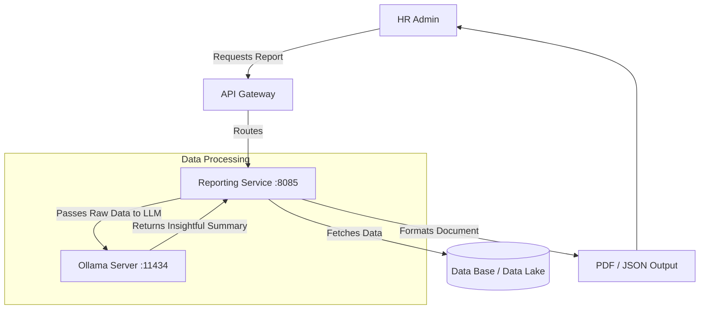

# Reporting Service

## 📌 Overview
The **Reporting Service** is an analytical engine built to aggregate data across the entire platform and generate actionable insights for HR administrators and C-level executives.

What makes this service unique is its integration with **Ollama**, allowing it to not only generate static CSV/PDF reports but also leverage local AI (`phi3` LLM) to produce narrative summaries, trends analysis, and predictive insights based on company data.

## 🏗️ Architecture & Flow



### 🔑 Key Responsibilities:
1. **Data Aggregation**: Pulling metrics regarding leave, performance, and general employee demographics.
2. **AI-Driven Analytics**: Using local instances of large language models to analyze large datasets and output human-readable summaries without sending proprietary company data to external cloud APIs like OpenAI.
3. **Format Generation**: Creating structured endpoints to consume report data.

## 💻 Technical Details

### Technologies & Dependencies
- **Spring Data JPA & Hibernate**: Database interactions.
- **MySQL Driver**: Stores analytical queries or cache results.
- **Ollama AI Integration**: Talks directly to the `phi3` endpoint for inference logic.

### Configuration Highlights (`application.properties`)
```properties
spring.application.name=reporting-service
server.port=8085

# Analytics & Local LLM Integration
ollama.base-url=http://localhost:11434
# Uses the phi3 model for text-based data summarization
ollama.model=phi3 
ollama.timeout=120000 
```

## 🚀 How to Run
**Prerequisite:** Ensure Ollama is running locally with the `phi3` model pulled.
```bash
ollama run phi3
```

**Using Maven:**
```bash
mvn spring-boot:run
```

**Using Docker:**
```bash
docker run -p 8085:8085 reporting-service:latest
```


## 🛑 Deep Dive Component Codes & Project Structure
This section contains the full, exhaustive breakdown of the microservice's source code, project structure, and dependencies. It operates as the fundamental source of truth replacing isolated snippets with the actual working code.

### 🌳 Complete Project Tree
```text
reporting-service/
├── .gitattributes
├── .gitignore
├── Dockerfile
├── hs_err_pid12196.log
├── mvnw
├── mvnw.cmd
├── pom.xml
└── src
    ├── main
    │   ├── java
    │   │   └── com
    │   │       └── revworkforce
    │   │           └── reportingservice
    │   │               ├── ReportingServiceApplication.java
    │   │               ├── config
    │   │               │   └── OllamaConfig.java
    │   │               ├── controller
    │   │               │   └── ReportGeneratorController.java
    │   │               ├── dto
    │   │               │   ├── ApiResponse.java
    │   │               │   ├── AttendanceResponse.java
    │   │               │   ├── AttendanceSummaryResponse.java
    │   │               │   ├── CheckInRequest.java
    │   │               │   ├── CheckOutRequest.java
    │   │               │   ├── DashboardResponse.java
    │   │               │   ├── EmployeeDashboardResponse.java
    │   │               │   ├── EmployeeReportResponse.java
    │   │               │   ├── LeaveReportResponse.java
    │   │               │   ├── OfficeLocationRequest.java
    │   │               │   ├── OfficeLocationResponse.java
    │   │               │   └── PerformanceReportResponse.java
    │   │               ├── exception
    │   │               │   ├── AccessDeniedException.java
    │   │               │   ├── AccountDeactivatedException.java
    │   │               │   ├── BadRequestException.java
    │   │               │   ├── DuplicateResourceException.java
    │   │               │   ├── GlobalExceptionHandler.java
    │   │               │   ├── InsufficientBalanceException.java
    │   │               │   ├── InvalidActionException.java
    │   │               │   ├── IpBlockedException.java
    │   │               │   ├── ResourceNotFoundException.java
    │   │               │   └── UnauthorizedException.java
    │   │               ├── integration
    │   │               │   └── OllamaClient.java
    │   │               ├── model
    │   │               │   ├── Attendance.java
    │   │               │   ├── Department.java
    │   │               │   ├── Designation.java
    │   │               │   ├── Employee.java
    │   │               │   ├── Goal.java
    │   │               │   ├── Holiday.java
    │   │               │   ├── LeaveApplication.java
    │   │               │   ├── LeaveBalance.java
    │   │               │   ├── LeaveType.java
    │   │               │   ├── Notification.java
    │   │               │   ├── OfficeLocation.java
    │   │               │   ├── PerformanceReview.java
    │   │               │   └── enums
    │   │               │       ├── AttendanceStatus.java
    │   │               │       ├── ExpenseCategory.java
    │   │               │       ├── ExpenseStatus.java
    │   │               │       ├── Gender.java
    │   │               │       ├── GoalPriority.java
    │   │               │       ├── GoalStatus.java
    │   │               │       ├── LeaveStatus.java
    │   │               │       ├── MessageType.java
    │   │               │       ├── NotificationType.java
    │   │               │       ├── ReviewStatus.java
    │   │               │       └── Role.java
    │   │               ├── repository
    │   │               │   ├── AttendanceRepository.java
    │   │               │   ├── DepartmentRepository.java
    │   │               │   ├── DesignationRepository.java
    │   │               │   ├── EmployeeRepository.java
    │   │               │   ├── GoalRepository.java
    │   │               │   ├── HolidayRepository.java
    │   │               │   ├── LeaveApplicationRepository.java
    │   │               │   ├── LeaveBalanceRepository.java
    │   │               │   ├── LeaveTypeRepository.java
    │   │               │   ├── NotificationRepository.java
    │   │               │   ├── OfficeLocationRepository.java
    │   │               │   └── PerformanceReviewRepository.java
    │   │               └── service
    │   │                   ├── AttendanceService.java
    │   │                   ├── DashboardService.java
    │   │                   ├── GeoAttendanceService.java
    │   │                   ├── OfficeLocationService.java
    │   │                   └── ReportGeneratorService.java
    │   └── resources
    │       └── application.properties
    └── test
        └── java
            └── com
                └── revworkforce
                    └── reportingservice
                        └── ReportingServiceApplicationTests.java
```

### 📦 Dependencies (`pom.xml`)
```xml
<?xml version="1.0" encoding="UTF-8"?>
<project xmlns="http://maven.apache.org/POM/4.0.0" xmlns:xsi="http://www.w3.org/2001/XMLSchema-instance"
         xsi:schemaLocation="http://maven.apache.org/POM/4.0.0 https://maven.apache.org/xsd/maven-4.0.0.xsd">
    <modelVersion>4.0.0</modelVersion>
    <parent>
        <groupId>org.springframework.boot</groupId>
        <artifactId>spring-boot-starter-parent</artifactId>
        <version>4.0.3</version>
        <relativePath/>
    </parent>
    <groupId>com.revworkforce</groupId>
    <artifactId>reporting-service</artifactId>
    <version>0.0.1-SNAPSHOT</version>
    <name>reporting-service</name>
    <description>HR dashboards, leave reports, employee reports, AI-powered performance reports</description>
    <properties>
        <java.version>17</java.version>
        <spring-cloud.version>2025.1.0</spring-cloud.version>
    </properties>
    <dependencies>
        <dependency><groupId>org.springframework.boot</groupId><artifactId>spring-boot-starter-actuator</artifactId></dependency>
        <dependency><groupId>org.springframework.boot</groupId><artifactId>spring-boot-starter-data-jpa</artifactId></dependency>
        <dependency><groupId>org.springframework.boot</groupId><artifactId>spring-boot-starter-validation</artifactId></dependency>
        <dependency><groupId>org.springframework.boot</groupId><artifactId>spring-boot-starter-webmvc</artifactId></dependency>
        <dependency><groupId>org.springframework.cloud</groupId><artifactId>spring-cloud-starter-config</artifactId></dependency>
        <dependency><groupId>org.springframework.cloud</groupId><artifactId>spring-cloud-starter-netflix-eureka-client</artifactId></dependency>
        <dependency><groupId>org.springframework.cloud</groupId><artifactId>spring-cloud-starter-openfeign</artifactId></dependency>
        <dependency><groupId>org.springdoc</groupId><artifactId>springdoc-openapi-starter-webmvc-ui</artifactId><version>2.8.4</version></dependency>
        <dependency><groupId>com.mysql</groupId><artifactId>mysql-connector-j</artifactId><scope>runtime</scope></dependency>
        <dependency><groupId>org.projectlombok</groupId><artifactId>lombok</artifactId><optional>true</optional></dependency>
        <dependency><groupId>org.springframework.boot</groupId><artifactId>spring-boot-starter-test</artifactId><scope>test</scope></dependency>
    </dependencies>
    <dependencyManagement>
        <dependencies>
            <dependency><groupId>org.springframework.cloud</groupId><artifactId>spring-cloud-dependencies</artifactId><version>${spring-cloud.version}</version><type>pom</type><scope>import</scope></dependency>
        </dependencies>
    </dependencyManagement>
    <build>
        <plugins>
            <plugin><groupId>org.apache.maven.plugins</groupId><artifactId>maven-compiler-plugin</artifactId>
                <configuration><annotationProcessorPaths><path><groupId>org.projectlombok</groupId><artifactId>lombok</artifactId></path></annotationProcessorPaths></configuration>
            </plugin>
            <plugin><groupId>org.springframework.boot</groupId><artifactId>spring-boot-maven-plugin</artifactId>
                <configuration><excludes><exclude><groupId>org.projectlombok</groupId><artifactId>lombok</artifactId></exclude></excludes></configuration>
            </plugin>
        </plugins>
    </build>
</project>

```

### ⚙️ Configurations (`src/main/resources`)
**`application.properties`**
```properties
spring.application.name=reporting-service
spring.config.import=optional:configserver:http://localhost:8888
eureka.client.service-url.defaultZone=http://localhost:8761/eureka/
eureka.instance.hostname=localhost
eureka.instance.prefer-ip-address=false
eureka.instance.instance-id=${spring.application.name}:${server.port}
server.port=8085

spring.datasource.url=jdbc:mysql://localhost:3306/workforce?createDatabaseIfNotExist=true
spring.datasource.username=root
spring.datasource.password=1234
spring.datasource.driver-class-name=com.mysql.cj.jdbc.Driver
spring.jpa.hibernate.ddl-auto=update
spring.jpa.show-sql=false
spring.jpa.properties.hibernate.dialect=org.hibernate.dialect.MySQLDialect

ollama.base-url=http://localhost:11434
ollama.model=phi3
ollama.timeout=120000
springdoc.api-docs.path=/v3/api-docs
springdoc.swagger-ui.path=/swagger-ui.html

```
