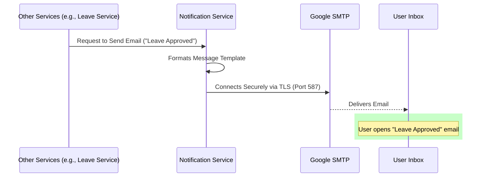

# Notification Service

## 📌 Overview
The **Notification Service** acts as the central communication hub for the entire HRMS ecosystem. Whenever another microservice needs to alert a user (e.g., about a new message, an approved leave request, a performance review submission, or an OTP for login), they dispatch a request to this service.

By centralizing the notification logic here, the system avoids duplicating mail server configurations and formatting templates across multiple applications. It also allows notifications to be queued, retried, and monitored independently.

## 🏗️ Architecture & Flow



### 🔑 Key Responsibilities:
1. **Email Delivery**: Uses standard SMTP protocols to dispatch HTML and text emails.
2. **Template Management**: Stores standard branding elements and dynamic placeholders for varying message types.
3. **Decoupled Alerts**: Listens to requests from any microservice across the platform without needing direct point-to-point hardcoding.

## 💻 Technical Details

### Technologies & Dependencies
- **Spring Boot Mail Starter**: Abstraction over JavaMailSender.
- **JavaMail**: The underlying API for SMTP interactions.
- **MySQL Driver**: Optional use for storing logs of sent/failed messages.

### Configuration Highlights (`application.properties`)
```properties
spring.application.name=notification-service
server.port=8086

# Mail Server Configuration
spring.mail.host=smtp.gmail.com
spring.mail.port=587
spring.mail.username=rkonda863@gmail.com
# Use an App Password, not a real password
spring.mail.password=zplsqhgqsbptleua 

# TLS Security Settings
spring.mail.properties.mail.smtp.auth=true
spring.mail.properties.mail.smtp.starttls.enable=true
spring.mail.properties.mail.smtp.starttls.required=true
```

## 🚀 How to Run
**Using Maven:**
```bash
mvn spring-boot:run
```

**Using Docker:**
```bash
docker run -p 8086:8086 notification-service:latest
```


## 🛑 Deep Dive Component Codes & Project Structure
This section contains the full, exhaustive breakdown of the microservice's source code, project structure, and dependencies. It operates as the fundamental source of truth replacing isolated snippets with the actual working code.

### 🌳 Complete Project Tree
```text
notification-service/
├── .gitattributes
├── .gitignore
├── Dockerfile
├── hs_err_pid22968.log
├── mvnw
├── mvnw.cmd
├── pom.xml
└── src
    ├── main
    │   ├── java
    │   │   └── com
    │   │       └── revworkforce
    │   │           └── notificationservice
    │   │               ├── NotificationServiceApplication.java
    │   │               ├── config
    │   │               │   ├── WebSocketAuthInterceptor.java
    │   │               │   ├── WebSocketConfig.java
    │   │               │   └── WebSocketEventListener.java
    │   │               ├── controller
    │   │               │   ├── NotificationController.java
    │   │               │   └── NotificationInternalController.java
    │   │               ├── dto
    │   │               │   └── ApiResponse.java
    │   │               ├── exception
    │   │               │   ├── AccessDeniedException.java
    │   │               │   ├── AccountDeactivatedException.java
    │   │               │   ├── BadRequestException.java
    │   │               │   ├── DuplicateResourceException.java
    │   │               │   ├── GlobalExceptionHandler.java
    │   │               │   ├── InsufficientBalanceException.java
    │   │               │   ├── InvalidActionException.java
    │   │               │   ├── IpBlockedException.java
    │   │               │   ├── ResourceNotFoundException.java
    │   │               │   └── UnauthorizedException.java
    │   │               ├── model
    │   │               │   ├── Department.java
    │   │               │   ├── Designation.java
    │   │               │   ├── Employee.java
    │   │               │   ├── Notification.java
    │   │               │   └── enums
    │   │               │       ├── Gender.java
    │   │               │       ├── NotificationType.java
    │   │               │       └── Role.java
    │   │               ├── repository
    │   │               │   ├── EmployeeRepository.java
    │   │               │   └── NotificationRepository.java
    │   │               └── service
    │   │                   ├── EmailService.java
    │   │                   ├── NotificationService.java
    │   │                   ├── PresenceService.java
    │   │                   └── WebSocketNotificationService.java
    │   └── resources
    │       └── application.properties
    └── test
        └── java
            └── com
                └── revworkforce
                    └── notificationservice
                        └── NotificationServiceApplicationTests.java
```

### 📦 Dependencies (`pom.xml`)
```xml
<?xml version="1.0" encoding="UTF-8"?>
<project xmlns="http://maven.apache.org/POM/4.0.0" xmlns:xsi="http://www.w3.org/2001/XMLSchema-instance"
         xsi:schemaLocation="http://maven.apache.org/POM/4.0.0 https://maven.apache.org/xsd/maven-4.0.0.xsd">
    <modelVersion>4.0.0</modelVersion>
    <parent>
        <groupId>org.springframework.boot</groupId>
        <artifactId>spring-boot-starter-parent</artifactId>
        <version>4.0.3</version>
        <relativePath/>
    </parent>
    <groupId>com.revworkforce</groupId>
    <artifactId>notification-service</artifactId>
    <version>0.0.1-SNAPSHOT</version>
    <name>notification-service</name>
    <description>Real-time notifications, email alerts, WebSocket push</description>
    <properties>
        <java.version>17</java.version>
        <spring-cloud.version>2025.1.0</spring-cloud.version>
    </properties>
    <dependencies>
        <dependency><groupId>org.springframework.boot</groupId><artifactId>spring-boot-starter-actuator</artifactId></dependency>
        <dependency><groupId>org.springframework.boot</groupId><artifactId>spring-boot-starter-data-jpa</artifactId></dependency>
        <dependency><groupId>org.springframework.boot</groupId><artifactId>spring-boot-starter-validation</artifactId></dependency>
        <dependency><groupId>org.springframework.boot</groupId><artifactId>spring-boot-starter-webmvc</artifactId></dependency>
        <dependency><groupId>org.springframework.boot</groupId><artifactId>spring-boot-starter-websocket</artifactId></dependency>
        <dependency><groupId>org.springframework.boot</groupId><artifactId>spring-boot-starter-mail</artifactId></dependency>
        <dependency><groupId>org.springframework.cloud</groupId><artifactId>spring-cloud-starter-config</artifactId></dependency>
        <dependency><groupId>org.springframework.cloud</groupId><artifactId>spring-cloud-starter-netflix-eureka-client</artifactId></dependency>
        <dependency><groupId>org.springframework.cloud</groupId><artifactId>spring-cloud-starter-openfeign</artifactId></dependency>
        <dependency><groupId>org.springdoc</groupId><artifactId>springdoc-openapi-starter-webmvc-ui</artifactId><version>2.8.4</version></dependency>
        <dependency><groupId>com.mysql</groupId><artifactId>mysql-connector-j</artifactId><scope>runtime</scope></dependency>
        <dependency><groupId>org.projectlombok</groupId><artifactId>lombok</artifactId><optional>true</optional></dependency>
        <dependency><groupId>org.springframework.boot</groupId><artifactId>spring-boot-starter-test</artifactId><scope>test</scope></dependency>
    </dependencies>
    <dependencyManagement>
        <dependencies>
            <dependency><groupId>org.springframework.cloud</groupId><artifactId>spring-cloud-dependencies</artifactId><version>${spring-cloud.version}</version><type>pom</type><scope>import</scope></dependency>
        </dependencies>
    </dependencyManagement>
    <build>
        <plugins>
            <plugin><groupId>org.apache.maven.plugins</groupId><artifactId>maven-compiler-plugin</artifactId>
                <configuration><annotationProcessorPaths><path><groupId>org.projectlombok</groupId><artifactId>lombok</artifactId></path></annotationProcessorPaths></configuration>
            </plugin>
            <plugin><groupId>org.springframework.boot</groupId><artifactId>spring-boot-maven-plugin</artifactId>
                <configuration><excludes><exclude><groupId>org.projectlombok</groupId><artifactId>lombok</artifactId></exclude></excludes></configuration>
            </plugin>
        </plugins>
    </build>
</project>

```

### ⚙️ Configurations (`src/main/resources`)
**`application.properties`**
```properties
spring.application.name=notification-service
spring.config.import=optional:configserver:http://localhost:8888
eureka.client.service-url.defaultZone=http://localhost:8761/eureka/
eureka.instance.hostname=localhost
eureka.instance.prefer-ip-address=false
eureka.instance.instance-id=${spring.application.name}:${server.port}
server.port=8086

spring.datasource.url=jdbc:mysql://localhost:3306/workforce?createDatabaseIfNotExist=true
spring.datasource.username=root
spring.datasource.password=1234
spring.datasource.driver-class-name=com.mysql.cj.jdbc.Driver
spring.jpa.hibernate.ddl-auto=update
spring.jpa.show-sql=false
spring.jpa.properties.hibernate.dialect=org.hibernate.dialect.MySQLDialect

spring.mail.host=smtp.gmail.com
spring.mail.port=587
spring.mail.username=rkonda863@gmail.com
spring.mail.password=zplsqhgqsbptleua
spring.mail.properties.mail.smtp.auth=true
spring.mail.properties.mail.smtp.starttls.enable=true
spring.mail.properties.mail.smtp.starttls.required=true
springdoc.api-docs.path=/v3/api-docs
springdoc.swagger-ui.path=/swagger-ui.html

```
