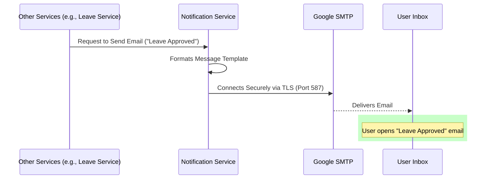

# Notification Service

## 📌 Overview
The **Notification Service** acts as the central communication hub for the entire HRMS ecosystem. Whenever another microservice needs to alert a user (e.g., about a new message, an approved leave request, a performance review submission, or an OTP for login), they dispatch a request to this service.

By centralizing the notification logic here, the system avoids duplicating mail server configurations and formatting templates across multiple applications. It also allows notifications to be queued, retried, and monitored independently.

## 🏗️ Architecture & Flow



### 🔑 Key Responsibilities:
1. **Email Delivery**: Uses standard SMTP protocols to dispatch HTML and text emails.
2. **Template Management**: Stores standard branding elements and dynamic placeholders for varying message types.
3. **Decoupled Alerts**: Listens to requests from any microservice across the platform without needing direct point-to-point hardcoding.

## 💻 Technical Details

### Technologies & Dependencies
- **Spring Boot Mail Starter**: Abstraction over JavaMailSender.
- **JavaMail**: The underlying API for SMTP interactions.
- **MySQL Driver**: Optional use for storing logs of sent/failed messages.

### Configuration Highlights (`application.properties`)
```properties
spring.application.name=notification-service
server.port=8086

# Mail Server Configuration
spring.mail.host=smtp.gmail.com
spring.mail.port=587
spring.mail.username=rkonda863@gmail.com
# Use an App Password, not a real password
spring.mail.password=zplsqhgqsbptleua 

# TLS Security Settings
spring.mail.properties.mail.smtp.auth=true
spring.mail.properties.mail.smtp.starttls.enable=true
spring.mail.properties.mail.smtp.starttls.required=true
```

## 🚀 How to Run
**Using Maven:**
```bash
mvn spring-boot:run
```

**Using Docker:**
```bash
docker run -p 8086:8086 notification-service:latest
```


## 🛑 Deep Dive Component Codes & Project Structure
This section contains the full, exhaustive breakdown of the microservice's source code, project structure, and dependencies. It operates as the fundamental source of truth replacing isolated snippets with the actual working code.

### 🌳 Complete Project Tree
```text
📦 notification-service
    📜 .gitattributes
    📜 .gitignore
    📜 Dockerfile
    📜 hs_err_pid22968.log
    📜 mvnw
    📜 mvnw.cmd
    📜 pom.xml
    📂 src
        📂 main
            📂 java
                📂 com
                    📂 revworkforce
                        📂 notificationservice
                            📜 NotificationServiceApplication.java
                            📂 config
                                📜 WebSocketAuthInterceptor.java
                                📜 WebSocketConfig.java
                                📜 WebSocketEventListener.java
                            📂 controller
                                📜 NotificationController.java
                                📜 NotificationInternalController.java
                            📂 dto
                                📜 ApiResponse.java
                            📂 exception
                                📜 AccessDeniedException.java
                                📜 AccountDeactivatedException.java
                                📜 BadRequestException.java
                                📜 DuplicateResourceException.java
                                📜 GlobalExceptionHandler.java
                                📜 InsufficientBalanceException.java
                                📜 InvalidActionException.java
                                📜 IpBlockedException.java
                                📜 ResourceNotFoundException.java
                                📜 UnauthorizedException.java
                            📂 model
                                📜 Department.java
                                📜 Designation.java
                                📜 Employee.java
                                📜 Notification.java
                                📂 enums
                                    📜 Gender.java
                                    📜 NotificationType.java
                                    📜 Role.java
                            📂 repository
                                📜 EmployeeRepository.java
                                📜 NotificationRepository.java
                            📂 service
                                📜 EmailService.java
                                📜 NotificationService.java
                                📜 PresenceService.java
                                📜 WebSocketNotificationService.java
            📂 resources
                📜 application.properties
        📂 test
            📂 java
                📂 com
                    📂 revworkforce
                        📂 notificationservice
                            📜 NotificationServiceApplicationTests.java
```

### 📦 Dependencies (`pom.xml`)
```xml
<?xml version="1.0" encoding="UTF-8"?>
<project xmlns="http://maven.apache.org/POM/4.0.0" xmlns:xsi="http://www.w3.org/2001/XMLSchema-instance"
         xsi:schemaLocation="http://maven.apache.org/POM/4.0.0 https://maven.apache.org/xsd/maven-4.0.0.xsd">
    <modelVersion>4.0.0</modelVersion>
    <parent>
        <groupId>org.springframework.boot</groupId>
        <artifactId>spring-boot-starter-parent</artifactId>
        <version>4.0.3</version>
        <relativePath/>
    </parent>
    <groupId>com.revworkforce</groupId>
    <artifactId>notification-service</artifactId>
    <version>0.0.1-SNAPSHOT</version>
    <name>notification-service</name>
    <description>Real-time notifications, email alerts, WebSocket push</description>
    <properties>
        <java.version>17</java.version>
        <spring-cloud.version>2025.1.0</spring-cloud.version>
    </properties>
    <dependencies>
        <dependency><groupId>org.springframework.boot</groupId><artifactId>spring-boot-starter-actuator</artifactId></dependency>
        <dependency><groupId>org.springframework.boot</groupId><artifactId>spring-boot-starter-data-jpa</artifactId></dependency>
        <dependency><groupId>org.springframework.boot</groupId><artifactId>spring-boot-starter-validation</artifactId></dependency>
        <dependency><groupId>org.springframework.boot</groupId><artifactId>spring-boot-starter-webmvc</artifactId></dependency>
        <dependency><groupId>org.springframework.boot</groupId><artifactId>spring-boot-starter-websocket</artifactId></dependency>
        <dependency><groupId>org.springframework.boot</groupId><artifactId>spring-boot-starter-mail</artifactId></dependency>
        <dependency><groupId>org.springframework.cloud</groupId><artifactId>spring-cloud-starter-config</artifactId></dependency>
        <dependency><groupId>org.springframework.cloud</groupId><artifactId>spring-cloud-starter-netflix-eureka-client</artifactId></dependency>
        <dependency><groupId>org.springframework.cloud</groupId><artifactId>spring-cloud-starter-openfeign</artifactId></dependency>
        <dependency><groupId>org.springdoc</groupId><artifactId>springdoc-openapi-starter-webmvc-ui</artifactId><version>2.8.4</version></dependency>
        <dependency><groupId>com.mysql</groupId><artifactId>mysql-connector-j</artifactId><scope>runtime</scope></dependency>
        <dependency><groupId>org.projectlombok</groupId><artifactId>lombok</artifactId><optional>true</optional></dependency>
        <dependency><groupId>org.springframework.boot</groupId><artifactId>spring-boot-starter-test</artifactId><scope>test</scope></dependency>
    </dependencies>
    <dependencyManagement>
        <dependencies>
            <dependency><groupId>org.springframework.cloud</groupId><artifactId>spring-cloud-dependencies</artifactId><version>${spring-cloud.version}</version><type>pom</type><scope>import</scope></dependency>
        </dependencies>
    </dependencyManagement>
    <build>
        <plugins>
            <plugin><groupId>org.apache.maven.plugins</groupId><artifactId>maven-compiler-plugin</artifactId>
                <configuration><annotationProcessorPaths><path><groupId>org.projectlombok</groupId><artifactId>lombok</artifactId></path></annotationProcessorPaths></configuration>
            </plugin>
            <plugin><groupId>org.springframework.boot</groupId><artifactId>spring-boot-maven-plugin</artifactId>
                <configuration><excludes><exclude><groupId>org.projectlombok</groupId><artifactId>lombok</artifactId></exclude></excludes></configuration>
            </plugin>
        </plugins>
    </build>
</project>

```

### ⚙️ Configurations (`src/main/resources`)
**`application.properties`**
```properties
spring.application.name=notification-service
spring.config.import=optional:configserver:http://localhost:8888
eureka.client.service-url.defaultZone=http://localhost:8761/eureka/
eureka.instance.hostname=localhost
eureka.instance.prefer-ip-address=false
eureka.instance.instance-id=${spring.application.name}:${server.port}
server.port=8086

spring.datasource.url=jdbc:mysql://localhost:3306/workforce?createDatabaseIfNotExist=true
spring.datasource.username=root
spring.datasource.password=1234
spring.datasource.driver-class-name=com.mysql.cj.jdbc.Driver
spring.jpa.hibernate.ddl-auto=update
spring.jpa.show-sql=false
spring.jpa.properties.hibernate.dialect=org.hibernate.dialect.MySQLDialect

spring.mail.host=smtp.gmail.com
spring.mail.port=587
spring.mail.username=rkonda863@gmail.com
spring.mail.password=zplsqhgqsbptleua
spring.mail.properties.mail.smtp.auth=true
spring.mail.properties.mail.smtp.starttls.enable=true
spring.mail.properties.mail.smtp.starttls.required=true
springdoc.api-docs.path=/v3/api-docs
springdoc.swagger-ui.path=/swagger-ui.html

```

### ☕ Source Code Files
#### **`src/main/java/com/revworkforce/notificationservice/NotificationServiceApplication.java`**
```java
package com.revworkforce.notificationservice;
import org.springframework.boot.SpringApplication;
import org.springframework.boot.autoconfigure.SpringBootApplication;
import org.springframework.cloud.client.discovery.EnableDiscoveryClient;
import org.springframework.cloud.openfeign.EnableFeignClients;

@SpringBootApplication
@EnableDiscoveryClient
@EnableFeignClients
public class NotificationServiceApplication {
    public static void main(String[] args) { SpringApplication.run(NotificationServiceApplication.class, args); }
}

```

#### **`src/main/java/com/revworkforce/notificationservice/config/WebSocketAuthInterceptor.java`**
```java
package com.revworkforce.notificationservice.config;

import org.springframework.messaging.Message;
import org.springframework.messaging.MessageChannel;
import org.springframework.messaging.simp.stomp.StompCommand;
import org.springframework.messaging.simp.stomp.StompHeaderAccessor;
import org.springframework.messaging.support.ChannelInterceptor;
import org.springframework.messaging.support.MessageHeaderAccessor;
import org.springframework.stereotype.Component;

import java.security.Principal;

@Component
public class WebSocketAuthInterceptor implements ChannelInterceptor {
    @Override
    public Message<?> preSend(Message<?> message, MessageChannel channel) {
        StompHeaderAccessor accessor = MessageHeaderAccessor.getAccessor(message, StompHeaderAccessor.class);

        if (accessor != null && StompCommand.CONNECT.equals(accessor.getCommand())) {
            String email = accessor.getFirstNativeHeader("X-User-Email");
            if (email != null && !email.isBlank()) {
                accessor.setUser(new SimplePrincipal(email));
            }
        }
        return message;
    }

    private record SimplePrincipal(String name) implements Principal {
        @Override
        public String getName() {
            return name;
        }
    }
}

```

#### **`src/main/java/com/revworkforce/notificationservice/config/WebSocketConfig.java`**
```java
package com.revworkforce.notificationservice.config;

import org.springframework.beans.factory.annotation.Autowired;
import org.springframework.beans.factory.annotation.Value;
import org.springframework.context.annotation.Configuration;
import org.springframework.messaging.simp.config.ChannelRegistration;
import org.springframework.messaging.simp.config.MessageBrokerRegistry;
import org.springframework.web.socket.config.annotation.EnableWebSocketMessageBroker;
import org.springframework.web.socket.config.annotation.StompEndpointRegistry;
import org.springframework.web.socket.config.annotation.WebSocketMessageBrokerConfigurer;

@Configuration
@EnableWebSocketMessageBroker
public class WebSocketConfig implements WebSocketMessageBrokerConfigurer {
    @Autowired
    private WebSocketAuthInterceptor webSocketAuthInterceptor;

    @Value("${app.cors.allowed-origins:http://localhost:4200}")
    private String allowedOrigins;

    @Override
    public void configureMessageBroker(MessageBrokerRegistry registry) {
        registry.enableSimpleBroker("/topic", "/queue");

        registry.setApplicationDestinationPrefixes("/app");

        registry.setUserDestinationPrefix("/user");
    }

    @Override
    public void registerStompEndpoints(StompEndpointRegistry registry) {
        registry.addEndpoint("/ws")
                .setAllowedOrigins(allowedOrigins.split(","));
    }

    @Override
    public void configureClientInboundChannel(ChannelRegistration registration) {
        registration.interceptors(webSocketAuthInterceptor);
    }
}

```

#### **`src/main/java/com/revworkforce/notificationservice/config/WebSocketEventListener.java`**
```java
package com.revworkforce.notificationservice.config;

import com.revworkforce.notificationservice.service.PresenceService;
import org.slf4j.Logger;
import org.slf4j.LoggerFactory;
import org.springframework.beans.factory.annotation.Autowired;
import org.springframework.context.event.EventListener;
import org.springframework.messaging.simp.SimpMessagingTemplate;
import org.springframework.stereotype.Component;
import org.springframework.web.socket.messaging.SessionConnectedEvent;
import org.springframework.web.socket.messaging.SessionDisconnectEvent;

import java.security.Principal;
import java.util.Map;

@Component
public class WebSocketEventListener {
    private static final Logger logger = LoggerFactory.getLogger(WebSocketEventListener.class);

    @Autowired
    private PresenceService presenceService;

    @Autowired
    private SimpMessagingTemplate messagingTemplate;

    @EventListener
    public void handleWebSocketConnect(SessionConnectedEvent event) {
        Principal principal = event.getUser();
        if (principal != null) {
            String email = principal.getName();
            presenceService.userConnected(email);
            logger.info("User connected via WebSocket: {}", email);
            broadcastPresence(email, true);
        }
    }

    @EventListener
    public void handleWebSocketDisconnect(SessionDisconnectEvent event) {
        Principal principal = event.getUser();
        if (principal != null) {
            String email = principal.getName();
            presenceService.userDisconnected(email);
            logger.info("User disconnected from WebSocket: {}", email);
            broadcastPresence(email, false);
        }
    }

    private void broadcastPresence(String email, boolean online) {
        Object payload = Map.of("email", email, "online", online);
        messagingTemplate.convertAndSend("/topic/presence", payload);
    }
}

```

#### **`src/main/java/com/revworkforce/notificationservice/controller/NotificationController.java`**
```java
package com.revworkforce.notificationservice.controller;
import com.revworkforce.notificationservice.dto.ApiResponse;
import com.revworkforce.notificationservice.model.Notification;
import com.revworkforce.notificationservice.service.NotificationService;
import org.springframework.beans.factory.annotation.Autowired;
import org.springframework.data.domain.Page;
import org.springframework.data.domain.PageRequest;
import org.springframework.data.domain.Pageable;
import org.springframework.http.ResponseEntity;
import org.springframework.web.bind.annotation.*;

@RestController
@RequestMapping("/api/notifications")
public class NotificationController {
    @Autowired
    private NotificationService notificationService;

    @GetMapping
    public ResponseEntity<ApiResponse> getMyNotifications(
            @RequestHeader("X-User-Email") String email,
            @RequestParam(required = false) Boolean isRead,
            @RequestParam(defaultValue = "0") int page,
            @RequestParam(defaultValue = "20") int size) {
        Pageable pageable = PageRequest.of(page, size);
        Page<Notification> notifications = notificationService.getMyNotifications(email, isRead, pageable);
        return ResponseEntity.ok(new ApiResponse(true, "Notifications fetched successfully", notifications));
    }

    @GetMapping("/unread-count")
    public ResponseEntity<ApiResponse> getUnreadCount(@RequestHeader("X-User-Email") String email) {
        long count = notificationService.getUnreadCount(email);
        return ResponseEntity.ok(new ApiResponse(true, "Unread count fetched successfully", count));
    }

    @PatchMapping("/{notificationId}/read")
    public ResponseEntity<ApiResponse> markAsRead(
            @PathVariable Integer notificationId,
            @RequestHeader("X-User-Email") String email) {
        Notification notification = notificationService.markAsRead(email, notificationId);
        return ResponseEntity.ok(new ApiResponse(true, "Notification marked as read", notification));
    }

    @PatchMapping("/read-all")
    public ResponseEntity<ApiResponse> markAllAsRead(@RequestHeader("X-User-Email") String email) {
        int count = notificationService.markAllAsRead(email);
        return ResponseEntity.ok(new ApiResponse(true, count + " notification(s) marked as read"));
    }
}

```

#### **`src/main/java/com/revworkforce/notificationservice/controller/NotificationInternalController.java`**
```java
package com.revworkforce.notificationservice.controller;
import com.revworkforce.notificationservice.dto.ApiResponse;
import com.revworkforce.notificationservice.model.Employee;
import com.revworkforce.notificationservice.model.enums.NotificationType;
import com.revworkforce.notificationservice.service.NotificationService;
import com.revworkforce.notificationservice.repository.EmployeeRepository;
import org.springframework.beans.factory.annotation.Autowired;
import org.springframework.http.ResponseEntity;
import org.springframework.web.bind.annotation.*;
import java.util.Map;

@RestController
@RequestMapping("/api/notifications")
public class NotificationInternalController {
    @Autowired private NotificationService notificationService;
    @Autowired private EmployeeRepository employeeRepository;

    @PostMapping("/send")
    public ResponseEntity<ApiResponse> sendNotification(@RequestBody Map<String, Object> request) {
        Integer recipientId = (Integer) request.get("recipientId");
        String title = (String) request.get("title");
        String message = (String) request.get("message");
        String type = (String) request.get("type");
        Integer referenceId = request.get("referenceId") != null ? (Integer) request.get("referenceId") : null;
        String referenceType = (String) request.get("referenceType");

        Employee recipient = employeeRepository.findById(recipientId).orElse(null);
        if (recipient != null) {
            notificationService.sendNotification(recipient, title, message,
                NotificationType.valueOf(type), referenceId, referenceType);
        }
        return ResponseEntity.ok(new ApiResponse(true, "Notification sent"));
    }
}

```

#### **`src/main/java/com/revworkforce/notificationservice/dto/ApiResponse.java`**
```java
package com.revworkforce.notificationservice.dto;
import lombok.AllArgsConstructor;
import lombok.Data;
import lombok.NoArgsConstructor;

@Data
@NoArgsConstructor
@AllArgsConstructor
public class ApiResponse {
    private boolean success;
    private String message;
    private Object data;

    public ApiResponse(boolean success, String message) {
        this.success = success;
        this.message = message;
        this.data = null;
    }
}

```

#### **`src/main/java/com/revworkforce/notificationservice/exception/AccessDeniedException.java`**
```java
package com.revworkforce.notificationservice.exception;

public class AccessDeniedException extends RuntimeException {
    public AccessDeniedException(String message) {
        super(message);
    }
}

```

#### **`src/main/java/com/revworkforce/notificationservice/exception/AccountDeactivatedException.java`**
```java
package com.revworkforce.notificationservice.exception;

public class AccountDeactivatedException extends RuntimeException {
    public AccountDeactivatedException(String message) {
        super(message);
    }

    public AccountDeactivatedException(String employeeCode, String reason) {
        super(String.format("Account '%s' is deactivated. %s", employeeCode, reason));
    }
}

```

#### **`src/main/java/com/revworkforce/notificationservice/exception/BadRequestException.java`**
```java
package com.revworkforce.notificationservice.exception;

public class BadRequestException extends RuntimeException {
    public BadRequestException(String message) {
        super(message);
    }
}

```

#### **`src/main/java/com/revworkforce/notificationservice/exception/DuplicateResourceException.java`**
```java
package com.revworkforce.notificationservice.exception;

public class DuplicateResourceException extends RuntimeException {
    public DuplicateResourceException(String message) {
        super(message);
    }

    public DuplicateResourceException(String resourceName, String fieldName, Object fieldValue) {
        super(String.format("%s already exists with %s: '%s'", resourceName, fieldName, fieldValue));
    }
}

```

#### **`src/main/java/com/revworkforce/notificationservice/exception/GlobalExceptionHandler.java`**
```java
package com.revworkforce.notificationservice.exception;

import com.revworkforce.notificationservice.dto.ApiResponse;
import org.springframework.http.HttpStatus;
import org.springframework.http.ResponseEntity;
import org.springframework.validation.FieldError;
import org.springframework.web.bind.MethodArgumentNotValidException;
import org.springframework.web.bind.annotation.ExceptionHandler;
import org.springframework.web.bind.annotation.RestControllerAdvice;
import org.springframework.web.method.annotation.MethodArgumentTypeMismatchException;
import org.springframework.web.servlet.resource.NoResourceFoundException;

import java.util.HashMap;
import java.util.Map;

@RestControllerAdvice
public class GlobalExceptionHandler {
    @ExceptionHandler(ResourceNotFoundException.class)
    public ResponseEntity<ApiResponse> handleResourceNotFound(ResourceNotFoundException ex) {
        return ResponseEntity.status(HttpStatus.NOT_FOUND)
                .body(new ApiResponse(false, ex.getMessage()));
    }

    @ExceptionHandler(BadRequestException.class)
    public ResponseEntity<ApiResponse> handleBadRequest(BadRequestException ex) {
        return ResponseEntity.status(HttpStatus.BAD_REQUEST)
                .body(new ApiResponse(false, ex.getMessage()));
    }

    @ExceptionHandler(DuplicateResourceException.class)
    public ResponseEntity<ApiResponse> handleDuplicateResource(DuplicateResourceException ex) {
        return ResponseEntity.status(HttpStatus.CONFLICT)
                .body(new ApiResponse(false, ex.getMessage()));
    }

    @ExceptionHandler(InsufficientBalanceException.class)
    public ResponseEntity<ApiResponse> handleInsufficientBalance(InsufficientBalanceException ex) {
        return ResponseEntity.status(HttpStatus.BAD_REQUEST)
                .body(new ApiResponse(false, ex.getMessage()));
    }

    @ExceptionHandler(UnauthorizedException.class)
    public ResponseEntity<ApiResponse> handleUnauthorized(UnauthorizedException ex) {
        return ResponseEntity.status(HttpStatus.UNAUTHORIZED)
                .body(new ApiResponse(false, ex.getMessage()));
    }

    @ExceptionHandler(AccessDeniedException.class)
    public ResponseEntity<ApiResponse> handleAccessDenied(AccessDeniedException ex) {
        return ResponseEntity.status(HttpStatus.FORBIDDEN)
                .body(new ApiResponse(false, ex.getMessage()));
    }

    @ExceptionHandler(InvalidActionException.class)
    public ResponseEntity<ApiResponse> handleInvalidAction(InvalidActionException ex) {
        return ResponseEntity.status(HttpStatus.BAD_REQUEST)
                .body(new ApiResponse(false, ex.getMessage()));
    }

    @ExceptionHandler(AccountDeactivatedException.class)
    public ResponseEntity<ApiResponse> handleAccountDeactivated(AccountDeactivatedException ex) {
        return ResponseEntity.status(HttpStatus.FORBIDDEN)
                .body(new ApiResponse(false, ex.getMessage()));
    }

    @ExceptionHandler(IpBlockedException.class)
    public ResponseEntity<ApiResponse> handleIpBlocked(IpBlockedException ex) {
        return ResponseEntity.status(HttpStatus.FORBIDDEN)
                .body(new ApiResponse(false, ex.getMessage()));
    }

    @ExceptionHandler(MethodArgumentNotValidException.class)
    public ResponseEntity<ApiResponse> handleValidationErrors(MethodArgumentNotValidException ex) {
        Map<String, String> errors = new HashMap<>();
        for (FieldError fieldError : ex.getBindingResult().getFieldErrors()) {
            errors.put(fieldError.getField(), fieldError.getDefaultMessage());
        }
        return ResponseEntity.status(HttpStatus.BAD_REQUEST)
                .body(new ApiResponse(false, "Validation failed", errors));
    }

    @ExceptionHandler(MethodArgumentTypeMismatchException.class)
    public ResponseEntity<ApiResponse> handleTypeMismatch(MethodArgumentTypeMismatchException ex) {
        String message = String.format("Invalid value '%s' for parameter '%s'. Expected type: %s",
                ex.getValue(), ex.getName(),
                ex.getRequiredType() != null ? ex.getRequiredType().getSimpleName() : "unknown");
        return ResponseEntity.status(HttpStatus.BAD_REQUEST)
                .body(new ApiResponse(false, message));
    }

    @ExceptionHandler(NoResourceFoundException.class)
    public ResponseEntity<ApiResponse> handleNoResourceFound(NoResourceFoundException ex) {
        return ResponseEntity.status(HttpStatus.NOT_FOUND)
                .body(new ApiResponse(false, "The requested resource was not found"));
    }

    @ExceptionHandler(IllegalArgumentException.class)
    public ResponseEntity<ApiResponse> handleIllegalArgument(IllegalArgumentException ex) {
        return ResponseEntity.status(HttpStatus.BAD_REQUEST)
                .body(new ApiResponse(false, ex.getMessage()));
    }

    @ExceptionHandler(Exception.class)
    public ResponseEntity<ApiResponse> handleGenericException(Exception ex) {
        return ResponseEntity.status(HttpStatus.INTERNAL_SERVER_ERROR)
                .body(new ApiResponse(false, "An unexpected error occurred: " + ex.getMessage()));
    }
}

```

#### **`src/main/java/com/revworkforce/notificationservice/exception/InsufficientBalanceException.java`**
```java
package com.revworkforce.notificationservice.exception;

public class InsufficientBalanceException extends RuntimeException {
    public InsufficientBalanceException(String message) {
        super(message);
    }

    public InsufficientBalanceException(int available, int requested) {
        super(String.format("Insufficient leave balance. Available: %d, Requested: %d", available, requested));
    }
}

```

#### **`src/main/java/com/revworkforce/notificationservice/exception/InvalidActionException.java`**
```java
package com.revworkforce.notificationservice.exception;

public class InvalidActionException extends RuntimeException {
    public InvalidActionException(String message) {
        super(message);
    }

    public InvalidActionException(String action, String allowedActions) {
        super(String.format("Invalid action '%s'. Allowed actions: %s", action, allowedActions));
    }
}

```

#### **`src/main/java/com/revworkforce/notificationservice/exception/IpBlockedException.java`**
```java
package com.revworkforce.notificationservice.exception;

public class IpBlockedException extends RuntimeException {
    public IpBlockedException(String message) {
        super(message);
    }
}

```

#### **`src/main/java/com/revworkforce/notificationservice/exception/ResourceNotFoundException.java`**
```java
package com.revworkforce.notificationservice.exception;

public class ResourceNotFoundException extends RuntimeException {
    public ResourceNotFoundException(String message) {
        super(message);
    }

    public ResourceNotFoundException(String resourceName, String fieldName, Object fieldValue) {
        super(String.format("%s not found with %s: '%s'", resourceName, fieldName, fieldValue));
    }
}

```

#### **`src/main/java/com/revworkforce/notificationservice/exception/UnauthorizedException.java`**
```java
package com.revworkforce.notificationservice.exception;

public class UnauthorizedException extends RuntimeException {
    public UnauthorizedException(String message) {
        super(message);
    }
}

```

#### **`src/main/java/com/revworkforce/notificationservice/model/Department.java`**
```java
package com.revworkforce.notificationservice.model;
import jakarta.persistence.*;
import lombok.*;
import org.hibernate.annotations.CreationTimestamp;
import org.hibernate.annotations.UpdateTimestamp;
import java.time.LocalDateTime;

@Entity
@Table(name = "department")
@Data
@NoArgsConstructor
@AllArgsConstructor
@Builder
public class Department {
    @Id
    @GeneratedValue(strategy = GenerationType.IDENTITY)
    @Column(name = "department_id")
    private Integer departmentId;
    @Column(name = "department_name", nullable = false, unique = true, length = 100)
    private String departmentName;
    @Column(columnDefinition = "TEXT")
    private String description;
    @Column(name = "is_active")
    @Builder.Default
    private Boolean isActive = true;
    @CreationTimestamp
    @Column(name="created_at", updatable = false)
    private LocalDateTime createdAt;
    @UpdateTimestamp
    @Column(name = "updated_at")
    private LocalDateTime updatedAt;
}

```

#### **`src/main/java/com/revworkforce/notificationservice/model/Designation.java`**
```java
package com.revworkforce.notificationservice.model;
import jakarta.persistence.*;
import lombok.*;
import org.hibernate.annotations.CreationTimestamp;
import org.hibernate.annotations.UpdateTimestamp;
import java.time.LocalDateTime;

@Entity
@Table(name="designation")
@Data
@NoArgsConstructor
@AllArgsConstructor
@Builder
public class Designation {
    @Id
    @GeneratedValue(strategy = GenerationType.IDENTITY)
    @Column(name = "designation_id")
    private Integer designationId;
    @Column(name = "designation_name", nullable = false, unique = true, length = 100)
    private String designationName;
    @Column(columnDefinition = "TEXT")
    private String description;
    @Column(name = "is_active")
    @Builder.Default
    private Boolean isActive = true;
    @CreationTimestamp
    @Column(name = "created_at", updatable = false)
    private LocalDateTime createdAt;
    @UpdateTimestamp
    @Column(name = "updated_at")
    private LocalDateTime updatedAt;
}

```

#### **`src/main/java/com/revworkforce/notificationservice/model/Employee.java`**
```java
package com.revworkforce.notificationservice.model;
import com.fasterxml.jackson.annotation.JsonIgnore;
import com.fasterxml.jackson.annotation.JsonIgnoreProperties;
import jakarta.persistence.*;
import lombok.*;
import com.revworkforce.notificationservice.model.enums.Gender;
import com.revworkforce.notificationservice.model.enums.Role;
import org.hibernate.annotations.CreationTimestamp;
import org.hibernate.annotations.UpdateTimestamp;
import java.math.BigDecimal;
import java.time.LocalDateTime;
import java.time.LocalDate;

@Entity
@Table(name = "employee", indexes = {
        @Index(name ="idx_emp_email", columnList = "email"),
        @Index(name = "idx_emp_name", columnList = "first_name, last_name"),
        @Index(name = "idx_emp_dept", columnList = "department_id"),
        @Index(name = "idx_emp_manager", columnList = "manager_code"),
        @Index(name = "idx_emp_role", columnList = "role")
})
@Getter
@Setter
@NoArgsConstructor
@AllArgsConstructor
@Builder
@ToString(exclude = {"manager", "department", "designation"})
@EqualsAndHashCode(onlyExplicitlyIncluded = true)
public class Employee {
    @Id
    @GeneratedValue(strategy = GenerationType.IDENTITY)
    @Column(name = "employee_id")
    @EqualsAndHashCode.Include
    private Integer employeeId;
    @Column(name = "employee_code", nullable = false, unique = true, length = 20)
    private String employeeCode;
    @Column(name = "first_name", nullable = false, length = 100)
    private String firstName;
    @Column(name = "last_name", nullable = false, length = 100)
    private String lastName;
    @Column(nullable = false, unique = true, length = 255)
    private String email;
    @JsonIgnore
    @Column(name = "password_hash", nullable = false, length = 255)
    private String passwordHash;
    @Column(length = 20)
    private String phone;
    @Column(name = "date_of_birth")
    private LocalDate dateOfBirth;
    @Enumerated(EnumType.STRING)
    @Column(length = 10)
    private Gender gender;
    @Column(columnDefinition = "TEXT")
    private String address;
    @Column(name = "emergency_contact_name", length = 100)
    private String emergencyContactName;
    @Column(name = "emergency_contact_phone", length = 20)
    private String emergencyContactPhone;
    @ManyToOne(fetch = FetchType.EAGER)
    @JoinColumn(name = "department_id")
    @JsonIgnoreProperties({"hibernateLazyInitializer", "handler"})
    private Department department;
    @ManyToOne(fetch = FetchType.EAGER)
    @JoinColumn(name = "designation_id")
    @JsonIgnoreProperties({"hibernateLazyInitializer", "handler"})
    private Designation designation;
    @Column(name = "joining_date", nullable = false)
    private LocalDate joiningDate;
    @Column(precision = 12, scale = 2)
    private BigDecimal salary;
    @ManyToOne(fetch = FetchType.EAGER)
    @JoinColumn(name = "manager_code", referencedColumnName = "employee_code")
    @JsonIgnoreProperties({"hibernateLazyInitializer", "handler", "manager"})
    private Employee manager;
    @Enumerated(EnumType.STRING)
    @Column(nullable = false, length = 10)
    @Builder.Default
    private Role role = Role.EMPLOYEE;
    @Column(name = "is_active")
    @Builder.Default
    private Boolean isActive = true;
    @Column(name = "two_factor_enabled")
    @Builder.Default
    private Boolean twoFactorEnabled = false;
    @CreationTimestamp
    @Column(name = "created_at", updatable = false)
    private LocalDateTime createdAt;
    @UpdateTimestamp
    @Column(name = "updated_at")
    private LocalDateTime updatedAt;
}

```

#### **`src/main/java/com/revworkforce/notificationservice/model/Notification.java`**
```java
package com.revworkforce.notificationservice.model;
import com.fasterxml.jackson.annotation.JsonIgnoreProperties;
import jakarta.persistence.*;
import lombok.*;
import com.revworkforce.notificationservice.model.enums.NotificationType;
import org.hibernate.annotations.CreationTimestamp;
import java.time.LocalDateTime;

@Entity
@Table(name = "notification", indexes = {
        @Index(name = "idx_notif_recipient", columnList = "recipient_id"),
        @Index(name = "idx_notif_read", columnList = "is_read")
})
@Getter
@Setter
@NoArgsConstructor
@AllArgsConstructor
@Builder
@ToString(exclude = {"recipient"})
@EqualsAndHashCode(onlyExplicitlyIncluded = true)
public class Notification {
    @Id
    @GeneratedValue(strategy = GenerationType.IDENTITY)
    @Column(name = "notification_id")
    @EqualsAndHashCode.Include
    private Integer notificationId;
    @ManyToOne(fetch = FetchType.EAGER)
    @JoinColumn(name = "recipient_id", nullable = false)
    @JsonIgnoreProperties({"hibernateLazyInitializer", "handler"})
    private Employee recipient;
    @Column(nullable = false, length = 200)
    private String title;
    @Column(nullable = false, columnDefinition = "TEXT")
    private String message;
    @Enumerated(EnumType.STRING)
    @Column(nullable = false, length = 20)
    private NotificationType type;
    @Column(name = "is_read")
    @Builder.Default
    private Boolean isRead = false;
    @Column(name = "reference_id")
    private Integer referenceId;
    @Column(name = "reference_type", length = 50)
    private String referenceType;
    @CreationTimestamp
    @Column(name = "created_at", updatable = false)
    private LocalDateTime createdAt;
}

```

#### **`src/main/java/com/revworkforce/notificationservice/model/enums/Gender.java`**
```java
package com.revworkforce.notificationservice.model.enums;

public enum Gender {
    MALE,
    FEMALE,
    OTHER
}

```

#### **`src/main/java/com/revworkforce/notificationservice/model/enums/NotificationType.java`**
```java
package com.revworkforce.notificationservice.model.enums;

public enum NotificationType {
    LEAVE_APPLIED,
    LEAVE_APPROVED,
    LEAVE_REJECTED,
    LEAVE_CANCELLED,
    REVIEW_SUBMITTED,
    REVIEW_FEEDBACK,
    GOAL_UPDATED,
    GOAL_COMMENT,
    ANNOUNCEMENT,
    CHAT_MESSAGE,
    EXPENSE_SUBMITTED,
    EXPENSE_APPROVED,
    EXPENSE_REJECTED,
    EXPENSE_REIMBURSED,
    GENERAL
}

```

#### **`src/main/java/com/revworkforce/notificationservice/model/enums/Role.java`**
```java
package com.revworkforce.notificationservice.model.enums;

public enum Role {
    EMPLOYEE,
    MANAGER,
    ADMIN
}

```

#### **`src/main/java/com/revworkforce/notificationservice/repository/EmployeeRepository.java`**
```java
package com.revworkforce.notificationservice.repository;
import com.revworkforce.notificationservice.model.Employee;
import com.revworkforce.notificationservice.model.enums.Role;
import org.springframework.data.jpa.repository.JpaRepository;
import org.springframework.data.jpa.repository.Query;
import org.springframework.data.repository.query.Param;
import org.springframework.stereotype.Repository;
import org.springframework.data.domain.Page;
import org.springframework.data.domain.Pageable;
import java.util.List;
import java.util.Optional;

@Repository
public interface EmployeeRepository extends JpaRepository<Employee, Integer> {
    Optional<Employee> findByEmail(String email);
    Optional<Employee> findByEmployeeCode(String employeeCode);
    boolean existsByEmail(String email);
    boolean existsByEmployeeCode(String employeeCode);
    boolean existsByRole(Role role);
    @Query(value = "SELECT employee_code FROM employee WHERE employee_code LIKE CONCAT(:prefix, '%') ORDER BY employee_code DESC LIMIT 1", nativeQuery = true)
    Optional<String> findLatestEmployeeCodeByPrefix(@Param("prefix") String prefix);
    Page<Employee> findByIsActive(Boolean isActive, Pageable pageable);
    Page<Employee> findByRole(Role role, Pageable pageable);
    Page<Employee> findByDepartment_DepartmentId(Integer departmentId, Pageable pageable);
    @Query("SELECT e FROM Employee e WHERE LOWER(e.firstName) LIKE LOWER(CONCAT('%', :keyword, '%')) OR LOWER(e.lastName) LIKE LOWER(CONCAT('%', :keyword, '%')) OR LOWER(e.email) LIKE LOWER(CONCAT('%', :keyword, '%')) OR LOWER(e.employeeCode) LIKE LOWER(CONCAT('%', :keyword, '%'))")
    Page<Employee> searchByKeyword(@Param("keyword") String keyword, Pageable pageable);
    Page<Employee> findByManager_EmployeeCode(String employeeCode, Pageable pageable);
    List<Employee> findByManager_EmployeeCode(String employeeCode);
    long countByIsActive(Boolean isActive);
    long countByRole(Role role);
    long countByRoleAndIsActive(Role role, Boolean isActive);
    @Query("SELECT e.department.departmentName, COUNT(e) FROM Employee e WHERE e.department IS NOT NULL AND e.isActive = true GROUP BY e.department.departmentName")
    List<Object[]> countActiveByDepartment();
    long countByDepartment_DepartmentId(Integer departmentId);

    @Query("SELECT FUNCTION('YEAR', e.joiningDate), FUNCTION('MONTH', e.joiningDate), COUNT(e) FROM Employee e WHERE e.isActive = true GROUP BY FUNCTION('YEAR', e.joiningDate), FUNCTION('MONTH', e.joiningDate) ORDER BY FUNCTION('YEAR', e.joiningDate) DESC, FUNCTION('MONTH', e.joiningDate) DESC")
    List<Object[]> getJoiningTrends();

    @Query("SELECT e.role, COUNT(e) FROM Employee e WHERE e.isActive = true GROUP BY e.role")
    List<Object[]> countActiveByRole();

    List<Employee> findByRoleAndIsActive(Role role, Boolean isActive);
}

```

#### **`src/main/java/com/revworkforce/notificationservice/repository/NotificationRepository.java`**
```java
package com.revworkforce.notificationservice.repository;
import com.revworkforce.notificationservice.model.Notification;
import com.revworkforce.notificationservice.model.enums.NotificationType;
import org.springframework.data.domain.Page;
import org.springframework.data.domain.Pageable;
import org.springframework.data.jpa.repository.JpaRepository;
import org.springframework.data.jpa.repository.Modifying;
import org.springframework.data.jpa.repository.Query;
import org.springframework.data.repository.query.Param;
import org.springframework.stereotype.Repository;

@Repository
public interface NotificationRepository extends JpaRepository<Notification, Integer> {
    Page<Notification> findByRecipient_EmployeeIdOrderByCreatedAtDesc(Integer employeeId, Pageable pageable);
    Page<Notification> findByRecipient_EmployeeIdAndIsReadOrderByCreatedAtDesc(Integer employeeId, Boolean isRead, Pageable pageable);
    long countByRecipient_EmployeeIdAndIsRead(Integer employeeId, Boolean isRead);
    @Modifying
    @Query("UPDATE Notification n SET n.isRead = true WHERE n.recipient.employeeId = :employeeId AND n.isRead = false")
    int markAllAsRead(@Param("employeeId") Integer employeeId);
    Page<Notification> findByRecipient_EmployeeIdAndTypeOrderByCreatedAtDesc(Integer employeeId, NotificationType type, Pageable pageable);
}

```

#### **`src/main/java/com/revworkforce/notificationservice/service/EmailService.java`**
```java
package com.revworkforce.notificationservice.service;

import jakarta.mail.MessagingException;
import jakarta.mail.internet.MimeMessage;
import org.slf4j.Logger;
import org.slf4j.LoggerFactory;
import org.springframework.beans.factory.annotation.Autowired;
import org.springframework.beans.factory.annotation.Value;
import org.springframework.mail.javamail.JavaMailSender;
import org.springframework.mail.javamail.MimeMessageHelper;
import org.springframework.scheduling.annotation.Async;
import org.springframework.stereotype.Service;

@Service
public class EmailService {
    private static final Logger log = LoggerFactory.getLogger(EmailService.class);

    @Autowired
    private JavaMailSender mailSender;

    @Value("${spring.mail.username}")
    private String fromEmail;

    @Value("${otp.expiry-minutes:5}")
    private int otpExpiryMinutes;

    @Async
    public void sendOtpEmail(String toEmail, String employeeName, String otp) {
        try {
            MimeMessage message = mailSender.createMimeMessage();
            MimeMessageHelper helper = new MimeMessageHelper(message, true, "UTF-8");

            helper.setFrom(fromEmail);
            helper.setTo(toEmail);
            helper.setSubject("WorkForce HRMS — Your Login Verification Code");
            helper.setText(buildOtpEmailTemplate(employeeName, otp), true);

            mailSender.send(message);
            log.info("OTP email sent successfully to: {}", toEmail);
        } catch (MessagingException e) {
            log.error("Failed to send OTP email to {}: {}", toEmail, e.getMessage());
            throw new RuntimeException("Failed to send OTP email. Please try again.");
        }
    }

    @Async
    public void sendWelcomeEmail(String toEmail, String employeeName, String employeeCode,
                                  String password, String role) {
        try {
            MimeMessage message = mailSender.createMimeMessage();
            MimeMessageHelper helper = new MimeMessageHelper(message, true, "UTF-8");

            helper.setFrom(fromEmail);
            helper.setTo(toEmail);
            helper.setSubject("Welcome to WorkForce HRMS — Your Account is Ready!");
            helper.setText(buildWelcomeEmailTemplate(employeeName, employeeCode, toEmail, password, role), true);

            mailSender.send(message);
            log.info("Welcome email sent successfully to: {}", toEmail);
        } catch (MessagingException e) {
            log.error("Failed to send welcome email to {}: {}", toEmail, e.getMessage());
        }
    }

    private String buildWelcomeEmailTemplate(String employeeName, String employeeCode,
                                              String email, String password, String role) {
        String roleBadgeColor;
        switch (role.toUpperCase()) {
            case "ADMIN":   roleBadgeColor = "#8b5cf6"; break;
            case "MANAGER": roleBadgeColor = "#3b82f6"; break;
            default:        roleBadgeColor = "#10b981"; break;
        }

        return "<!DOCTYPE html>" +
            "<html><head><meta charset=\"UTF-8\"></head>" +
            "<body style=\"margin:0;padding:0;background-color:#f8fafc;font-family:'Segoe UI',Roboto,Helvetica,Arial,sans-serif;\">" +
            "<table width=\"100%\" cellpadding=\"0\" cellspacing=\"0\" style=\"background-color:#f8fafc;padding:40px 0;\">" +
            "<tr><td align=\"center\">" +
            "<table width=\"520\" cellpadding=\"0\" cellspacing=\"0\" style=\"background-color:#ffffff;border-radius:16px;overflow:hidden;box-shadow:0 4px 6px rgba(0,0,0,0.07);\">" +

            "<tr><td style=\"background:linear-gradient(135deg,#1e3a5f 0%,#2563eb 100%);padding:36px 40px;text-align:center;\">" +
            "<h1 style=\"margin:0;font-size:28px;font-weight:700;color:#ffffff;letter-spacing:0.5px;\">WorkForce</h1>" +
            "<p style=\"margin:4px 0 0;font-size:12px;color:#93c5fd;letter-spacing:2px;text-transform:uppercase;\">HRMS Portal</p>" +
            "</td></tr>" +

            "<tr><td style=\"padding:40px 40px 0;text-align:center;\">" +
            "<div style=\"width:64px;height:64px;margin:0 auto 20px;border-radius:50%;background:linear-gradient(135deg,#dbeafe,#eff6ff);display:flex;align-items:center;justify-content:center;\">" +
            "<span style=\"font-size:32px;\">&#127881;</span>" +
            "</div>" +
            "<h2 style=\"margin:0 0 8px;font-size:22px;font-weight:700;color:#1e293b;\">Welcome aboard, " + employeeName + "!</h2>" +
            "<p style=\"margin:0 0 28px;font-size:14px;color:#64748b;line-height:1.6;\">" +
            "Your WorkForce HRMS account has been created. Below are your login credentials to get started.</p>" +
            "</td></tr>" +

            "<tr><td style=\"padding:0 40px;\">" +
            "<table width=\"100%\" cellpadding=\"0\" cellspacing=\"0\" style=\"background:#f8fafc;border:1px solid #e2e8f0;border-radius:12px;overflow:hidden;\">" +
            "<tr><td style=\"padding:20px 24px;border-bottom:1px solid #e2e8f0;\">" +
            "<table width=\"100%\"><tr>" +
            "<td style=\"font-size:13px;color:#64748b;font-weight:500;\">Employee Code</td>" +
            "<td style=\"font-size:14px;color:#1e293b;font-weight:700;text-align:right;font-family:monospace;letter-spacing:1px;\">" + employeeCode + "</td>" +
            "</tr></table></td></tr>" +
            "<tr><td style=\"padding:20px 24px;border-bottom:1px solid #e2e8f0;\">" +
            "<table width=\"100%\"><tr>" +
            "<td style=\"font-size:13px;color:#64748b;font-weight:500;\">Email</td>" +
            "<td style=\"font-size:14px;color:#1e293b;font-weight:600;text-align:right;\">" + email + "</td>" +
            "</tr></table></td></tr>" +
            "<tr><td style=\"padding:20px 24px;border-bottom:1px solid #e2e8f0;\">" +
            "<table width=\"100%\"><tr>" +
            "<td style=\"font-size:13px;color:#64748b;font-weight:500;\">Password</td>" +
            "<td style=\"font-size:14px;color:#1e293b;font-weight:700;text-align:right;font-family:monospace;letter-spacing:1px;\">" + password + "</td>" +
            "</tr></table></td></tr>" +
            "<tr><td style=\"padding:20px 24px;\">" +
            "<table width=\"100%\"><tr>" +
            "<td style=\"font-size:13px;color:#64748b;font-weight:500;\">Role</td>" +
            "<td style=\"text-align:right;\">" +
            "<span style=\"display:inline-block;padding:4px 14px;border-radius:20px;font-size:12px;font-weight:700;" +
            "color:#ffffff;background-color:" + roleBadgeColor + ";letter-spacing:0.5px;\">" + role.toUpperCase() + "</span>" +
            "</td></tr></table></td></tr>" +
            "</table></td></tr>" +

            "<tr><td style=\"padding:24px 40px 0;\">" +
            "<div style=\"padding:16px 20px;background-color:#fef3c7;border-left:4px solid #f59e0b;border-radius:0 8px 8px 0;\">" +
            "<p style=\"margin:0;font-size:13px;color:#92400e;line-height:1.5;\">" +
            "<strong>&#128274; Security Tip:</strong> Please change your password after your first login to keep your account secure.</p>" +
            "</div></td></tr>" +

            "<tr><td style=\"padding:24px 40px 0;\">" +
            "<p style=\"margin:0 0 12px;font-size:14px;font-weight:600;color:#1e293b;\">What you can do on WorkForce:</p>" +
            "<table cellpadding=\"0\" cellspacing=\"0\" width=\"100%\">" +
            "<tr><td style=\"padding:6px 0;font-size:13px;color:#475569;\">&#128197; &nbsp;Mark attendance &amp; track hours</td></tr>" +
            "<tr><td style=\"padding:6px 0;font-size:13px;color:#475569;\">&#128221; &nbsp;Apply for leaves &amp; view balance</td></tr>" +
            "<tr><td style=\"padding:6px 0;font-size:13px;color:#475569;\">&#127919; &nbsp;Set goals &amp; track performance</td></tr>" +
            "<tr><td style=\"padding:6px 0;font-size:13px;color:#475569;\">&#128276; &nbsp;Get real-time notifications</td></tr>" +
            "<tr><td style=\"padding:6px 0;font-size:13px;color:#475569;\">&#129302; &nbsp;Chat with AI assistant for quick help</td></tr>" +
            "</table></td></tr>" +

            "<tr><td style=\"padding:32px 40px;\">" +
            "<div style=\"border-top:1px solid #e2e8f0;padding-top:24px;text-align:center;\">" +
            "<p style=\"margin:0;font-size:12px;color:#94a3b8;\">This is an automated message from WorkForce HRMS. Please do not reply.</p>" +
            "<p style=\"margin:8px 0 0;font-size:11px;color:#cbd5e1;\">&copy; 2026 WorkForce HRMS. All rights reserved.</p>" +
            "</div></td></tr>" +

            "</table></td></tr></table></body></html>";
    }

    private String buildOtpEmailTemplate(String employeeName, String otp) {
        StringBuilder otpBoxes = new StringBuilder();
        for (char digit : otp.toCharArray()) {
            otpBoxes.append(
                "<td style=\"width:48px;height:56px;text-align:center;font-size:28px;font-weight:700;" +
                "color:#1e293b;background-color:#f1f5f9;border:2px solid #e2e8f0;border-radius:12px;" +
                "font-family:'Segoe UI',Roboto,sans-serif;letter-spacing:2px;\">"
                + digit + "</td><td style=\"width:8px;\"></td>"
            );
        }

        return "<!DOCTYPE html>" +
            "<html><head><meta charset=\"UTF-8\"></head>" +
            "<body style=\"margin:0;padding:0;background-color:#f8fafc;font-family:'Segoe UI',Roboto,Helvetica,Arial,sans-serif;\">" +
            "<table width=\"100%\" cellpadding=\"0\" cellspacing=\"0\" style=\"background-color:#f8fafc;padding:40px 0;\">" +
            "<tr><td align=\"center\">" +
            "<table width=\"480\" cellpadding=\"0\" cellspacing=\"0\" style=\"background-color:#ffffff;border-radius:16px;overflow:hidden;box-shadow:0 4px 6px rgba(0,0,0,0.07);\">" +

            "<tr><td style=\"background:linear-gradient(135deg,#1e3a5f 0%,#2563eb 100%);padding:32px 40px;text-align:center;\">" +
            "<h1 style=\"margin:0;font-size:24px;font-weight:700;color:#ffffff;letter-spacing:0.5px;\">WorkForce</h1>" +
            "<p style=\"margin:4px 0 0;font-size:12px;color:#93c5fd;letter-spacing:2px;text-transform:uppercase;\">HRMS Portal</p>" +
            "</td></tr>" +

            "<tr><td style=\"padding:40px;\">" +
            "<p style=\"margin:0 0 8px;font-size:16px;color:#1e293b;\">Hello <strong>" + employeeName + "</strong>,</p>" +
            "<p style=\"margin:0 0 28px;font-size:14px;color:#64748b;line-height:1.6;\">" +
            "We received a login request for your WorkForce account. Use the verification code below to complete your sign-in:</p>" +

            "<table cellpadding=\"0\" cellspacing=\"0\" style=\"margin:0 auto 28px;\">" +
            "<tr>" + otpBoxes.toString() + "</tr>" +
            "</table>" +

            "<div style=\"text-align:center;margin-bottom:28px;\">" +
            "<span style=\"display:inline-block;padding:8px 20px;background-color:#fef3c7;color:#92400e;border-radius:8px;font-size:13px;font-weight:500;\">" +
            "&#9200; This code expires in " + otpExpiryMinutes + " minutes" +
            "</span></div>" +

            "<div style=\"padding:16px 20px;background-color:#f0f9ff;border-left:4px solid #3b82f6;border-radius:0 8px 8px 0;margin-bottom:8px;\">" +
            "<p style=\"margin:0;font-size:13px;color:#1e40af;line-height:1.5;\">" +
            "<strong>Security Notice:</strong> If you did not request this code, please ignore this email and ensure your account credentials are secure.</p>" +
            "</div>" +
            "</td></tr>" +

            "<tr><td style=\"padding:24px 40px;background-color:#f8fafc;border-top:1px solid #e2e8f0;text-align:center;\">" +
            "<p style=\"margin:0;font-size:12px;color:#94a3b8;\">This is an automated message from WorkForce HRMS. Please do not reply.</p>" +
            "<p style=\"margin:8px 0 0;font-size:11px;color:#cbd5e1;\">&copy; 2026 WorkForce HRMS. All rights reserved.</p>" +
            "</td></tr>" +

            "</table></td></tr></table></body></html>";
    }
}

```

#### **`src/main/java/com/revworkforce/notificationservice/service/NotificationService.java`**
```java
package com.revworkforce.notificationservice.service;

import com.revworkforce.notificationservice.exception.AccessDeniedException;
import com.revworkforce.notificationservice.exception.ResourceNotFoundException;
import com.revworkforce.notificationservice.model.Employee;
import com.revworkforce.notificationservice.model.Notification;
import com.revworkforce.notificationservice.model.enums.NotificationType;
import com.revworkforce.notificationservice.model.enums.Role;
import com.revworkforce.notificationservice.repository.EmployeeRepository;
import com.revworkforce.notificationservice.repository.NotificationRepository;
import org.springframework.beans.factory.annotation.Autowired;
import org.springframework.data.domain.Page;
import org.springframework.data.domain.Pageable;
import org.springframework.stereotype.Service;
import org.springframework.transaction.annotation.Transactional;

import java.util.List;

@Service
public class NotificationService {
    @Autowired
    private NotificationRepository notificationRepository;
    @Autowired
    private EmployeeRepository employeeRepository;
    @Autowired
    private WebSocketNotificationService wsNotificationService;

    public void sendNotification(Employee recipient, String title, String message, NotificationType type, Integer referenceId, String referenceType) {
        Notification notification = Notification.builder()
                .recipient(recipient)
                .title(title)
                .message(message).type(type).referenceId(referenceId).referenceType(referenceType).build();
        notification = notificationRepository.save(notification);

        try {
            long unreadCount = notificationRepository.countByRecipient_EmployeeIdAndIsRead(recipient.getEmployeeId(), false);
            wsNotificationService.pushNotification(recipient.getEmail(), java.util.Map.of(
                    "notificationId", notification.getNotificationId(),
                    "title", title,
                    "message", message,
                    "type", type.name(),
                    "referenceId", referenceId != null ? referenceId : "",
                    "referenceType", referenceType != null ? referenceType : "",
                    "unreadCount", unreadCount
            ));
        } catch (Exception e) {
        }
    }

    public Page<Notification> getMyNotifications(String email, Boolean isRead, Pageable pageable) {
        Employee employee = employeeRepository.findByEmail(email)
                .orElseThrow(() -> new ResourceNotFoundException("Employee not found with email: " + email));
        if (isRead != null) {
            return notificationRepository.findByRecipient_EmployeeIdAndIsReadOrderByCreatedAtDesc(employee.getEmployeeId(), isRead, pageable);
        }
        return notificationRepository.findByRecipient_EmployeeIdOrderByCreatedAtDesc(employee.getEmployeeId(), pageable);
    }

    public long getUnreadCount(String email) {
        Employee employee = employeeRepository.findByEmail(email)
                .orElseThrow(() -> new ResourceNotFoundException("Employee not found with email: " + email));
        return notificationRepository.countByRecipient_EmployeeIdAndIsRead(employee.getEmployeeId(), false);
    }

    @Transactional
    public Notification markAsRead(String email, Integer notificationId) {
        Employee employee = employeeRepository.findByEmail(email)
                .orElseThrow(() -> new ResourceNotFoundException("Employee not found with email: " + email));
        Notification notification = notificationRepository.findById(notificationId)
                .orElseThrow(() -> new ResourceNotFoundException("Notification not found with id: " + notificationId));
        if (!notification.getRecipient().getEmployeeId().equals(employee.getEmployeeId())) {
            throw new AccessDeniedException("You can only mark your own notifications as read");
        }
        notification.setIsRead(true);
        return notificationRepository.save(notification);
    }

    @Transactional
    public int markAllAsRead(String email) {
        Employee employee = employeeRepository.findByEmail(email)
                .orElseThrow(() -> new ResourceNotFoundException("Employee not found with email: " + email));
        return notificationRepository.markAllAsRead(employee.getEmployeeId());
    }

    public void notifyLeaveApplied(Employee employee) {
        String empName = employee.getFirstName() + " " + employee.getLastName();

        if (employee.getManager() != null) {
            sendNotification(employee.getManager(), "New Leave Application",
                    empName + " has applied for leave.",
                    NotificationType.LEAVE_APPLIED, null, "LEAVE_APPLICATION");
        }

        List<Employee> admins = employeeRepository.findByRoleAndIsActive(Role.ADMIN, true);
        for (Employee admin : admins) {
            if (employee.getManager() != null
                    && admin.getEmployeeId().equals(employee.getManager().getEmployeeId())) {
                continue;
            }
            sendNotification(admin, "New Leave Application",
                    empName + " has applied for leave.",
                    NotificationType.LEAVE_APPLIED, null, "LEAVE_APPLICATION");
        }
    }

    public void notifyLeaveApproved(Employee employee, Integer leaveId) {
        sendNotification(employee, "Leave Approved", "Your leave application has been approved.",
                NotificationType.LEAVE_APPROVED, leaveId, "LEAVE_APPLICATION");
    }

    public void notifyLeaveRejected(Employee employee, Integer leaveId) {
        sendNotification(employee, "Leave Rejected",
                "Your leave application has been rejected. Please check the comments.",
                NotificationType.LEAVE_REJECTED, leaveId, "LEAVE_APPLICATION");
    }

    public void notifyLeaveCancelled(Employee employee, Integer leaveId) {
        if (employee.getManager() != null) {
            sendNotification(employee.getManager(), "Leave Cancelled",
                    employee.getFirstName() + " " + employee.getLastName() + " has cancelled a leave application.",
                    NotificationType.LEAVE_CANCELLED, leaveId, "LEAVE_APPLICATION");
        }
    }

    public void notifyReviewSubmitted(Employee employee, Integer reviewId) {
        if (employee.getManager() != null) {
            sendNotification(employee.getManager(), "Performance Review Submitted",
                    employee.getFirstName() + " " + employee.getLastName() + " has submitted a performance review.",
                    NotificationType.REVIEW_SUBMITTED, reviewId, "PERFORMANCE_REVIEW");
        }
    }

    public void notifyReviewFeedback(Employee employee, Integer reviewId) {
        sendNotification(employee, "Manager Feedback Received",
                "Your manager has provided feedback on your performance review.",
                NotificationType.REVIEW_FEEDBACK, reviewId, "PERFORMANCE_REVIEW");
    }

    public void notifyGoalComment(Employee employee, Integer goalId) {
        sendNotification(employee, "Goal Comment from Manager",
                "Your manager has commented on your goal.",
                NotificationType.GOAL_COMMENT, goalId, "GOAL");
    }

    public void notifyAnnouncement(Employee employee, Integer announcementId, String announcementTitle) {
        sendNotification(employee, "New Announcement", "New announcement: " + announcementTitle,
                NotificationType.ANNOUNCEMENT, announcementId, "ANNOUNCEMENT");
    }
}

```

#### **`src/main/java/com/revworkforce/notificationservice/service/PresenceService.java`**
```java
package com.revworkforce.notificationservice.service;

import org.springframework.stereotype.Service;

import java.util.Collections;
import java.util.Set;
import java.util.concurrent.ConcurrentHashMap;

@Service
public class PresenceService {
    private final Set<String> onlineUsers = ConcurrentHashMap.newKeySet();

    public void userConnected(String email) {
        onlineUsers.add(email);
    }

    public void userDisconnected(String email) {
        onlineUsers.remove(email);
    }

    public boolean isOnline(String email) {
        return onlineUsers.contains(email);
    }

    public Set<String> getOnlineUsers() {
        return Collections.unmodifiableSet(onlineUsers);
    }
}

```

#### **`src/main/java/com/revworkforce/notificationservice/service/WebSocketNotificationService.java`**
```java
package com.revworkforce.notificationservice.service;

import org.springframework.beans.factory.annotation.Autowired;
import org.springframework.messaging.simp.SimpMessagingTemplate;
import org.springframework.stereotype.Service;

import java.util.Map;

@Service
public class WebSocketNotificationService {
    @Autowired
    private SimpMessagingTemplate messagingTemplate;

    public void pushNotification(String recipientEmail, Map<String, Object> notification) {
        messagingTemplate.convertAndSendToUser(
                recipientEmail, "/queue/notifications", notification);
    }

    public void sendUnreadChatCount(String recipientEmail, long count) {
        messagingTemplate.convertAndSendToUser(
                recipientEmail, "/queue/chat-unread", Map.of("unreadCount", count));
    }
}

```
