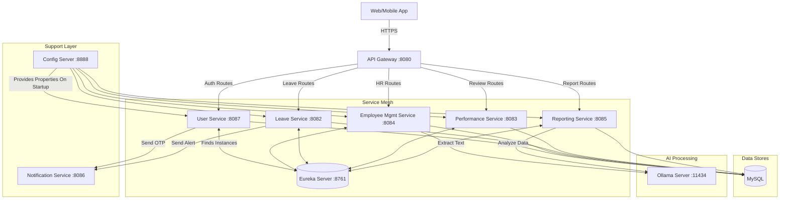

# 🚀 WorkForce Microservices HRMS - Explanations Repository
Welcome to the detailed architectural notes and documentation for the **WorkForce Microservices (HRMS)** project.

This directory provides deep dives into each of the building blocks that make up the backend infrastructure of our modern Human Resource Management System. The project follows a strictly decoupled, domain-driven microservices pattern powered by **Java, Spring Boot, and Spring Cloud Netflix (Eureka & Gateway)** and enhanced with **Local AI Integration (Ollama)**.

---

## 📂 Documentation Directory

Below is the list of fully detailed explanation files regarding the core elements of the architecture, ordered logically from infrastructure to business domains. Click on any link below (or view the files directly in this directory) to understand their responsibilities, dependencies, application flow (via Mermaid diagrams), and how to run them locally using Maven or Docker.

### 🔌 1. Core Infrastructure & Networking
1. [**`01-eureka-server.md`**](./01-eureka-server.md): Explains how the API components find and communicate with each other dynamically.
2. [**`02-config-server.md`**](./02-config-server.md): Shows how all configurations (`.properties`) are managed centrally instead of inside each jar file.
3. [**`03-api-gateway.md`**](./03-api-gateway.md): Details the project's single entry point, handling JWT verifications, CORS, and smart routing.

### 👤 2. Identity & Employees
4. [**`04-user-service.md`**](./04-user-service.md): Covers Identity as a Service (IdP), Role enforcement, and generating JWT tokens alongside OTP logic.
5. [**`05-employee-management-service.md`**](./05-employee-management-service.md): Unpacks the core employee lifecycle logic, handling documents, and the distinct integration with an Ollama vision AI (`llava`) for receipt parsing.

### 📊 3. HR Operations Domain
6. [**`06-leave-service.md`**](./06-leave-service.md): Describes the business rules surrounding physical check-ins, geo-fencing, and PTO approvals.
7. [**`07-performance-service.md`**](./07-performance-service.md): Manages employee feedback, score tracking, and quarterly reviews.
8. [**`08-reporting-service.md`**](./08-reporting-service.md): Discusses how system-wide data is crunched, heavily leveraging an Ollama language model (`phi3`) for predictive analytics and summarization.

### 📧 4. Communication
9. [**`09-notification-service.md`**](./09-notification-service.md): Details the SMTP implementation used to send unified emails (like OTPs or leave approvals) from other services.

---

## 🌎 Global Architecture Ecosystem

While each service file illustrates internal flows, here is how the entire system communicates from a bird's-eye view:

### 💡 General Notes for Running the Suite
- Make sure **MySQL Server** is active on port `3306` before running domain services. 
- You must always launch **Service Discovery** and **Config Server** *before* spinning up the rest of the ecosystem.
- Make sure you pull models locally for Ollama (`phi3`, `llava`) if using AI endpoints.  

Happy coding and exploring the HRMS ecosystem!
