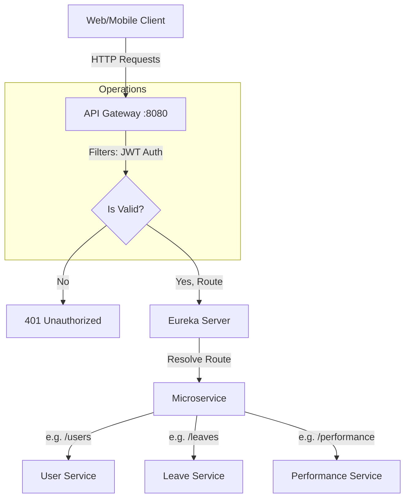

# API Gateway (Entry Point & Routing)

## 📌 Overview
The **API Gateway** serves as the single entry point into the entire microservices architecture. It sits between the client applications (web, mobile) and the internal microservices.

Instead of a client application keeping track of the host, port, and API endpoints for every single microservice (e.g. knowing where the User Service is vs where the Leave Service is), it simply sends all requests to the API Gateway. The Gateway then parses the request and dynamically routes it to the appropriate underlying service using Service Discovery (Eureka).

## 🏗️ Architecture & Flow



### 🔑 Key Responsibilities:
1. **Dynamic Routing**: Automatically maps incoming requests to the appropriate microservices (e.g. `/user/**` -> User Service).
2. **Security & Authentication**: Validates JWT tokens on incoming requests. Acts as the first line of defense blocking unauthenticated traffic from reaching internal backend services.
3. **Cross-Origin Resource Sharing (CORS)**: Handles pre-flight checks and injects necessary CORS headers so frontend applications can consume the APIs.
4. **Resilience**: Implements Circuit Breakers (using Resilience4J) so that if a backend service fails, it doesn't bring down the whole system.
5. **Load Balancing**: Works closely with Eureka to send traffic to healthy instances.

## 💻 Technical Details

### Dependencies (`pom.xml`)
- `spring-cloud-starter-gateway`: The core gateway engine.
- `spring-cloud-starter-netflix-eureka-client`: To find other services.
- `spring-boot-starter-security`: For JWT Validation and security configuration.
- `resilience4j`: For Circuit Breaking pattern in routes.

### Configuration (`application.properties`)
The gateway heavily relies on configurations to determine how to route traffic and act on failures:
```properties
spring.application.name=api-gateway
server.port=8080

# Fetch dynamic routes & config from Config Server
spring.config.import=optional:configserver:http://localhost:8888

# Register with Eureka to know where microservices are
eureka.client.service-url.defaultZone=http://localhost:8761/eureka/

# JWT Secret to decode and validate incoming tokens
jwt.secret=404E635266556A586E3272357538782F413F4428472B4B6250645367566B5970

# Circuit Breaker Setup
resilience4j.circuitbreaker.configs.default.sliding-window-size=10
resilience4j.circuitbreaker.configs.default.failure-rate-threshold=50
resilience4j.circuitbreaker.configs.default.wait-duration-in-open-state=10000
```

### Authentication Filter (`JwtAuthenticationFilter`)
The Gateway contains a custom filter that intercepts requests, checks for a `Authorization: Bearer <token>` header, and uses the `jwt.secret` to validate it. If the token is expired or invalid, the Gateway stops the request dead in its tracks.

## 🚀 How to Run
**Using Maven:**
```bash
mvn spring-boot:run
```

**Using Docker:**
```bash
docker run -p 8080:8080 api-gateway:latest
```

All interactions with the system should now go through `http://localhost:8080`.
