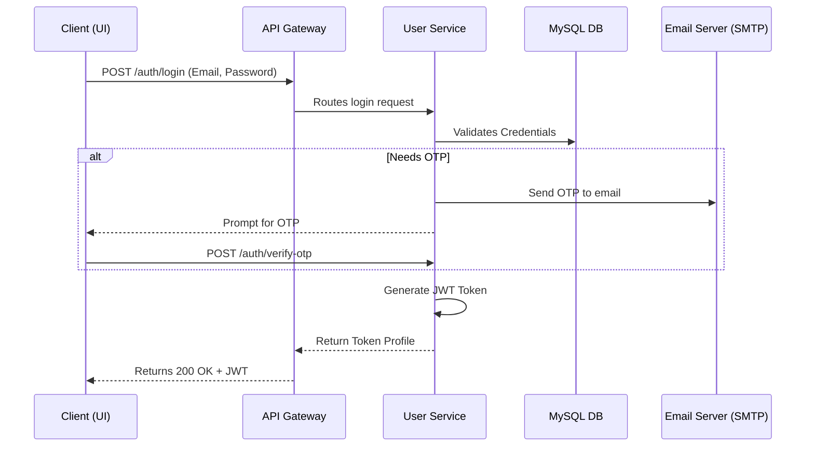

# User Service (Identity & Authentication)

## 📌 Overview
The **User Service** manages all aspects of user identity, authentication, and authorization within the HRMS system. It acts as the primary Identity Provider (IdP) for the ecosystem, validating user credentials and generating secure JWT tokens for downstream services.

Instead of handling authentication independently, other services trust the User Service to perform logins, register users, enforce OTP (One Time Password) checks, and issue valid claims.

## 🏗️ Architecture & Flow



### 🔑 Key Responsibilities:
1. **User Authentication**: Secure login mechanism with strong hashing (e.g., BCrypt).
2. **2-Factor Authentication (OTP)**: Multi-factor authentication layer requiring One-Time Passwords sent via email.
3. **Token Generation (JWT)**: Creates stateless JSON Web Tokens used for cross-service authentication.
4. **Role Management**: Distinguishes between roles (e.g., ADMIN, MANAGER, EMPLOYEE) for route protection.
5. **Swagger Documentation**: Houses the OpenAPI specs for user-related APIs (`/v3/api-docs`).

## 💻 Technical Details

### Technologies & Dependencies
- **Spring Data JPA & Hibernate**: For ORM mapping of User entities.
- **MySQL Driver**: Connects to the primary relational database (`workforce`).
- **Spring Boot Starter Mail**: Handles SMTP connectivity to send OTP emails.
- **Spring Security**: Underpins the token validation and path protection.
- **SpringDoc OpenAPI**: Generates Swagger-UI documentation.

### Configuration Highlights (`application.properties`)
```properties
spring.application.name=user-service
server.port=8087

# Database Connection
spring.datasource.url=jdbc:mysql://localhost:3306/workforce?createDatabaseIfNotExist=true
spring.jpa.hibernate.ddl-auto=update

# Security Constants
jwt.secret=404E635266556A586E3272357538782F413F4428472B4B6250645367566B5970
jwt.expiration=86400000 # 24 Hours

# OTP Setup
otp.expiry-minutes=5
otp.max-attempts=5
otp.enforce-for-all=true

# SMTP Mail properties
spring.mail.host=smtp.gmail.com
spring.mail.port=587
spring.mail.username=rkonda863@gmail.com
```

### OpenAPI (Swagger) Access
With the service running, the interactive API documentation can be accessed at:
👉 **[http://localhost:8087/swagger-ui.html](http://localhost:8087/swagger-ui.html)**
*(Note: Can also be proxied through the API Gateway)*

## 🚀 How to Run
**Using Maven:**
```bash
mvn spring-boot:run
```

**Using Docker:**
```bash
docker run -p 8087:8087 user-service:latest
```
