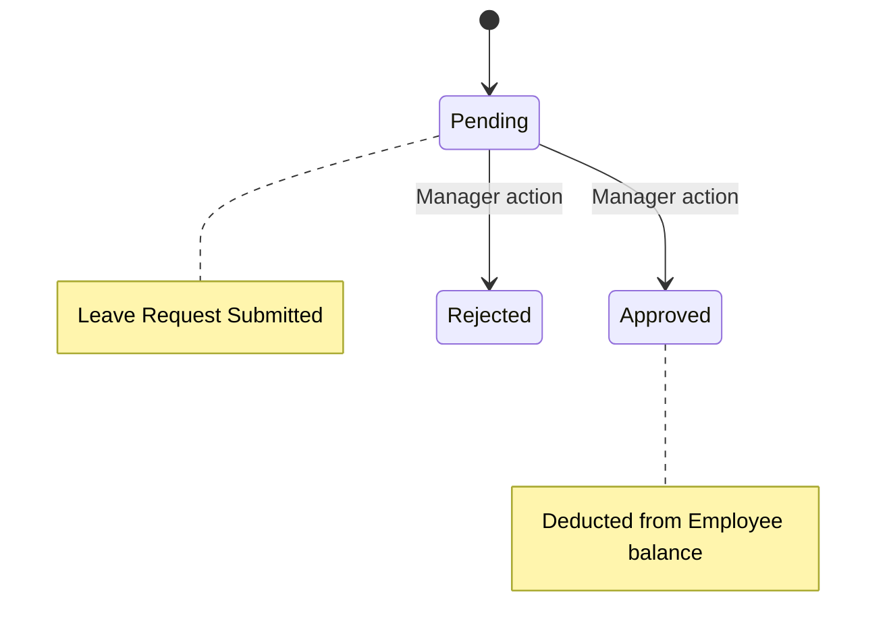

# Leave & Attendance Service

## 📌 Overview
The **Leave Service** manages employee time off, vacation days, sick leave, and daily attendance logs. It encapsulates complex domain rules involving office hours, late marks, early departures, and geo-fenced check-ins to ensure that human resources can be tracked seamlessly.

By extracting leave logic into a separate microservice, the HRMS system guarantees that calculating attendance and processing workflows (e.g., manager approvals) occurs safely without burdening other core operations.

## 🏗️ Architecture & Flow



### 🔑 Key Responsibilities:
1. **Attendance Tracking**: Records daily clock-ins and clock-outs.
2. **Geo-Fencing**: Validates check-ins against a strict physical radius to ensure employees are actually at the office location.
3. **Threshold Rules**: Automatically flags employees as "Late" or marks an "Early Departure" based on predefined configurable rules.
4. **Leave Management**: Manages employees' leave balance, applying deductions automatically after supervisor approvals.

## 💻 Technical Details

### Technologies & Dependencies
- **Spring Data JPA & Hibernate**: For ORM mapping to the `workforce` database.
- **MySQL Driver**: Stores attendance logs, leave balances, and request histories.

### Configuration Highlights (`application.properties`)
The service defines strict HR parameters inside its configuration file, making role rules widely customizable without altering the code:
```properties
spring.application.name=leave-service
server.port=8082

# DB Properties
spring.datasource.url=jdbc:mysql://localhost:3306/workforce?createDatabaseIfNotExist=true

# Attendance Business Rules
attendance.office-start-time=09:00
attendance.office-end-time=18:00
attendance.late-threshold-minutes=15
attendance.early-departure-threshold-minutes=30

# Geo-Fencing Constraints
geo-attendance.default-radius-meters=200
```
*In the configuration above, arriving at 09:16 marks an employee as late. Leaving at 17:29 marks them as an early departure.*

### API Documentation (Swagger)
Access interactive Swagger UI at:
👉 **[http://localhost:8082/swagger-ui.html](http://localhost:8082/swagger-ui.html)**

## 🚀 How to Run
**Using Maven:**
```bash
mvn spring-boot:run
```

**Using Docker:**
```bash
docker run -p 8082:8082 leave-service:latest
```
