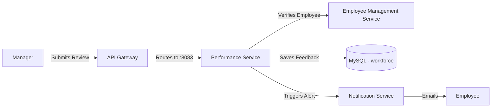

# Performance Service

## 📌 Overview
The **Performance Service** is dedicated to managing employee appraisals, feedback cycles, goal tracking, and overall performance metrics. It provides tools for managers to review their team members and for individuals to track their own professional growth within the company.

By keeping this domain isolated, the HRMS can independently scale its review cycles (which typically see high traffic during end-of-quarter or end-of-year periods) without affecting day-to-day operations like time-tracking or log-ins.

## 🏗️ Architecture & Flow



### 🔑 Key Responsibilities:
1. **Goal Management**: Allowing employees and managers to establish, track, and update Key Performance Indicators (KPIs).
2. **Review Cycles**: Structuring 30-day, 90-day, or annual reviews.
3. **Feedback Mechanism**: Storing qualitative and quantitative feedback securely.
4. **Scoring**: Calculating performance scores that might be leveraged later for promotions or salary adjustments.

## 💻 Technical Details

### Technologies & Dependencies
- **Spring Data JPA & Hibernate**: For mapping performance evaluation entities.
- **MySQL Driver**: Connects to the primary relational database to store permanent records.

### Configuration Highlights (`application.properties`)
```properties
spring.application.name=performance-service
server.port=8083

# DB Properties
spring.datasource.url=jdbc:mysql://localhost:3306/workforce?createDatabaseIfNotExist=true
spring.jpa.hibernate.ddl-auto=update

# API Documentation
springdoc.api-docs.path=/v3/api-docs
```

## 🚀 How to Run
**Using Maven:**
```bash
mvn spring-boot:run
```

**Using Docker:**
```bash
docker run -p 8083:8083 performance-service:latest
```
