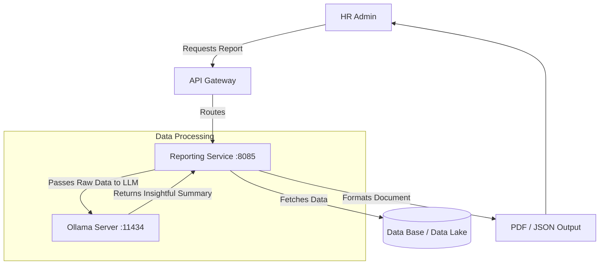

# Reporting Service

## 📌 Overview
The **Reporting Service** is an analytical engine built to aggregate data across the entire platform and generate actionable insights for HR administrators and C-level executives.

What makes this service unique is its integration with **Ollama**, allowing it to not only generate static CSV/PDF reports but also leverage local AI (`phi3` LLM) to produce narrative summaries, trends analysis, and predictive insights based on company data.

## 🏗️ Architecture & Flow



### 🔑 Key Responsibilities:
1. **Data Aggregation**: Pulling metrics regarding leave, performance, and general employee demographics.
2. **AI-Driven Analytics**: Using local instances of large language models to analyze large datasets and output human-readable summaries without sending proprietary company data to external cloud APIs like OpenAI.
3. **Format Generation**: Creating structured endpoints to consume report data.

## 💻 Technical Details

### Technologies & Dependencies
- **Spring Data JPA & Hibernate**: Database interactions.
- **MySQL Driver**: Stores analytical queries or cache results.
- **Ollama AI Integration**: Talks directly to the `phi3` endpoint for inference logic.

### Configuration Highlights (`application.properties`)
```properties
spring.application.name=reporting-service
server.port=8085

# Analytics & Local LLM Integration
ollama.base-url=http://localhost:11434
# Uses the phi3 model for text-based data summarization
ollama.model=phi3 
ollama.timeout=120000 
```

## 🚀 How to Run
**Prerequisite:** Ensure Ollama is running locally with the `phi3` model pulled.
```bash
ollama run phi3
```

**Using Maven:**
```bash
mvn spring-boot:run
```

**Using Docker:**
```bash
docker run -p 8085:8085 reporting-service:latest
```
